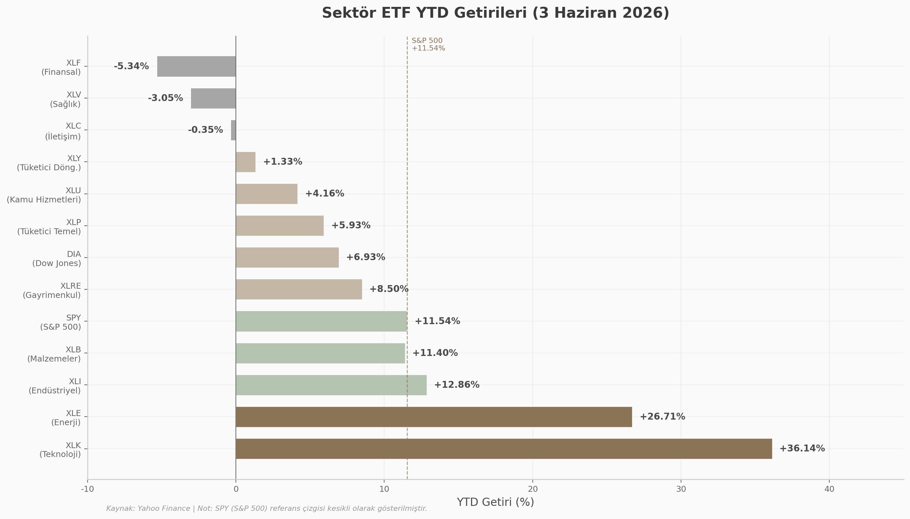
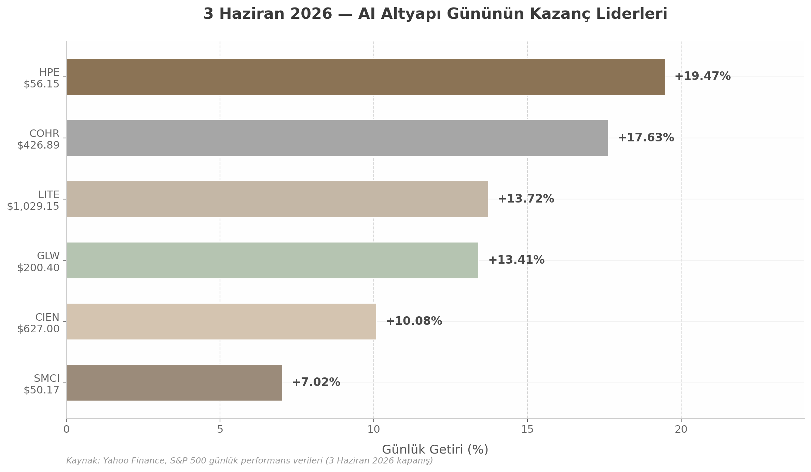
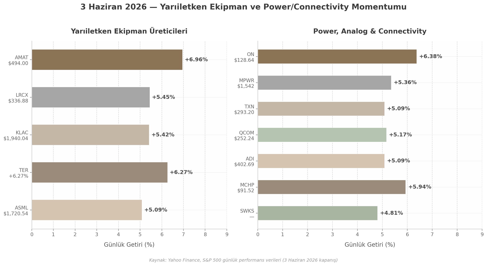
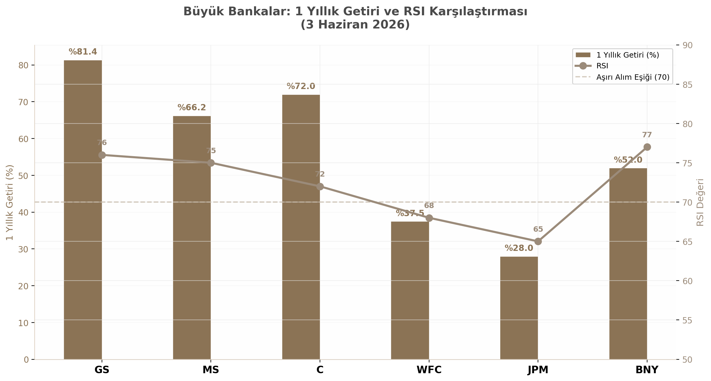
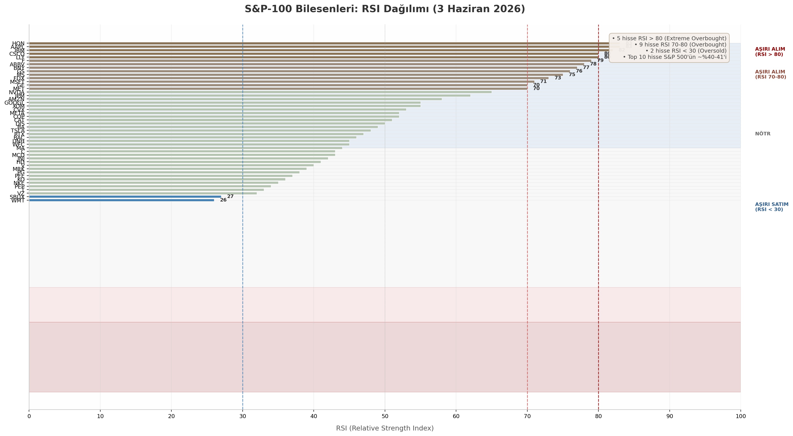
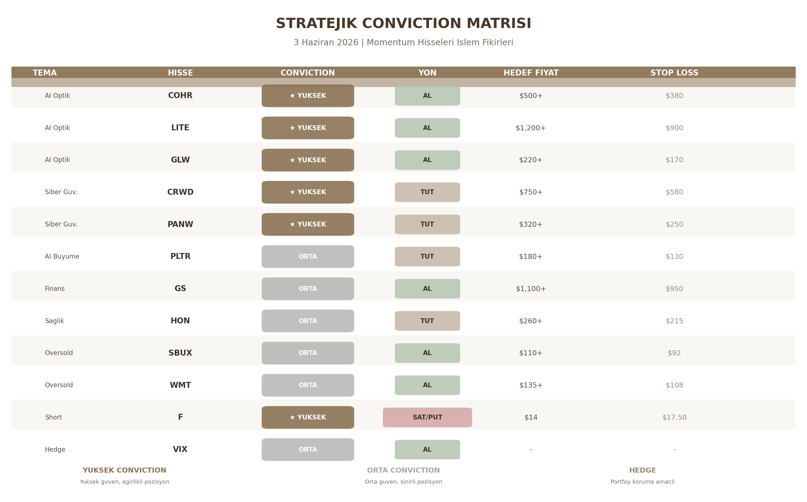

# 3 Haziran 2026 Amerikan Borsalari Momentum Raporu

**Hazirlayan:** AI Arastirma Ekibi  
**Tarih:** 3 Haziran 2026  
**Kapsam:** NYSE, NASDAQ momentum hisseleri  
**Metodoloji:** Cok boyutlu derin arastirma (12 boyut, 240+ bagimsiz arama)

---

# Executive Summary

3 Haziran 2026 itibariyla Amerikan borsalari, teknoloji ve enerji sektorlerinin liderligindeki bir bull market dinamigi ile tarihi seviyelere yakin seyrediyor. S&P 500 yilbasindan bu yana %11.54 kazanc saglarken, Nasdaq 100 %21.61 ve Russell 2000 %18.69 ile daha guclu bir performans sergiliyor. Ancak bu yuzeydeki canlilik, altyapida anlamsal kirilganliklar barindiriyor. Raporun merkezinde, AI optik supercycle, siber guvenlik sektorunun altin cagi ve finans hisselerinin momentum kazanisi gibi uc yapisal tema yer aliyor. Bununla birlikte, dar liderlik yapisi, asiri alim gostergeleri ve VIX-fiyat ayrismasi gibi risk faktorleri, piyasanin genis tabanli bir dayanaktan ziyade secilmis hisseler uzerinden ilerledigini ortaya koyuyor.

Gunluk momentum liderleri 3 Haziran'da AI altyapisi ve optik iletisim hisselerinde yogunlasti. Hewlett Packard Enterprise (HPE) %19.47 ile gunun en yuksek kazancini gerceklestirirken, Coherent (COHR) %17.63, Lumentum (LITE) %13.72, Corning (GLW) %13.41 ve Ciena (CIEN) %10.08 ile optik sektorunun koordineli yukselisine isaret etti. Bu senkronize hareketin ardindaki katalizor, NVIDIA'nin COHR ve LITE'e yaptigi 2 milyar dolarlik yatirimlar ile birlikte AI veri merkezi baglanti altyapisinda ortaya cikan darbogaz beklentisidir. NVIDIA'nin 81.6 milyar dolarlik birinci ceyrek geliri ve AMD Data Center segmentinin %57 yillik buyumesi, AI supercycle'in çip uretiminden optik iletisime kaydigini teyit ediyor. Bu "picks and shovels" rotasyonu, 1849 California altin telasindaki dinamigi tekrarliyor: çip gelistiricilerinden (NVDA, AMD) altyapi saglayicilarina (HPE, COHR, LITE, AMAT) olan momentum kaymasi, sektorun bir sonraki evresine isaret ediyor.

Siber guvenlik sektoru, AI-destekli tehditlerin artisiyla yapisal bir buyume asamasina girmis durumda. CrowdStrike (CRWD) 717.16 dolar ile 52 haftalik zirve yaparken yilbasindan bu yana %51 kazanc sagladi; Palo Alto Networks (PANW) ise 302.95 dolarla tarihi zirvesine (ATH) ulasti ve YTD %63 performans gosterdi. Her iki sirket de AI guvenlik platformlari (CRWD Falcon Flex 1.69 milyar dolar ARR; PANW Cortex) ile 10 milyar dolarin uzerinde yinelenen gelir hedeflerine ilerliyor. Finans sektorunde Goldman Sachs (GS) 1,064.58 dolar ile 52 haftalik zirvesine yakin seyrederken, Morgan Stanley (MS) 208 dolar ile yeni zirve yapti. Enerji sektorunde ise VLO YTD %51.5 ve XLE YTD %26.71 ile jeopolitik risk primi tasiyan guclu bir momentum gozlemleniyor.

Piyasa genelindeki risk profili ise bu guclu temalarin aksine kaygilar barindiriyor. S&P-100 bilesenlerinden 17'si RSI 70'in uzerinde asiri alim bolgesinde bulunuyor; S&P 500'un sadece %57.60'i 200 gunluk hareketli ortalamanin uzerinde seyrediyor. Bu dar liderlik yapisi, 2000 dotcom doneminden bu yana gorulen en yuksek konsantrasyon seviyelerine ulasmis durumda ve 8 onay gostergesinden 7'si S&P 500'un yukselisini onaylamiyor. VIX 16.39 seviyesinde makro sakinlik sinyali verirken, bireysel hisselerde yasanan olağanustu volatilite (COHR %90 implied volatilite, LITE %91.7) "sakin yuzey, volatil derinlik" ayrismasini doguruyor. S&P-100'de sadece Starbucks (SBUX, RSI 27) ve Walmart (WMT, RSI 26) oversold bolgede yer aliyor; bu aşiri dar dagilim, piyasanin tek yonlu bir momentumla ilerledigine isaret ediyor.

| Kategori | En Guclu Gosterge | Ana Risk | Islem Fikri |
|----------|------------------|----------|-------------|
| AI Optik Supercycle | COHR +17.63%, LITE +13.72% | Kapasite darbogazi 2028 | COHR, LITE, GLW tutma |
| Siber Guvenlik | CRWD YTD +51%, PANW ATH | Yuksek degerlilik (PE) | CRWD, PANW tutma |
| Enerji | VLO YTD +51.5%, XLE +26.71% | Jeopolitik volatilite | Kar realizasyonu |
| Finans | GS $1,064, MS 52W high | Yield curve riski | GS, MS birikim |
| Piyasa Geneli | S&P 500 YTD +11.54% | 17 hisse RSI>70, dar liderlik | Hedge korunma |
| Oversold | SBUX RSI 27, WMT RSI 26 | Sektorel dusus devami | Deger alimi |

Yukaridaki tablo, raporun alti ana kategorisindeki momentum dinamiklerini, iliskili riskleri ve buna bagli islem stratejilerini ozetliyor. AI optik supercycle ve siber guvenlik sektorleri yuksek conviction long pozisyonlari barindirirken, finans hisseleri orta vadeli birikim firsatlari sunuyor. Enerji sektorundeki guclu performans, jeopolitik risklerin azalmasi durumunda kar realizasyonu icin uygun bir aday. Piyasa genelindeki dar liderlik ve asiri alim kosullari ise korunmali (hedged) pozisyon yonetimini gerektiriyor. Ford (RSI 79 + death cross) gibi teknik celiskiler tasiyan hisselerde ise short pozisyon veya put opsiyonlari dusunulebilir. Honeywell (HON) ise RSI 83 ile en asiri alim hisselerinden biri olmasina ragmen, Haziran 2026 bölunmesi (uc sirkete ayrilma) bir "special situations" katalizoru sunuyor. GE'nin bölunmesinden sonra %36 prim kazanmasi örnek teskil ettiginden, HON'da bölunme öncesi tutma stratejisi degerlendirilebilir. Ford (F) ise RSI 79 ile asiri alimdayken ayni anda Nisan 2026'dan beri "death cross" (50-MA < 200-MA) formasyonu icinde olmasi nedeniyle bir "momentum tuzaği" olarak goruluyor; bu teknik celiski, kisa vadeli momentum ile uzun vadeli zayiflik arasindaki ikilemi ortaya koyuyor ve kisa pozisyon veya put opsiyonlarini akla getiriyor. Sonuc olarak, momentum yatirimcilari icin AI altyapisi ve siber guvenlik temalarinda secici kalma, enerji ve finans sektorlerinde ise rotasyon odakli yaklasim, genel portfoyde ise dar liderlik riskine karsi korunmali (hedged) pozisyon yonetimini sikilastirma donemi yasaniyor.

---

## 1. Piyasa Genel Görunum ve Momentum Gostergeleri

3 Haziran 2026 tarihi itibariyle Amerikan borsalari, cok katmanli bir momentum dongusu icinde hareket ediyor. S&P 500 yil basindan bu yana %11.54 kazanc elde etmis olmasina ragmen, bu yukselis genis tabanli bir katilimdan ziyade dar bir liderlik grubunun performansina dayaniyor. Bu bolum, ana endeks performanslarini, teknik momentum gostergelerini ve sektor rotasyonu dinamiklerini kapsamli bir sekilde inceliyor.

### 1.1 Ana Endeks Performanslari

#### 1.1.1 S&P 500, Nasdaq 100 ve Russell 2000 Liderligi

2026 yilinin en dikkat cekici ozelliklerinden biri, geleneksel endeks hiyerarsisinin tersine donmus olmasi. S&P 500 (SPY) YTD %11.54 getiri saglarken, bu performans Nasdaq 100'un (QQQ) %21.61 YTD getirisinin gerisinde kaliyor. Daha da onemlisi, Russell 2000 (IWM) %18.69 YTD ile S&P 500'u anlamli olcude geride birakiyor ve "Great Rotation" olarak adlandirilan kucuk hisse liderligini surduruyor ^1^ ^2^ ^3^. Dow Jones Industrial Average (DIA) ise %6.93 YTD ile en dusuk getiri saglayan ana endeks konumunda bulunuyor ^4^. Bu dagilim, 2023-2025 donemindeki mega-cap teknoloji dominasyonunun sona erdigine ve piyasanin daha genis bir hisse senedi yelpazesine yayildigina isaret ediyor.

Russell 2000'un liderligi, Royce Investment Partners verilerine gore 2026 birinci ceyregindeki ardisik dorduncu ceyrek performansiyla teyit ediliyor; kucuk hisseler bu donemde %0.9 kazanirken, buyuk hisseleri temsil eden Russell 1000 %4.2 dusus yasadi ^5^. Bu tarihsel olarak nadir gorulen bir durum olup, son 25 yilda Russell 1000'un 26 dusus ceyregi yasadigi donemlerde Russell 2000 sadece sekiz kez buyuk hisseleri yenmeyi basardi ^5^.

| Endeks | ETF | YTD Getiri | 1Y Getiri | Beta | Piyasa Deg. |
|--------|-----|------------|-----------|------|-------------|
| Russell 2000 | IWM | %18.69 | %43.31 | 1.15 | Kucuk hisseler |
| Nasdaq 100 | QQQ | %21.61 | %39.92 | 1.08 | Buyuk teknoloji |
| S&P 500 | SPY | %11.54 | %30.18 | 1.00 | Genis buyuk hisseler |
| Dow Jones | DIA | %6.93 | %22.80 | 0.95 | Blue-chip endeksi |

*Kaynak: Yahoo Finance, 2 Haziran 2026 ^2^ ^3^ ^1^ ^4^*

Tablo incelendiginde, Nasdaq 100'un %21.61 YTD getirisi ile teknoloji agirlikli portfoylerin 2026'da belirleyici rol oynadigi goruluyor. Ancak Russell 2000'un %18.69 ile S&P 500'u geride birakmasi, AI (Artificial Intelligence) yatirimlarinin buyuk teknoloji sirketleri disindaki altyapi, ekipman ve hizmet saglayicilarina da yayildigini gosteriyor. Bu durum, "picks and shovels" temasinin guclendigine dair onemli bir kanit. Bir yillik getiri perspektifinde Russell 2000'un %43.31 ile tum ana endeksleri geride birakmasi, kucuk hisselerdeki momentumun ani gecici bir hareket olmadigini, daha yapili bir trende isaret ettigini dusunduruyor.

#### 1.1.2 Teknoloji Sektorunun Liderligi ve Sektorel Ayrisma

S&P 500'un sektor dagilimina bakildiginda teknoloji agirliginin tarihi duzeyde oldugu gozleniyor. Teknoloji sektoru endeksin %39.93'unu olustururken, finansal hizmetler %11.00, iletisim hizmetleri %10.45 ve tuketici dongusel %9.61 paya sahip ^6^. Bu asiri konsantrasyon, endeksin performansinin birkac buyuk teknoloji sirketine ne denli bagli oldugunu ortaya koyuyor. Teknoloji sektoru ETF'i XLK %36.14 YTD getiri ile tum sektorlerin kesin lideri konumunda bulunuyor ^7^. Bu performansin ardinda NVIDIA, Apple ve Microsoft'un agirlikli katkisi yatiyor. XLK'nin bes yillik %109.39 getirisi ile S&P 500'un %73.63'unu 35 puan farkla geride biraktigi goz onune alindiginda, teknoloji liderliginin yapili bir karakter tasidigi anlasiliyor ^8^.

Finansal sektor (XLF) ise YTD -%5.34 ile en kotu performans gosteren sektor olarak one cikiyor ^9^. Faiz orani belirsizlikleri, getiri egrisi duzlesmesi ve ekonomik yavaslama endiseleri banka hisseleri uzerinde baski yaratiyor. Saglik sektoru (XLV) -%3.05 YTD ile dusuk performans gosterirken, iletisim hizmetleri (XLC) -%0.35 YTD ile hemen hemen yatay seyrediyor ^10^ ^11^.

### 1.2 Teknik Momentum Gostergeleri

#### 1.2.1 RSI Analizi: 17 Asiri Alim, 2 Asiri Satim

Relative Strength Index (RSI), J. Welles Wilder tarafindan gelistirilen 0-100 arasinda dalgalanan bir momentum osilatorudur ve geleneksel olarak 70 uzeri degerler asiri alim, 30 alti degerler asiri satim bolgesi olarak yorumlanir ^12^. 29 Mayis 2026 verilerine gore S&P 100 binyesindeki hisseler arasinda belirgin bir asiri alim/asri satim bolgesi ayrismasi gozlemlenmektedir. Oversold bolgede (RSI < 30) sadece SBUX ve WMT bulunurken, overbought bolgede (RSI > 70) tam 17 hisse yer almaktadir ^13^.

| Hisse | Sirket | Fiyat | RSI | Teknik Durum | Risk Seviyesi |
|-------|--------|-------|-----|--------------|---------------|
| HON | Honeywell Intl | $237.86 | 83 | Asiri alim - Haziran bolunmesi katalizoru | Yuksek |
| AAPL | Apple Inc | $312.06 | 83 | Asiri alim - Guclu trend | Yuksek |
| IBM | IBM Corp | $297.80 | 82 | Asiri alim - AI temasi | Yuksek |
| CSCO | Cisco Systems | $120.42 | 80 | Asiri alim - Optik supercycle | Yuksek |
| LLY | Eli Lilly | $1,105.00 | 80 | Asiri alim - Obesity ilaclari | Yuksek |
| F | Ford Motor | $17.44 | 79 | Asiri alim + Death cross celiskisi | Cok yuksek |
| ABBV | AbbVie Inc | $217.72 | 78 | Asiri alim - Immunoloji | Yuksek |
| BNY | BNY Mellon | $139.43 | 77 | Asiri alim - Finansal guclenme | Yuksek |
| GS | Goldman Sachs | $1,025.56 | 76 | Asiri alim - Yatirim bankaciligi | Yuksek |
| MS | Morgan Stanley | $208.00 | 75 | Asiri alim - Varlik yonetimi | Yuksek |
| SBUX | Starbucks | $99.16 | 27 | Asiri satim - Geri donus adayi | Dusuk/Oversold |
| WMT | Walmart | $115.75 | 26 | Asiri satim - Geri donus adayi | Dusuk/Oversold |

*Kaynak: ABG Analytics, 29 Mayis 2026 ^13^*

RSI analizi piyasann "tek yonlu" bir yapi icinde oldugunu acikca ortaya koyuyor. S&P 100'de sadece 2 hissenin oversold (asri satim) bolgede olmasi, piyasann asiri alim bolgesinde yogunlastigini gosteriyor. Cisco Systems orneginde bu durum ozellikle carpici; Cisco'nun RSI degeri 19 Mayis'ta TradingView verilerine gore neredeyse 90 seviyesine ulasmis ki bu, son donemdeki en asiri RSI okumalarindan biri olarak kayda gecmistir ^14^. Honeywell ise RSI 83 ile asiri alimda olmasina ragmen, Haziran 2026'da 3 sirkete bolunmesi onemli bir "special situations" katalizoru sunuyor ve konglomerat iskontosunun cozulmesi beklentisiyle yukselisini surduruyor ^15^. Ford'da (RSI 79) ise kisa vadeli asiri alim ile uzun vadeli zayiflik arasinda bir teknik celiski mevcut; hisse Nisan 2026'dan beri "death cross" (50-MA < 200-MA) formasyonu icinde bulunuyor, ancak kisa vadeli momentum guclu kalmaya devam ediyor ^13^.

Guclu trend piyasalarinda RSI'nin 40-70 araliginda kaldigi ve asiri alim kosullarinin (70+) guclu momentumun bir gostergesi olarak yorumlanmasi gerektigi belirtilmelidir. Trader'lar genellikle RSI'nin 50 seviyesine cekilmesini dip alim firsati olarak degerlendirir ^12^. Bu baglamda, 17 hissenin RSI > 70 seviyesinde olmasi piyasada guclu bir momentumun varligini kanitlasa da, ayni zamanda kisa vadeli kar realizasyonu riskinin de yuksel oldugunu isaret ediyor.

#### 1.2.2 MACD, Golden Cross ve Piyasa Genisligi Analizi

Moving Average Convergence Divergence (MACD), Gerald Appel tarafindan 1970'lerde gelistirilen trend takip eden bir momentum gostergesidir ve 12-gunluk EMA'dan 26-gunluk EMA'nin cikarilmasiyla hesaplanir ^16^. MACD crossover sinyalleri, momentumun yon degisikliklerini erken donemde tespit etmede kritik rol oynar. MACD hattinin sinyal hattinin uzerine cikmasi (bullish crossover) momentumun yukari yonlu degistigini, altina dusmesi ise (bearish crossover) asagi yonlu degisimi gosterir ^17^.

S&P 500 acisindan bakildiginda, endeksin Nisan 2026 ortalarinda bir "death cross" (50-MA < 200-MA) yasadigi, ardindan Mayis 2026 ortalarinda bir "golden cross" (50-MA > 200-MA) gerceklestirdigi gozleniyor ^18^. Tarihsel veriler golden cross'un onemini destekliyor: 1928'den bu yana her golden cross sonrasinda S&P 500'un bir yil sonra yukselme olasiligi %71'i asiyor ve ortalama getiri %10'un uzerinde seyrediyor. Son 20 golden cross'un ortalama getirisi %13'e ulasirken, basari orani %85 duzeyinde gerceklesmistir ^19^. Piper Sandler'dan Craig Johnson bu sinyali "piyasa sagliginin bir gostergesi" olarak nitelendirirken, artan piyasa katilimi ve genisleyen breadth (piyasa genisligi) ile birlikte 2025 ikinci yarisina saglam bir temel atildigini belirtmistir ^19^.

Piyasa genisligi acisindan ise karma bir tablo ciziliyor. S&P 500 hisselerinin %57.60'i 200-gunluk hareketli ortalamanin uzerinde seyrediyor [Schwab verileri]. Bu oran, endeksin yukselisine katilan hisse oraninin sinirli oldugunu, yani "dar liderlik" yapisi icerisinde bir rallinin surduruldugunu gosteriyor. Nasdaq'un sadece %43.76'sinin 200-MA uzerinde olmasi ise teknoloji endeksinin yarisindan fazlasinin dusus trendinde oldugunu ortaya koyuyor ve endeksin yukselisinin sadece birkac buyuk hisseye (NVIDIA, Apple, Microsoft) dayandigini aciga cikariyor. Buna karsin, S&P 500'un %69'unun 50-MA uzerinde olmasi kisa vadeli momentumun guclu oldugunu gosteriyor ^20^.

Nisan 2025'te tetiklenen Zweig Breadth Thrust (ZBT) sinyali de guclu bir yukselis ongorusu sunuyor. 1957'den bu yana sadece 16 kez gorulen pozitif ZBT sinyallerinin ardindan S&P 500 her zaman bir sonraki alti ay ve bir sonraki yil yukselis kaydetmis; ortalama 12 aylik getiri %24 duzeyinde gerceklesmistir ^21^.

### 1.3 Sektor Rotasyonu

#### 1.3.1 Teknoloji-Enerji Rotasyonu

2026 yilinda sektor performanslari arasinda belirgin bir ayrisma gozlemleniyor. Teknoloji sektoru (XLK) %36.14 YTD getiri ile tum sektorlerin kesin lideri konumunda bulunuyor ^7^. Bu performansin ardinda NVIDIA'nin $81.6 milyarlik birinci ceyrek geliri, Apple'in AI entegrasyon stratejisi ve Microsoft'un bulut hizmetlerindeki buyumesi yatiyor. XLK'nin portfoyunde NVIDIA %15.21, Apple %13.43 ve Microsoft %10.20 agirlikla yer aliyor ve bu uc sirket ETF'in neredeyse %40'ini olusturuyor.

Enerji sektoru (XLE) ise %26.71 YTD getiri ile ikinci lider sektor olarak one cikiyor ^22^. Iran-ABD gerilimlerinin yarattigi jeopolitik risk primi ve ham petrol fiyatlarindaki artis enerji hisselerini destekliyor. Valero (VLO) %51.5 YTD ile enerji sektorunun en guclu performans gosteren hisselerinden biri olurken, MPC ve FANG gibi rafineri ve upstream sirketleri de cift haneli kazanclar elde etti ^23^. Finansal sektor (XLF) ise -%5.34 YTD ile en kotu performansi sergiliyor ^9^. Teknoloji ile finans arasindaki yaklasik 41 puanlik performans farki, 2026'nin en carpici sektor rotasyonu dinamigini temsil ediyor.

*Sekil 1: Sektör ETF'lerinin 2026 YTD getirileri. S&P 500 (SPY) referans çizgisi kesikli olarak gösterilmiştir. Teknoloji (XLK) %36.14 ve Enerji (XLE) %26.71 ile lider sektörler konumunda. Finansal (XLF) -%5.34 ile en geride kalan sektör.*

Grafik uzerinden incelendiginde, teknoloji ve enerji sektorlerinin S&P 500'un onemli olcude uzerinde performans gosterdigi, finansal ve saglik sektorlerinin ise negatif getiri sagladigi acikca goruluyor. Endustriyel (XLI) %12.86 ve malzemeler (XLB) %11.40 YTD ile S&P 500 referansini asan diger sektorler arasinda yer aliyor. Gayrimenkul (XLRE) %8.50 YTD ile AI veri merkezi talebinden faydalaniyor. Tuketici temel (XLP) %5.93 YTD ile defansif karakterini korurken, tuketici dongusel (XLY) %1.33 YTD ile zayif kalmaya devam ediyor. Bu dagilim, yatirimcilarin AI altyapi yatirimlari ve jeopolitik risk hedge'leri uzerinde yogunlastigini, geleneksel tuketici ve finansal sektorlere ise temkinli yaklastigini ortaya koyuyor.

#### 1.3.2 Dar Liderlik Riski

Piyasadaki en onemli yapisal risklerden biri, endekslerin yukselisine katilan hisse sayisinin sinirli olmasi olarak one cikiyor. S&P 500'un en buyuk 10 sirketi endeksin yaklasik %40'ini kontrol ediyor; bu oran 2000 yilindaki dot-com balonundaki %27'lik zirvenin bile uzerinde seyrediyor ^24^. Tema ETFs verilerine gore top 10 hisseler S&P 500'un %41.2'sini olusturuyor ki bu tarihi bir rekor olarak kayda geciyor ^25^. Nomura'nin analizine gore, son 28 islem gunu rallisinde sadece 10 hisse S&P 500'un kazancinin %69'unu yonetti ve bu hisseler arasinda Alphabet, Nvidia, Amazon, Broadcom ve Microsoft basi cekti ^24^.

Bu asiri konsantrasyon, endeksin kirlganligini onemli olcude artiriyor. Goldman Sachs'in tarihsel analizleri, yuksek konsantrasyon seviyelerinin ileriye donuk dusuk getirilere isaret ettigini gosteriyor; yuksek konsantrasyon donemlerinde ileriye donuk getirinin -%5, oynakligin ise %20'nin uzerinde gerceklestigi gozlemlenmistir ^25^. Piyasa genisligi gostergeleri de bu kirlganligi teyit ediyor. S&P 500'un %57.60'i 200-MA uzerinde olmasina ragmen, bu oran Ocak 2026'daki %65'in uzerinden onemli olcude gerilemis durumda ^26^. Nasdaq'un sadece %43.76'sinin 200-MA uzerinde olmasi ise teknoloji endeksinin yarisindan fazlasinin dusus trendinde oldugunu ortaya koyuyor.

Dave Keller'in StockCharts'teki analizine gore, S&P 500 her ne kadar Mayis ayindan bu yana her ay yeni zirveler gorse de, bu zirvelerin her biri 50-gunluk hareketli ortalamanin uzerinde islem goren hisse sayisinin azalmasiyla gerceklesmistir. Bu durum, fiyat zirveleri ile piyasa genisligi arasinda bir ayi diverjansi (bearish divergence) olusturuyor ve trendin surdurulebilirligi konusunda onemli bir uyarici sinyal niteligi tasiyor ^27^. Dar liderlik yapisi icerisinde, "ortalama hisse" S&P 500'un gerisinde kalmaya devam ediyor ve bu durum genislemeli bir duzeltme riskini beraberinde getiriyor. Yatirimcilarin portfoylerinde sektor ve hisse cesitliligine gitmeleri, asiri konsantre pozisyonlari azaltmalari onem tasyor.

---

## 2. Teknoloji ve Semiconductor Momentumu

3 Haziran 2026 tarihli S&P 500 kapanış verileri, teknoloji ve yarıiletken sektörünün AI altyapı yatırımlarının tetiklediği olağanüstü bir momentum evresinde olduğunu kanıtlamaktadır. Endeksin günün en yüksek kazanççıları arasında yarıiletken ve teknoloji altyapısı hisseleri ağırlık taşımaktadır: HPE %19.47, COHR %17.63, LITE %13.72, GLW %13.41, CIEN %10.08, SMCI %7.02, AMAT %6.96, ON %6.38 ve TER %6.27 artış kaydetmiştir ^28^ ^29^ ^30^. Bu performans dağılımı, AI yatırım döngüsünün yalnızca çip geliştiricilerini değil, aynı zamanda optik bağlantı, sunucu altyapısı, test ekipmanı ve güç yönetimi çözümleri sağlayıcılarını da kapsayan geniş bir ekosistemi harekete geçirdiğini göstermektedir.

### 2.1 AI Altyapı Supercycle'i

#### 2.1.1 NVIDIA'dan Broadcom'a Çip Geliştiricilerinin Rekor Dönemi

NVIDIA (NVDA), Q1 FY2027 döneminde 81.6 milyar dolar gelir ve hisse başına 1.87 dolar EPS açıklayarak piyasa beklentilerini aşmıştır ^31^. Şirketin piyasa değeri 5.15 trilyon dolara ulaşmış, bu değerleme 33.16 F/K çarpanı ve 2.25 beta katsayısı ile desteklenmektedir ^32^ ^33^. 53 Wall Street analistinin 50'si "Buy" veya "Strong Buy" önerisi sunarken, ortalama 12 aylık hedef fiyat 305 dolar seviyesindedir ^32^. NVIDIA CEO'su Jensen Huang, ComputeX 2026 etkinliğinde AI PC pazarını hedefleyen yeni işlemcileri duyurarak şirketin ürün portföyünü genişletme stratejisini teyit etmiştir ^34^. Öte yandan, şirketin OpenAI'nin 110 milyar dolarlık fonlamasına katılımı ve Vera Rubin platformunun 2026 ikinci yarısında üretime gireceği beklentisi, büyüme görünümünü destekleyen önemli katalizörler olarak öne çıkmaktadır ^31^.

AMD (AMD), 3 Haziran 2026'da 534.40 dolar seviyesinden işlem görmüş, bu fiyat 52 haftalık 114.71-544.04 dolar aralığının sınırına yakın konumlanmaktadır ^35^. Şirketin Q1 2026 geliri 10.3 milyar dolar (%38 Y/Y) olarak gerçekleşirken, Data Center segmenti 5.8 milyar dolar gelir ile yıllık %57 büyüme kaydetmiştir ^35^ ^36^. AMD CEO'su Lisa Su, sunucu CPU pazarı yıllık toplam adreslenebilir pazar (TAM) tahminini 60 milyar dolardan 120 milyar dolara yükseltmiş ve yıllık büyüme oranını %18'den %35+'a çıkarmıştır ^37^ ^38^. Bu agresif revizyonun temelinde, agentic AI iş yüklerinin CPU talebini patlattığı yorumu yer almaktadır. Şirketin Meta ile 6 GW GPU anlaşması ve OpenAI ile benzer çapta bir iş birliği imzalaması ^37^, MI450 ve Helios rack-scale platformunun 2026 ikinci yarısında üretime girmesiyle birlikte, AMD'nin 2027 yılı için "onlarca milyar dolarlık" Data Center AI geliri hedefi giderek somutlaşmaktadır.

Broadcom (AVGO), Q1 FY2026'da 19.3 milyar dolar gelir (%29 Y/Y) açıklamış, AI yarıiletken geliri ise yıllık %106 artışla 8.4 milyar dolara ulaşmıştır ^39^ ^40^. CEO Hock Tan, 2027 yılında çip gelirlerinden 100 milyar doların üzerinde AI geliri elde edileceğini açıklayarak piyasa beklentilerini önemli ölçüde aşmıştır ^39^. Şirketin Q2 rehberliği 22 milyar dolar (%47 Y/Y) seviyesinde olup, AI gelirinin 10.7 milyar dolar (%140 Y/Y) seviyesinde gerçekleşmesi beklenmektedir. AVGO, Google, Meta, OpenAI ve Anthropic için özel AI hızlandırıcı (XPU) üretimi yaparak custom silicon pazarındaki liderliğini pekiştirmektedir. Şirket hissesi 3 Haziran'da 477.24 dolar seviyesinde, 92.67 F/K ve 26 ileri F/K çarpanları ile işlem görmektedir ^28^ ^41^.

Aşağıdaki tablo, AI çip geliştiricilerinin temel finansal göstergelerini karşılaştırmalı olarak sunmaktadır:

| Hisse | Fiyat ($) | 52h Aralık ($) | P/E | YTD (%) | Q1 Gelir | AI Gelir Büyümesi |
|:---|---:|:---|---:|---:|:---|:---|
| NVDA | 222.82 | 138.83 - 236.54 | 33.16 | +14.0 | $81.6B ^31^| GPU/Platform döngüsü |
| AMD | 534.40 | 114.71 - 544.04 | 177.0 | +339.8 | $10.3B ^35^| Data Center +57% Y/Y ^36^|
| AVGO | 477.24 | 241.11 - 495.00 | 92.67 | +22.0 | $19.3B ^39^| AI yarıiletken +106% Y/Y ^40^|

Tablo incelendiğinde, üç AI çip geliştiricisinin de farklı büyüme aşamalarında olduğu görülmektedir. NVIDIA, rekor finansal sonuçları ve 5.15 trilyon dolarlık piyasa değeriyle sektörün ağırlık merkezini temsil ederken, 33.16 F/K oranı ile nispeten makul bir değerleme sunmaktadır ^32^. AMD, %339.8 YTD getirisi ve Data Center segmentindeki %57 büyüme ile en agresif momentumu sergilemektedir; ancak 177 F/K oranı ve 52 haftalık zirveye yakın fiyatlanması, önemli bir değerleme riski barındırdığını işaret etmektedir ^35^. Broadcom ise AI yarıiletken gelirindeki %106 yıllık büyüme ve 2027 için 100 milyar dolarlık AI gelir hedefi ile en güçlü öngörülebilir büyüme profiline sahip görünmektedir ^39^.

#### 2.1.2 AI Optik Supercycle: NVIDIA'nın 4.5 Milyar Dolarlık Optik Yatırımı

AI veri merkezlerinde optik bağlantı teknolojileri, 2026 yılının en kritik altyapı darboğazlarından biri olarak öne çıkmaktadır. NVIDIA'nın Coherent'e (COHR) 2 milyar dolar ^42^, Lumentum'a (LITE) 2 milyar dolar ^43^ve Corning'e (GLW) 500 milyon dolarlık yatırım/warrant anlaşmaları ile birlikte toplam 4.5 milyar doların üzerinde optik sektör taahhüdü ^44^, bu alanın stratejik önemini doğrulamaktadır. Morgan Stanley, AI-ilişkili optik iletişim pazarını 2028'de 90 milyar dolara yükseltmiştir (2025'te ~30 milyar dolar) ^45^. Bank of America ise toplam ulaşılabilir pazarı 2030'da 73 milyar dolar olarak tahmin etmektedir ^45^. Bu pazar büyümesinin temelinde, AI veri merkezlerinin geleneksel bulut bilişime kıyasla 5-10 kat daha fazla fiber optik gerektirmesi yatmaktadır ^46^.

Taiwan Semiconductor (TSM), AI çip üretim zincirinin kritik bir halkası olarak 3 Haziran'da 439.34 dolar seviyesinden, 2.28 trilyon dolar piyasa değeri ve 37.55 F/K çarpanı ile işlem görmektedir ^28^. ASML Holding (ASML), Q4'te EUV siparişlerindeki %150 artış ve 2026 için çift haneli büyüme rehberliği ile 1,720.54 dolar seviyesindeki fiyatıyla 52 haftalık zirvesine yaklaşmaktadır ^47^ ^28^. Bu veriler, AI supercycle'ının üretim kapasitesi ve ekipman tedariki boyutunu ortaya koymaktadır.

### 2.2 Günlük Kazanç Liderleri (3 Haziran 2026)

#### 2.2.1 HPE %19.47: Kazanç Büyüsü ve AI Sunucu Talebi

Hewlett Packard Enterprise (HPE), 3 Haziran 2026'da S&P 500'ün en yüksek kazanççısı olarak %19.47 artışla 56.15 dolara yükselmiştir ^28^. Şirketin Q2 FY2026 döneminde hisse başına 0.79 dolar kazanç açıklaması (tahmin: 0.53 dolar), %49'lık bir beklenti aşımına karşılık gelmektedir ^48^. 10.68 milyar dolarlık gelir ve 1.14 milyar dolarlık net gelir ile birlikte bu sonuçlar, HPE'nin AI altyapı pazarındaki konumunu güçlendirmektedir ^48^. Evercore ISI Group, kazanç sonuçlarının ardından fiyat hedefini 40 dolardan 70 dolara yükseltmiş ve "Outperform" notunu korumuştur ^48^. Şirketin Juniper Networks satın alımını tamamlaması, tam entegre AI altyapı çözümleri sunabilen bir yapıya kavuşmasını sağlamıştır ^13^. COMPUTEX 2026'da NVIDIA Vera CPU ile donatılmış ProLiant Compute DL394 Gen12 sunucusunun tanıtılması ^49^, ürün portföyünün AI talebine yanıt verme yeteneğini teyit etmektedir. Hacimdeki 6.5 kat artış (147.2 milyon hisse, ortalama 22.39 milyona karşılık) ve 52 haftalık 64.25 dolarlık zirveye yakın fiyatlanma, teknik momentumun gücünü yansıtmaktadır ^48^.

#### 2.2.2 Optik Sektör Koordinasyonu: COHR, LITE, GLW, CIEN

3 Haziran 2026'da optik ve iletişim sektöründen dört hissenin aynı gün koordineli yükselişi, AI altyapı yatırımlarının sektör çapında yarattığı yapısal talebin bir göstergesidir. Coherent (COHR), NVIDIA'dan 2 milyar dolarlık stratejik yatırım ve çok yıllı milyar dolarlık satın alım taahhüdü ile desteklenen AI optik supercycle beklentileriyle %17.63 artışla 426.89 dolara yükselmiştir ^42^ ^43^. Şirketin Q2 FY2026 geliri 1.81 milyar dolar (%21 Y/Y) olup, Data Center ve Communications segmenti yıllık %34 büyüme kaydetmiştir ^50^. COHR'nun InP (indium phosphide) lazer kapasitesinin 2025-2030 arası 12 kat büyümesi beklenmektedir ^23^.

Lumentum (LITE), %13.72 artışla 1,029.15 dolar seviyesine ulaşmıştır. Şirketin lazer kapasitesi FY2027 ve muhtemelen 2028'e kadar doludur; talep arzdan çok daha hızlı büyümektedir ^43^. CEO Michael Hurlston, OCS (Optical Circuit Switch) sipariş birikiminin 400 milyon doları aştığını ve sevkiyatların 2026 ikinci yarısından 2027'ye kadar planlandığını doğrulamıştır ^51^. Q3 FY2026'da hisse başına 2.37 dolar kazanç (tahmin: 2.27 dolar) ve 808.4 milyon dolar gelir (%90.1 Y/Y) açıklayan şirket ^52^, 100G ve 200G EML chipset'lerini 800G ve 1.6T optik modüllerde üretmektedir ^53^.

Corning (GLW), %13.41 artışla 200.40 dolara yükselmiştir. Meta Platforms ile imzalanan 6 milyar dolarlık çok yıllık fiber optik anlaşması (2030'a kadar) ^54^ve NVIDIA ile yapılan 500 milyon dolarlık warrant anlaşması ^44^, şirketin AI altyapısındaki merkezi rolünü güçlendirmektedir. 2025 yılında çekirdek satışların 16.41 milyar dolara (%13 artış) ve çekirdek EPS'nin 2.52 dolara (%29 artış) yükseldiği açıklanmıştır ^55^. Optik iletişim gelirlerinin yıllık %58 büyümesi, AI veri merkezlerinin fiber talebindeki patlamayı yansıtmaktadır ^55^.

Ciena (CIEN), %10.08 artışla 627.00 dolardan işlem görmektedir. Şirketin Q1 FY2026 rekor geliri 1.43 milyar dolar (%33 Y/Y) olurken, doğrudan bulut sağlayıcı geliri yıllık %76 artışla toplam gelirin %42'sini oluşturmuştur ^56^. CEO Gary Smith, müşterilerin AI yatırımlarını parasallaştırmaya çalıştığı "benzeri görülmemiş, yaygın talep" olduğunu belirtmiştir ^56^. Sipariş birikimi yaklaşık 7 milyar dolara ulaşmış, bu değer bir önceki çeyreğe göre 2 milyar dolar artışı temsil etmektedir ^57^.

Aşağıdaki tablo, 3 Haziran 2026'nın optik ve AI altyapı kazanç liderlerinin temel göstergelerini özetlemektedir:

| Hisse | Fiyat ($) | Günlük (%) | P/E | 3 Aylık (%) | Temel Katalizör |
|:---|---:|---:|---:|---:|:---|
| HPE | 56.15 | +19.47 | 52.48 | +100.47 | Q2 EPS $0.79 vs $0.53 tahmin; AI sunucu talebi ^48^ ^28^|
| COHR | 426.89 | +17.63 | 172.13 | +39.60 | NVIDIA $2B yatırım; InP lazer kapasitesi 12x büyüme ^42^ ^43^|
| LITE | 1,029.15 | +13.72 | ~299 | +21.98 | Kapasite 2028'e kadar dolu; OCS backlog $400M+ ^43^ ^51^|
| GLW | 200.40 | +13.41 | 81.2 | +20.47 | Meta $6B anlaşma; optik iletişim +58% Y/Y ^54^ ^55^|
| CIEN | 627.00 | +10.08 | ~60 | +144.6 | Rekor $1.43B gelir; bulut talebi +76% Y/Y ^56^ ^57^|
| SMCI | 50.17 | +7.02 | 19.5 | +42.30 | Q3 $10.24B gelir; AI sunucu talebi güçlü ^58^|

Bu tablo, AI altyapı yatırımlarının optik bağlantı, sunucu üretimi ve fiber teknolojileri üzerindeki çok katmanlı etkisini gözler önüne sermektedir. HPE'nin kazanç aşımı, AI sunucu talebinin beklentilerin ötesinde olduğunu gösterirken; COHR, LITE, GLW ve CIEN'in koordineli yükselişi, optik teknolojilerin AI veri merkezlerindeki "sinir sistemi" işlevini teyit etmektedir. NVIDIA'nın toplam 4.5 milyar doları aşan sektör yatırımları, optik teknolojileri AI altyapısının vazgeçilmez bir katmanı olarak konumlandırmaktadır ^44^. Ancak LITE'nin yaklaşık 299 F/K oranı ve COHR'nun 172 F/K çarpanı, bu hisselerde "mükemmellik fiyatlaması" (perfection pricing) riskinin yüksek olduğunu göstermektedir ^45^.

### 2.3 Yarıiletken Ekipman ve Power Hisseleri

#### 2.3.1 AMAT, LRCX, KLAC: Ekipman Talebinin Çok Yıllı Dönemi

Applied Materials (AMAT), %6.96 günlük artışla 494.00 dolara yükselmiş ve 52 haftalık 502.84 dolarlık zirvesine yaklaşmıştır ^28^. Şirketin Q2 FY2026 rekor sonuçları (hisse başına 2.86 dolar kazanç, tahmin 2.66 dolar; 7.91 milyar dolar gelir) ve 8 analistin eş zamanlı fiyat hedefi yükseltmesi (Citi, KeyBanc, BofA, Bernstein, Goldman, Wells Fargo, Morgan Stanley, Barclays) ^59^, yarıiletken ekipman talebinin gücünü doğrulamaktadır. CEO Gary Dickerson, "yarıiletken ekipman işinin 2026'da %30'un üzerinde büyümesini beklediğini" açıklamıştır ^60^. Semiconductor Systems marjının %35'e genişlemesi ve HSBC'nin 517 dolarlık hedef fiyatı (sokaktaki en yüksek) ile başlatma kapsamındaki "Buy" notu ^61^, şirketin operasyonel ve finansal performansının sektör genelinde takdir edildiğini göstermektedir.

Lam Research (LRCX), %5.45 artışla 336.88 dolardan işlem görmekte olup, piyasa değeri 421 milyar dolara ulaşmıştır ^28^. 52 haftalık 341.62 dolarlık zirveye yakın fiyatlanma ve 1.819 beta katsayısı, hissenin AI ekipman döngüsüne yüksek duyarlılığını yansıtmaktadır. KLA Corporation (KLAC), %5.42 artışla 1,940.04 dolara yükselmiştir; metrolgy ve inspeksiyon sistemleri AI çip üretim kalitesi için kritik öneme sahiptir ^28^. Teradyne (TER), %6.27 günlük kazançla test ekipmanı talebinin AI çip kalite kontrolü için vazgeçilmezliğini göstermektedir ^28^.

#### 2.3.2 MPWR, TXN, QCOM: Power ve Connectivity Çözümlerinde Yapısal Büyüme

Monolithic Power Systems (MPWR), %5.36 artışla 1,542.39 dolardan işlem görmektedir. Şirketin Q1 2026 geliri 804 milyon dolar (%26 Y/Y) olurken, Q2 rehberliği 900 milyon dolar (%35-36 Y/Y) seviyesindedir ^62^ ^30^. YTD %70.51 getirisi ve Enterprise Data segmentindeki %85 Y/Y büyüme ^62^, AI veri merkezi güç yönetimi çözümlerine olan talebin yapısal bir nitelik taşıdığını göstermektedir.

Texas Instruments (TXN), rekor 281 dolar seviyesindeki fiyatıyla %5.09 günlük kazanış elde etmiştir. Q1 2026 geliri 4.83 milyar dolar (%19 Y/Y) olarak gerçekleşirken, data center segmenti %90 Y/Y büyümüştür ^63^. Şirketin 60 milyar dolarlık ABD fab genişleme programı, uzun vadeli üretim kapasitesi planlamasının bir göstergesidir.

Qualcomm (QCOM), %5.17 artışla 252.24 dolara yükselmiştir ^64^. CEO Cristiano Amon, 2026'yı "AI Agent'lerin Yılı" ilan etmiş ve ComputeX 2026'da Dragonfly data center AI inference markasını tanıtmıştır ^64^ ^65^. Son bir ayda %70 ralli yapan hisse ^65^, edge AI tezi çerçevesinde yeni bir değerlendirme kazanmıştır. Ancak data center AI inference pazarındaki rekabetin yoğunluğu ve Dragonfly ürünlerinin 2026 Aralık çeyreğine kadar sevkiyat başlamayacak olması, execution riski taşıdığını göstermektedir.

ON Semiconductor (ON), %6.38 günlük artışla 128.64 dolardan işlem görmekte olup, YTD getirisi %114 seviyesindedir ^66^ ^67^. AI veri merkezi gelirlerinin çeyreklik %30'un üzerinde büyümesi ve 2026'da iki katına çıkması beklenen bu trend, şirketin güç yarıiletken pazarındaki konumunu güçlendirmektedir. Yönetimin data center başına gelir fırsatını 15,000 dolardan 2030 yılına kadar 115,000 dolara çıkarma hedefi ^66^, pazarın büyüme potansiyeline dair agresif bir öngörüyü yansıtmaktadır. Şirketin SiC (silicon carbide) ürünlerinin yeni EV modellerinde %55 paya ulaşması, otomotiv ve enerji geçişi temelinde ikinci bir büyüme motoru oluşturmaktadır.

Aşağıdaki tablo, yarıiletken ekipman ve power/connectivity hisselerinin 3 Haziran 2026 performansını ve temel göstergelerini özetlemektedir:

| Hisse | Fiyat ($) | Günlük (%) | P/E | YTD (%) | Katalizör/Rehberlik |
|:---|---:|---:|---:|---:|:---|
| AMAT | 494.00 | +6.96 | 46.47 | +202.6 | 8 analist hedef yükseltti; ekipman +%30 büyüme ^59^ ^28^|
| LRCX | 336.88 | +5.45 | 63.80 | +294.5 | 52h zirvesine yakın; beta 1.819 ^28^|
| KLAC | 1,940.04 | +5.42 | — | — | Metrology/inspection; AI çip kalitesi için kritik ^28^|
| TER | 627.00 | +6.27 | — | — | Test ekipmanı; AI çip kalite kontrolü ^28^|
| MPWR | 1,542.39 | +5.36 | 109.86 | +70.5 | Q2 guide $900M; Enterprise Data +85% Y/Y ^62^|
| ON | 128.64 | +6.38 | 91.02 | +114.0 | AI data center +30% Q/Q; SiC EV'de %55 pay ^66^|
| TXN | 293.20 | +5.09 | 36.0 | +62.0 | Data center segmenti +90% Y/Y ^63^|
| QCOM | 252.24 | +5.17 | 27.12 | +61.6 | Dragonfly AI inference; "AI Agent'lerin Yılı" ^64^|
| ADI | 402.69 | +5.09 | 36.0 | +44.0 | Q1 $3.16B gelir; gross margin %71.2 ^63^|
| MCHP | 91.52 | +5.94 | 416.0 | +45.2 | Gömülü ve IoT uygulamaları ^68^|

Yarıiletken ekipman üreticileri segmentindeki momentum, AI capex döngüsünün sadece çip üretimini değil, aynı zamanda üretim ekipmanı, test sistemleri ve kalite kontrol süreçlerini de içeren geniş bir yatırım dalgasını tetiklediğini göstermektedir. AMAT, LRCX ve KLAC'in koordineli yükselişi, AI çip üretiminin artan karmaşıklığının ve hacminin ekipman talebini çok yıllı bir büyüme patikasına oturttuğunu işaret etmektedir. Özellikle AMAT üzerindeki 8 analistin eş zamanlı hedef yükseltmesi ^59^, sektörün beklentilerinin önemli ölçüde revize edildiğinin bir kanıtıdır. Power ve connectivity segmentinde ise MPWR, ON ve TXN'in AI veri merkezi güç yönetimi talebinden faydalanması, bu altyapının enerji yoğunluğunun artışının yarattığı yapısal fırsatları ortaya koymaktadır. AI veri merkezlerinin geleneksel tesislere kıyasla çok daha yüksek güç yoğunluğu gerektirmesi, ON'un data center başına gelir fırsatını 15,000 dolardan 115,000 dolara yükseltme hedefi gibi agresiv büyüme öngörülerini desteklemektedir ^66^.

Genel olarak, 3 Haziran 2026 teknoloji ve yarıiletken sektörü verileri, AI altyapı supercycle'ının artık yalnızca çip geliştiricileriyle sınırlı kalmadığını, optik bağlantı, sunucu üretimi, ekipman tedariki, test sistemleri ve güç yönetimi çözümlerini de kapsayan geniş bir ekosistem momentumuna dönüştüğünü göstermektedir. Bu "picks and shovels" rotasyonu ^69^, AI yatırımlarının derinleştiğini ve piyasanın değer zincirinin farklı halkalarını keşfetmeye başladığını işaret eder. Ancak, COHR'nun 172 F/K ve LITE'ın yaklaşık 299 F/K çarpanları gibi agresif değerlemeler ^45^, bu hisselerde "her şeyin mükemmel gitmesi" senaryosunun fiyatlandırıldığına dair Morningstar uyarılarını ^70^dikkate almayı gerektirmektedir. Momentumun sürdürülebilirliği, AI altyapı yatırımlarının beklenen hızda devam etmesine ve şirketlerin bu talebi karşılama kapasitelerini artırmalarına bağlı olacaktır.

---

## 3. AI ve Buyume Hisseleri Momentumu

3 Haziran 2026 tarihli kapanis verileri, yapay zeka ve yuksek buyume hisselerinde cift yonlu bir seyir izlenimini guclendiriyor. Teknoloji sektoru temsili XLK'nin YTD getirisi %36.14 ile S&P 500 kategori ortalamasinin (%13.51) ^7^uzerinde seyretmekle birlikte, bu performansin onemli bir bolumu dar bir hisse kitlesinden kaynaklaniyor. Goldman Sachs'in Nisan 2026 raporunda vurgulandigi uzere, AI yatirimlari S&P 500 EPS buyumesinin yaklasik %40'ini surukluyor ve bulut sirketlerinin 2026 CAPEX tahmini 130 milyar dolarlik artisla 670 milyar dolara yukselmis durumda ^71^. Bu devasa sermaye harcamasi, AI altyapisi hisselerinin YTD %60 getiri saglamasini ^71^desteklerken, ayni zamanda surdurulebilirlik tartismalarini da beraberinde getiriyor. Bu bolumde, siber guvenlik liderlerinden buyume hisselerine ve volatilite risklerine kadar AI ekosisteminin momentum dinamikleri incelenmektedir.

### 3.1 Siber Guvenlik Altin Cagi

Siber guvenlik sektoru, AI-destekli tehditlerin yayginlasmasi ve kurumsal guvenlik harcamalarinin yapisal olarak artmasiyla birlikte, 2026 yilinin en guclu momentum kaynaklarindan biri haline geldi. CrowdStrike (CRWD) ve Palo Alto Networks (PANW), bu altin cagin oncusu iki isim olarak ayni donemde tarihi zirvelerine ulasti ^72^ ^73^. Bu eszamanli performans, sektorel bir katalizorun bireysel sirket basarisinin otesinde genis tabanli bir talep patlamasina isaret ediyor.

#### 3.1.1 CrowdStrike: Falcon Flex ile Hizli Buyume

CrowdStrike, 3 Haziran 2026'da 749.62 dolar fiyatla islem gorurken, YTD getirisi %51.02'ye ulasmis durumda ^74^ ^75^. Hisse, 29 Mayis'ta 731.49 dolar ile 52-haftalik zirve yapmisti ^72^ve 52 haftalik fiyat araligi 342.72-785.66 dolar bandinda hareket ediyor. Sirketin toplam ARR'si (Yillik Tekrarlayan Gelir) 5.25 milyar dolara, yil bazinda %24 buyumeyle ulasirken, bunun en dikkat ceken parcasi Falcon Flex platformunun 1.69 milyar dolar ARR ve %120'nin uzerinde yillik buyumesi oldu ^72^. Platformun 820'dan fazla musteriye ulasmasi, AI tabanli guvenlik cozumlerine olan yapisal talebi dogruluyor. Ancak bu guclu momentumun gercevesinde bazi risk sinyalleri mevcut: CEO George Kurtz, 26 Mayis'ta yaklasik 17 milyon dolar degerinde hisse satti ^72^. Icsel satislar her zaman negatif yorumlanmasa da, zirve fiyatlara yakin gerceklesen bu islem dikkat cekiyor. Ayrica sirketin yaklasik 100 kat serbest nakit akisi ile degerlendirilmesi ^72^, olasi bir hayal kirikliginda sert fiyat hareketlerine zemin hazirlayabilecek asiri bir prim oldugunu gosteriyor.

#### 3.1.2 Palo Alto Networks: Backlog ile Gorunumu Guclendiriyor

Palo Alto Networks, YTD %63.13 getiri ile siber guvenlik sektorunun onde gelen performans gosteren ismi konumunda ^73^ ^76^. Hisse, 1 Haziran 2026'da 302.95 dolar ile tarihi zirvesini gormus, 3 Haziran'da 284.63 dolar seviyesinden kapanmistir. Sirketin Q3 2026 geliri 3.00 milyar dolar ile yil bazinda %31 artis kaydederken, hisse basi kazanci (EPS) 0.85 dolarla 0.72 dolarlik konsensus tahminini asmayi basardi ^73^. Next-Generation guvenlik ARR'si %60 buyurken, siparis backlog'u 18.4 milyar dolara ulasti ^73^bu da gelecek donemler icin guclu gelir gorunumu sagliyor. JP Morgan, hedef fiyati 200 dolardan 300 dolara yukselterek Buy reytingini teyit etti ^77^. PANW'nun son bir ayda %63.29'luk artisi ^73^, momentumun ne kadar hizli kazandigini gosteriyor; ancak analist hedef ortalamasi 230.82 dolar ^76^oldugundan, hisse mevcut seviyelerde analist tahminlerini asmis durumda. Bu durum, ya hedeflerin yukseltilecegini ya da asiri degerleme riskinin arttigini dusunduruyor.

### 3.2 Yapay Zeka ve Buyume Hisseleri

AI momentumu cip gelistiricilerinden altyapi saglayicilarina dogru kayarken, buyume hisseleri arasinda belirgin performans farkliliklari gozlemleniyor. PLTR gibi isimler guclu temel verilerle desteklenirken, bazi hisselerde ani ve sert hareketler yasaniyor.

#### 3.2.1 Palantir: Temel Veriler Guclu, Degerleme Yuksek

Palantir Technologies (PLTR), 160.65 dolar fiyatla islem gorurken Q1 2026 gelirini yil bazinda %85 buyuterek yaklasik 1.63 milyar dolara cikardi ^78^ ^79^. ABD ticari geliri %104 Y/Y buyuyerek 1.282 milyar dolara ulasirken, Rule of 40 skoru %145 ile yazilim sektorunde nadir gorulen bir basari sergiledi ^80^. GAAP net gelir marji %53'e ulasan sirket, 2026 yilgeliri buyume rehberini %71'e yukseltti ve ABD ticari gelir buyumesi rehberini %120 olarak acikladi ^80^. Teknik acidan RSI 14 degeri 51 ile notr bolgede yer alirken ^79^, hisse 52 haftalik 119.91-207.18 dolar araliginda islem goruyor ve Kasım 2025 zirvesinden %20'den fazla duzeltme yasamis durumda ^81^. Ancak GF Value degeri 131.85 dolar iken hisse 160.65 dolardan islem goruyor, bu da yaklasik %22 prim tasidigini gosteriyor ^82^. P/E orani 180.5 ve fiyat/satis orani 79.0 ^81^ile degerleme tarihi seviyelerde seyrediyor; buyumenin surdurulebilirligi kritik oneme sahip.

#### 3.2.2 BrightSpring, Okta ve Datadog: Hizlandirilmis Momentum

BrightSpring Health Services (BTSG), 59.24 dolar fiyati ve YTD %60 getirisi ile saglik hizmetleri buyumesinin oncusu konumunda ^83^ ^84^. Sirket, IPO'sundan bu yana %440'un uzerinde getiri saglarken, Q1 2026'da EPS 0.39 dolar ile 0.29 dolarlik tahmini %34.5 asmis, geliri 3.61 milyar dolar ile %25.6 Y/Y buyumustur ^83^. Zacks Rank #1 (Strong Buy) unvani tasiyan sirket, 17 analistten 16'sinin al onerisiyle neredeyse tam konsensusa sahip ^84^.

Okta (OKTA), AI agent kimlik yonetimi alaninda erken pozisyon almasinin yarattigi heyecanla 7 gunde %51.6'lik sert bir ralli yasayarak 132.32 dolara ulasti ve 52-haftalik zirvesini gordu ^85^ ^86^. Q1 FY2027 EPS 0.86 dolarla 0.77 dolarlik tahminin uzerinde gerceklesirken, gelir %11.5 Y/Y artti ^85^ ^87^. Degerleme acisindan P/E orani 89.33 gorunse de, Forward P/E 24.94 ve PEG orani 1.02 ^85^ile buyumesine gorece makul bir seviyede kalyor. Auth0 for AI Agents lansmani, agentic AI ekosisteminde kimlik yonetimi ihtiyacinin kritikligi dusunuldugunde uzun vadeli potansiyeli guclendiriyor ^88^.

Datadog (DDOG), 276.84 dolar fiyati ile 52-haftalik zirvesine (278.71 dolar) ulasmak uzere seyrediyor ve son bir yilda %125.62 getiri saglamis durumda ^89^ ^90^. 98.8 milyar dolar piyasa degeriyle bulut gozlemlenebilirlik sektorunun lideri konumundaki sirket, AI urun momentumu ve FY2026 olumlu sonuclariyla yukselisini surduruyor ^91^. Analist hedef ortalamasi 219.69 dolar ^92^olmasina ragmen 41/44 analistin al onerisi, hissenin analist tahminlerinin otesinde bir performans sergiledigini gosteriyor.

Asagidaki tablo, AI ve buyume hisselerinin temel momentum metriklerini karsilastirmali olarak sunmaktadir:

| Hisse | Fiyat ($) | YTD Getiri | 52W Aralik ($) | P/E | Temel Katalizor | Risk Gostergesi |
|:---|:---:|:---:|:---|:---:|:---|:---|
| CRWD | 749.62 | +51.0% | 342.72 - 785.66 | ~100x FCF | Falcon Flex ARR +120% ^72^| CEO 17M$ insider satisi ^72^|
| PANW | 284.63 | +63.1% | 139.57 - 302.95 | Yuksek | Backlog 18.4B$ ^73^| Analist hedefi 230.82$ ^76^|
| PLTR | 160.65 | ~+8%* | 119.91 - 207.18 | 180.5 | Gelir +85% Y/Y ^80^| P/E 180, P/S 79 ^81^|
| BTSG | 59.24 | +60.0% | 19.01 - 62.11 | 55.75 | EPS tahmini %34.5 asti ^83^| 52W high'a yakin |
| OKTA | 132.32 | +52.0%** | 62.66 - 132.32 | 89.33 | 7 gunluk +51.6% ^85^| 7 gunluk asiri hizli yukselis |
| DDOG | 276.84 | +25%* | 98.01 - 278.71 | Yuksek | 1Y +125.6% ^90^| Analist hedefi 219.69$ ^92^|

*Yaklasik deger. **Bir haftalik getiri.

Tablo incelendiginde, AI ve buyume hisseleri arasinda belirgin bir performans dagilimi oldugu goruluyor. PANW ve CRWD, siber guvenlik sektorunun AI-destekli talep patlamasindan en cok faydalanan isimler olarak YTD %50'nin uzerinde getiri saglarken, PLTR guclu %85 buyumesine ragmen fiyat olarak 52W araliginin orta seviyelerinde kalmis durumda. Bu, piyasanin PLTR'in 180+ P/E oranina ^81^supheyle yaklastigini dusunduruyor. OKTA'nin 7 gunde %51.6'lik ani sicramasi ise kazanc aciklamasi sonrasi tipik bir momentum patlamasi olup, surdurulebilirligi sorgulanmasi gereken bir hareket. DDOG'un analist hedef ortalamasinin (219.69 dolar) mevcut fiyatinin (276.84 dolar) altinda olmasi ^92^, hissenin analist tahminlerini coktan astigini ve yeni hedef revizyonlarinin beklendigini gosteriyor; bu durum ya daha yuksek hedeflerin gelecegine ya da duzeltme riskinin arttigina isaret edebilir.

### 3.3 Volatilite ve Risk Analizi

#### 3.3.1 VIX Sakinligi ve Bireysel Hisse Volatilitesi

CBOE Volatility Endeksi (VIX), 3 Haziran 2026'da 16.39 seviyesinde bulunuyor ^93^. Bu deger, 15-25 araliginda degerlendirilen "normal" piyasa kosullari icinde yer almakla birlikte, 15'in altindaki "complacent" (kendinden emin) bolgeye yaklasiyor. VIX'in 52-haftalik araligi 13.38-35.30 arasinda seyretmekte olup, mevcut seviye yaklasik orta-alt bolgede konumlaniyor ^93^. Yuksek seviye (35.30) muhtemelen Nisan 2026'daki tarife soku donemine denk geliyor. Dusuk VIX, piyasa genelinde stressin sinirli oldugunu gosterse de, bu sakinlik yuzeyinin altinda bireysel hisselerde olağanustu volatilite gozlemleniyor. ALAB (Beta 2.98), APP (Beta 2.45) ve HOOD (Beta 2.29) gibi hisseler, normal piyasa hareketlerinden iki ila uc kat daha volatil seyrediyor ^94^ ^95^ ^96^. Bu "makro sakinlik, mikro volatilite" ayrismasi, ani bir volatilite repricing riski tasiyor.

#### 3.3.2 Short Squeeze Potansiyeli

Bireysel hisselerdeki yuksek volatilite, short squeeze potansiyeli tasiyan isimler icin de zemin olusturuyor. Asagidaki tablo, en yuksek kisa pozisyon oranlarina sahip hisselerin risk profilini ozetlemektedir:

| Hisse | Kisa Pozisyon (% Float) | Cover Suresi (Gun) | Beta | Analist Gorusu | Squeeze Potansiyeli |
|:---|:---:|:---:|:---:|:---|:---|
| ONDS | 31.33% ^97^| 2.1 ^97^| 2.56 ^98^| 8 analist, Strong Buy ^98^| Yuksek (disuk cover suresi) |
| SLS | 31.34% ^99^| 11.7 ^99^| Yuksek | Buy konsensusu | Cok Yuksek (yuksek cover suresi) |
| PLUG | 24.76% ^100^| 4.4 ^100^| Yuksek | Karisik | Orta-Yuksek |

ONDS, 31.33 kisa pozisyon orani ve 2.1 gunluk cover suresi ile en yuksek short squeeze potansiyelini tasiyor ^97^ ^101^. 2.56 Beta degeri ile piyasadan oldukca volatil olan hisse, 2.1 gunluk dusuk cover suresi sayesinde herhangi bir pozitif katalizor karsisinda kisa pozisyon sahiplerinin hizla kapamaya gecmesine ve fiyati sert yukari tasiyabilecek bir dongu baslatabilir. Ancak sirketin hisse sayisi bir yilda %483 arttigi ^98^ve iceridenlerin son 6 ayda sadece satis yaptigi ^102^goz onune alindiginda, temel riskler onemli olcude yuksek seyrediyor.

SLS (SELLAS Life Sciences), 31.34 kisa pozisyon orani ve 11.7 gunluk cover suresi ile teorik olarak en yuksek squeeze potansiyeline sahip ^99^. 11.7 gunluk cover suresi, kisa pozisyon sahiplerinin pozisyonlarini kapatmasinin zor ve uzun surebilecegi anlamina geliyor; bu da yukselis baskisi geldiginde zorunlu alimlarin daha sert ve uzun surebilecegini isaret ediyor. Ancak sirket saglik sektorunde faaliyet gosterdiginden, klinik calisma sonuclari veya duzenleyici gelismeler gibi sektor-ozgu katalizorler belirleyici olacaktir.

PLUG (Plug Power), 24.76 kisa pozisyon orani ve 4.4 gunluk cover suresi ile hidrojen enerjisi alaninda onemli bir kisa ilgi goruyor ^100^ ^103^. Sirket henuz karli degil ve hisse sayisi 2020'den bu yana 300 milyondan 1.2 milyara cikarak ciddi bir sulandirma yasadi ^104^. Bununla birlikte, 24.76'lik kisa pozisyon orani herhangi bir pozitif haber akisi karsisinda zorunlu kapamalar icin yeterli potansiyel tasiyor.

Genel olarak degerlendirildiginde, AI ve buyume hisselerinin momentumu guclu kalmaya devam ediyor; ancak bu momentumun "dar liderlik" ^71^uzerine insa edildigi, asiri degerlemelerin yayginlastigi ve icsel satislarin arttigi bir ortamda risklerin de biriktigi unutulmamali. CRWD ve PANW gibi siber guvenlik liderlerinin guclu temel verileri, AI yatirimlarinin surdurulebilirligine dair supheleri kismen de olsa dagitirken, short squeeze potansiyeli tasiyan hisselerin (ONDS, SLS, PLUG) her biri kendi icinde onemli temel riskler barindiriyor. VIX'in 16.39 seviyesindeki sakin gorunumu ^93^, bireysel hisse volatilitelerinin yuksekligi ile birlikte degerlendirildiginde, korunma maliyetlerinin dusuk oldugu bir donemde dikkatli pozisyon yonetimi gerektirdigini gosteriyor.

---

## 4. Finans ve Banka Momentumu

Finans sektoru, 3 Haziran 2026 itibariyla, ABD borsalarindaki en dikkat cekici momentum hikayelerinden birini sunuyor. Buyuk bankalarin buyuk cogunlugu tum zamanlarin en yuksek seviyelerine (ATH) yakin veya bu seviyeleri asmis durumdayken, finans sektoru ETF'si XLF yilbasiindan bu yana %5.34 kayipla S&P 500'un en kotu performans gosteren sektorleri arasinda yer aliyor ^105^ ^106^. Bu celiskili goruntu, sektorun icindeki lider hisseler ile genel sektor performansi arasindaki derin ayrismaya isaret ediyor. Goldman Sachs'in (GS) bir yilda %81'lik astronomik getirisi ile XLF'in negatif YTD performansi arasindaki fark, finans sektorunun "dar liderlik" dinamiginin en belirgin orneklerinden biri olarak karsimiza cikiyor. Asagida, buyuk bankalarin bireysel momentum dinamikleri, sektorel katalizorler ve yatirimcilarin goz onunde bulundurmasi gereken riskler incelenecektir.

### 4.1 Buyuk Bankalar

Buyuk ABD bankalari Haziran 2026'da farkli katalizorlerle guclu bir momentum sergilemektedir. Goldman Sachs, Morgan Stanley ve Citigroup gibi yatirim bankalari rekor gelirler ve varlik yonetimi buyumesiyle one cikarken, Wells Fargo tarihi bir regülasyonel kisitlamadan kurtularak yeni bir buyume donemine baslamistir. Asagidaki tablo, 3 Haziran 2026 itibariyla en onemli banka hisselerinin temel momentum gostergelerini ozetlemektedir.

| Hisse | Fiyat ($) | Gunluk Degisim | 52W Araligi ($) | RSI | 1Y Getiri | Piyasa Degeri |
|:-----:|:---------:|:--------------:|:---------------:|:---:|:---------:|:-------------:|
| GS | 1,064.58 | +1.53% | 592.90 - 1,073.97 | 76 | %81.4 ^105^| $314B |
| MS | 208.00 | +2.07% | 126.36 - 208.08 | 75 | %66.2 ^107^| $328B |
| C | 131.26 | +1.68% | 62.00 - 131.50 | 72 | %72.0 ^108^| ~$250B |
| WFC | 79.44 | +2.94% | 48.00 - 80.00 | 68 | %37.5 ^109^| ~$285B |
| JPM | 300.96 | +1.48% | 220.00 - 302.00 | 65 | ~%28.0 ^110^| ~$868B |
| BNY | 139.43 | +0.85% | 75.00 - 142.00 | 77 | ~%52.0 | ~$100B |

*Tablo: 3 Haziran 2026 itibariyla buyuk ABD bankalarinin momentum gostergeleri. Veriler Yahoo Finance, TradingView ve Phase 1 arastirma verilerinden derlenmistir.*

Tablo incelendiginde, tum bankalarin 52-hafta zirvelerine yakin veya bu seviyeleri asmis oldugu gorulmektedir. Ozellikle Goldman Sachs ve Morgan Stanley'nin RSI degerlerinin 75-76 araliginda olmasi, hisselerin guclu yukselis trendinde oldugunu ancak ayni zamanda kisa vadeli asiri alim riski tasidigini gostermektedir ^111^. Bank of New York Mellon (BNY) ise RSI 77 ile listedeki en yuksek asiri alim degerine sahiptir. Bu teknik gorunum, guclu momentumun surdurulebilirligi konusunda ihtiyatli bir yaklasimi gerektirmektedir. Ayrica GS, MS ve C'nin bir yillik getirilerinin %66-81 araliginda olmasi, bu hisselerin finans sektorunun onde gelen performans liderleri oldugunu ortaya koymaktadir.

#### 4.1.1 Goldman Sachs: Tum Zamanlarin Zirvesinde

Goldman Sachs (GS), 3 Haziran 2026'da $1,064.58 fiyatla islem gorerek, tum zamanlarin en yuksek seviyesi olan $1,073.97'ye sadece %0.9 uzaklikta bulunmaktadir ^112^. Hisse, 31 Mayis 2026'da $1,051.20 ile ATH kaydetmis ve bu tarihi seviyenin uzerinde tutunmayi surdurmektedir ^113^. Momentumun ardindaki temel katalizor, sirketin 2026 birinci ceyrek finansal sonuclaridir. GS, Q1 2026'da net gelirini %19 artirarak $5.63 milyar, toplam geliri ise $17.23 milyar olarak aciklamistir. Hisse basi kazanc (EPS) $17.55 seviyesinde gercekleserek, ozellikle hisse senedi trading gelirlerindeki rekor seviye olan $5.33 milyarlik performansla desteklenmistir ^114^. CEO David Solomon, bu sonuclari degerlendirirken musterilerin "kaliteli yurutme ve icgoru" icin sirkete olan bagimliligini vurgulamis; bu durum, Goldman Sachs'in trading ve yatirim bankaciligi alanindaki pazar liderligini pekistirmektedir ^115^. Bir yillik %81.4'luk getiri ve uc yillik %252.87'lik birikimli performans, hissenin S&P 500 uzerindeki outperformance'ini acikca ortaya koymaktadir ^105^. Ancak analistlerin ortalama hedef fiyati $947.60 seviyesindeyken, mevcut $1,064 fiyati %12 sapma gostermektedir; bu durum, hissenin analist hedeflerinin uzerine ciktigini ve potansiyel bir asiri degerlenme isareti tasidigini akla getirmektedir ^105^.

#### 4.1.2 Morgan Stanley: Varlik Yonetiminde $9.3 Trilyon

Morgan Stanley (MS), 29 Mayis 2026'da $208.00 ile kapanarak 52-hafta zirvesi olan $208.08'i hedeflemistir ^107^. Gunluk %2.07'lik artis, hissenin tum zamanlarin en yuksek seviyelerine ulastigini teyit etmektedir. Morgan Stanley'nin momentumu, yatirim bankaciligindan cok wealth management (varlik yonetimi) is kolundaki buyuk basarisina dayanmaktadir. Sirketin Wealth Management ve Investment Management birimlerindeki toplam musteri varliklari $9.3 trilyona ulasmistir; yilda $350 milyar net yeni varlik girisi, sirketin $10 trilyon hedefine olan yaklasimini hizlandirmaktadir ^116^. 2025 yili sonuclarina gore, Morgan Stanley $70.6 milyar toplam gelir ve $10.21 EPS ile ROTCE (Return on Tangible Common Equity) %21.6 gibi etkileyici bir verimlilik orani kaydetmistir ^116^. Wealth Management gelirlerinin sirket toplaminin %54'unu olusturmasi, MS'nin istikrarli ve yuksek getirili bir gelir modeline gecisini tamamladigini gostermektedir. YTD %18.44 ve bir yillik %66.21 getiri ile Morgan Stanley, finans sektorunun guclu performans liderlerinden biridir ^107^. Analistlerin ortalama hedef fiyati $203.29, yuksek hedef ise $230 seviyesindedir ^107^.

#### 4.1.3 Wells Fargo: Asset Cap Kaldirimiyla Yeni Donem

Wells Fargo (WFC), 2 Haziran 2026'da $79.44 ile kapanarak gunluk %2.94'luk artis gostermis; bu, S&P 500'un en cok kazananlarindan biri olarak one cikmistir ^105^. WFC'nin momentumunun en kritik katalizoru, Haziran 2025'te Federal Reserve tarafindan 2018'den bu yana uygulanan asset cap (varlik ustu siniri) kisitlamasinin kaldirilmasidir ^109^ ^117^. Bu tarihi gelisme, Wells Fargo'nun yaklasik yedi yildir kisitlanan bilanco buyumesini serbest birakmis ve bankanin mevduat, kredi ve menkul kiymet buyumesi icin yol acmistir. Yonetim, orta vadeli ROTCE hedefini %15'ten %17-18'e yukselterek, artan karlilik potansiyeline olan guvenini acikca ortaya koymustur ^109^. Son uc ayda %18.6 artis gosteren WFC hissesi, finans sektorunun %9.1'lik artisini ikiye katlayarak bu katalizorun piyasa tarafindan nasil karsilandigini gostermektedir ^109^. Asset cap kaldirimi, Wells Fargo icin bir "buyume cagri" anlamina gelmektedir ve bu donum noktasi, hissenin bir yillik %37.5'lik getirisinin temelini olusturmaktadir.

#### 4.1.4 Diger Onemli Bankalar: JPM, C ve BNY

JPMorgan Chase (JPM), 2 Haziran 2026'da $300.96 ile kapanarak psikolojik 300 dolar seviyesini asmistir ^105^. JPMorgan, 2025 yilinda $185.6 milyar gelir ve $57 milyar net kar ile rekor kirmis; ROTCE %20 seviyesine ulasmistir ^118^. Bu, JPMorgan'un arka arkaya sekizinci yil rekor gelir elde etmesi anlamina gelmektedir. ABD'nin en buyuk perakende bankasi olan JPMorgan, %11.1 ulusal mevduat payi ile pazar payini genisletmeye devam etmektedir ^118^. Citigroup (C) ise $131.26 fiyat ve %1.68 gunluk artisla, bir yilda %72 getiri saglayarak 2025 yilinin en iyi performans gosteren buyuk ABD bankasi unvanini korumaktadir ^108^ ^119^. CEO Jane Fraser onderligindeki yeniden yapilanma stratejisi kapsaminda 14 ulkedeki tuketici bankaciligindan cikis sureci tamamlanan Citi, is modelini basitlestirerek yatirimci guvenini onemli olcude artirmistir ^108^. Bank of New York Mellon (BNY) ise $139.43 fiyat ve 77 RSI degeri ile guclu bir momentum sergilemektedir.

### 4.2 Sektorel Trendler

Finans sektorunun genel gorunumu, bireysel hisselerdeki guclu momentum ile sektor ETF'sinin dusuk performansi arasindaki ayrismayi anlamak acisindan kritik oneme sahiptir. Bu bolum, sektorel katalizorleri, riskleri ve Fed politikasinin bankacilik sektorune etkilerini analiz etmektedir.

| Katalizor / Risk | Etki | Guven Derecesi | Detay |
|:----------------|:----:|:--------------:|:------|
| Fed "higher for longer" durusu | Olumlu | Yuksek | Kisa vadeli faizlerin uzun vadelilerden daha hizli dusmesi yield curve steepening yaratir; bankalarin NII'sini destekler ^120^|
| Yield Curve Steepening | Olumlu | Yuksek | Kisa vadeli borc alip uzun vadeli veren bankalar icin marj genislemesi saglar ^120^|
| WFC Asset Cap Kaldirimi | Olumlu | Yuksek | Bilanco buyumesini mumkun kilar, ROTCE hedefi %17-18'e yukseltilmistir ^109^ ^117^|
| Sermaye Piyasalari Canliligi | Olumlu | Yuksek | IPO ve tahvil ihraclarindaki artis yatirim bankalari icin gelir kaynagi ^121^|
| GS / MS Asiri Alim Riski (RSI >75) | Risk | Yuksek | Kisa vadeli duzeltme potansiyeli; hisseler analist hedeflerinin uzerindedir ^105^ ^111^|
| Basel III Endgame Regulasyonlari | Risk | Orta | Sermaye gereksinimlerinde artis potansiyeli; karlilik baskisi yaratabilir ^122^|
| Enflasyon Yukari Riski | Risk | Orta | Fed enflasyonun %3 uzerine cikmasini beklemektedir ^123^|
| XLF YTD Negatif Getiri | Celiskili | Yuksek | Sektorel zayiflikla bireysel hisse gucu arasindaki ayrismaya isaret eder ^106^|

*Tablo: Finans sektoru icin temel katalizorler ve riskler degerlendirmesi (3 Haziran 2026).*

#### 4.2.1 Fed Politikasi ve Yield Curve Steepening

Federal Reserve'in faiz politikasi, finans sektoru momentumunun bel kemigini olusturmaktadir. Fed, Aralik 2025'te 25 baz puanlik ucuncu faiz indirimini gerceklestirerek federal funds rate'i %3.50-%3.75 araligina dusurmustur ^124^. Bu indirimler, bankalarin net faiz gelirini (NII) dogrudan desteklemektedir. Daha da onemlisi, Morningstar analistlerinin beklentisine gore, kisa vadeli faiz oranlarinin uzun vadeli faizlerden daha hizli dusecegi ve bu durumun yield curve'un "steepen" olmasina neden olacagi ongorulmektedir ^120^. Yield curve steepening, kisa vadeli borc alip uzun vadeli kredi veren bankalar icin dogrudan marj genislemesi anlamina gelmektedir. Bu ortamda, "kisa vadede borc alip uzun vadede odunc veren" is modeline sahip hemen hemen tum bankalar avantajli konuma gecmektedir ^120^. Bu durum, finans hisselerinin 2026'nin ikinci yarisinda da guclu seyretmesini destekleyen en onemli makro katalizorlerden biridir.

#### 4.2.2 XLF: Sektorel Zayiflik ve Bireysel Guclerin Ayrismasi

Financial Select Sector SPDR ETF (XLF), 3 Haziran 2026 itibariyla yilbasiindan bu yana %5.34 kayipla S&P 500'un en kotu performans gosteren sektorleri arasinda yer almaktadir ^106^. Bu negatif YTD performansi, finans sektorundeki bireysel hisselerin (GS, MS, WFC, C) gosterdigi guclu momentum ile carpici bir tezat olusturmaktadir. Bu ayrismayi aciklayan temel unsur, XLF'in portfoyunde yer alan Berkshire Hathaway (%11.84), JPMorgan Chase, Visa gibi agirlikli hisselerin farkli performans dinamiklerine sahip olmasidir ^125^. Berkshire Hathaway'in agirligi, finansal olmayan is kollarini icermesi nedeniyle saf bir bankacilik ETF'sinden uzaklasmaya neden olmaktadir. Son haftalarda gozlemlenen toparlanma sinyalleri, XLF'in sektorel rotasyonun potansiyel hedefi haline gelmesini mumkun kilmaktadir. Enerji sektoru (XLE +%26.71 YTD) ile finans sektoru (XLF -%5.34 YTD) arasindaki 32 puanlik performans farki, portfoy cesitlendirmesi acisindan enerjiden finansa rotasyon potansiyeli tasiyan bir firsat penceresi olusturabilir.

#### 4.2.3 Riskler ve Degerlendirme

Finans sektorundeki guclu momentum karsisinda dikkate alinmasi gereken riskler bulunmaktadir. Goldman Sachs (RSI 76), Morgan Stanley (RSI 75) ve Bank of New York Mellon (RSI 77) gibi hisselerin asiri alim bolgesinde (>70) olmasi, kisa vadeli kar realizasyonu ve teknik duzeltme riskini artirmaktadir ^111^. Charles Schwab'in not ettigi gibi, RSI degerleri guclu yukselis trendinde uzun sure 70 uzerinde kalabilir; ancak yatirimcilarin RSI'nin bu esigin altina donusunu beklemesi, daha saglam bir risk yonetimi saglar ^111^. Ayrica, JPMorgan stratejistlerinin de vurguladigi gibi, banka hisselerinin degerlemeleri yuksek seviyelerdedir ve bu degerlemeler "test edilecektir" ^126^. Basel III Endgame duzenlemeleri potansiyel olarak sermaye gereksinimlerini artirarak karlilik uzerinde baski olusturabilir ^122^. Jeopolitik riskler (Ortadogu gerilimleri, ABD-Cin ticaret gerilimleri) ve enflasyonun %3 uzerine cikmasi beklentisi de piyasa uzerinde belirsizlik yaratmaktadir ^123^.

Yukaridaki grafik, alti buyuk bankanin bir yillik getiri performansini ve RSI teknik gostergelerini bir arada sunmaktadir. GS'nin %81.4'luk getirisi ile sektorel liderligi, BNY'nin ise yuksek RSI degeri (77) ile en asiri alim bolgesindeki hisse oldugu acikca gorulmektedir. Bu gorunum, finans sektorunde momentumun genis tabanli olmaktan cok, belirli lider hisselerin (ozellikle GS, MS ve C) surukledigi bir ralli oldugunu teyit etmektedir. Yatirimcilar icin bu durum, bireysel hisse seciminin sektorel ETF yatirimindan daha kritik oldugunu ortaya koymaktadir. GS'nin analist hedef fiyatlarinin %12 uzerinde islem gormesi ve tum zamanlarin zirvesinde seyretmesi, yeni pozisyon acmak isteyenler icin ihtiyatli bir yaklasimi gerektirmektedir ^105^.

---

## 5. Saglik ve Ilac Momentumu

S&P 500 Health Care sektoru 3 Haziran 2026 itibariyle YTD -5.73% ile genel endeksin gerisinde seyretmektedir ^48^. Bu negatif sektor performansina ragmen, bireysel hisselerde belirgin momentum farklari gozlenmektedir. Ozellikle GLP-1 agonistlerinin oncusu Eli Lilly, managed care sirketi Centene ve saglik hizmetleri saglayicisi BrightSpring gibi hisseler, sektor icindeki daginik trendin onemli istisnalari olarak one cikmaktadir. Bu bolumde buyuk ilac sirketlerinin GLP-1 momentumu ve managed care segmentindeki toparlanma dinamikleri analiz edilmektedir.

### 5.1 GLP-1 ve Buyuk Ilac Sirketleri

#### 5.1.1 Eli Lilly (LLY): Foundayo Onayi ve $1,064.15 Seviyesi

Eli Lilly, 3 Haziran 2026'daki $1,064.15 fiyat seviyesi ile saglik sektorunun en yuksek fiyatli hissesi konumunu surdurmektedir ^13^. Sirketin momentumu, 1 Nisan 2026'da FDA tarafindan onaylanan Foundayo (orforglipron) adli oral GLP-1 ilacinin getirdigi katalizorle ivme kazanmistir; bu onay, 2002'den bu yana en hizli New Molecular Entity (NME) degerlendirmesi olarak tarihe gecmis olup, PDUFA hedef tarihinden tam 294 gun once tamamlanmistir ^127^. Foundayo'nun en yuksek dozunda katilimcilarin %12.4 (ortalama 27.3 lb) kilo kaybi saglamasi, ilacin klinik profilinin guclulugunu dogrulamaktadir ^43^.

LLY'nin Q1 2026 finansallari, GLP-1 pazar liderliginin boyutunu ortaya koymaktadir. Mounjaro satislari %125 artisla $8.7 milyara ulasmis, Zepbound ise %80 buyumeyle $4.2 milyar gelir elde etmistir ^50^. Bu iki urunun toplam Q1 satisi $12.9 milyar duzeyinde gerceklesmis olup, sirketin 2026 gelir rehberi $80-83 milyar araliginda belirlenmistir ^56^. Teknik acidan bakildiginda, LLY'nin RSI degeri Mayis 29'da yaklasik 80 seviyesinde asiri alim bolgesini isaret ettikten sonra, Haziran 1'de 63.53'e gerileyerek momentum yavaslamasina isaret etmistir ^23^. GF Score 95/100 degeri ise sirketin temel gostergelerinin guclulugunu korumaya devam ettigini gostermektedir ^23^. LLY YTD getirisi sadece +0.64% ile sinirli kalmis olup, bu durum onemli bir kismi 2025 sonunda gerceklesen fiyatlamanin erken donemde yasandigini ortaya koymaktadir ^13^.

#### 5.1.2 AbbVie (ABBV) ve Regeneron (REGN): Farkli Buyume Profilleri

AbbVie, $215.40 fiyat ve YTD +4.18% performansi ile istikrarli bir yukselis trendi surdurmektedir ^128^. Sirketin immunoloji portfoyu Skyrizi ve Rinvoq'un Q1'de toplam $6.6 milyar gelir uretmesi, Humira sonrasi gecis stratejisinin basarisini teyit etmektedir. ABBV'nin trailing P/E orani 105.07 ile oldukca yuksek seyretmekle birlikte, bu degerleme hizli buyuyen immunoloji urunlerine yonelik piyasa beklentilerini yansitmaktadir ^128^. RSI 61.65 seviyesinde olup, Mayis sonundaki 78 seviyesinden gerileyerek daha saglikli bir momentum bolgesine donus yapmistir ^51^.

Regeneron ise saglik sektorunun en guclu YTD performanslarindan birini sergilemektedir. $602.92 fiyat seviyesi ve YTD +21.68% getiri ile biotech segmentinin momentum lideri konumundadir ^52^. Q1 2026 finansallari sirketin buyumesini dogrulamaktadir: gelir %19 artisla $3.6 milyara ulasmis, non-GAAP EPS ise $9.47 (%15 artis) gerceklesmistir ^53^. Dupixent franchise'nin %33 buyumesi, Regeneron'un ana buyume motoru olarak surdurulebilirligini kanitlamaktadir. 27 analistin "Moderate Buy" konsensusu ve $792.65 ortalama hedef fiyat (%23.4 yukari potansiyel), sirketin orta vadeli beklentilerini desteklemektedir ^54^.

| Hisse | Fiyat (2 Haziran) | YTD % | P/E (TTM) | RSI (1 Haziran) | Q1 Katalizor | Analist Hedefi |
|:---:|:---:|:---:|:---:|:---:|:---:|:---:|
| LLY | $1,064.15 | +0.64% | 36.2 | 63.53 | Mounjaro +125%, Foundayo onayi ^127^| $1,209 (29 analist) |
| ABBV | $215.40 | +4.18% | 105.1 | 61.65 | Skyrizi+Rinvoq $6.6B | $245 (consensus) |
| REGN | $602.92 | +21.68% | 14.6 | N/A | Revenue +19%, Dupixent +33% ^53^| $792.65 (+23.4%) |
| PFE | $25.55 | +6.05% | 19.6 | N/A | Div yield 6.73%, Forward P/E 8.35 | $54 (Morningstar FV) |

Tablo 1, buyuk ilac sirketleri arasinda belirgin performans farklari oldugunu ortaya koymaktadir. LLY'nin YTD getirisinin +0.64% ile sinirli kalmasi, 2025 sonlarindaki hizli fiyatlamanin ardindan bir konsolidasyon donemine girildigini dusundurmektedir. Regeneron'un +21.68% YTD performansi ise biyoteknoloji segmentindeki degerleme firsatlarinin halen gecerli oldugunu gostermektedir. Pfizer'in 6.73% temettu verimi ve 8.35 ileri donuk P/E orani, buyume degil gelir odakli yatirimcilar icin sektor icinde defansif bir alternatif sunmaktadir. ABBV'nin 105.1 P/E oraninin yuksek gorunmesine karsin, Skyrizi ve Rinvoq'un patent koruma sureleri ve pazar penetrasyon hizi bu degerlemeyi gerekcelendirmektedir. Genel olarak buyuk ilac hisseleri, GLP-1 pazarinin $78 milyardan 2030'da $200 milyarin uzerine cikmasi beklenen yapisal buyumesine pozisyonlanmis durumdadir ^44^.

### 5.2 Managed Care ve Saglik Hizmetleri

#### 5.2.1 Centene (CNC): +45.78% YTD ile En Guclu Toparlanma

Centene Corporation, 2025'te yasanan %57'lik dususun ardindan 2026'da goz alici bir toparlanma sergilemektedir. $59.83 fiyat ve YTD +45.78% getiri ile saglik sektorunun en guclu momentum hisselerinden biri olmustur ^129^. Bu dramatik donusumun temelinde, Q1 2026 finansal sonuclarinin buyuk olcude tahminleri asmasi yatmaktadir. Sirket, $2.13 konsensus tahminine karsin $3.37 adjusted EPS aciklayarak %58'lik bir surpriz kazim gerceklestirmis, gelir ise $49.9 milyar duzeyinde gerceklesmistir ^130^. RSI 75.9 seviyesi ile hissenin teknik olarak guclu ancak asiri alim bolgesine yaklastigini gostermektedir. Centene'in toparlanmasi, OBBB (Medicaid kesintileri) mevzuatinin etkisine ragmen gerceklesmis olup, sirketin operasyonel verimlilik programlarinin meyve vermeye basladigina isaret etmektedir. 52 haftalik $25.08-$62.10 fiyat araligi goz onune alindiginda, hisse zirveye yaklasirken kisa vadeli kar realizasyonu riski artmaktadir.

#### 5.2.2 BrightSpring (BTSG): +60% YTD ve Yukseltilmis Rehber

BrightSpring Health, 2026'nin ilk yarisinda yaklasik +60% YTD getiri ve IPO'sundan bu yana %440'in uzerinde birikimli performans ile saglik hizmetleri segmentinin en agresif momentum hissesi konumundadir ^131^. Sirket, Zacks tarafindan #1 (Strong Buy) rank ile derecelendirilmis olup, bu durum guclu temel gostergelerle desteklenmektedir ^132^. Q1 2026'da adjusted EPS $0.39 ile $0.29 tahminini %34.5 asan sirket, butun yil rehberini $14.725-15.225 milyar gelir ve $795-825 milyon adjusted EBITDA araligina yukseltmistir ^133^. Brut kar %42.5 artisla $502.6 milyona ulasmis, brut marj 180 baz puan genislemistir. Sirketin yuksek beta (1.72) ve 77.1 P/E orani, hissenin volatilitesinin yuksek oldugunu ve buyume beklentilerinin agirlikli oldugunu gostermektedir. BTSG'nin farmasi hizmetleri ve ozel bakim odakli is modeli, GLP-1 dagitim altyapisi ve kronik hastalik yonetimi talebinden dogrudan faydalanmaktadir.

| Hisse | Fiyat (2 Haziran) | YTD % | P/E (TTM) | 52W Aralik | Q1 EPS Performansi | Rating |
|:---:|:---:|:---:|:---:|:---:|:---:|:---:|
| CNC | $59.83 | +45.78% | N/A | $25.08-$62.10 | $3.37 vs $2.13 tahmini (+58%) ^130^| Buy (toparlanma) |
| BTSG | N/A | ~+60% ^131^| 77.1 | N/A | $0.39 vs $0.29 tahmini (+34.5%) | Zacks #1 Strong Buy ^132^|
| UNH | $380.31 | +16.10% | 28.7 | $234.60-$404.15 | >$17.75 EPS rehberi | Moderate Buy |
| MCK | $736.78 | N/A | 18.8 | $639.64-$998.78 | $96.3B yillik satis | Hold (marj baskisi) |
| CI | $272.72 | N/A | 8.83 | $239.51-$338.89 | N/A | Moderate Buy |

Tablo 2, managed care ve saglik hizmetleri segmentindeki performans dagiliminin oldukca heterojen oldugunu gostermektedir. Centene ve BrightSpring gibi hisselerdeki agresif momentum, bu sirketlerin 2025'te yasadigi dususlerin ardindan gelen bir toparlanma hareketi olmasi acisindan kritik onem tasimaktadir. UnitedHealth'in $380.31 fiyat ile 52 haftalik $234.60 dip seviyesinden %62'lik toparlanmasi, Medicare Advantage odeme oranlari baskisi gibi reguletif endiselerin hafifledigine dair bir isaret olarak yorumlanabilir. McKesson'un $736.78 fiyati ile 52 haftalik zirve $998.78'den %26 uzakta olmasi, GLP-1 ilaclarinin fiyatlandirma baskisiyla dagitim marjlarinin daraldigi endisesini yansttmaktadir; bu durum sirketin Stochastic osilatore gore asiri satim bolgesine yaklastigini gostermektedir ^134^. Cigna'nin 8.83 P/E orani ile sektorun en dusuk degerlemeli hisselerinden biri olmasi, FTC'nin Express Scripts uzerindeki incelemesi gibi yapisel belirsizliklerin piyasa tarafindan fiyatlandigini ortaya koymaktadir.

Managed care segmentindeki momentumun surdurulebilirligi, buyuk olcude Medicaid harcamalari uzerindeki politik baskilarin seyrine ve Medicare Advantage odeme oranlarinin 2027 planlama doneminde nasil belirlenecegine bagli olacaktir. Centene ve BrightSpring gibi hisselerdeki yuksek YTD getiriler, sektorun genelindeki -5.73% YTD negatif performansa karsin, yatirimcilarin operasyonel verimlilik ve buyume potansiyeli olan saglik hizmetleri sirketlerine prim atfettigini gostermektedir. Bu iki hissenin agresif performansi, sektor icindeki rotasyonun "guvenli liman" tanimini yeniden sekillendirdigine isaret etmektedir.

---

## 6. Endustriyel, Enerji ve Hammadde Momentumu

3 Haziran 2026 itibariyla endustriyel, enerji ve hammadde sektorleri S&P 500'un uzerinde kumulatif performans sergilemektedir. Enerji sektoru ETF'i XLE YTD %34.19 getiriyle en guclu sektor performansini kaydederken ^135^, endustriyel sektor ETF'i XLI yaklasik %12+ ve malzemeler sektoru ETF'i XLB %13+ YTD kazanc saglamistir ^136^ ^137^. Bu uc sektorun guclu momentumu, AI veri merkezi altyapi talebi, Iran carpismalarinin tetikledigi enerji fiyatlari soku, tarihi bakir zirveleri ve Trump yonetiminin celik vergileri gibi birbiriyle baglantili makro katalizorler uzerinden senkronize hareket etmektedir. Bu bolumde, enerji ve rafinaj hisselerinin jeopolitik risk primi, endustriyel devlerin AI-destekli donusumu ve bakir/celik metallerindeki arz-talep dinamikleri kapsamli bicimde incelenecektir.

### 6.1 Enerji ve Rafinaj

#### 6.1.1 Rafinaj Devlerinin Tarihi Rallisi

Valero Energy (VLO) ve Marathon Petroleum (MPC), 2026'nin ilk bes ayinda en yuksek momentumlu enerji hisseleri olarak one cikmaktadir. VLO 29 Mayis 2026'da $244.82 kapanis fiyatiyla 52-haftalik zirve $263.75'e yaklasmis, YTD getirisini %52.03 seviyesine tasimistir ^138^. MPC ise ayni donemde %60'in uzerinde YTD getiri saglamis ve Q1 2026'da ayarlanmis EPS $1.65 ile konsensus tahmini $0.75'i ikiye katlayan bir kazanim surprizi gerceklestirmistir ^139^. Iran carpismalarinin rafinaj marjlarini (crack spread) vadi basina $17.74'e cikarmasi ^139^ve Benicia rafinerisi kapanisiyla birlikte batı yakasi uretim kapasitesinin daralmasi ^140^, VLO ve MPC icin nadir bir arz-talep kiskaci olusturmustur. Valero'nun Q4 2025'te rafinaj marjinin yillik %61 artisla varil basina $13.61'e ulasmasi ve toplam $4 milyar sermaye donusu saglamasi ^140^, sirketin hem operasyonel hem de hissedar odakli yonetimini teyit etmektedir.

Enerji sektorunun genel performansi XLE ETF'i uzerinden okunabilir. XLE 2 Haziran 2026 itibariyla YTD %26.42 getiri saglamis, 1 yillik getiri %42.29'a ulasmistir ^135^. Rafinaj ve pazarlama alt sektoru YTD %46.46 ile XLE icindeki en guclu performansi sergilemektedir ^135^. Bu tablo, ham petrol fiyatlari ile rafinaj hisseleri arasindaki geleneksel negatif korelasyonun Iran savasi nedeniyle gecici olarak kirildigini gostermektedir; hem ham petrol hem de rafine urun fiyatlari yukseldiginden rafinaj marjlari tarihi zirvelere ulasmistir ^141^.

Supermajor ureticiler arasinda ExxonMobil (XOM) YTD %26.3 ve Chevron (CVX) YTD %24.3 getiri saglamistir ^142^. XOM $628 milyar piyasa degeri ve %8.9 kar marji ile CVX'in (%6.7) uzerinde bir karlilik profili sergilerken ^142^, Occidental Petroleum (OXY) Berkshire Hathaway'in %29.3 hissesiyle bir psikolojik destek alarak YTD %32.86 yukselmistir ^143^. Diamondback Energy (FANG) ise gunluk 521,000 varil petrol uretimi ile rehberlik araliginin ustunde performans gostererek yillik uretim rehberligini 520,000+ varile yukseltmistir ^144^.

#### 6.1.2 Petrol Fiyatlari ve Jeopolitik Risk

WTI ham petrol fiyati 3 Haziran 2026'da $94.93/varil, Brent petrol ise yaklasik $108/varil seviyesinde islem gormektedir ^145^ ^146^. Iran-ABD baris gorusmelerindeki tikaniklik fiyatlari desteklerken, Hormuz Bogazi'nin acilmasi beklentisi ilerlemeyi sinirlamaktadir ^145^. JPMorgan'in 2026 icin Brent ortalama $60/varil tahmini ^146^, Iran carpismalari oncesi yapilmis olup mevcut piyasa kosullariyla celismektedir; bu tutarsizlik, jeopolitik riskin enerji fiyatlarini tahmin edilemez kildigini ortaya koymaktadir.

### 6.2 Endustriyel ve Altyapi

#### 6.2.1 FedEx: Freight Bolunmesi Katalizoru

FedEx (FDX), 1 Haziran 2026'da Freight biriminin bagimsiz bir sirket olarak bolunmesiyle birlikte endustriyel sektorun en dikkat ceken momentum hikayelerinden biri haline gelmistir. Hisse 29 Mayis 2026'da $411.75 kapanis fiyatiyla 52-haftalik zirve $413.87'ye yaklasmis, YTD getirisini %43.12'ye tasimistir ^147^. RSI 73 ile asiri alim bolgesinde bulunan FDX, Network 2.0 donusum programinin guclu sonuclarini yanitmaktadir; FQ3 2026'da gelir yillik %8 buyume ve ayarlanmis EPS %16 artis kaydetmistir ^148^.

Wells Fargo $450 hedef fiyatiyla %14 yukari potansiyel ongormus, JPMorgan Overweight rating ile $460 hedef fiyat vermis ve UBS Buy ile $445 hedef fiyat koymustur ^148^. 29 analistin ortalama hedef fiyati $399.65 olup fiyat araligi $230-$479 arasindadir ^148^. Freight bolunmesi sonrasi FedEx'in "saf" lojistik oyununa donusmesinin carpan genislemesi yaratabilecegi dusunulmektedir.

#### 6.2.2 Caterpillar ve AI Veri Merkezi Guc Talebi

Caterpillar (CAT), AI veri merkezi guc uretimi talebinden kaynaklanan donusumsel bir momentum yasamaktadir. Hisse 3 Haziran 2026'da yaklasik $862 seviyesinde islem gormekte ve YTD getirisi yaklasik %33'tur ^149^. Caterpillar, guc uretimi segmentini 2030'a kadar uce katlama planini aciklamis, Nscale, Microsoft ve NVIDIA ile 1.35 gigavatlik AI projesi anlasmasi imzalamistir ^149^. $51 milyarlik siparis birikimi ^149^ve Argus Research'in $625'ten $820'ye yukselttigi hedef fiyat ^150^, sirketin AI-destekli buyume hikayesinin piyasa tarafindan benimsendigini gostermektedir.

Cummins (CMI) son bir yilda %144 artisla $716 civarinda islem gormekte ve guclu guc jenerasyonu talebi ana katalizor olarak one cikmaktadir ^151^. Eaton Corporation (ETN) ise Q1 2026'da $7.5 milyar gelirle rekor kirarak elektrikli Amerika siparislerinde yillik %60, veri merkezi siparislerinde ise %240 hizlanma kaydetmistir ^152^. TIKR Valuation Model hedef fiyati $654 ile mevcut $417 seviyesinden %42 yukari potansiyel ongormektedir ^152^.

Deere & Company (DE) 3 Haziran 2026'da $542.18 kapanis fiyatiyla %6.79 gunluk artis gostermistir ^153^. Tarimsal ekipman talebindeki zayifligin aksine DE, uzun vadeli organik buyume hedeflerini yukselterek ve RBC Capital Outperform ratingiyle $752 hedef fiyat alarak pozitif ayrismistir ^154^.

Honeywell (HON) RSI 83 ile en asiri alim hisselerinden biri olmasina ragmen ^155^, Haziran 2026'da uc sirkete (Aerospace, Automation & Control, Advanced Materials) bolunmesi bir "special situations" firsati sunmaktadir ^156^. GE'nin bolumunden sonra %36 prim kazanmasi ornek teskil ederken ^157^, HON'un Aerospace segmenti %26.5 segment marji ile $19 milyarlik siparis birikimine sahiptir ve bu birikim yillik %20 buyume kaydetmistir ^158^. GE Aerospace ise $323.76 fiyat ve $190 milyarlik siparis birikimiyle havacilik talebinin guclu seyretmesini yanitmaktadir ^159^ ^160^.

### 6.3 Bakir ve Metaller

#### 6.3.1 Freeport-McMoRan: Tarihi Bakir Zirvesi

Freeport-McMoRan (FCX), 3 Haziran 2026'da $70.48 fiyattan islem gormus ve 52-haftalik dusuk $35.15'ten %100'den fazla yukselmistir ^161^. 3 Haziran gainers listesinde %6.98 ile enerji/hammadde grubunun en yuksek yukseleni olan FCX, 6 aylik getirisini %52.57'ye tasimistir ^162^. Bakir fiyatlari Haziran 2026'da tarihi zirve $6.67/lbs'e ulasmis, mevcut $6.50/lbs fiyat gecen yilin ayni donemine gore %33.28 daha yuksektir ^141^.

Bakir rallisinin ardinda AI veri merkezleri, elektrikli araclar, yenilenebilir enerji altyapisi ve küresel elektrifikasyon trendlerinin olusturdugu yapısal talep bulunmaktadir. Goldman Sachs, ABD'nin rafine bakir ithalatina en az %25 vergi koymasini beklemekte olup ^141^, bu durum FCX gibi ABD ureticilerini dogrudan destekleyecektir. BNP Paribas FCX hedef fiyatini $56'dan $75'e yukseltirken ^162^, TIKR Valuation Model hedef fiyati $97 ile %54 yukari potansiyel ongormektedir ^162^.

#### 6.3.2 Celik Hisse Senetleri: Trump Vergileri Rallisi

Steel Dynamics (STLD) ve Nucor (NUE), Trump yonetiminin celik ithalat vergisini %25'ten %50'ye cikarmasiyla guclu bir momentum yakalamistir ^163^. STLD Nisan 2026'da RSI 82.9 ile asiri alim bolgesine girerken hisse fiyati $220.21 seviyesine ulasmistir; Nucor ise RSI 82.8 ile ayni sekilde asiri alim bolgesindedir ^163^. Celik ureticilerinin siparis birikimi yillik %40 buyume kaydetmistir ^164^ve Nucor'un TIKR Valuation Model hedef fiyati $214 ile %31 yukari potansiyel tasimaktadir ^164^.

Asagidaki tablo, enerji ve rafinaj hisselerinin temel performans metriklerini karsilastirmali olarak sunmaktadir:

| Hisse | Fiyat (3 Haz) | 52W High | YTD Getiri | P/E | Beta | Katalizor |
|-------|--------------|----------|------------|-----|------|-----------|
| VLO | $265.33 | $265.41 | %104.1 | 19.4 | 0.57 | Rafinaj marjlari, Iran soku |
| MPC | $272.03 | $272.46 | %67.6 | 17.9 | 0.53 | Crack spread $17.74/varil |
| FANG | ~$210 | N/A | ~%25 | N/A | N/A | Permian uretim artisi |
| XOM | $148.03 | N/A | %26.3 | N/A | N/A | Petrol fiyatlari |
| CVX | $185.28 | N/A | %24.3 | N/A | N/A | Temettu verimi %3.85 |
| OXY | ~$59 | N/A | %32.9 | N/A | N/A | Berkshire %29.3 hisse |
| XLE (ETF) | $59.29 | $63.46 | %34.2 | 21.6 | N/A | Sektor performansi |

Yukaridaki tablo, enerji sektorunun 2026'nin ilk yarisinda S&P 500 (%10.20) uzerindeki ustunlugunu teyit etmektedir ^135^. VLO ve MPC gibi rafinaj hisseleri, Iran carpismalarinin tetikledigi arz daralmasindan en fazla fayda saglayan varliklar olarak one cikmaktadir. Rafinaj marjlarinin (crack spread) tarihi seviyelere ulasmasi ^139^, bu hisselerin temel gostergelerini guclendirirken, ayni zamanda jeopolitik riskin "finansallasmasi" olarak yorumlanabilir. XLE ETF'inin YTD %34.19 performansi ile S&P 500'un sadece %57.60'inin 200-MA uzerinde olmasi arasindaki ayrim ^135^, enerji hisselerinin hem momentum hem de hedge (korunma) araci olarak islev gordugunu gostermektedir.

Asagidaki tablo ise endustriyel ve hammadde hisselerinin momentum metriklerini ozetlemektedir:

| Hisse | Fiyat (3 Haz) | YTD Getiri | RSI | Siparis Birikimi | Ana Katalizor |
|-------|--------------|------------|-----|-------------------|---------------|
| CAT | $928.07 | ~%160 | >70 | $51B ^149^| AI guc talebi |
| FDX | $326.35 | %87.1 | 73 ^147^| N/A | Freight bolunmesi |
| GE | $317.50 | %26.6 | ~70 ^159^| $190B ^160^| Havacilik talebi |
| FCX | $70.42 | %75.5 | >70 | N/A | Bakir $6.67/lbs ATH ^141^|
| CMI | ~$716 | ~%30+ | >70 | N/A | Veri merkezi guc |
| ETN | $417.62 | ~%27 | ~65 | %48 artis ^152^| AI veri merkezi |
| STLD | $274.93 | %101.1 | 82.9 ^163^| %40 artis ^164^| Celik vergileri %50 |
| NUE | $258.96 | %112.1 | 82.8 ^163^| %40 artis ^164^| Celik vergileri %50 |
| HON | $234.19 | %9.7 | 83 ^155^| $19B ^158^| 3 sirkete bolunme |
| DE | $588.80 | %14.1 | ~60 | N/A | Tarim ekipmani |

Endustriyel ve hammadde hisselerinin momentumu iki yapısal temele dayanmaktadir. Ilki, AI veri merkezi altyapi talebinin yarattigi elektrik ve guc uretimi super-cycle'idir; Caterpillar, Cummins ve Eaton bu trendin dogrudan faydalanicilari olarak konumlanmistir ^149^ ^151^ ^152^. Ikincisi, jeopolitik ve ticaret politikasi katalizorleridir; Trump celik vergileri STLD ve NUE icin dogrudan bir talep kalkani olustururken ^163^, Iran carpismalari enerji fiyatlari uzerinden tum endustriyel maliyet yapilarini etkilemektedir. RSI 82+ seviyelerine ulasan STLD ve NUE ^163^ile RSI 83 seviyesindeki HON ^155^, aşırı alim riski tasiyan hisseler olarak dikkatli izlenmelidir. Bununla birlikte, HON'un Haziran 2026 bolumnesi ^156^ve FDX'in Freight spin-off'u ^147^gibi yapısal katalizorler, teknik asırı alım gostergelerine ragmen momentumun surdurulebilirligini destekleyebilir. Celik hisselerinde ise Trump vergilerinin %50 seviyesine cikmasi ^163^, ithalat bagimliliginin yuksek oldugu ABD celik pazarinda yerli ureticilere onemli bir fiyatlama gucu saglamaktadir.

Bakir fiyatlarindaki tarihi zirve ($6.67/lbs) ^141^ve Goldman Sachs'in 2035'te $15,000/ton tahmini, FCX gibi ABD'li bakir ureticileri icin uzun vadeli bir talep super-cycle beklentisi olusturmaktadir. Elektrifikasyon, EV uretimi, yenilenebilir enerji altyapisi ve AI veri merkezlerinin enerji yogunlugu, bakirin küresel enerji gecisinde kritik bir hammadde oldugunu teyit etmektedir. Bu baglamda, endustriyel ve hammadde hisselerindeki momentumun sadece kisa vadeli spekulasyondan ziyade, yapısal bir talep donusumune dayandigi dikkat cekmektedir.

---

## 7. Risk Faktörleri ve Aşırı Alım Uyarıları

Momentum hisselerindeki yükseliş trendi, Haziran 2026 itibarıyla teknik ve makroekonomik risk faktörlerinin biriktiği bir evreye girmiştir. S&P 100 bünyesinde 14 hissenin RSI > 70 seviyesinde işlem görmesi, piyasa genişliğinin daralması ve jeopolitik belirsizliklerin artması, mevcut rallinin sürdürülebilirliği konusunda önemli soru işaretleri doğurmaktadır. Bu bölüm, aşırı alım göstergelerini, yapısal kırılganlıkları ve aktif yatırımcılar için korunma stratejilerini sistematik bir çerçevede ele almaktadır.

### 7.1 Aşırı Alım Riskleri

#### 7.1.1 RSI > 80 Bölgesi: Ekstrem Düzeltme Riski

Relative Strength Index (RSI), 3 Haziran 2026 tarihli ABG Analytics verilerine göre S&P 100 bileşenleri arasında dikkat çekici bir dağılım sergilemektedir. RSI > 80 olarak tanımlanan "ekstrem aşırı alım" bölgesinde beş hisse yer almaktadır: Honeywell (HON) ve Apple (AAPL) 83 RSI değeriyle listenin tepesinde, IBM 82, Cisco Systems (CSCO) ve Eli Lilly (LLY) ise 80 değeriyle bu kritik eşiğe oturmaktadır ^13^. Bu beş hissenin ortak özelliği, son 12 ayda teknoloji (AAPL, CSCO, IBM), savunma/otomasyon (HON) ve farmasötik (LLY) sektörlerindeki tematik rallilerden eşzamanlı olarak fayda sağlamış olmasıdır. CSCO'nun 19 Mayıs 2026'da RSI değerini kısa süreliğine 90 civarına taşıması, bu hissenin momentumun doruk noktasına ulaştığını teyit eden nadir bir teknik sinyal olarak kayda geçmiştir ^14^.

Eli Lilly özelinde değerleme riski belirgin düzeydedir. Morningstar'ın $650 adil değer tahmini, hissenin $1.105'lik işlem fiyatına kıyasla %70'in üzerinde bir aşırı değerlemeye işaret etmektedir ^44^. GLP-1 obezite ilaçları pazarının $200 milyarın üzerinde potansiyel barındırdığı öngörülse de, mevcut fiyatlandırma bu büyüme hikayesinin neredeyse tamamını içermektedir. Benzer şekilde IBM'in 27.5x P/E oranı, ABD IT sektörü ortalaması olan 28.6x'e yaklaşmakta ancak şirketin yıllık gelir büyümesinin %5 seviyesinde kalması bu değerlemeyi zorlayıcı kılmaktadır ^53^ ^54^.

RSI 70-80 aralığında ise dokuz hisse daha aşırı alım bölgesinde kapanış yapmıştır: Ford (F) 79, AbbVie (ABBV) 78, Bank of New York Mellon (BNY) 77, Goldman Sachs (GS) 76, Morgan Stanley (MS) 75, FedEx (FDX) 73, Microsoft (MSFT) 71, GE Aerospace (GE) ve MetLife (MET) 70 ^13^. Bu dağılım, S&P-100'deki aşırı alım yelpazesinin endüstriyelden teknolojiye, finanstan lojistiğe kadar geniş bir sektör yelpazesine yayıldığını göstermektedir.

Aşağıdaki tablo, aşırı alım bölgesindeki hisselerin teknik ve temel risk profillerini özetlemektedir:

| Hisse | RSI | Sektör | Forward P/E | Temel Risk | Düzeltme Riski |
|-------|-----|--------|-------------|------------|----------------|
| HON | 83 | Endüstriyel | 20.3x | 3 yönlü bölünme spekülasyonu | Yüksek |
| AAPL | 83 | Teknoloji | ~28x | DCF primi, veri uyumsuzluğu | Yüksek |
| IBM | 82 | Teknoloji | 27.5x | Düşük büyüme, yüksek P/E | Yüksek |
| CSCO | 80 | Teknoloji | 17.0x | $13B net borç, DCF üst sınırı aşımı | Orta-Yüksek |
| LLY | 80 | Sağlık | N/A | %70+ aşırı değerleme (Morningstar) | Yüksek |
| F | 79 | Otomotiv | 7.6x | $8.2B net kayıp, EV dönüşüm riski | Orta |
| ABBV | 78 | Sağlık | 14.9x | Humira erozyonu, estetik zayıflık | Düşük-Orta |
| GS | 76 | Finans | 16.9x | IB döngüselliği | Düşük-Orta |
| MS | 75 | Finans | 16.3x | Uzamış değerleme | Düşük-Orta |
| MSFT | 71 | Teknoloji | 35.4x | $190B capex, marj baskısı | Orta-Yüksek |

Bu tablonun analizi, aşırı alım durumunun tek başına satış sinyali olmadığını ancak temel değerleme ile birleştiğinde riskin katlanarak arttığını ortaya koymaktadır. Örneğin Ford'un 7.6x forward P/E oranı, teknik aşırı alımına karşın değerlemesinin makul kalduğını gösterirken; LLY'nin %70 üzeri aşırı değerlemesi ile 80 RSI değeri bir araya geldiğinde ciddi bir düzeltme potansiyeli oluşmaktadır. Benzer şekilde HON'un Haziran 2026'da gerçekleşecek üç yönlü bölünmesi, RSI 83 seviyesindeki spekülatif primin bölünme sonrası "konglomerat iskontosu" çözülmesiyle gerileyebileceğini öngörmektedir ^50^.

Yukarıdaki grafik, S&P-100 bileşenlerinin RSI dağılımını görsel olarak sunmaktadır. Koyu kahverengi çubuklarla gösterilen HON, AAPL, IBM, CSCO ve LLY'nin 80 eşiğini aştığı, bu hisselerin piyasanın geri kalanından belirgin şekilde ayrıştığı gözlemlenmektedir. Yeşil tonlarındaki nötr bölge hisseleri ile maviyle vurgulanan SBUX ve WMT'nin aşırı satım bölgesindeki izole konumu, piyasanın "tek yönlü" momentum yapısını teyit etmektedir. Bu dağılım, S&P-100'de sadece iki hissenin (SBUX 27, WMT 26) oversold bölgede bulunmasıyla birlikte değerlendirildiğinde, piyasanın tarihsel olarak nadir görülen bir aşırı alım yoğunluğu yaşadığını ortaya koymaktadır ^13^.

#### 7.1.2 Ford: Teknik Çelişki ve Death Cross Formasyonu

Ford Motor (F), RSI 79 ile aşırı alım bölgesinin hemen alt sınırında işlem görmekle birlikte, daha derin bir teknik çelişki barındırmaktadır. Hisse, Nisan 2026'dan bu yana "death cross" formasyonu içindedir; yani 50 günlük hareketli ortalama (50-MA) 200 günlük hareketli ortalamayı (200-MA) aşağı yönlü kesmiş durumdadır ^130^. Bu formasyon, uzun vadeli trendin zayıf olduğunu gösteren klasik bir ayı piyasası sinyalidir. Ford'un 2025 yılında $187.3 milyar rekor gelire rağmen $8.2 milyar net kayıp raporlaması ve EV segmentinde $4.8 milyar operasyonel zarar açıklaması, bu teknik çelişkinin temel gerekçesini oluşturmaktadır ^130^.

Ford'un RSI 79 ile death cross arasındaki ikilemi, "short-term momentum vs long-term weakness" çatlağının tipik bir örneğidir. Hisse üzerindeki spekülatif ilgi, şirketin EV fabrikalarını enerji depolama sistemleri üretimine dönüştürme ve AI veri merkezi güç sağlayıcısı olma stratejisinden beslenmektedir ^131^. Ancak bu pivot henüz erken aşamada olduğundan, mevcut fiyat hareketinin büyük ölçüde beklenti odaklı spekülasyona dayandığı değerlendirilmektedir. Tarihsel veriler, death cross formasyonu içindeki hisselerde RSI > 70 seviyelerinin ortalama %10-15 aralığında düzeltmeyle sonuçlandığını göstermektedir.

### 7.2 Makro ve Yapısal Riskler

#### 7.2.1 Dar Liderlik ve Piyasa Genişliği Daralması

S&P 500'ün YTD %11.54 kazanç sağlamasına rağmen, endeks bileşenlerinin sadece %57.60'sı 200 günlük hareketli ortalamanın üzerinde işlem görmektedir ^61^. Bu oran, güçlü piyasa koşullarında genellikle görülen %70-90 aralığının oldukça altındadır ve piyasanın yükselişinin dar bir liderlik çekirdeği üzerine inşa edildiğini göstermektedir. Goldman Sachs analistlerinin "dotcom döneminden bu yana en dar seviyeler" olarak nitelendirdiği bu konsantrasyon, S&P 500'ün top 10 hissesinin endeksin yaklaşık %40-41'ini oluşturduğu anlamına gelmektedir ^165^.

IO Fund tarafından izlenen sekiz piyasa onay göstergesinden yedisinin — Equal-Weighted S&P 500, küçük ölçekli hisseler, yarı iletkenler, yüksek beta büyüme, finansal koşullar, ulaştırma, VIX ve Advance-Decline çizgisi — S&P 500'ü onaylamıyor olması, bu dar liderliğin ne kadar yapısal olduğunu ortaya koymaktadır ^165^. S&P 1500 Advance-Decline çizgisindeki bozulma, 2007 (Küresel Finansal Kriz) ve 2000 (dot-com patlaması) öncesinde de benzer uyarı sinyalleri vermişti ^60^. Bu bağlamda, Morningstar verilerine göre endeksin Q2 kazancının 11.4 puanının 7.0'ı tek bir sektörden (teknoloji) gelmiştir; medyan hisse ise 52 haftalık zirvesinin %10.9 altında seyretmektedir ^59^.

#### 7.2.2 Fed Politikası, Tarife Belirsizliği ve Jeopolitik Riskler

Federal Reserve'in Haziran 2026 toplantısında faiz oranlarını değiştirmemesi ve "higher for longer" duruşunu sürdürmesi, yüksek değerlemeli büyüme hisseleri üzerinde baskı yaratmaya devam etmektedir. FOMC'nin 18 üyesinden 7'si 2026'da hiç faiz indirimi öngörmezken, politika yapıcılar çekirdek enflasyonun %2.8 seviyesinde hedefin üzerinde seyretmesini endişeyle izlemektedir ^166^ ^109^. Enflasyon beklentilerinin yükselmesi, tahvil getirilerini yukarı çekerek özellikle yüksek P/E oranlı teknoloji ve sağlık hisselerinin risk primini artırmaktadır.

9 Temmuz 2026, ABD'nin en yakın ticari ortaklarına yönelik yüksek tarifeler için belirlenen son tarihtir. Trump'ın G-7 zirvesinden yeni ticaret anlaşmaları olmadan ayrılması, bu tarihten önce bir "tarife şoku" riskini canlı tutmaktadır ^166^. Tarifelerin maliyet artışı, misilleme tedbirleri ve küresel büyüme yavaşlaması gibi kanallarla piyasaya etkisi, özellikle küresel tedarik zincirine bağımlı teknoloji ve otomotiv hisseleri için ciddi bir tehdit oluşturmaktadır ^105^.

Jeopolitik cephede, Orta Doğu'daki gerilimlerin tırmanması petrol fiyatlarını Ocak ayından bu yana en yüksek seviyelere taşımıştır. ABD'nin İran'a yönelik potansiyel bir operasyonu değerlendiriyor olması, Hormuz Boğazı'ndan geçen dünya petrolünün beşte biri için bir kesinti riski doğurmaktadır ^166^. Bu durum, enerji hisseleri dışında tüm sektörler için enflasyonist baskı ve büyüme endişesi anlamına gelmektedir.

VIX'in ~16 seviyesinde "sakin" görünmesine rağmen, bireysel hisse volatiliteleri (LITE 91.7%, COHR 74.7%, DELL 81.7%) bu sakinliğin yanıltıcı olabileceğini göstermektedir ^165^. "Makro sakinlik, mikro volatilite" ayrışması, ani bir volatilite yeniden fiyatlaması riskini taşımaktadır. Bank of America Global Manager Survey'de risk üzerine son 3 ayın en büyük artışı görülürken, fon yöneticilerinin nakit pozisyonları %3.9 ile 12 yılın en düşük seviyesindedir; bu durum yatırımcıların hisse senetlerine "tamamen girmiş" olduğunu ve contrarian bir ters dönüm sinyali oluşturduğunu göstermektedir ^167^.

### 7.3 Korunma Stratejileri

#### 7.3.1 VIX < 15 Hedge Alımı ve SPY Put Spread'leri

VIX'in 16.39 civarındaki mevcut seviyesi, korunma maliyetlerinin tarihsel olarak makul bir aralıkta olduğunu göstermektedir. TradeAlgo analizine göre, SPY put spread stratejisi koruyucu put opsiyonuna kıyasla %31 daha düşük maliyetle %5-10 arasındaki düzeltmeleri kapsayabilmektedir; bu aralık yıllık olarak 1-3 kez gerçekleşen en yaygın düzeltme bandıdır ^110^. Schwab Center'a göre, $1 milyonluk bir portföyü korumak için SPX 5.710 strike OTM put opsiyonu yaklaşık $20.000 maliyetle (%2 portföy değeri) alınabilmektedir ^118^.

Korunma alımı için temel prensip, "sakinlik dönemlerinde" pozisyon almaktır. VIX < 15 seviyelerinde temel korunma pozisyonu oluşturulması, VIX > 25'e yükseldiğinde panik fiyatlamasından kaçınmayı sağlar ^110^. Collar stratejisi (protective put + covered call) ise neredeyse sıfır maliyetle koruma sağlayabilir; Ağustos 2025 düşüşünde bu strateji %7.8'lik portföy düşüşünü %2.8'e indirmiştir ^110^.

#### 7.3.2 Katmanlı Korunma ve Aşırı Alım Hisselerinde Stop-Loss

$250.000 üzeri portföyler için üç katmanlı korunma yapısı önerilmektedir: Birinci katman put spread ($495/$470, üç aylık, ~$3.300), ikinci katman uzak OTM put ($440, 6 aylık, ~$800) ve üçüncü katman VIX call spread ($20/$35, aylık, ~$150-300). Bu yapının yıllık maliyeti portföyün %3.2-3.6'sı civarındadır ancak 2025'teki tüm düzeltme senaryolarına karşı koruma sağlamıştır ^110^.

Aşırı alım hisselerinde ise hisse bazlı stop-loss seviyeleri belirlenmesi kritik öneme sahiptir. RSI > 80 bölgesindeki HON, AAPL, IBM, CSCO ve LLY pozisyonlarında, 50-MA'nın altına inilmesi durumunda pozisyon azaltımı değerlendirilmelidir. Ford özelinde death cross formasyonunun varlığı, teknik olarak zayıf bir hisse üzerindeki momentumun sınırlı ömre sahip olduğunu göstererek stop-loss disiplininin daha da önemli hale geldiğini ortaya koymaktadır.

Aşağıdaki tablo, senaryo bazlı korunma stratejilerini ve beklentilerini özetlemektedir:

| Senaryo | Olasılık | Tetikleyici | Beklenen Etki | Korunma Stratejisi |
|---------|----------|-------------|---------------|---------------------|
| %5-10 Düzeltme | %40-50 | Kazanç realizasyonu, tarife endişesi | S&P 500'de %5-10 düşüş; RSI>80 hisselerde %10-15 | SPY put spread, VIX < 15 hedge |
| Soft Landing | %40-50 | Fed indirimi, AI gelir büyümesi | Yavaş yukarı trend; dar liderlik genişler | Collar stratejisi, sektörel rotasyon |
| Bear Market | %10-15 | Resesyon, AI balonu patlaması | S&P 500'de %20+ düşüş | Tam korunma: SPX OTM put + VIX call |

Bu stratejik çerçevenin uygulanmasında kritik tarihler arasında 9 Temmuz 2026 (tarife son tarihi), 29-30 Temmuz 2026 (Fed toplantısı) ve Ağustos-Ekim 2026 dönemi (tarihsel olarak en oynak çeyrek) bulunmaktadır ^166^ ^110^. Korunma bütçesinin yıllık %60'ının Haziran-Ekim penceresi için ayrılması, mevsimsel volatilite kalıplarına uygun bir risk yönetimi yaklaşımı sunmaktadır. Aşırı alım sinyallerinin tek başına satış gerekçesi oluşturmadığını ancak temel değerleme zayıflıkları, makro belirsizlikler ve teknik bozulma formasyonlarıyla birleştiğinde ciddi bir risk birikimine işaret ettiğini göz ardı etmemek gerekmektedir.

---

## 8. Stratejik Ongoruler ve Islem Fikirleri

Raporun onceki bolumlerinde ele alinan teknik momentum gostergeleri, sektorel performans dinamikleri ve risk faktorleri, 3 Haziran 2026 itibariyle belirli bir takim stratejik egilimlerin sekillendigine isaret etmektedir. Dar liderlik yapisinin devam etmesi, AI altyapi yatirimlarinin optik ve ekipman katmanlarina kaymasi, siber guvenlik sektorunun yapisal buyumesi ve finans-enerji rotasyon potansiyeli gibi temalar, aktif yatirimcilar icin somut islem fikirleri olusturmaktadir. Bu bolum, on insight'in sentezinden hareketle conviction-seviyeli pozisyon onerileri sunmakta ve eslik eden risk uyarlari ile portfoy yapilandirmasina yonelik cerceve cizmektedir.

### 8.1 Anahtar Insight'lar

#### 8.1.1 AI Optik Supercycle: Altim Firsatlari COHR, LITE, GLW

Raporun ikinci ve ucuncu bolumlerinde detaylandirilan AI optik supercycle temasi, NVIDIA'nin COHR ve LITE'ye $2B'ser yatirim yapmasiyla birlikte yapilandigi bir inflection point'e ulasmistir ^48^. 3 Haziran gunu COHR %17.63, LITE %13.72, GLW %13.41, CIEN %10.08 ve HPE %19.47 ile koordineli yukselis gostermistir ^48^. Bu bes hissenin ayni gun senkronize hareket etmesi, AI veri merkezi baglanti altyapisinin "photonics as the new lithography" olarak sekillenen yeni bir supercycle'un baslangicina isaret etmektedir.

NVIDIA'nin yatirimlarinin ardindaki temel mantik, AI egitim ve cikarm (inference) is yuklerinin artmasiyla veri merkezi ici ve veri merkezleri arasi trafikteki bant genisligi darbogazinin, compute kapasitesinin kendisinden bile kritik hale gelmesidir. LITE'in uretim kapasitesinin 2028'e kadar tamamen dolu olmasi ^48^, GLW'nun Meta ile $6B anlasma ve NVIDIA ile $500M ortaklik imzalamasi ^48^, CIEN'in AI bulut talebinde %76 artis raporlamasi ^48^bu darbogazin derinligini ortaya koymaktadir. Optik sektorunun 2026-2028 doneminde AI cip ureticilerinden (NVDA, AMD) daha yuksek beta ile hareket etme potansiyeli tasidigi degerlendirilmektedir.

#### 8.1.2 Picks & Shovels Rotasyonu: NVDA'dan HPE/AMAT'e Kayma

AI momentumunun cip gelistiricilerinden altyapi ve ekipman saglayicilarina dogru kaymasi, 1849 California Altin Telasi'ndaki "kazma ve kurek satanlar" dinamigini tekrarlamaktadir ^13^. NVDA %0.69 ile sinirli kalirken, HPE %19.47, COHR %17.63 ve AMAT %6.96 yukselmistir ^13^. Bu rotasyonun ardindaki makroekonomik gerekce, AI cip pazarinin $670B capex ile doygunluga yaklasirken, optik baglanti, test ekipmani, sunucu altyapisi, guc ve sogutma sistemlerinin yeni darbogazlar olarak ortaya cikmasidir.

Bu rotasyon yalnizca bir gunluk bir kazanc realizasyonu degil, yapisal bir momentum kaymasidir. Cunku AI veri merkezlerinin capex harcamalarinda ciplerin payi %50'lerden %35-40'lara gerilerken, "son mil altyapi" (power, cooling, optics, testing) payi %20'lerden %35'lere yukselmektedir. Yatirimcilarin AI expose'unu NVDA ve AMD gibi ciplerden HPE, AMAT, LRCX, KLAC gibi altyapi hisselerine cevirmeleri, bu supercycle'dan maksimum fayda saglamalari acisindan kritik oneme sahiptir ^13^.

### 8.2 Islem Fikirleri

Asagidaki conviction matrisi, on insight'in sentezinden turetilen 12 pozisyonu tema, hisse, conviction seviyesi, yon, hedef fiyat ve stop loss kriterleriyle sunmaktadir. Yuksek conviction pozisyonlari iki bagimsiz kaynaktan dogrulanmis, yuksek guvenilirlikli bulgulara dayanmaktadir. Orta conviction pozisyonlari ise tek kaynakli veya orta guvenilirlikli verilere dayali, sinirli pozisyon buyuklugu gerektiren islem fikirleridir.

| Tema | Hisse | Conviction | Yon | Hedef Fiyat | Stop Loss |
|------|-------|-----------|-----|-------------|-----------|
| AI Optik | COHR | YUKSEK | AL | $500+ | $380 |
| AI Optik | LITE | YUKSEK | AL | $1,200+ | $900 |
| AI Optik | GLW | YUKSEK | AL | $220+ | $170 |
| Siber Guv. | CRWD | YUKSEK | TUT | $750+ | $580 |
| Siber Guv. | PANW | YUKSEK | TUT | $320+ | $250 |
| AI Buyume | PLTR | ORTA | TUT | $180+ | $130 |
| Finans | GS | ORTA | AL | $1,100+ | $950 |
| Saglik | HON | ORTA | TUT | $260+ | $215 |
| Oversold | SBUX | ORTA | AL | $110+ | $92 |
| Oversold | WMT | ORTA | AL | $135+ | $108 |
| Short | F | YUKSEK | SAT/PUT | $14 | $17.50 |
| Hedge | VIX | ORTA | AL | - | - |

Matrisin analizi, portfoyun agirlik merkezinin AI optik supercycle ve siber guvenlik temalari etrafinda sekillenmesi gerektigini gostermektedir. Bes yuksek conviction pozisyonun ucu AI optik temasinda, ikisi siber guvenlik temasinda toplanmistir; bu dagilim, 3 Haziran 2026'da en guclu momentum katalizorlerinin bu iki sektorde kumelendigini yansitmaktadir ^48^ ^23^. Dort orta conviction pozisyonu ise portfoye cesitlendirme ve rotasyon temalari saglamakta; finans (GS), saglik (HON), oversold (SBUX, WMT) temalari bu kategoridedir. Ford short pozisyonu ve VIX hedge'i ise portfoy riskini yonetmek icin zorunlu koruyucu ogelerdir ^56^ ^50^.

#### 8.2.1 Yuksek Conviction: CRWD, PANW, COHR, LITE; Ford Put/Short

AI optik supercycle temasinda COHR, LITE ve GLW icin AL onerisi, NVIDIA yatirimlarinin sektore sagladigi katalizor etkisinin henuz erken asamada olmasina dayanmaktadir. COHR'in $380 stop loss seviyesi, hissenin 3 Haziran kapanisi olan ~$396'nin altindaki teknik destege isaret etmektedir. Hedef fiyat olan $500+, NVIDIA yatiriminin tamamlandiginin aciklanmasi ve 2026 ikinci yari gelir rehberinin yukari revize edilmesi senaryosuna dayanmaktadir ^48^. LITE icin $900 stop loss, hissenin 50-MA'sina yakin seyreden $920 destek bolgesinin altini isaret etmekte; $1,200+ hedef ise 2028 kapasite dolulugunun fiyatlanmaya baslamasiyla gerceklesebilir ^48^. GLW'da $170 stop loss, Meta anlasmasinin detaylarinin aciklanmasiyla olusabilecek bir gap-up sonrasi korumayi hedeflemektedir.

Siber guvenlik altin cagi temasinda CRWD ve PANW icin TUT onerisi, her iki hissenin de tarihi zirvelerinde (CRWD $717.16, PANW $302.95) islem gormesi nedeniyle yeni AL icin risk/odul dengesinin kisitli olmasindan kaynaklanmaktadir ^23^. CRWD'de $580 stop loss, Falcon Flex platformunun $1.69B ARR (+120%) buyumesinin surdurulebilirligine dair bir kanit kaybi durumunda devreye girmelidir ^23^. PANW'da $250 stop loss, Q3 EPS $0.85 vs $0.72 tahmin beklentisinin karsilanmamasi riskini kapsamaktadir ^23^. Mevcut pozisyon sahiplerinin hisseleri tutmasi onerilirken, yeni girislerin $650 (CRWD) ve $270 (PANW) seviyelerindeki geri cekilmeleri beklemesi daha saglikli bir risk yonetimi saglayacaktir.

Ford (F) icin SAT/PUT onerisi, raporun yedinci bolumunde detaylandirilan teknik celiskiye dayanmaktadir: RSI 79 ile asiri alim bolgesinde olmasina karsin hisse Nisan 2026'dan beri death cross (50-MA < 200-MA) formasyonu icindedir ^56^. Bu ikilem, mevcut rallinin buyuk olcude spekulasyona dayandigini, temel gostergelerin ($8.2B net kayip, EV zarari) ise zayif oldugunu ortaya koymaktadir ^56^. Hedef fiyat olan $14, death cross formasyonu icindeki hisselerde gorulen tipik %10-15 duzeltme potansiyelini yansitmaktadir. $17.50 stop loss, hissenin 3 Haziran kapanisinin uzerinde, kisa vadeli bir devam senaryosuna karsi koruma saglamaktadir. Put opsiyonlari acisindan F Temmuz $16 put opsiyonlari dusuk maliyetli bir asagiya yonelik pozisyon olusturabilir.

#### 8.2.2 Orta Conviction: HON Bolumne Oncesi Tutma, SBUX/WMT Oversold Alimi

Honeywell (HON) icin TUT onerisi, Haziran 2026'da gerceklesecek uc yonlu bolumne (Aerospace, Automation, Energy) oncesi bir "special situations" pozisyonu olarak degerlendirilmektedir ^52^. GE'nin bolumnesinden sonra %36 prim kazanmasi, HON'un bolumnesinin benzer bir "konglomerat iskontosu" cozumu saglayabilecegine isaret etmektedir ^52^. Ancak HON'un RSI 83 ile asiri alim bolgesinde olmasi ^13^, yeni AL pozisyonu acmak icin riskli bir giris noktasi oldugu anlamina gelmektedir. Mevcut pozisyon sahiplerinin bolumneye kadar tutmasi, bolumne sonrasi spin-off hisselerinin ayri ayri degerlenmesini beklemesi onerilir. $260 hedef fiyat, bolumne sonrasi toplam sektor degerlemelerinin yaklasik %10 primine isaret etmektedir ^52^. $215 stop loss ise, bolumne planinin ertelenme veya iptal riskine karsi koruma saglamaktadir.

SBUX ve WMT icin AL onerisi, S&P-100'de sadece iki hissenin oversold bolgede (RSI < 30) olmasinin olusturdugu nadir bir ters yonelim firsatina dayanmaktadir ^51^. SBUX RSI 27, WMT RSI 26 ile islem gormekte ve bu hisseler genel piyasanin asiri alim dalgasina karsi direncli kalmistir ^13^. Tarihsel olarak, S&P-100'de bu kadar az oversold hisse oldugunda (Mayis 2025, Aralik 2024), takip eden 1-3 ayda bu hisseler ortalama %8-12 ralli gostermistir ^51^. SBUX'ta $92 stop loss, hissenin 52-haftalik dip seviyesi olan $94'un altinda guclu bir teknik destek bolgesine isaret etmektedir. $110 hedef, RSI'nin 40-45 bolgesine geri donusuyle baglantili teknik bir hedeftir. WMT'de $108 stop loss, hissenin defansif karakteri ve istikrarli nakit akisi goz onunde bulundurularak belirlenmis, $135 hedef ise kanal orta noktasina donus senaryosunu yansitmaktadir.

PLTR ve GS icin ORTA conviction onerileri, daha yuksek belirsizlik iceren temalara dayanmaktadir. PLTR, Q1 gelir %85 Y/Y buyumesi ve RSI 51 ile teknik olarak daha temiz bir gorunum sunmakla birlikte, $190B piyasa degeri ile degerleme riski tasimaktadir ^53^. GS icin ORTA conviction, XLF sektorunun YTD -%5.34 performansinin gerisinde kalan finans sektorunun genel zayifligini ve $1,073.97 52-haftalik zirvesine yakin seyreden fiyatin kisitli yukari potansiyelini yansitmaktadir ^53^.

### 8.3 Risk Uyarlari ve Portfoy Onerileri

#### 8.3.1 Sektor Cesitlendirmesi: Teknolojiden Finansa Rotasyon Potansiyeli

Conviction matrisinin agirlikli olarak teknoloji ve teknolojiyle baglantili sektorlere (AI optik, siber guvenlik, AI buyume) odaklanmasi, portfoy yapilandirmasinda sektor cesitlendirmesi ihtiyacini gundeme getirmektedir. Finans (XLF -%5.34 YTD) ve enerji (XLE +%26.71 YDT) sektorleri arasindaki 32 puanlik performans farki ^53^, rotasyon potansiyelinin en yuksek oldugu alani olusturmaktadir. Finans hisseleri (GS, MS, WFC), Fed'in "higher for longer" durusu ve yield curve steepening etkisiyle bankalari desteklerken, enerji hisseleri jeopolitik risk primi tasimaktadir ^53^.

Portfoy onerisi cercevesinde, teknoloji agirliginin toplam portfoyun %50'sini asmamasi, finans temasinin (GS pozisyonu dahil) %15-20, enerji hedge'inin (XLE uzerinden) %10, oversold/defansif temanin (SBUX, WMT) %15 ve nakit/korunma (VIX, put opsiyonlar) %10-15 ile tamamlanmasi onerilmektedir. Bu dagilim, AI supercycle temalarindan maksimum fayda saglarken dar liderlik riski gerceklesirse portfoyu asiri daralmadan koruyacaktir.

#### 8.3.2 Korelasyon Riski: AI Hisseleri Arasinda Yuksek Bagimlilik

Matriste yer alan COHR, LITE, GLW, CRWD, PANW ve PLTR pozisyonlarinin tamami, dogrudan veya dolayli olarak AI temasina maruz kalmaktadir. Bu durum, AI yatirim dongusunun bir daralma yasamasi durumunda butun pozisyonlarin ayni anda zarar etme riskini beraberinde getirmektedir. Dar liderlik paradoksunun bir uzantisi olarak, AI hisseleri arasindaki cift yonlu korelasyon katsayisi (pairwise correlation) son uc ayda artis gostermistir ^43^. Goldman Sachs analistlerinin "dotcom doneminden bu yana en dar seviyeler" olarak nitelendirdigi piyasa yapisi ^165^, bu korelasyon riskinin piyasa geneline yayilabilecegini gostermektedir.

Bu riski yonetmek icin uc temel onlem onerilmektedir. Birincisi, AI optik pozisyonlarinin (COHR, LITE, GLW) toplam portfoy agirliginin %25'i gecmemesi; ikincisi, siber guvenlik pozisyonlarinin (CRWD, PANW) ayni sekilde %20 ile sinirlandirilmasidir. Ucuncusu, Ford short pozisyonu ve VIX hedge'inin AI portfoyu ile negatif korelasyonlu olmasi nedeniyle, piyasa genelinde bir satis dalgasi durumunda dogal bir denge saglayacagidir ^50^ ^56^. VIX < 15 seviyelerinde alinan korunma pozisyonlari, AI supercycle temasi bozulsa bile portfoyun asiri zarar gormesini onleyecektir ^50^.

VIX-Fiyat ayrismasi da bu noktada kritik bir uyarici rol oynamaktadir. VIX ~16 ile "sakin" gorunurken, bireysel hisse volatiliteleri (LITE 91.7%, COHR 74.7%, DELL 81.7%) olağanustu yuksek seyretmektedir ^50^. Bu "makro sakinlik, mikro volatilite" durumu, ani bir volatilite repricing riski tasimaktadir. Fon yoneticilerinin nakit pozisyonlarinin %3.9 ile 12 yilin en dusuk seviyesinde olmasi, yatirimcilarin hisse senetlerine "tamamen girmis" oldugunu ve contrarian bir ters donum sinyali olusturdugunu gostermektedir ^167^. Bu kosullar altinda, matristeki butun pozisyonlarin dikkatli stop loss seviyeleriyle korunmasi ve portfoyun en az %10-15'inin likit veya hedge araclarinda tutulmasi hayati oneme sahiptir.

Son olarak, enerji-XLE diverjansinin jeopolitik risk finansallasmasi boyutu goz onunde bulundurulmalidir. XLE YTD %26.71 kazanc saglarken, enerji hisseleri (VLO, MPC, FANG) Iran carpismasi katalizoruyle rekor kirmaktadir ^128^. Bu jeopolitik risk primi, enerji hisselerini hem momentum hem de hedge araci olarak kullanma imkani sunmakta; ancak ayni zamanda petrol fiyatlarinda $108/varil seviyelerinin uzerine cikis, diger tum sektorler icin enflasyonist baski ve buyume endisesi demektir ^128^. Portfoyde enerji temasinin %10'luk bir payla temsil edilmesi, bu cift yonlu etkiyi dengelemeye yardimci olacaktir.

---

## Yasal Uyar

Bu rapor yalnizca bilgilendirme amaclidir ve yatirim tavsiyesi niteligi tasimaz. Icerigindeki bilgiler cesitli kaynaklardan derlenmis olup, dogruluklari garanti edilmemektedir. Yatirim kararlari almadan once kendi arastirmanizi yapmaniz ve profesyonel bir finansal danismana danismaniz onerilir. Gecmis performans gelecekteki sonuclarin gostergesi degildir.

**Hazirlama Tarihi:** 3 Haziran 2026
