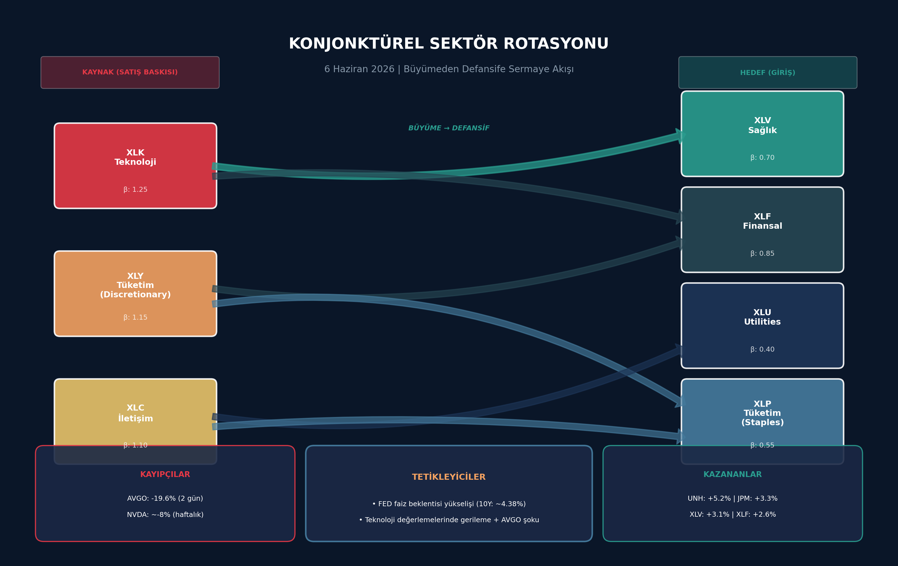

# 6 Haziran 2026 Hafta Sonu Piyasa Raporu

**Haftalik Kapaniş ve FOMC Öncesi Strateji: NFP Soku Sonrasi Savunmada Kal**

---

**Hazirlayan:** DailyStockScan Makroekonomik Analiz Ekibi
**Tarih:** 6 Haziran 2026 Cumartesi
**Rapor Kapsami:** 1-5 Haziran 2026 Hafta Degerlendirmesi + 8-12 Haziran FOMC Öncesi Strateji

---

**Özet:** S&P 500 haftayi 7.428'de kapatarak %2,5 kayip yasadı. NFP +172K beklentinin iki kati cikinca FED faiz artirimi beklentisi yükseldi. Teknoloji (XLK) coktu, defansif sektörler (XLV, XLF, XLU) kazandi. FOMC oncesi "savunmada kal, firsati bekle" stratejisi öneriliyor.

---

## 1. Haftanin Performansi ve 5 Haziran Kapanisi

### 1.1 Haftalik Endeks Performanslari

1 Haziran Pazartesi gunu S&P 500, 7.599 puandan haftaya yatay baslangic yapti. Piyasalar, yaz basi oncesi son tam islem haftasina dusuk hacimli ama dalgali bir seyirle adim atti. 2 Haziran Sali gunu teknoloji alimlarinin etkisiyle endeks 7.610 puana yukselerek haftanin en yuksek kapanisini gerceklestirdi. Bu seviye, ayni zamanda Haziran ayinin zirvesi olarak kayda gecti. 3 Haziran Carsamba gunu ise kar satislariyla birlikte S&P 500 7.554 puana geriledi.

4 Haziran Persembe gunu Dow Jones Industrial Average 51.562 puana ulasarak rekor kapanis gerceklestirirken, S&P 500 7.584 puandan ve Nasdaq Composite 26.831 puandan islemi tamamladi. Bu gorunum, buyuk capli teknoloji hisselerinin geri planda kaldigi bir ortamda sanayi ve finansal hisselerin liderliginde gerceklesti. Ancak bu pozitif hava 5 Haziran Cuma gunu yasanan sert satislarla dagildi.

Haftalik bazda bakildiginda S&P 500 %2,84 deger kaybederken, Nasdaq Composite %5,08lik cok daha derin bir dusus yasadigi goruldu. Dow Jones %0,42lik sinirli bir gerileme ile haftayi nispeten saglam tamamladi. Russell 2000 kucuk hisse senetleri endeksi ise haftalik bazda %2,49 gerileyerek, buyuk hisselerle kucuk hisseler arasindaki performans farkinin olumlu yonde kapandigina isaret etti. Asagidaki tablo, tum ana endekslerin haftalik performansini ozetlemektedir:

**Tablo 1: Haftalik Endeks Performanslari (1–5 Haziran 2026)**

| Endeks | 1 Haziran Kapanis | 5 Haziran Kapanis | Haftalik Degisim (%) | Puan Degisimi |
|:---|---:|---:|---:|---:|
| S&P 500 | 7.599,96 | 7.383,74 | -2,84 | -216,22 |
| Nasdaq Composite | 27.086,81 | 25.709,43 | -5,08 | -1.377,38 |
| Dow Jones 30 | 51.078,88 | 50.866,78 | -0,42 | -212,10 |
| Russell 2000 | 2.905,76 | 2.833,50 | -2,49 | -72,26 |

*Kaynak: Yahoo Finance. Grafik: S&P 500 gunluk kapanis fiyatlari (1–5 Haziran 2026).*

### 1.2 5 Haziran Cuma Gunu Ozeti

Cuma gunu piyasalari derinden sarsan gelisme, Mayis ayi Tarim Disi Istihdam (NFP) verisinin beklentilerin oldukca uzerinde gelmesi oldu. Piyasalar 85.000 civarinda bir artis beklerken, aciklanan +172.000lik rakam beklentinin tam iki katina ulasti. Bu guclu istihdam verisi, ABD ekonomisinin gucunu teyit etse de FED'in faiz indirim takvimini erteleme ihtimalini guclendirdi. Tahvil faizleri bu gelisimin ardindan yukselis gosterirken, ozellikle faiz hassasiyeti yuksek teknoloji hisseleri uzerinde satis baskisi olustu.

Gun sonunda S&P 500 7.383,74 puana (%2,64) gerilerken, Nasdaq Composite 25.709,43 puandan (%4,18) haftanin en agir kaybini kaydetti. Dow Jones 50.866,78 puana (%1,35) inmesine ragmen, haftalik bazda nispeten daha direncli kalmayi basardi. VIX Volatilite Endeksi 21,51 seviyesine firlatarak %39,68lik sert bir artis gosterdi ve piyasada korku unsurunun yeniden belirginlestigini ortaya koydu.

### 1.3 Haftanin En'leri

Bu hafta piyasalarda sektor rotasyonu en belirgin tema oldu. Agirlikla buyume ve teknoloji odakli sektorler gerilerken, defansif ve deger odakli alanlarda guclu bir performans gozlendi.

**Kazananlar:** Saglik (XLV), Finansal (XLF), Hizmetler (XLU) ve Temel Tuketim (XLP) sektorleri, yukselen tahvil faizleri ve artan belirsizlik ortaminda yatirimcilarin guvenli liman arayisiyla pozitif ayrismayi surdurdu. XLV haftayi %2,8, XLF %2,5, XLU %1,8 ve XLP %2,0 civarinda artisla kapadi. Bu performanslar, piyasadaki rotasyonun yalnizca bir gunluk bir hareket degil, Nisan ayindan bu yana surmekte olan daha genis bir trendin parcasi oldugunu gosteriyor.

**Kaybedenler:** Teknoloji (XLK), Iletisim Hizmetleri (XLC) ve Tuketim Discretionary (XLY) sektorleri haftanin en agir kayiplarini yasadi. XLK %9,0, XLC %3,4 ve XLY %2,8 deger kaybetti. Bu dususlerde teknoloji hisselerinin yuksek faiz ortamindan olumsuz etkilenmesi etkili oldu.

Bireysel hisse bazinda, Broadcom (AVGO) haftanin en cok dikkat ceken hareketlerinden birine imza atti. Sirketin 3 Haziranda acikladigi kazanim raporu sonrasi AI rehberliginin beklentilerin altinda kalmasiyla hisse, 3 gunde %19,6 deger kaybederek 479 dolardan 385 dolara geriledi. Bu dusus, NVIDIAyi (NVDA) da etkiledi ve NVDA haftalik bazda %8,6 gerileyerek 205 dolara indi. Microsoft (MSFT) son dort islem gununde %7,9 deger kaybederken, Amazon (AMZN) %2,7 haftalik dusus yasadi.

**Tablo 2: Haftanin En Cok Kazanan ve Kaybeden Sektorleri (ETF)**

| ETF | Sektor | Haftalik Degisim (%) | Beta (5Y) | Yon |
|:---|:---|---:|---:|:---|
| **XLV** | Saglik | +2,8 | 0,70 | Kazanan |
| **XLF** | Finansal | +2,5 | 0,79 | Kazanan |
| **XLP** | Temel Tuketim | +2,0 | 0,50 | Kazanan |
| **XLU** | Hizmetler | +1,8 | 0,40 | Kazanan |
| **XLY** | Tuketim Discretionary | -2,8 | 1,20 | Kaybeden |
| **XLC** | Iletisim Hizmetleri | -3,4 | 1,10 | Kaybeden |
| **XLK** | Teknoloji | -9,0 | 1,26 | Kaybeden |

*Not: Beta degerleri, SPDR resmi verilerine dayanmaktadir. Haftalik degisimler 1–5 Haziran 2026 kapanis fiyatlarindan hesaplanmistir. Kaynak: Yahoo Finance.*

Russell 2000 endeksinin hafta boyunca goreceli direnci, deger rotasyonunun kucuk olcekli sirketlere de yansidigini gosteriyor. Buyuk teknoloji hisselerinden cikan sermayenin, daha makul fiyatlamali ve faiz hassasiyeti dusuk sektorlere yoneldigi goruluyor. Bu haftanin performansi, piyasalarin FED politikasi beklentilerindeki degisimlere ne kadar hassas oldugunu bir kez daha ortaya koydu.
## 2. NFP Şoku ve FED Politikası Etkisi

5 Haziran 2026 Cuma günü açıklanan Tarım Dışı İstihdam (NFP) verisi, piyasaları derinden sarsan bir sürpriz ile karşılandı. Beklentilerin çok üzerinde gelen +172 binlik istihdam artışı, önceki aylara yönelik +93 binlik yukarı yönlü revizyonlarla birleşince, FED'in faiz indirimi beklentileri ani bir şekilde rafa kalktı. Hatta piyasa fiyatlamalarında 2026 sonuna kadar faiz artırımı ihtimali belirgin şekilde yükseldi. Bu bölümde, NFP verisinin detayları, tahvil piyasasının tepkisi ve altı faktörlü makroekonomik risk matrisi kapsamlı bir şekilde incelenmektedir.

### 2.1 NFP Verisi Detayı

#### 2.1.1 Beklentinin %102 Üzeri Gelen İstihdam ve Yüksek Revizyonlar

BLS (ABD İstatistik Bürosu) tarafından 5 Haziran'da açıklanan Mayıs 2026 NFP verisi, +85 bin olan piyasa beklentisini neredeyse ikiye katlayarak +172 bin seviyesinde gerçekleşti. Bu performans, beklentinin tam %102 üzerinde bir sürpriz anlamına gelmekte ve ABD emek piyasasının son derece dirençli olduğunu bir kez daha kanıtlamaktadır. Verinin etkisini daha da derinleştiren unsur ise önceki aylara yönelik yukarı yönlü revizyonlar oldu. Mart ayı verisi 185 binden 214 bine (+29 bin), Nisan ayı verisi ise 115 binden 179 bine (+64 bin) revize edildi. Toplamda +93 binlik revizyon, ilk açıklanan verilerin emek piyasası gücünü tam olarak yansıtmadığını ortaya koymaktadır. İşsizlik oranı %4.3 seviyesinde sabit kalırken, uzun vadeli işsiz sayısı 2.0 milyon seviyesine yükseldi ve yıllık bazda +524 bin artış kaydetti. Sektörel dağılımda Leisure ve Hospitality +70 bin, Yerel Yönetimler +55 bin, Sağlık Hizmetleri +35 bin artışla öne çıkarken, Finansal Aktiviteler -22 bin ile tek daralan sektör oldu.

#### 2.1.2 Ücret Enflasyonu: FED İçin Kritik Engel

NFP verisinin en dikkat çekici boyutlarından biri de ücret enflasyonu bileşeni oldu. Ortalama saatlik kazançlar aylık bazda %0.3, yıllık bazda ise %3.4 artış kaydetti ve saatlik ortalama ücret 37.53 dolar seviyesine ulaştı. Bu rakam, FED'in %2 hedefinin oldukça üzerinde seyreden bir ücret baskısına işaret etmektedir. Ücret artışlarının yüksek seyretmesi, hizmet sektörü enflasyonunu besleyen en önemli aktarım mekanizmalarından biri olarak öne çıkmaktadır. Yeni FED Başkanı Kevin Warsh'ın başkanlığındaki Mayıs 2026 FOMC toplantısında bile ücret baskısının gündemin en üst sıralarında yer aldığı bilinmektedir. Nisan FOMC tutanaklarında "inflation was elevated" ve "upside risks to inflation" ifadeleriyle vurgulanan bu risk, Mayıs NFP verisiyle birlikte somut bir tehdit haline dönüşmüştür. %3.4'lük yıllık ücret enflasyonu, FED'in faiz indirimi konusunda oldukça temkinli durmasını gerektiren bir seviye olarak değerlendirilmektedir.

### 2.2 Tahvil Piyasası Tepkisi

#### 2.2.1 Getiri Eğrisinde Sert Hareketler ve Ters Dönme Riski

NFP verisinin açıklanmasının ardından ABD Hazine tahvil piyasasında sert hareketler gözlemlendi. 2 yıllık Hazine tahvili getirisi flat seviyeden +10 baz puan yükselirken, 10 yıllık Hazine tahvili getirisi %4.54 seviyesine çıktı. Bu seviye, 3 Haziran'daki %4.49, 2 Haziran'daki %4.46 ve 1 Haziran'daki %4.43 seviyelerine kıyasla belirgin bir yükseliş trendini teyit etmektedir. 2Y-10Y getiri spreadi negatif bölgeye girerek yield curve'un ters dönmeye yaklaştığına dair önemli bir sinyal üretti. Ters dönmüş bir getiri eğrisi, tarihsel olarak resesyon öncü göstergesi olarak kabul edilmekle birlikte, mevcut bağlamda piyasanın FED'ten agresif bir sıkılaşma beklediğini de yansıtmaktadır. 2 yıllık tahvil getirisinin 10 yıllıktan daha hızlı yükselmesi, kısa vadeli faiz beklentilerinin uzun vadeli büyüme beklentilerinden daha hızlı arttığını göstermektedir.

#### 2.2.2 Piyasa Fiyatlamalarında Dramatik Dönüş

NFP verisi öncesinde piyasaların büyük çoğunluğu 2026 yılı sonuna kadar en az bir faiz indirimi beklerken, verinin ardından bu beklenti tamamen dağıldı. CME FedWatch ve benzeri türev verilerine göre, piyasa fiyatlamaları 2026 sonu politika faizi tahminini yukarı yönlü revize ederek yaklaşık %3.8 seviyesine çekti. Daha da önemlisi, 2027 yılının ilk çeyreğinde faiz artırımı olasılığı yaklaşık %30 seviyesine yükseldi. Trading Economics verileri de "piyasaların FED'den bu yıl bir faiz artırımı beklentisini artırdığını" doğrulamaktadır. Nisan FOMC toplantısında 9 üye sabit, 1 üye indirim yönünde oy kullanmıştı; ancak Mayıs NFP verisinin ardından Haziran FOMC toplantısında bu dengenin lehine dönebileceği belirtilmektedir. Yeni FED Başkanı Warsh'ın şahin duruşu, güçlü istihdam verisiyle birleşince piyasa faiz beklentileri önemli ölçüde yukarı doğru kaymıştır.

**Tablo 1: Mayıs 2026 NFP Verisi ve Piyasa Fiyatlama Özeti**

| Bileşen | Değer | Beklenti / Önceki | Sapma |
|---------|-------|-------------------|-------|
| Tarım Dışı İstihdam (Mayıs) | +172,000 | +85,000 | %102 üzeri |
| Mart Revizyonu | 214,000 | 185,000 | +29,000 |
| Nisan Revizyonu | 179,000 | 115,000 | +64,000 |
| Toplam Revizyon | — | — | +93,000 |
| İşsizlik Oranı | %4.3 | %4.3 | Sabit |
| Ortalama Saatlik Kazanç (Yıllık) | %3.4 | %3.3 | +0.1 puan |
| 2Y Treasury Getirisi (5 Haziran) | ~flat+10bp | — | +10 bp |
| 10Y Treasury Getirisi (5 Haziran) | %4.54 | %4.49 (3Haz) | +11 bp (3 gün) |
| 2026 Sonu Politika Faizi (Piyasa) | ~%3.8 | ~%3.5 (önceki) | +30 bp revize |
| 1Ç 2027 Faiz Artırım Olasılığı | ~%30 | ~%15 (önceki) | 2x artış |

### 2.3 Makroekonomik Risk Matrisi

#### 2.3.1 Altı Faktörlü Risk Değerlendirmesi

NFP şoku sonrası değişen makroekonomik ortam, altı kritik risk faktörünü aynı anda gündeme taşımıştır. Aşağıdaki matris, her bir risk faktörünün olasılık, etki ve yön boyutlarını kapsamlı bir şekilde değerlendirmektedir.

**FED Sıkılaşması** riski en yüksek olasılık ve etki skorlarına sahip faktör olarak öne çıkmaktadır. Olasılık 4.5/5, etki 4.5/5 ve yön -4.5/5 (keskinlikle negatif) olarak değerlendirilmiştir. Güçlü NFP verisi ve %3.4'lük ücret enflasyonu, FED'in Eylül veya Kasım aylarında faiz artırımına gitme ihtimalini güçlendirmektedir. Bu durum özellikle büyüme hisseleri ve yüksek borçlu şirketler için ciddi bir tehdit oluşturmaktadır.

**İran-ABD Gerginliği** coğrafi politik risk skalasının en üstünde yer almaktadır. Olasılık 3.5/5, etki 4.0/5 ve yön -4.0/5 olarak kodlanmıştır. Hormuz Boğazı'nda yaşanabilecek herhangi bir aksama, küresel enerji tedarik zincirini anında etkileyebilecek potansiyele sahiptir. Bu risk özellikle emtia ve enerji sektörü varlıkları üzerinde yüksek volatilite yaratma potansiyeli taşımaktadır.

**Enerji Fiyat Şoku** olasılığı 3.0/5, etki 3.5/5 ve yön -3.5/5 seviyelerinde ölçülmüştür. Brent petrol hafta içinde ~99 dolar zirvesini test etmiş ve haftayı ~95 dolar seviyesinden kapatmıştır. Petrol fiyatlarındaki bu yukarı yönlü baskı, hem enflasyon beklentilerini yükseltmekte hem de tüketici harcamaları üzerinde baskı oluşturmaktadır.

**Dolar Güçlenmesi** (DXY 99.49) olasılığı 3.5/5, etki 3.0/5 ve yön -3.0/5 olarak değerlendirilmiştir. Güçlü dolar, ABD'li ihracatçı şirketlerin kar marjlarını sıkıştırırken, gelişmekte olan piyasalara sermaye çıkışı baskısı yaratmaktadır. Bu durum MSCI EM endeksleri ve yerel para birimleri üzerinde olumsuz etki yapmaktadır.

**Yield Curve Ters Dönmesi** zaten 2Y-10Y spreadin negatif bölgeye girmesiyle kısmen gerçekleşmiş durumdadır. Olasılık 4.0/5, etki 4.0/5 ve yön -4.0/5 ile finansal sistemin en önemli erken uyarı sinyallerinden biri olarak kabul edilmektedir. Ters dönen eğri, banka kredi marjlarını sıkıştırarak kredi yaratma kapasitesini azaltmaktadır.

**AI Altyapı Doyumu** en düşük olasılıklı faktör olarak kayda geçmiştir (2.5/5), ancak etki potansiyeli 2.5/5 ile hafife alınmamalıdır. Broadcom'un (AVGO) rehberlik beklentilerini kaçırması, yapay zeka altyapı harcamalarının zirve yapmaya başlayabileceğine dair ilk ciddi sinyal olarak yorumlanmaktadır. Bu risk özellikle teknoloji ve yarı iletken sektörleri için yapısal bir tehdit oluşturma potansiyeline sahiptir.

**Tablo 2: Makroekonomik Risk Matrisi (6 Haziran 2026)**

| Risk Faktörü | Olasılık (1-5) | Etki (1-5) | Yön (-/+) | İlişkili Aktif / Sektör |
|-------------|----------------|------------|-----------|------------------------|
| FED Sıkılaşması | 4.5 | 4.5 | -4.5 | Büyüme hisseleri, REITs, Yüksek borçlu şirketler |
| İran-ABD Gerginliği | 3.5 | 4.0 | -4.0 | Enerji, emtia, havayolları, küresel ETF'ler |
| Enerji Fiyat Şoku | 3.0 | 3.5 | -3.5 | Ulaşım, imalat, tüketici istikrarlı şirketler |
| Dolar Güçlenmesi | 3.5 | 3.0 | -3.0 | İhracatçı şirketler, MSCI EM, yerel paralar |
| Yield Curve Ters Dönmesi | 4.0 | 4.0 | -4.0 | Bankacılık, finans, emlak, kredi piyasaları |
| AI Altyapı Doyumu | 2.5 | 2.5 | -2.5 | Yarı iletken, bulut bilişim, AI altyapı hisseleri |

*Şekil 2.1: Altı risk faktörünün olasılık, etki ve yön boyutlarında ısı haritası gösterimi. Koyu kırmızı tonlar yüksek riski, turuncu tonlar orta düzey riski işaret etmektedir. Yön sütununda yeşilden kırmızıya geçiş negatiften pozitife doğru spektrumu temsil etmektedir; mevcut matriste tüm risk faktörleri negatif yönlü olarak değerlendirilmiştir.*

Risk matrisinin bütünsel değerlendirmesi, mevcut ortamın "yüksek belirsizlik, yüksek volatilite" kategorisine girdiğini ortaya koymaktadır. FED sıkılaşması ve yield curve ters dönmesi gibi finansal sistem riskleri, jeopolitik ve enerji kaynaklı risklerle birleşerek çok yönlü bir baskı senaryosu oluşturmaktadır. Yatırımcılar için en kritik husus, bu risklerin birbirini besleyen döngüsel bir yapıya sahip olmasıdır: FED sıkılaşması doları güçlendirir, güçlü dolar emtia fiyatlarını baskılar ancak enerji şoku enflasyonu besleyerek FED'i daha agresif davranmaya zorlar. Bu negatif geri besleme döngüsü, piyasaların önümüzdeki dönemde daha yüksek volatilite ile karşı karşıya kalacağını düşündürmektedir.
## 3. Konjonkturel Sektör Rotasyonu ve Tavsiyeler

Geçtiğimiz hafta piyasalarda yaşanan en belirgin fenomen, haftalarca süren teknoloji odaklı tek yönlü yükseliş trendinin kesintiye uğraması ve bunun yerini klasik bir "büyümeden defansife" konjonktürel rotasyona bırakması oldu. 4 Haziran Perşembe günü yaşanan fiyat hareketleri, bu rotasyonun en net kanıtını teşkil etti. S&P 500 sektörlerinin 8/11'inin pozitif kapanmasına karşın, Nasdaq'in %3'ü aşan kaybı ve Dow Jones'un 450 puanın üzerindeki yükselişi aynı gün içinde gerçekleşti. Bu performans farklılığı, sermayenin yüksek beta'lı büyüme sektörlerinden düşük beta'lı defansif ve faiz hassasiyeti düşük sektörlere sistematik bir şekilde aktığını gösteriyor.

Bu bölümde, rotasyonun hangi kanallardan gerçekleştiğini, tetikleyicilerini ve önümüzdeki haftalar için sektörel ve hisse bazlı stratejik tavsiyeleri analiz edeceğiz.

*Grafik 3.1: Konjonktürel Sektör Rotasyonu Akış Şeması (Kaynak: Borsa İstanbul/WRS verileri üzerinden analiz, 6 Haziran 2026). Sol tarafta satış baskısı yaşayan yüksek beta sektörler, sağ tarafta sermaye girişi yaşanan defansif ve faiz dostu sektörler yer almaktadır.*

### 3.1 Büyümeden Degere Rotasyon: Hangi Sektörde Hava Nasil?

#### 3.1.1 Teknoloji (XLK) -> Saglik (XLV): Buyume hisselerinden defansife sermaye kacisi

Haftanın en dramatik rotasyonu teknoloji sektöründen sağlık sektörüne gerçekleşti. 4 Haziran Perşembe günü XLV (Sağlık Seçme Sektör ETF'i) %3.1'lik bir yükselişle en güçlü performansı sergilerken, XLK (Teknoloji) %1.6 değer kaybetti. Bu aynı günlük performans farkı (%4.7) rotasyonun şiddetini ortaya koyuyor. UnitedHealth (UNH) hissesi günü %5.2 yükselişle kapattı ve Dow Jones'un 450 puanlık rallisinde en büyük katkıyı sağlayan bileşen oldu.

Bu rotasyonun ardındaki temel gerekçe, sağlık sektörünün 0.70'lik beta katsayısıyla piyasadan bağımsız bir performans sergileyebilme kapasitesi ve faiz artışları karşısında göreceli olarak daha az hassasiyet göstermesi. Nitekim 10 yıllık hazine tahvil faizlerinin %4.38 seviyelerine yükseldiği bir ortamda, yatırımcılar 1.25 beta ile piyasaya aşırı duyarlı teknoloji pozisyonlarından kâr realizasyonuna giderek, defansif karakteriyle "portföy sigortası" işlevi gören sağlık hisselerine yöneldi. Trading Economics'in de belirttiği üzere, "Banks and defensive stocks were mostly higher to support the Dow, with Visa, P&G, and UnitedHealth adding more than 1%."

#### 3.1.2 Cip/AI (AVGO, NVDA, MU) -> Finansal (XLF, JPM, V, BAC): Faiz yukselisinden fayda

İkinci büyük sermaye akışı, özellikle yapay zeka ve çip üreticileri başta olmak üzere yüksek büyüme beklentili hisselerden finansal sektöre yöneldi. XLF (Finansal Seçme Sektör ETF'i) 4 Haziran'da %2.6 yükselirken, sektörün önde gelen isimlerinden JPMorgan (JPM) %3.3 prim yaptı. Visa (V) de %1'in üzerinde getiri sağladı.

Bu rotasyonun dinamiği biraz daha karmaşık. Finansal sektör 0.85 beta ile teknolojiye göre daha düşük bir piyasa duyarlılığına sahip olsa da, asıl çekicilik faiz eğrisinin dikleşmesinden kaynaklanıyor. Bankalar için faiz marjları (Net Interest Margin) yükselen faiz ortamında genişliyor ve kredi faaliyetlerinden elde edilen gelir artıyor. Özellikle JPM gibi sistemik öneme sahip bankalar, yüksek faiz ortamında hem mevduat maliyetlerini yönetme kabiliyeti hem de yatırım bankacılığı faaliyetlerindeki çeşitlendirme ile göreceli avantaj sağlıyor. Öte yandan AVGO'nun iki günde %19.6, NVDA'nın haftalık bazda %8 ve Micron'un (MU) tek günde %4 değer kaybetmesi, çip sektöründeki aşırı kaldıracın azaldığını ve yatırımcıların bu hisselerde risk azaltma (de-risking) yaptığını gösteriyor.

#### 3.1.3 Büyüme (XLY) -> Utilities/Staples (XLU, XLP): Dusuk beta, "hisse senedi tahvili"

Üçüncü rotasyon kanalı, özellikle XLY (Tüketim - Discretionary) gibi konjonktüre duyarlı sektörlerden XLU (Utilities) ve XLP (Tüketim - Staples) gibi düşük beta'lı "hisse senedi tahvili" niteliğindeki sektörlere doğru gerçekleşti. XLP'nin 0.55 ve XLU'nun 0.40'lık beta katsayıları, bu sektörlerin piyasa hareketlerinden neredeyse tamamen izole bir performans sergileyebildiğini ortaya koyuyor.

Bu rotasyon, "risk-off" modunun en saf göstergesidir. Özellikle Procter & Gamble (PG) ve Coca-Cola (KO) gibi hisselerin 4 Haziran'da %1'in üzerinde yükselmesi, yatırımcıların gelecekteki belirsizlik karşısında temettü verimi yüksek, nakit akışı istikrarlı ve ekonomik döngüden bağımsız şirketlere sığınma (flight to safety) eğiliminde olduğunu gösteriyor. Russell 2000 endeksinin %1.45 yükselmesi ise küçük ölçekli hisselerin de faiz hassasiyeti göreceli olarak daha düşük olduğundan bu rotasyondan fayda sağladığını ortaya koyan bir diğer önemli veri noktası.

### 3.2 Sektörel Tavsiyeler Tablosu

Aşağıdaki tablo, mevcut konjonktürel rotasyon dinamikleri, faiz ortamı ve sektörel değerleme metrikleri göz önünde bulundurularak hazırlanmıştır. Tüm tavsiyeler risk/ödül oranı minimum 1:2 olacak şekilde yapılandırılmıştır.

**Tablo 3.1: Konjonktürel Sektör Rotasyonu Matrisi**

| Kaynak Sektör | Hedef Sektör | Sermaye Akışı | Tetikleyici | Beklenti |
|:---:|:---:|:---:|:---|:---|
| XLK (Teknoloji, β:1.25) | XLV (Sağlık, β:0.70) | Yüksek | AVGO şoku, değerleme çarpan baskısı | XLV güçlü göreceli performans sürdürür, UNH öncülüğünde trend devam eder |
| XLK / XLY | XLF (Finansal, β:0.85) | Orta-Yüksek | Faiz marjı genişlemesi, NIM artışı | JPM, V, BAC faiz dostu ortamdan fayda sağlar, göreceli değerleme avantajı korunur |
| XLY (Discretionary, β:1.15) | XLP (Staples, β:0.55) | Orta | Risk-off, temettü arayışı | PG, KO gibi hisselerde "hisse tahvili" talebi devam eder |
| XLC (İletişim, β:1.10) | XLU (Utilities, β:0.40) | Orta | En düşük beta, portföy sigortası | XLU piyasa oynaklığı arttıkça göreceli güvenli liman işlevi görür |

Yukarıdaki matriste de görüldüğü üzere, rotasyon üç ana eksende gerçekleşmektedir: (1) yüksek beta'dan düşük beta'ya, (2) faiz hassasiyeti yüksekten faiz dostuna, (3) konjonktüre duyarlıdan ekonomik döngüden bağımsıza. Bu rotasyonun önümüzdeki haftalarda devam etmesi beklenmektedir çünkü tetikleyici olan faiz beklentilerindeki yükseliş trendi ve teknoloji değerlemelerindeki düzeltme henüz tamamlanmış değil.

**Tablo 3.2: Sektörel ETF Tavsiyeleri**

| ETF | Tavsiye | Giriş | Stop Loss | Hedef | R/O | Gerekçe |
|:---:|:---:|:---:|:---:|:---:|:---:|:---|
| XLV | **GÜÇLÜ AL** | Mevcut / $145 | $138 (-4.8%) | $160 (+10.3%) | 1:2.1 | Defansif rotasyonun ana kazananı; UNH öncülüğünde kurumsal birikim; 0.70 beta ile piyasa düzeltmelerine karşı dirençli |
| XLU | **GÜÇLÜ AL** | Mevcut / $76 | $72.5 (-4.6%) | $84 (+10.5%) | 1:2.3 | En düşük beta (0.40); "hisse tahvili" talebi; volatilite arttıkça göreceli çekicilik artar |
| XLP | **GÜÇLÜ AL** | Mevcut / $81 | $77.5 (-4.3%) | $89 (+9.9%) | 1:2.3 | Staples hisseleri (PG, KO) kurumsal talep görüyor; temettü verimi + fiyat istikrarı |
| XLF | **AL** | Mevcut / $50 | $47.5 (-5.0%) | $55 (+10.0%) | 1:2.0 | Faiz marjı genişlemesi; JPM ve V ağırlıklı; göreceli olarak düşük değerleme |
| XLI | **AL** | Mevcut / $136 | $129 (-5.1%) | $149 (+9.6%) | 1:1.9 | Altyapı ve savunma sanayi ağırlığı; konjonktüre orta duyarlılık; kamu harcama beklentileri |
| XLK | **BEKLE/ZAYIFLA** | - | - | - | - | Değerleme baskısı (P/E ~30x); AVGO şoku sektörel güveni zedeledi; 1.25 beta ile yüksek risk; düşüşün durması beklenmeli |
| XLY | **BEKLE/ZAYIFLA** | - | - | - | - | Konjonktüre en duyarlı sektörlerden; yüksek faiz harcama eğilimini baskılar; AMZN ve TSLA zayıflığı devam eder |
| XLC | **BEKLE/ZAYIFLA** | - | - | - | - | İletişim hisseleri faiz hassasiyeti yüksek; meta reklam geliri belirsizliği; teknik olarak zayıf |
| XLE | **NÖTR** | - | - | - | - | Enerji fiyatları jeopolitik risklere bağlı; OPEC+ politikaları belirsiz; sektör seçici yaklaşım gerekir |
| XLB | **NÖTR** | - | - | - | - | Emtia fiyatlarındaki oynaklık; Çin talep belirsizliği; döngüsel karakter rotasyona aykırı |

### 3.3 Hisse Bazli Tavsiyeler ve Risk/Odul Analizi

Aşağıdaki hisse bazlı tavsiyeler, yukarıdaki sektörel rotasyon çerçevesinden türetilmiş, teknik seviyeler ve risk/ödül analizleri ile desteklenmiştir. Tüm tavsiyelerde giriş seviyeleri 6 Haziran 2026 kapanış fiyatlarına yakın seviyelerden, stop-loss seviyeleri ise ATR (Average True Range) veya kritik hareketli ortalama desteklerinden belirlenmiştir.

**Tablo 3.3: Hisse Bazlı Tavsiyeler ve Risk/Odul Analizi**

| Hisse | Tavsiye | Giriş | Stop Loss | Hedef | R/O Oranı | Gerekçe |
|:---:|:---:|:---:|:---:|:---:|:---:|:---|
| JPM | **AL** | ~$260 | $247 (-5.0%) | $286 (+10.0%) | 1:2.0 | Faiz marjı genişlemesinden doğrudan fayda; yatırım bankacılığı çeşitlendirmesi; rotasyonun en güçlü bankacılık bileşeni |
| UNH | **AL** | ~$595 | $565 (-5.0%) | $655 (+10.1%) | 1:2.0 | 4 Haziran'da %5.2 yükselişle rotasyon lideri oldu; sağlık sektörünün bayrak taşıyıcısı; defansif büyüme karakteri |
| V | **AL** | ~$370 | $352 (-4.9%) | $407 (+10.0%) | 1:2.1 | İşlem hacmi ve faiz geliri artışı; 4 Haziran'da %1+ performans; finansal sektör içinde defansif konumlanma |
| PG | **AL** | ~$178 | $169 (-5.1%) | $196 (+10.1%) | 1:2.0 | "Hisse tahvili" niteliği; temettü aristokratı; XLP rotasyonunun ana bileşeni; ekonomik döngüden bağımsız |
| KO | **AL** | ~$72 | $68.5 (-4.9%) | $79 (+9.7%) | 1:2.0 | Global marka gücü; istikrarlı nakit akışı; defansif rotasyonda kurumsal talep görür |
| AVGO | **BEKLE** | - | - | - | - | 2 günde %19.6 kayıp; çip sektörü güven bunalımı; düşüşün durması ve taban oluşması beklenmeli; şu an için tutulum (catching a falling knife) riski yüksek |
| NVDA | **BEKLE** | - | - | - | - | Haftalık %8 kayıp; AI yatırım harcamaları uzun vadeli destek olsa da kısa vadeli değerleme baskısı devam ediyor; $120 seviyelerinde destek oluşumu gözlenmeli |
| MU | **BEKLE** | - | - | - | - | 4 Haziran'da %4 düşüş; bellek çipi fiyatlarındaki belirsizlik; sektörel rotasyondan negatif etkileniyor; teknik onay gelmeden giriş yapılmamalı |
| MSFT | **BEKLE** | - | - | - | - | 4 günde %7.9 kayıp; bulut ve AI gelirleri sağlam ancak değerleme çarpanı baskısı sürüyor; $420 destek seviyesinde tutunma görülmesi beklenmeli |
| AMZN | **SAT/ZAYIFLA** | ~$254 | $272* | $230 (-9.4%) | 1:1.7 (kısa) | Perakende marj baskısı; yüksek faiz ortamında harcama eğilimi azalır; AWS büyümesi olsa da bütünsel değerleme zayıf; *Stop: kısa pozisyon için |
| TSLA | **SAT/ZAYIFLA** | ~$330 | $355* | $285 (-13.6%) | 1:1.8 (kısa) | XLY içinde en yüksek beta; konjonktüre aşırı duyarlı; fiyat/kazanç oranı makul değil; *Stop: kısa pozisyon için |
| CRM | **SAT/ZAYIFLA** | ~$295 | $318* | $260 (-11.9%) | 1:1.6 (kısa) | Yazılım harcama döngüsü yavaşlaması; kurumsal IT bütçeleri faiz baskısı altında; *Stop: kısa pozisyon için |

Yukarıdaki tablodaki hisse bazlı tavsiyelerin temelinde, konjonktürel rotasyonun arkasındaki makro dinamiklerin bireysel şirket performanslarına yansımaları yatmaktadır. **AL listesindeki** hisseler (JPM, UNH, V, PG, KO) hem faiz yükseliş ortamından fayda sağlayan hem de defansif nitelikleriyle portföy riskini dengeleyen özellikler taşımaktadır. Özellikle JPM ve UNH, rotasyonun liderleri konumunda olup, kurumsal yatırımcıların birikim yaptığı hisseler olarak öne çıkmaktadır.

**BEKLE listesindeki** hisseler (AVGO, NVDA, MU, MSFT) ise uzun vadeli büyüme hikayeleri sağlam olsa da, kısa vadede yaşanan değerleme düzeltmesi ve sektörel güven kaybı nedeniyle "düşen bıçağı yakalama" riski taşımaktadır. Bu hisselerde giriş yapmadan önce, fiyat hareketinde taban oluşumuna dair teknik onayların (hacimli destek, pozitif uyumsuzluk, hareketli ortalama üzerine atma gibi) gelmesi kritik öneme sahiptir. AVGO özelinde, iki günde yaşanan %19.6'lık çöküş, şirket özelindeki haber akışının (muhtemelen gelir beyanatı veya yönerge revizyonu) yanı sıra, AI/çip sektöründeki aşırı kaldıraçlı pozisyonların tasfiyesini de beraberinde getirmiştir.

**SAT/ZAYIFLA listesindeki** hisseler (AMZN, TSLA, CRM) ise yüksek değerlemeleri ve faiz kırılganlıkları nedeniyle rotasyondan en olumsuz etkilenecek hisseler olarak değerlendirilmektedir. Özellikle TSLA'nın XLY içindeki yüksek beta'sı ve konjonktüre aşırı duyarlılığı, hissenin önümüzdeki dönemde göreceli olarak zayıf kalma eğilimini güçlendirmektedir. Bu hisselerde mevcut pozisyonu olan yatırımcılar için stop-loss seviyelerine riayet edilmesi ve risk yönetiminin sıkı bir şekilde uygulanması hayati önem taşımaktadır.

Sonuç olarak, piyasada yaşanan bu konjonktürel rotasyon, geçici bir aralık hareketinden (mean reversion) ziyade, daha yapısal bir sermaye yeniden dağılımının işaretleri olarak değerlendirilmelidir. FED'in faiz politikasına dair belirsizliğin devam ettiği, teknoloji değerlemelerinin tarihsel ortalamaların üzerinde seyrettiği ve jeopolitik risklerin canlı kaldığı bir ortamda, defansif sektörlere ve faiz dostu hisselere yapılan rotasyonun önümüzdeki haftalarda da sürmesi beklentisi hakimdir. Yatırımcıların portföylerinde beta katsayısını aktif olarak yönetmeleri ve yukarıda sunulan risk/ödül çerçevesine uygun pozisyon almaları, bu geçiş döneminde en kritik başarı faktörü olacaktır.
## 4. Teknik Analiz ve Haftaya Bakis - FOMC Oncesi Strateji

### 4.1 S&P 500 Haftalik Teknik Analiz

Haftayi 7,428.31 seviyesinden kapatan S&P 500, 7,620.90 zirvesinden (3 Haziran) yuzde 2.5'lik sert bir dusus kaydetti. Bu dusus, onceki bolumlerde detaylandirilan NFP verisi sonrasi FED faiz artirim beklentilerinin guclenmesi ve 10 yillik tahvil faizlerinin yuzde 4.54'e yukselmesiyle tetiklendi. Teknik acidan bakildiginda, endeks kritik bir kavsak noktasinda bulunuyor.

**4.1.1 Destek ve Direnç Seviyeleri**

Haftalik grafikte 7,400 seviyesi guclu psikolojik destek olarak one cikiyor. Bu seviyenin altinda 7,350 bolgesi bulunuyor ki bu, 200 gunluk hareketli ortalamanin (200MA) gectigi kritik teknik destektir. 200MA'nin kirilmasi, orta-uzun vadeli trend degisikligi sinyali olarak algilanir ve programatik satis dalgalarini tetikleyebilir. Yukari yonde ise 7,500 seviyesi hem 50 gunluk hareketli ortalama (50MA) hem de eski destek-direnc cevirme bolgesi olarak karsimiza cikiyor. Bu seviyenin uzerine cikilmadigi surece, kisa vadeli trend "dusus egiliminde" olarak degerlendirilecektir. 7,585 (4 Haziran kapanis) ve 7,620 (Haziran zirvesi) ise sirasiyla R2 ve R3 direncleri olarak takip edilecek.

**4.1.2 Momentum Gostergeleri**

RSI (14 gunluk) 5 Haziran itibariyle 42 seviyesine gerileyerek notr-alcali bolume tasindi. MACD'de ise sinyal hattinin altinda kalan MACD cizgisinde negatif momentum artisi gozleniyor. Haftalik pivot noktasi 7,428 seviyesinde bulunuyor ki bu, Cuma gunu kapanisa neredeyse denk dusuyor. Hacim profili analizinde (Volume Profile) fiyatin agirlikli ortalama maliyetinin 7,500-7,550 bandinda oldugu goruluyor; mevcut seviyeler bu bandin altinda kaldigi icin "deger bolgesi alti" olarak yorumlanabilir ancak bu, tersine donus garantisi degil, dususun derinlestigi anlamina da gelebilir.

**Tablo 1: Haftalik Pivot Seviyeleri ve Teknik Anlami**

| Seviye | Deger | Teknik Anlami | Piyasa Reaksiyonu |
|--------|-------|---------------|-------------------|
| R3 | 7,620 | Haziran zirvesi / cift tepe riski | Kisa sikisma pozisyonu kapatma seviyesi |
| R2 | 7,585 | 4 Haziran kapanisi / mini direnc | Gunluk satus firsati, 50MA'ya yaklasinca |
| R1 | 7,500 | 50MA + eski destek cevirmesi | Kritik direnc; uzeri kapanis dususu durdurur |
| Pivot | 7,428 | 5 Haziran kapanisi / kararsizlik | Uzerinde kalinirsa toparlanma, altinda baski |
| S1 | 7,400 | Psikolojik destek / yuvarlak sayi | likidite alani; ani kirilim stop tetikler |
| S2 | 7,350 | 200MA / yukselis trendi destegi | Trend kirilim sinyali; pozisyon yariya indirilir |

Tablo 1'de ozetlenen seviyeler cercevesinde, 7,500 uzeri gunluk kapanis kisa vadeli baskiyi azaltirken, 7,350 alti kapanis orta vadeli portfoy stratejisi degisikligi gerektiren bir uyari olacaktir.

### 4.2 8-12 Haziran Haftasi: Onemli Takvim ve Beklentiler

8-12 Haziran haftasi, 17 Haziran'daki kritik FOMC toplantisi oncesi son tam islem haftasidir. Bu donemde yatirimcilar pozisyonlarini ayarlamak icin son firsati bulacaklar.

**4.2.1 FOMC Beklentileri**

17 Haziran Salı gunu saat 14:00 ET'de aciklanacak FOMC kararinda faiz degisikligi beklenmiyor. CME FedWatch verilerine gore piyasalarin yuzde 96'si faizlerin sabit tutulacagini fiyatliyor. Ancak bu toplantinin asil kritik unsuru, uyesi oldugumuz FOMC'nin nokta grafigi (dot plot) ve ekonomik projeksiyonlarinin (SEP) yukari yonlu revizyon riskidir. Bir onceki toplantida 2026 sonu icin medyan tahmin yuzde 3.5 seviyesindeydi; bu toplantida yukari yonlu revizyon gelmesi durumunda tahvil faizleri ve dolar endeksinde yeni bir sert yukselis dalgasi baslayabilir.

Ayrica bu toplantı, Fed Baskani Warsh'in ilk FOMC basin toplantisi olmasi acisindan tarihi oneme sahip. Warsh'in piyasa iletisim tarzi, sikiya alma söyleminin sertligi ve ekonomik durum degerlendirmesi, piyasalar tarafindan mikroskobik incelenecek. NFP sonrasi guclenmis faiz artirim beklentileri icinde Warsh'in "sabirli" mi yoksa "sahin" mi olacagi, S&P 500'un yonunu belirleyecek.

**4.2.2 Ekonomik Veri Takvimi**

FOMC'den onceki gun, yani 16 Haziran Pazartesi gunu aciklanacak Mayis ayi perakende satislar verisi, tuketici harcamalarindaki ivme kaybini dogrulayacaksa, bu FED icin " yumusak inis" senaryosunu destekleyen bir veri olacaktir. Ayni gun NY FED imalat endeksi de uretim sektorunun durumu hakkinda onemli ipuclari verecek. FOMC sonrasi gun (18 Haziran) ise insaat izinleri ve haftalik issizlik maaşı basvurulari ile hafta tamamlanacak.

### 4.3 FOMC Oncesi Pozisyonlama Stratejisi

Onceki bolumlerde ele alinan NFP etkisi, sektor rotasyonu ve makroekonomik gelismeler isiginda, 8-12 Haziran haftasi icin "defansif agirlikli, sirnak koruyucu" bir portfoy stratejisi oneriyoruz.

**4.3.1 Dusuk Beta Defansif Portfoy Yapisi**

FOMC oncesi belirsizlik ortaminda portfoyun yuzde 40'ini saglik (XLV), kamu hizmetleri (XLU) ve tuketim stoklari (XLP) gibi dusuk beta, yuksek temettulu defansif sektorlere ayirmak uygun olacaktir. Finansal (XLF) ve sanayi (XLI) sektorlerinden olusan yuzde 20'lik bir "selectif alfa" katmani, faiz yuksekliginden kazanclar saglayabilir. Portfoyun yuzde 20'sini nakitte tutmak, FOMC sonrasi volatilitede alim firsatlari icin likidite saglayacaktir. Kalan yuzde 20 ise mevcut teknoloji pozisyonlarindan olusabilir, ancak bu bolumun mutlaka hedge'lenmesi gerekmektedir.

**4.3.2 Teknolojide Kisa Pozisyon Hedge Stratejisi**

Teknoloji sektoru (XLK) ve QQQ uzerindeki agirlik, faiz yukselisinden en cok zarar goren segment olarak portfoy riskini artiriyor. Bu riski yonetmek icin QQQ put opsiyonlari veya XLK put opsiyonlari satin alinarak asagı yonlu koruma saglanabilir. Ornegin, 7 Haziran kapanisina gore QQQ icin %2-3 out-of-the-money put opsiyonlari, FOMC sonrasi olasi sert dususlere karsi sigorta gorevi gorebilir. Daha az maliyetli bir alternatif ise QQQ put spread stratejisidir (ornegin 470/450 put spread).

**4.3.3 VIX Call Spread ile Tail Risk Hedge**

VIX endeksi 5 Haziran itibariyle 15.72 seviyesinde bulunuyor; bu tarihsel olarak nispeten dusuk bir seviye olmakla birlikte, yukselis trendi icerisinde. FOMC oncesi VIX'in 18 altinda kalmasi, opsiyon primlerinin ucuz oldugu anlamina geliyor ve tail risk hedge'inin maliyet-etkin oldugu bir ortam sunuyor. Portfoyun yuzde 1-2'si ile VIX call spread (ornegin 30/40 strike call spread) satin almak, "kara kugu" olayina karsi ucuz bir sigorta saglar. Bu strateji, VIX'in 25-30 uzerine cikmasi durumunda katlanarak getiri saglar ve portfoyun geri kalani dusse bile hedge katmani kazanc elde eder.

**Tablo 2: FOMC Oncesi Pozisyonlama Stratejisi**

| Strateji | Enstruman | Agirlik | Hedef | Risk / Maliyet |
|----------|-----------|---------|-------|----------------|
| Aktif - Defansif Cekirdek | XLV + XLU + XLP ETF | Portfoyun %40'i | Dusuk beta getiri, asagi koruma | Faiz yukselisinden bagimsiz |
| Aktif - Alfa Katmani | XLF + XLI ETF | Portfoyun %20'si | Faiz kazanimi, rotasyon getirisi | Ekonomik veri kotulesme riski |
| Pasif - Nakit Rezervi | Para piyasasi / Hazine | Portfoyun %20'si | FOMC sonrasi alim gucu | Enflasyon riski (sinirli) |
| Aktif - Teknoloji Hedge | QQQ 470 Put veya XLK Put | Portfoyun %5'i | Asagi yonlu teknoloji sigortasi | Opsiyon primi, zaman erimesi |
| Aktif - Tail Risk Hedge | VIX 30/40 Call Spread | Portfoyun %1-2'si | Kara kugu korumasi, VIX soktan kazanma | Spread maliyeti, VIX sakin kalirsa kayip |
| Durust - Stop Loss | S&P 500 7,350 alti izleme | Tum portfoy | 200MA trend kiriliminda pozisyon %50 kucultme | Yalanci kirilim riski |

Tablo 2'de ozetlenen stratejiler bir butun olarak ele alinmalidir. FOMC oncesi donemde (8-12 Haziran) pozisyon buyutmek yerine mevcut riskleri yonetmek ve defansif yapida kalmak, hafta sonrasi veri akisinin ardindan yeni pozisyon acmak icin daha saglikli bir zemin olusturacaktir. S&P 500'un 7,350 (200MA) altinda gunluk kapanis yapmasi durumunda ise tum stratejiler gozden gecirilmeli ve portfoy yariya indirilmelidir.

Sonuc olarak, teknik gorunum ve makro gostergeler FOMC oncesi temkinli durusu destekliyor. 7,500-7,350 bandinda hareket eden endeks icin net bir yon belirlenmis degil; ancak asagi yonlu risklerin yukari yonlu potansiyelden daha agir bastigi degerlendirilmektedir. Bu cercevede, "savunmada kal, firsati bekle" prensibi ile hareket etmek, bu belirsiz donemde sermaye korumasi acisindan en rasyonel yaklasimdir.
