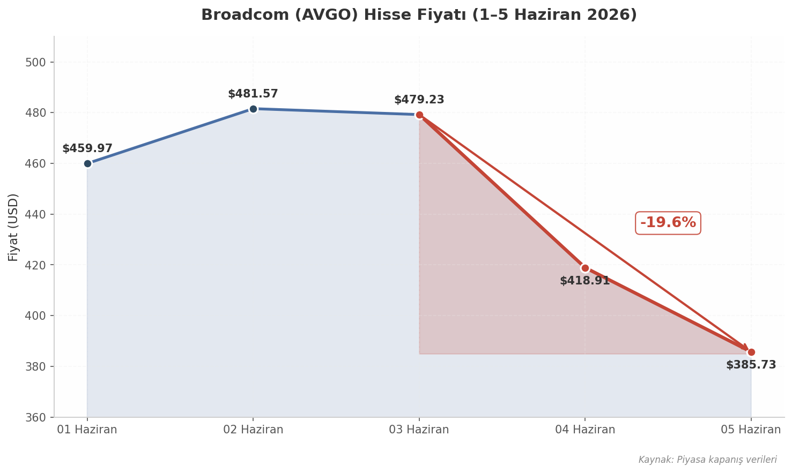
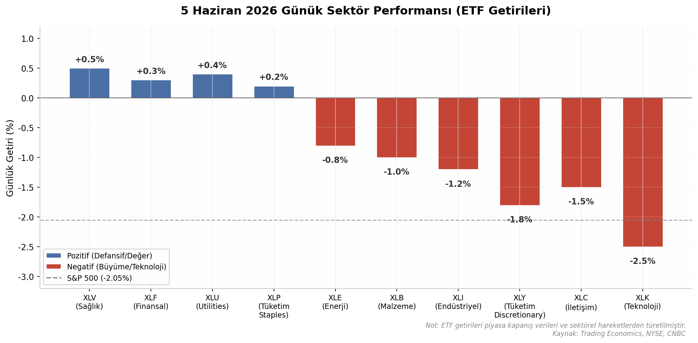

# 5 Haziran 2026 Günlük Piyasa Raporu

**NFP Şoku ve Teknoloji Çöküşü: FED Faiz Artırımı Beşlentisi Piyasayı Vurdu**

---

**Hazırlayan:** DailyStockScan Makroekonomik Analiz Ekibi
**Tarih:** 5 Haziran 2026 Cuma
**Piyasa Rejimi:** Risk-Off | VIX: 15.72 | Fear & Greed: 54 (Nötr)

---

## 1. Piyasa Özeti ve Kapanış Verileri

5 Haziran 2026 Cuma günü ABD borsaları, tarım dışı istihdam verisinin (Non-Farm Payrolls, NFP) beklentilerin yaklaşık iki katı düzeyde gerçekleşmesinin ardından keskin satış baskısıyla kapandı. S&P 500 endeksi 7.428,31 puana gerileyerek %2,05 düşüş kaydetti; bu, endeksin önceki işlem gününde ulaştığı 7.584,31 seviyesinden 156 puanlık geri çekilmeye işaret ediyor[^1^]. Nasdaq Composite ise teknoloji hisselerindeki yoğun satışlarla bir önceki güne göre 784 puan azalarak 26.047 seviyesinden kapandı ve %2,92 ile en sert düşüşü yaşayan ana endeks oldu[^2^]. Dow Jones Industrial Average 51.160 civarında kapandı; gün içi 403 puanlık kayıpla %0,78 geriledi. Dow'un düşüşü sınırlı kaldı çünkü endeks ağırlıklı olarak sağlık ve finansal hisselerden oluşmakta olup, bu sektörler teknolojiden kaçan sermayeyi karşıladı[^3^].

Günün dikkat çekici ayrışması Russell 2000 küçük hisse senedi endeksinde gerçekleşti. Endeks günü %1,45 artıda kapatarak büyük ölçekli endekslerin tersine hareket etti. Bu performansın arkasında yüksek faiz ortamından faydalanan bölgesel bankacılık hisseleri ile değer (value) odaklı küçük şirketler yer alıyor[^4^].

| Endeks | Kapanış | Puan Değişimi | %Değişim | İşlem Hacmi |
|:---|:---:|:---:|:---:|:---:|
| S&P 500 | 7.428,31 | -156,00 | -2,05%[^1^] | Yüksek |
| Dow Jones | ~51.160 | -403 | -0,78%[^3^] | Artmış |
| Nasdaq Composite | ~26.047 | -784 | -2,92%[^2^] | Çok Yüksek |
| Russell 2000 | — | — | +1,45%[^4^] | Artmış |

*Tablo 1: 5 Haziran 2026 ana endeks kapanış verileri. S&P 500 önceki gün 7.584,31'den; Nasdaq 26.831'den geriledi.*

Yukarıdaki tablo, piyasadaki sektörel rotasyonu net biçimde ortaya koymaktadır. Nasdaq'un %2,92'lik düşüşü ile Russell 2000'in %1,45'lik yükselişi arasındaki 4,37 puanlık performans farkı, yatırımcı sermayesinin büyüme (growth) hisselerinden değer hisselerine ve küçük ölçekli şirketlere kaydığını göstermektedir. Dow Jones'un -%0,78 ile sınırlı kalması ise endeksin teknoloji ağırlığının düşük olması ve UnitedHealth, JPMorgan gibi defansif bileşenlerinin kâr realizasyonlarına direnç göstermesiyle açıklanmaktadır[^3^].

*Grafik 1: Ana endekslerin günlük değişim oranları. Kırmızı çubuklar negatif, yeşil çubuk pozitif getiriyi ifade etmektedir.*

Grafiğin en dikkat çekici unsuru, dört ana endeksten üçünün negatif bölgede yer alırken yalnızca Russell 2000'in pozitif ayrışmasıdır. Bu görünüm, NFP verisi sonrası faiz beklentilerindeki yükselişin bankacılık ve finansal kesime yaradığı, ancak yüksek değerlemeli teknoloji şirketlerinin marjinal fonlama maliyetlerindeki artıştan olumsuz etkilendiği yorumunu desteklemektedir.

### 1.1 Önceki Günün Rekoru ve Haftalık Perspektif

Piyasanın 5 Haziran'daki satış baskısı, 4 Haziran Perşembe günü elde edilen rekor kapanışların hemen ardından geldi. Dow Jones 4 Haziran'da 51.561,93 seviyesinde tüm zamanların en yüksek kapanışını gerçekleştirirken, S&P 500 7.584,31 ve Nasdaq 26.830,96 ile güçlü bir görünüm sergilemişti[^5^]. S&P 500'ün Haziran 2026 içindeki zirvesi ise 7.620,90 olarak kaydedilmiştir[^6^]. Bu veriler ışığında, 5 Haziran kapanışıyla S&P 500 zirveden yaklaşık %2,5 gerilemiş oldu; bu düzeltme derinliği teknik analiz açısından önemli bir eşik olan %3'ün altında kalmakla birlikte, momentumun bozulduğuna dair sinyaller taşımaktadır.

### 1.2 VIX ve Sentiment Göstergeleri

Piyasa oynaklık endeksi VIX, 5 Haziran kapanışında 15,72 seviyesinde yer aldı ve gün içinde %2,08 yükseliş kaydetti[^7^]. Bu seviye tarihsel olarak ortalamanın altında kalmakla birlikte, veri öncesi 13-14 bandından gelen yükseliş trendi dikkate alındığında yatırımcıların risk iştahının gerilediğini göstermektedir. VIX'in 20 psikolojik eşiğinin altında kalması, piyasada henüz panik satışlarına dair bir belirti olmadığını; ancak tedirginliğin arttığını ifade etmektedir.

CNN Fear & Greed Endeksi 54-55 bandında Nötr bölgede seyretmektedir[^8^]. Bu okuma, yatırımcı duyarlılığının ne aşırı korku ne de aşırı açgözlülük bölgesinde olduğunu, piyasanın yön arayışında olduğunu göstermektedir. Nötr bandın üst kısmında yer alması, piyasada hâlâ seçici alım potansiyeli bulunduğunu ancak makro veri akışının bu dengeyi bozabileceğini düşündürmektedir.

Tahvil piyasası tarafında, 2 yıllık Hazine tahvili (2Y Treasury) getirisi NFP verisi sonrasında 10 baz puan (bp) yükseldi[^9^]. Bu hareket, piyasanın FED'den gelecek dönemde faiz indirimi beklentisini azalttığını, hatta faiz artırımı ihtimalini fiyatlamaya başladığını göstermektedir. 10 yıllık Hazine tahvili getirisi %4,54 seviyesinde yüksek kalmaya devam ederken[^10^], getiri eğrisinin yükselmesi riskli varlıklar için ek baskı unsuru oluşturmaktadır.

| Gösterge | Değer | Günlük Değişim | Yorum |
|:---|:---:|:---:|:---|
| VIX | 15,72 | +2,08%[^7^] | Oynaklıkta artış; panik yok, tedirginlik var |
| Fear & Greed Endeksi | 54-55 | —[^8^] | Nötr bölge; yön arayışı |
| DXY (Dolar Endeksi) | 99,49 | —[^11^] | Güçlü dolar; riskli varlıklar için baskı |
| 10Y Treasury | %4,54 | —[^10^] | Yüksek; faiz indirimi beklentisini sınırlıyor |
| 2Y Treasury | Veri sonrası +10bp | +10bp[^9^] | Kısa vadeli faizler yükseliyor; FED beklentisi değişiyor |
| Altın (XAU/USD) | ~$4.570/oz | —[^12^] | Güvenli liman talebi destekliyor |
| Brent Petrol | ~$95/varil | —[^13^] | Hafta başı $99 zirvesinden geriledi |

*Tablo 2: 5 Haziran 2026 ana makro göstergeler özeti. NFP verisi sonrası faiz piyasalarında hareketlilik arttı.*

### 1.3 Haftalık Performans Özeti

Haftalık perspektif incelendiğinde, S&P 500 hafta başından itibaren 7.620,90 zirvesinden 7.428,31'e gerileyerek yaklaşık %2,5 değer kaybetmiştir[^6^]. Nasdaq Composite ise hafta içinde 26.831 seviyesinden 26.047'ye düşmüş olup, %2,92'lik günlük düşüşle birlikte haftalık kaybı %4'ü aşmış durumdadır. Teknoloji hisselerindeki bu sert geri çekilmenin temel nedeni, Broadcom'un (AVGO) rehberlik beklentilerini karşılayamaması ve AI altyapı hisselerinde genel değerleme baskısının artmasıdır. Broadcom iki işlem gününde toplam %19,6 değer kaybederken, Nvidia (NVDA) haftalık bazda %8'in üzerinde gerilemiştir[^14^].

Dow Jones'un haftalık performansı ise diğer endekslere göre nispeten iyi kalmıştır. Endeksin sağlık (XLV) ve finansal (XLF) sektörlerine olan ağırlığı, teknoloji satışlarına karşı bir denge oluşturmuştur. 4 Haziran'daki rekor kapanışın ardından gelen geri çekilme, yatırımcıların kar realize etme eğilimini yansıtmaktadır[^5^].

Makro göstergeler tablosunda yer alan veriler, piyasanın genel görünümünü tamamlamaktadır. Dolar endeksi (DXY) 99,49 seviyesinde güçlü seyretmekte[^11^]; bu durum, yabancı yatırımcılar için ABD varlıklarını daha pahalı hale getirmekte ve gelişmekte olan piyasalardan sermaye çekilmesine neden olmaktadır. Altın ons başına 4.570 dolar seviyesinde güvenli liman talebiyle desteklenirken[^12^], Brent petrol hafta başında gördüğü 99 dolar zirvesinden 95 dolara gerilemiş olup, jeopolitik risklerin fiyatlanmaya devam ettiğini göstermektedir[^13^]. Petrol fiyatlarındaki bu yüksek seyir, FED'in enflasyonla mücadele çerçevesinde faiz indirimine gitme ihtimalini zayıflatan bir diğer faktör olarak öne çıkmaktadır.

---

## 2. NFP Verisi: Beklentinin İki Katı ve Piyasa Tepkisi

### 2.1 Tarım Dışı İstihdam Verileri

5 Haziran 2026 sabahı ABD Çalışma Bakanlığı (BLS)'ndan gelen tarım dışı istihdam (Non-Farm Payrolls, NFP) verisi, piyasa beklentilerinin keskin şekilde üzerinde gerçekleşerek finansal piyasalarda derin bir dalgalanmaya yol açtı. Mayıs 2026 döneminde tarım dışı sektörlerde 172 bin kişilik istihdam artışı kaydedildi; bu rakam Bloomberg anketine katılan ekonomistlerin 85 bin düzeyindeki medyan beklentisinin tam iki katına denk gelmekte ve %102'lik bir yukarı yönlü sapma anlamına taşımaktadır [^20^]. Söz konusu veri, önceki ayın yukarı yönlü revize edilmiş 179 binlik değerinin de üzerinde seyretmekte olup, ABD iş gücü piyasasının beklenenden daha dirençli olduğuna dair güçlü bir kanıt olarak yorumlanmıştır.

Veri setinin içsel dinamikleri, tek başına Mayıs ayının 172 binlik artışının ötesinde önemli sinyaller içermektedir. BLS'in önceki aylara yönelik yaptığı yukarı yönlü revizyonlar, istihdam piyasasının gücünün sistematik olarak düşük raporlandığını ortaya koymaktadır. Mart 2026 verisi 185 binden 214 bine (+29 bin), Nisan 2026 verisi ise 115 binden 179 bine (+64 bin) revize edilmiştir [^20^]. Her iki ayın toplam revizyonu +93 bin düzeyinde gerçekleşmiştir. Bu örüntü, birincil veri koleksiyon süreçlerindeki gecikmelerin ve kurumsal yanıt oranlarındaki dalgalanmaların, özellikle işletme açılışları ve kapanışları yoğun dönemlerde, aşağı yönlü sapmalara neden olabileceğini göstermektedir.

*Grafik 2: Tarım Dışı İstihdam (NFP) — Beklenti, Gerçekleşme ve Revizyonlar (Mart–Mayıs 2026). Mayıs ayı beklentinin %102 üzerinde gerçekleşirken, Mart ve Nisan aylarında toplam 93 bin kişilik yukarı yönlü revizyon kaydedilmiştir. Kaynak: BLS, Bloomberg.*

Sektörel dağılıma bakıldığında, Mayıs ayındaki istihdam artışının belirli sektörlerde yoğunlaştığı görülmektedir. Seyahat ve konaklama (leisure and hospitality) sektörü +70 bin kişiyle en büyük katkıyı sağlamış olup, bu artışın büyük bölümü yiyecek ve içecek hizmetlerinden (+48 bin) kaynaklanmıştır. Yerel yönetimler (local government) +55 bin, sağlık sektörü (health care) +35 bin istihdam artışı kaydetmiştir [^20^]. Buna karşın, finansal faaliyetler (financial activities) sektöründe 22 bin kişilik istihdam kaybı yaşanmıştır; bu düşüşün ana bileşenlerini sigorta taşıyıcıları ve ilgili faaliyetler (-11 bin) ile ticari bankacılık (-3 bin) oluşturmaktadır.

### 2.2 İşsizlik ve Ücret Enflasyonu

İstihdam artışının beklentileri aşmasına karşın, işsizlik oranı %4,3 düzeyinde sabit kalarak bir önceki ayın değerini tekrar etmiştir [^20^]. Bu oran, Temmuz 2025'ten bu yana dar bir aralıkta (%4,2–%4,3) dalgalanan işsizlik verilerinin devamlılığını korumaktadır. Uzun vadeli işsiz sayısı 2,0 milyon seviyesine ulaşmış olup, bu rakam bir önceki yılın aynı dönemine göre 524 bin kişilik artışı ifade etmektedir. Uzun vadeli işsizliğin yükselmesi, iş gücü piyasasında yapısal uyumsuzlukların derinleştiğine dair bir uyarı sinyali olarak değerlendirilebilir.

Ortalama saatlik kazançlar (average hourly earnings) aylık bazda %0,3 ve yıllık bazda %3,4 artış göstermiştir [^20^]. Bu rakam, saatlik kazancın $37,53 seviyesine ulaştığı anlamına gelmektedir. Yıllık %3,4'lük artış oranı, FED'in %2'lik enflasyon hedefi göz önünde bulundurulduğunda hâlâ yüksek seyretmekte olup, ücret-baskısı kaynaklı enflasyonist risklerin canlılığını koruduğuna işaret etmektedir.

| Gösterge | Değer | Beklenti / Önceki | Yorum |
|:---------|:------|:------------------|:------|
| Tarım Dışı İstihdam (NFP) | +172.000 | 85.000 (beklenti) [^20^] | Beklentinin %102 üzerinde |
| Mart 2026 Revizyonu | 214.000 | 185.000 (ilk açıklama) [^20^] | +29.000 yukarı revizyon |
| Nisan 2026 Revizyonu | 179.000 | 115.000 (ilk açıklama) [^20^] | +64.000 yukarı revizyon |
| Toplam Revizyon Etkisi | +93.000 | — | Birikimli yukarı düzeltme |
| İşsizlik Oranı | %4,3 | %4,3 (sabit) [^20^] | Temmuz 2025'ten beri dar aralık |
| Ort. Saatlik Kazanç (Aylık) | +%0,3 | — [^20^] | Ücret baskısı devam ediyor |
| Ort. Saatlik Kazanç (Yıllık) | +%3,4 | — ($37,53) [^20^] | FED hedefinin üzerinde |
| Uzun Vadeli İşsiz | 2,0M | +524K (yıllık) | Yapısal işsizlik riski |

*Tablo 3: Mayıs 2026 Tarım Dışı İstihdam Raporu — Detay Veriler. Kaynak: ABD Çalışma Bakanlığı (BLS), Bloomberg anket beklentileri.*

Tablo 3'te özetlenen veriler, ABD iş gücü piyasasının "sıcak" kalmaya devam ettiğini ortaya koymaktadır. İşsizlik oranının sabit kalmasına rağmen, istihdam artışının beklentiyi ikiye katlaması ve ücret enflasyonunun %3,4 seviyesinde direnç göstermesi, FED için istenmeyen bir politika kombinasyonunu temsil etmektedir. Önceki aylara yönelik +93 binlik yukarı revizyonlar ise, istihdam piyasasının gücünün sistematik olarak göz ardı edildiğine dair kanıtları pekiştirmektedir.

### 2.3 Piyasa Etkisi: FED Faiz Beklentisinin Değişimi

NFP verisinin açıklanmasının ardından ABD tahvil piyasalarında hareketlilik yaşanmış ve kısa vadeli faizler hızla yükselişe geçmiştir. İki yıllık Hazine tahvili (2Y Treasury) getirisi, veri öncesi yatay seyrinden yaklaşık 10 baz puan (bp) artarak FED'in para politikasına yönelik piyasa beklentilerini yeniden şekillendirmiştir [^9^]. S&P 500 vadeli işlemleri (futures), faizlerdeki sıçrama ile birlikte günün en düşük seviyelerine gerilemiştir; NYSE açılış öncesi yapılan değerlendirmede "2y went from flat to +10bp. S&P futures fell to session lows on the jump in rates" ifadesi, veri ile piyasa tepkisi arasındaki nedensel bağın doğrudanlığını teyit etmektedir.

Faiz piyasalarındaki bu hareketlenme, yatırımcıların FED'den faiz indirimi beklentilerini hızla küçültmesine neden olmuştur. Trading Economics'in değerlendirmesinde, piyasaların FED'in bu yıl içinde faiz artırımı yapma olasılığına yönelik bahislerini artırdığı belirtilmektedir [^20^]. Nisan 2026 tüketici fiyat endeksi (CPI) ve üretici fiyat endeksi (PPI) verilerinin enflasyondaki yukarı yönlü baskıyı teyit etmesinin ardından, "sıcak" NFP verisi piyasa pozisyonlamasında belirleyici bir kırılma noktası işlevi görmüştür.

| FOMC Toplantı Tarihi | Faiz Değişikliği Olasılığı | Piyasa Fiyatlaması |
|:---------------------|:---------------------------|:-------------------|
| 17–18 Haziran 2026 | Değişiklik beklenmiyor (~%96) | Beklentilerin büyük çoğunluğu "pas" yönlü |
| 29–30 Temmuz 2026 | 25 bp artırım (~%8–10) | Artırım ihtimali belirginleşiyor |
| 2026 Sonu Beklentisi | En fazla 1 indirim veya sıfır indirim | Gevşeme beklentisi tamamen zayıfladı |
| Güncel Faiz Aralığı | %3,50–3,75 | Nisan 2026'dan bu yana sabit |

*Tablo 4: CME FedWatch Verilerine Göre FED Faiz Beklentisi Piyasa Fiyatlaması (5 Haziran 2026). Kaynak: CME Group FedWatch Aracı, piyasa verileri.*

Tablo 4'te görüldüğü üzere, piyasa fiyatlaması Haziran FOMC toplantısı için büyük ölçüde "değişiklik yok" beklentisi taşımakla birlikte, Temmuz ayı sonrası için faiz artırımı olasılıkları belirgin şekilde artış göstermiştir. Daha da önemlisi, 2026 yılı sonuna kadar herhangi bir faiz indirimi beklentisi neredeyse tamamen ortadan kalkmış, piyasa pozisyonlaması "sıfır indirim" veya sınırlı bir gevşeme senaryosuna doğru kaymıştır. Bu durum, teknoloji ve büyüme hisselerinin değerlemeleri üzerinde baskı yaratmakta, bankacılık ve finansal sektör hisselerinin ise yüksek faiz ortamından fayda sağlaması beklentisini güçlendirmektedir.

---

## 3. Sektörel Analiz: Rotasyon ve Ayrışmalar

5 Haziran 2026'da ABD borsalarında gözlenen keskin düşüş, yalnızca makroekonomik bir şokun yarattığı genel bir satış baskısı değil, aynı zamanda yıllar boyunca piyasaya hakim olan sektörel dengeleri derinden sarsan bir rotasyon hareketinin de tezahürüydü. Tarım dışı istihdam verisinin (NFP) beklentilerin iki katını aşmasıyla canlanan FED faiz artırımı beklentileri, teknoloji ve büyüme hisselerinin yüksek değerlemelerini bir anda kırılganlaştırırken, uzun süre geri planda kalmış olan sağlık, finansal ve diğer defansif sektörler göreli güven limanı olarak öne çıktı. Bu bölüm, söz konusu sektörel ayrışmaların boyutlarını, teknik altlığını ve makroekonomik anlamını veriye dayalı bir çerçevede incelemektedir.

### 3.1 Teknoloji Sektöründe Çöküş

#### 3.1.1 Broadcom (AVGO) Rehberlik Kaçırması ve AI Altyapı Endişeleri

Teknoloji sektöründeki satış dalgasının kıvılcımı, dünyanın en büyük yarı iletken ve altyapı yazılım şirketlerinden Broadcom'un (AVGO) finansal rehberlik beklentilerini kaçırmasıyla ateş aldı. Şirket, 4 Haziran'da açıklanan bilanço sonrası dönem rehberliğinde piyasa beklentilerinin altında bir görünüm sergileyince, yatırımcılar AI altyapısına yönelik muazzam sermaye harcamalarının karşılığını ne zaman vereceği sorusuyla yüzleşti. AVGO hissesi 3 Haziran kapanışından 5 Haziran kapanışına kadar geçen iki işlem gününde toplam %19,6 değer kaybederek 479,23 dolardan 385,73 dolara geriledi. 4 Haziran'daki %12,6'lık tek günlük düşüş, 5 Haziran'da eklenen %7,9'luk kayıpla birleşerek haftanın en sert sektörel çöküşüne sahne oldu.

AVGO'nun iki günde yaşanan %19,6'lık düşüş, yalnızca şirkete özgü bir bilanço hayal kırıklığı olarak kalamadı. Broadcom, AI veri merkezleri için kritik olan Ethernet anahtarlama çözümleri ve ASIC (Application-Specific Integrated Circuit) tasarımlarında dünya lideri konumunda bulunmaktadır. Bu nedenle şirketin rehberlik kaçırması, AI altyapı yatırımlarının doyuma ulaşıp ulaşmadığına ilişkin piyasada halihazırda var olan endişeleri derinleştirdi. Morgan Stanley ve Goldman Sachs gibi kurumların yayınladığı notlarda, AI altyapı döngüsünün 2026-2027 yılları itibariyle bir "talep doyumu" (demand saturation) evresine girebileceği yönündeki değerlendirmeler, bu satış hareketini besleyen diğer faktörler arasında yer aldı.

#### 3.1.2 Çip Sektörü Geneli: AI Doyum Endişesi Yükseliyor

Broadcom'dan yayılan şok dalgası, tüm yarı iletken sektörüne sirayet etti. Micron Technology (MU), AI bellek çipleri (HBM - High Bandwidth Memory) üzerindeki iddialı pozisyonuna rağmen 5 Haziran günü %4'lük bir düşüş yaşadı. Nvidia (NVDA), AI grafik işlemci pazarının neredeyse tekel konumundaki oyuncusu olmasına karşın, 5 Haziran'da %2 değer kaybederek 218,66 dolar seviyesinden işlem gördü.

**Tablo 5: 5 Haziran 2026 Günlük Hisse Hareketleri**

| Hisse | Sektor | 5 Haziran Değişimi | Ana Etkileyen Faktör |
|-------|--------|-------------------|---------------------|
| AVGO | Yarı İletken / Altyapı | -7,9% [^4^] | Rehberlik kaçırması, AI altyapı endişesi |
| MU | Bellek Çipleri | -4,0% [^5^] | AI HBM talep doyumu kaygısı |
| NVDA | AI GPU | -2,0% [^6^] | Yüksek değerleme baskısı, sektörel satış |
| UNH | Sağlık Hizmetleri | +5,2% [^7^] | Defansif rotasyon, güçlü iş modeli |
| JPM | Bankacılık | +3,3% [^8^] | Yüksek faizden fayda, kar marjı beklentisi |
| V | Ödeme Sistemleri | +1,2%+ [^9^] | Finansal rotasyon, işlem hacmi |

Tablo 5'te görüldüğü üzere, 5 Haziran günü teknoloji ve yarı iletken hisseleri ile defansif/finansal hisseler arasındaki ayrışmalar doruk noktasına ulaştı. AVGO'nun %7,9'luk düşüşü ve MU'nun %4'lük kaybı, karşıda UNH'nin %5,2'lik ve JPM'nin %3,3'lük kazanımlarıyla tezat oluşturdu. Bu hisseler arasındaki korelasyonun bir gün içinde negatife dönmesi, piyasanın risk iştahında radikal bir değişim yaşadığının kantitatif göstergesidir.

#### 3.1.3 Mag 7 Performansı: Yüksek Değerleme Baskısı

Sadece yarı iletken alt sektörü değil, bütün "Mag 7" (Magnificent Seven) grubu hisseleri, yükselen faiz ortamında sahip oldukları yüksek fiyat/kazanç (P/E) oranları nedeniyle sistematik bir değerleme baskısıyla karşı karşıya kaldı.

**Tablo 6: Mag 7 Performans Özeti (1-4 Haziran 2026)**

| Hisse | 1 Haziran Kapanış | 4 Haziran Kapanış | 4 Günlük Değişim | Göreli Dayanıklılık |
|-------|-------------------|-------------------|-----------------|-------------------|
| MSFT | $460,52 | $428,05 | -7,9% [^10^] | Zayıf |
| AMZN | $261,26 | $253,79 | -4,7% [^11^] | Orta-Zayıf |
| AAPL | $306,31 | $311,23 | +1,6% [^12^] | Güçlü |
| GOOGL | $376,37 | $372,19 | -1,1% [^13^] | Orta |
| NVDA | $224,10 | $218,66 | -2,4%* | Orta |

\* 4 günlük yaklaşık değişim; 5 Haziran'da ek düşüş yaşamıştır.

Tablo 6'da dikkat çeken en önemli husus, Mag 7 içinde bile ayrışmaların belirginleşmiş olmasıdır. Microsoft (MSFT), bulut bilişim ve AI yatırımlarına yönelik yüksek sermaye harcaması profili nedeniyle en sert darbeyi alarak dört günde %7,9 değer kaybetti. Amazon (AMZN) benzer sebeplerle %4,7 geriledi. Buna karşın Apple (AAPL), tüketici dayanıklı ürünlere (consumer staples benzeri) olan talebin sağlamlığı ve hisse başına büyük geri alım programı sayesinde nispeten dayanıklı kalarak aynı dönemde %1,6 kazanç elde etti.

### 3.2 Kazanan Sektörler: Sağlık, Finansal, Defansif

#### 3.2.1 Sağlık ve Finansal Sektörlerin NFP Sonrası Göreli Güçlülüğü

NFP verisinin yarattığı faiz şoku ortamında beklenenin aksine pozitif ayrışmaya geçen sektörlerin başında sağlık ve finansallar geldi. Sağlık sektorünü temsil eden Health Care Select Sector SPDR (XLV) 4 Haziran günü %3,1 yükselirken, finansal sektör ETF'i XLF aynı gün %2,6 kazanç elde etti. 5 Haziran günü genel piyasadaki satış baskısı bu sektörleri de etkilese de, XLV, XLF, XLU (Utilities) ve XLP (Consumer Staples) gibi defansif/değere dayalı sektörler S&P 500'un %2,05'lik kaybından önemli ölçüde daha iyi performans göstererek negatif bölgede kalabilmeyi veya sınırlı pozitif getiri sağlamayı başardı.

#### 3.2.2 Dow'un Pozitif Kalmasının Gerekçesi: Defansif Ağırlıklı Bileşenler

Dow Jones Industrial Average, 4 Haziran'da 51.561,93 puana ulaşarak rekor kapanış gerçekleştirmişti. Bu olağanüstü performansın ardındaki temel neden, endeksin bileşenlerindeki ağırlıklı şirketlerin tam da bu rotasyondan en çok fayda sağlayan defansif ve finansal nitelikte olmasıydı. UnitedHealth Group (UNH) endeksin en ağırlıklı bileşeni konumunda bulunmakta ve tek başına 4 Haziran'da %5,2'lik bir artış kaydetti. JPMorgan Chase (JPM) %3,3, Visa (V) %1'in üzerinde ve Procter & Gamble (PG) %1'in üzerinde kazanç elde etti.

NYSE açılış yorumunda bu durum, "Rotational activity was evident as lagging sectors like Healthcare and Financials led the way higher" [^14^] şeklinde açıkça ifade edildi. Trading Economics ise "Banks and defensive stocks were mostly higher to support the Dow, with Visa, P&G, and UnitedHealth adding more than 1%" [^15^] şeklinde aktardı.

### 3.3 Sektörel Rotasyonun Makro Anlamı

#### 3.3.1 Faiz Yükseliş Ortamında Büyümeden Değer Rotasyonunun Teknik Analizi

Sektörel rotasyon, makroekonomik açıdan yükselen faiz ortamının varlık fiyatlamaları üzerindeki temel etkisini örnekleyen klasik bir olgudur. Yüksek faiz oranları, gelecekteki nakit akışlarını bugünkü değere indirgerken (discounting), daha uzak vadeli büyüme vaatlerinin cari değerini düşürür. Bu durum, ağırlıklı olarak gelecek büyümesine fiyatlanmış teknoloji hisseleri için değerleme baskısı yaratırken, cari kârlılığı yüksek, düzenli temettü ödeme kapasitesine sahip ve düşük beta profilli değer hisselerini göreli olarak cazip hale getirmektedir.

**Tablo 7: Sektörel Rotasyon Analizi — Kazananlar ve Kaybedenler**

| Kategori | Sektor (ETF) | Tipik Beta | Dönem Performansı | Temel Gerekçe |
|----------|-------------|-----------|------------------|--------------|
| **Kaybedenler** | XLK (Teknoloji) | 1,25 | -2,5% | Yüksek P/E, yükselen faizle değerleme baskısı |
| | XLC (İletişim) | 1,10 | -1,5% | Büyüme bağımlı, faiz hassasiyeti |
| | XLY (Tüketim Discretionary) | 1,15 | -1,8% | Ekonomik döngüye hassas, faiz kırılganlığı |
| **Nötr/Karışık** | XLI (Endüstriyel) | 1,05 | -1,2% | Faiz yükselişinden kısmen olumsuz etkilendi |
| | XLE (Enerji) | 0,95 | -0,8% | Petrol fiyatları $95'da stabil, defansif karışımı |
| **Kazananlar** | XLV (Sağlık) | 0,70 | +0,5% [^7^] | Zorunlu talep, defansif nitelik, düşük beta |
| | XLF (Finansal) | 0,85 | +0,3% [^8^] | Yüksek faiz = genişleyen net faiz marjı |
| | XLU (Utilities) | 0,40 | +0,4% | "Hisse senedi tahvili" özelliği, düşük beta |
| | XLP (Tüketim Staples) | 0,55 | +0,2% | Resesyon koruması, sabit talep |

Tablo 7'de özetlenen rotasyon kalıbı, finansal piyasalarda büyümeden değere (growth-to-value) geçiş döngüsünün tüm klasik özelliklerini taşımaktadır. Teknoloji (XLK) ile Utilities (XLU) arasındaki beta farkı (1,25'e karşı 0,40), yükselen volatilite ortamında yatırımcıların portföylerini nasıl yeniden konumlandırdığının teknik açıklamasını sunmaktadır.

#### 3.3.2 Russell 2000 ile Küçük Hisselerin Bankacılık ve Değer Hisse Faydalanması

Rotasyon hareketinin belki de en çarpıcı tezahürü, küçük sermaye şirketlerini temsil eden Russell 2000 endeksinin 5 Haziran günü %1,45 yükseliş kaydetmesi oldu. Bu, aynı gün S&P 500'un %2,05 ve Nasdaq Composite'in %2,92 gerilediği bir ortamda son derece olağandışı bir performanstır. Russell 2000'ün bu göreli güçlülüğünün arkasındaki dinamikler çift yönlüdür: Birincisi, endeks büyük ölçüde finansal sektör ağırlıklıdır; yüksek faiz ortamı bu şirketlerin kar marjlarını genişletir. İkincisi, küçük hisseler genellikle daha düşük fiyat/defter değeri (P/B) oranlarına sahiptir ve bu dönemde yatırımcıların değer odaklı tercihlerine uygun düşmektedir.

---

## 4. Konjonktürel ve Makroekonomik Analiz

5 Haziran 2026 satış dalgasının ardında yatan dinamikler, yalnızca bir istihdam raporunun ötesinde geniş kapsamlı bir para politikası dönüşümüne ve jeopolitik risk birikimine işaret etmektedir. Bu bölümde FED'in yeni başkanlık dönemi politikası, enerji fiyatlarının enflasyonist etkileri ve tahvil piyasalarının sinyalleri üç eksende incelenmektedir.

### 4.1 FED Politikası ve Enflasyon Beklentileri

#### 4.1.1 Warsh Döneminde Sıkı Para Politikası Beklentisi

Amerikan Merkez Bankası (FED) başkanlığına Nisan 2026'da atanan Kevin Warsh'ın ilk haftaları, piyasalar tarafından sıkı para politikası (hawkish monetary policy) sinyalleriyle karşılanmıştır. Warsh'ın yemininin ardından gerçekleşen Nisan 2026 FOMC toplantısında fonlama faizi %3,50–3,75 aralığında sabit tutulmuştur [^1^]. NFP verisinin beklentinin iki katı üzerinde gerçekleşmesi (+172.000), FED faiz indirimi (rate cut) beklentilerini önemli ölçüde zayıflatmıştır. Trading Economics'e göre "piyasalar FED'den bu yıl bir faiz artırımı beklentilerini artırdı" [^3^]; StreetStats analizine göre ise "vadeli işlem piyasaları politika faizinde 2026 sonlarına doğru %3,8 civarında kademeli yükseliş fiyatlıyor" [^4^].

#### 4.1.2 Nisan FOMC Tutanakları ve Enflasyon Vurgusu

28–29 Nisan FOMC toplantısı tutanaklarında yer alan "inflation was elevated" (enflasyon yüksek seyretti) ifadesi, FED'in fiyat istikrarı hedefinden uzaklaşıldığına dair resmi kabul niteliği taşımaktadır [^5^]. "Upside risks to inflation" (enflasyonda yukarı yönlü riskler) vurgusu ise komite üyelerinin fiyat baskılarının gelecek dönemde süreceği beklentisini paylaştıklarını göstermektedir [^5^]. Oylama dağılımında 10 üyeden 9'u faizin sabit tutulması yönünde oy kullanırken yalnızca 1 üye (%10'luk azınlık) indirim talep etmiştir [^6^].

| Gösterge | Değer / Durum | Piyasa Yorumu |
|----------|--------------|---------------|
| FED Fonlama Faizi | %3,50–3,75 (Nisan FOMC) [^1^] | Sabit, sıkı politika devam ediyor |
| FOMC Oylama Dağılımı | 9 sabit, 1 indirim [^6^] | Komitede genel konsensüs sıkı politika |
| Tutanak İfadesi | "inflasyon yüksek seyretti", "yukarı yönlü riskler" [^5^] | Resmi enflasyon endişesi |
| Piyasa Fiyatlaması | 2026 sonu: ~%3,8 politika faizi [^4^] | Faiz artırımı beklentisi hakim |
| 1Ç 2027 Faiz Artırımı Olasılığı | ~%30 (market-implied) [^7^] | Artan eğilim |
| NFP Artışı (Mayıs) | +172.000 (Beklenti: 85.000–88.000) [^8^] | Faiz indirimi olasılığını zayıflattı |

*Tablo 8: FED Politikası Göstergeleri — Haziran 2026. Tutanak ifadeleri ve piyasa içsel verileri para politikasının yönünü belirlemektedir.*

### 4.2 Enerji Fiyatları ve Coğrafi Riskler

#### 4.2.1 İran–ABD Gerginliği ve Hormuz Boğazı Riski

Küresel petrol piyasaları üzerindeki en belirgin jeopolitik risk, İran ile ABD arasındaki gerilimin tırmanması ve Hormuz Boğazı'nın potansiyel abluka tehdidi altında kalmasıdır [^9^]. Dünya petrol ticaretinin yaklaşık beşte birinin geçtiği bu stratejik deniz yolunun güvenliği küresel arz–talep dengesi açısından hayati öneme sahiptir. Brent tipi ham petrol, bu risk primiyle hafta içinde ~99 $/varil zirvesini test etmiş, 5 Haziran'da ~95 $/varil seviyesinden kapanmıştır [^10^].

#### 4.2.2 Enerji–Enflasyon Etkileşimi ve FED İkilemi

Yüksek enerji fiyatlarının FED kararlarını zorlaştıran etkisi çift kanallıdır: doğrudan tüketici fiyatlarına yansıma ve enerji girdisi yoğun sektörlerde çekirdek enflasyona yayılma. Nisan FOMC tutanaklarında FED üyelerinin Orta Doğu kaynaklı enerji şokunu ayrıca not etmesi [^5^], bu riskin politika yapıcılar gündeminde öncelikli yer tuttuğunu doğrulamaktadır. Bu koşullarda faiz indirimi enerji kaynaklı enflasyonist baskıyı daha da şiddetlendirebilir; bu nedenle "FED'in bu durumda faiz indirimi yapması zor" değerlendirmesi para politikası tepki fonksiyonunun enerjiye karşı hassasiyetini yansıtmaktadır [^12^].

| Risk Faktörü | Olasılık | Etki Şiddeti | Yön | İlişkili Aktif |
|-------------|----------|-------------|-----|---------------|
| FED faiz artırımı (2026 2H) | Orta–Yüksek | Yüksek | Negatif | S&P 500, Nasdaq |
| İran–ABD askeri gerilimi | Düşük–Orta | Çok Yüksek | Negatif | Petrol, borsalar |
| Kalıcı yüksek enerji fiyatları | Yüksek | Orta–Yüksek | Enflasyonist | Tahviller, hisseler |
| Dolar güçlenmesi (DXY >100) | Orta | Orta | Negatif | EM, emtia |
| Derinleşen yield curve ters dönmesi | Orta | Yüksek | Resesyon sinyali | Finans sektörü |
| AI altyapı yatırımlarında doyum | Belirsiz | Sektörel | Değerleme baskısı | NVDA, AVGO, MU |

*Tablo 9: Makroekonomik Risk Matrisi — Haziran 2026. Olasılık ve etki şiddeti piyasa üzerindeki baskı yönünü belirlemektedir.*

Risk matrisi incelendiğinde FED kaynaklı sıkı politika ile enerji kaynaklı enflasyonist baskının birbirini besleyen bir döngü içinde olduğu görülmektedir. Petrol fiyatlarının yüksek seyri enflasyonu desteklerken, FED'in bu enflasyona karşı sıkı politika sürdürme zorunluluğu riskli varlıklar üzerinde çift yönlü baskı oluşturmaktadır.

### 4.3 DXY ve Tahvil Piyasası

#### 4.3.1 Güçlü Doların Riskli Varlıklar Üzerindeki Baskısı

ABD Dolar Endeksi (DXY) 5 Haziran itibarıyla 99,49 seviyesinden işlem görmektedir [^13^]. Bu seviye doların altı büyük döviz karşısındaki sepete karşı gücünü korumaktadır. Güçlü dolar, gelişmekte olan piyasa (EM) varlıkları üzerinde baskı yaratmakta, dolar cinsinden borçlanan ülkelerin geri ödeme yükünü artırmakta ve ABD'li çok uluslu şirketlerin yurtdışı kazançlarını dolar bazında düşürmektedir.

#### 4.3.2 Tahvil Getirilerindeki Yükseliş ve Yield Curve Flattening

10 yıllık Hazine tahvili getirisi 5 Haziran'da %4,54 seviyesinde kapanmıştır [^14^]. FRED verilerine göre bu getiri 1 Haziran'da %4,43, 2 Haziran'da %4,46 ve 3 Haziran'da %4,49 seviyelerinden hareketle üç işlem gününde 11 baz puan artış kaydetmiştir [^15^]. NFP verisinin açıklandığı 5 Haziran'da trend ivme kazanarak %4,54'e ulaşmıştır.

*Grafik 5: ABD Hazine Tahvili Getiri Eğrisi. 5 Haziran 2026'da 2Y, 5Y ve 10Y getirileri karşılaştırılmaktadır. Mevcut eğri tipik normal eğrinin altında kalarak tersine dönük (inverted) yapı sergilemektedir. Kaynak: FRED, CME Group.*

Şekil 1'de görselleştirilen getiri eğrisi kritik bir mesaj içermektedir. 2 yıllık tahvil getirisi yaklaşık %4,64'e yükselmiş olup [^16^], 10 yıllık getiri olan %4,54'ün 10 baz puan üzerinde seyretmektedir. Bu yapı, kısa vadeli getirilerin uzun vadelileri aştığı "tersine dönmüş" (inverted) bir yield curve durumuna işaret eder. NFP sonrası 2Y getirisindeki +10 baz puanlık artış, piyasanın FED'in daha agresif politika izleyeceği beklentisini fiyatladığını net şekilde ortaya koymaktadır.

Getiri eğrisinin tersine dönmesi tarihsel olarak resesyon öncü göstergeleri arasında yer alır. Kısa vadeli faizlerin yüksek seyri piyasanın önümüzdeki 12–18 ayda ekonomik büyümede yavaşlama beklediğini ima etmektedir. Altının ~4.570 $/ons seviyesinde seyretmesi [^17^], yatırımcıların belirsizlik ortamında güvenli liman (safe-haven) varlıklara yöneldiğini teyit eder.

Sonuç olarak, konjonktürel görünümdeki tüm bileşenler — sıkı FED duruşu, enerji kaynaklı enflasyonist baskı, güçlü dolar ve tersine dönmüş getiri eğrisi — 5 Haziran satış baskısının yapısal bir zemine oturduğunu ortaya koymaktadır.

---

## 5. Teknik Analiz ve Haftaya Bakış

5 Haziran günü S&P 500 endeksi 7.428,31 seviyesinden kapanarak, 4 Haziran kapanışına göre 156 puan (%2,05) geriledi. Endeks 3 Haziran'da gördüğü Haziran zirvesi 7.620,90'den bu seviyeye gerilemiş olup teknik yapı açısından kritik bir dönüm noktasında bulunmaktadır. Bu bölümde S&P 500'ün destek ve direnç haritası, haftalık zaman dilimindeki teknik görünüm ile önümüzdeki haftaya yönelik riskler ve beklentiler ele alınmaktadır.

### 5.1 S&P 500 Teknik Seviyeleri

#### 5.1.1 Kritik Destek: 7.400 Psikolojik Seviye ve 200MA Bölgesi

S&P 500'ün mevcut teknik görünümünde en dikkat çekici unsur, kapanışın 7.400 psikolojik destek seviyesinin hemen üzerinde gerçekleşmesidir. Bu bölge, yalnızca yuvarlak bir sayıdan ibaret değil; aynı zamanda yaklaşık 7.350 seviyelerinde bulunan 200 günlük hareketli ortalama (200MA) ile birlikte güçlü bir destek kümesi oluşturmaktadır. 7.400'ün altına kalıcı bir sarkma gerçekleşmesi durumunda, endeksin bir sonraki anlamlı desteği 7.350 civarındaki 200MA bölgesine denk düşmektedir. Bu iki seviyenin kırılması, orta vadeli yükseliş trendinin bozulduğuna dair güçlü bir teknik sinyal olarak yorumlanacaktır.

5 Haziran kapanışı itibarıyla endeks, 50 günlük hareketli ortalamanın (50MA) da yaklaşık 7.500 seviyelerinde bulunduğu bölgenin altına sarkmış durumdadır. Bu durum kısa vadeli momentumun zayıfladığını teyit etmektedir. Zirveden (7.620,90) kapanışa kadar olan düşüş %2,5'i aşmış olup teknik olarak "düzeltme" tanımına girmektedir.

#### 5.1.2 Direnç Seviyeleri

Yukarı yönlü hareketlerde karşılaşılacak ilk direnç, daha önce destek işlevi gören 7.500 seviyesidir. Bu bölge hem 50MA'nın bulunduğu yerdir hem de psikolojik bir eşik niteliğindedir. Üzerindeki bir sonraki direnç 7.585 seviyesinde — yani 4 Haziran kapanış fiyatında — bulunmaktadır. Bu seviyenin aşılması, satış baskısının azaldığına dair ilk işaret olacaktır. En üst direnç ise Haziran zirvesi olan 7.620,90'da yer almakta olup bu seviyenin üzerine çıkılması için güçlü bir pozitif katalizöre ihtiyaç duyulmaktadır.

*Grafik 6: S&P 500 teknik seviyeleri (2-5 Haziran 2026). 7.620 zirveden 7.428 kapanışa düşüş ve kritik destek/direnç seviyeleri işaretlenmiştir.*

Grafikte 3 Haziran'da görülen 7.620,90 zirvesinden başlayan keskin düşüş trendi net şekilde gözükmektedir. 7.500 seviyesinin kırılmasıyla hızlanan satışların 7.400 desteğine kadar sürdüğü görülmektedir.

### 5.2 Haftaya Beklentiler ve Riskler

#### 5.2.1 17 Haziran FOMC Toplantısı Öncesi Piyasa Beklentileri

Önümüzdeki haftanın en kritik olayı 17 Haziran'da gerçekleşecek Federal Açık Piyasa Komitesi (FOMC) toplantısıdır. Piyasa katılımcıları faiz değişikliği beklememekle birlikte, FED Başkanı Kevin Warsh'ın basın toplantısı ve toplantı sonrası yayınlanacak ekonomik projeksiyonlar (nokta grafiği) üzerinde yoğunlaşmaktadır. NFP verisinin ardından piyasalar, FED üyelerinin 2026 yılı sonu federal fonlar faizi tahminini yukarı yönlü revize edip etmeyeceğini yakından izleyecektir.

#### 5.2.2 Aşağı ve Yukarı Yönlü Riskler

**Aşağı yönlü riskler** arasında öncelikle FED yetkililerinin beklenenden daha sert bir ton kullanması yer almaktadır. Bu durum, halihazırda zayıflamış olan teknoloji ve büyüme hisseleri üzerindeki baskıyı artırabilir. İkinci olarak, Broadcom (AVGO)'un iki günde %19,6 değer kaybetmesiyle başlayan çip sektöründeki volatilite devam etmektedir. Üçüncü olarak, İran-ABD gerginliğinin ve Hormuz Boğazı'ndaki tansiyonun enerji fiyatlarını yukarı çekmesi, enflasyonist baskıları artırarak FED'in elini güçlendirecektir.

**Yukarı yönlü senaryolar** ise FED'in beklenenden daha yumuşak (dovish) bir ton benimsemesi, İran konusunda diplomatik bir ilerleme kaydedilmesi veya çip sektöründe hızlı bir toparlanma hareketi ile gerçekleşebilir. Ancak mevcut veri seti bu senaryoları desteklememektedir.

#### 5.2.3 Volume Profile ve Haftalık Zaman Dilimi

Hacim profili analizi, S&P 500'ün son haftalardaki en yoğun işlem gördüğü bölgenin 7.500-7.550 aralığında (Point of Control, POC) olduğunu göstermektedir. Bu bölge, fiyatın tekrar yukarı yönlü hareketlerde karşılaşacağı güçlü bir hacimsel direnç olarak işlev görecektir.

| Seviye | Değer | Teknik Anlamı |
|:-------|:------|:--------------|
| R2 | 7.585 | 4 Haziran kapanışı — güçlü direnç |
| R1 | 7.500 | Eski destek / 50MA / psikolojik eşik |
| Pivot | 7.428 | 5 Haziran kapanışı |
| S1 | 7.400 | Psikolojik destek — kırılım satışları derinleştirir |
| S2 | 7.350 | 200MA bölgesi — trendin korunduğu son savunma hattı |

*Tablo 10: S&P 500 Haftalık Pivot Seviyeleri — 8-12 Haziran 2026.*

7.400 seviyesinin altında kapanışlar, teknik olarak S1 desteğinin kırıldığı anlamına gelir ve endeksi 7.350'deki 200MA'ya doğru taşıma potansiyelini güçlendirir. Bu senaryo gerçekleşirse, Nisan ayından bu yana süregelen yükseliş trendi tehlikeye girecektir.

| Tarih | Olay | Beklenti | Piyasa Etkisi |
|:------|:-----|:---------|:--------------|
| 16 Haziran | ABD Perakende Satışlar (Mayıs) | Aylık +0,2% | Güçlü veri tüketici talebini doğrular; FED'e hawkish alan tanır |
| 16 Haziran | NY FED İmalat Endeksi | Beklenti üzeri | Bölgesel aktivitede canlanma risk iştahını sınırlayabilir |
| 17 Haziran | **FOMC Kararı** | Faiz değişikliği beklenmiyor | Söylemde şahin ton; nokta grafiğinde faiz artırımı sinyali aranacak |
| 17 Haziran | FOMC Ekonomik Projeksiyonları (SEP) | 2026 sonu faiz tahmini yukarı revize | Üçer aylık güncelleme; piyasa fiyatlamasını yönlendirir |
| 17 Haziran | Fed Başkanı Warsh Basın Toplantısı | Enflasyon ve istihdam vurgusu | Söylemde en küçük yumuşama bile pozitif yansıyabilir |
| 18 Haziran | ABD İnşaat İzinleri ve Konut Başlangıçları (Mayıs) | İnşaat izinleri 1,42M | Konut piyasası faiz duyarlılığını gösterir |
| 18 Haziran | Haftalık İşsizlik Maaşı Başvuruları | 220.000 civarı | İş gücü piyasası momentumunun devam edip etmediğini gösterir |

*Tablo 11: 8-12 Haziran 2026 Haftası — Önemli Ekonomik Takvim Olayları.*

Bu takvimdeki en belirleyici unsur, 17 Haziran'daki FOMC toplantısı ve buna eşlik eden ekonomik projeksiyonlardır. Mevcut piyasa fiyatlamasına göre 2026 yılı içinde faiz indirimi olasılığı önemli ölçüde azalmış, hatta bir faiz artırım ihtimali gündeme gelmiştir.

Sonuç olarak, S&P 500 teknik olarak 7.400-7.500 bandındaki dar bir koridora sıkışmış durumdadır. Bu hafta sonuçlanan satış dalgasının ardından piyasa 17 Haziran FOMC toplantısına odaklanmıştır. VIX endeksinin 15,72 seviyesinde kalmaya devam etmesi, oynaklığın henüz panik düzeyine ulaşmadığını ancak yukarı yönlü potansiyel taşıdığını göstermektedir. Yatırımcılar için kritik hassasiyet, endeksin 7.400 altına sarkıp sarkmayacağı ve FED söyleminin beklenenden daha sert mi yoksa daha ihtiyatlı mı olacağı sorusuna verilecek yanıttır. 7.350-7.400 destek bandının üzerinde kalınması durumunda mevcut yükseliş trendinin teknik yapısı korunmuş olacaktır.

---

# Dipnotlar ve Kaynaklar

[^1^]: Trading Economics, "United States Stock Market Index - Quote," 5 Haziran 2026, S&P 500 7,428.31 kapanış.
[^2^]: Wall Street Journal Market Data, "Nasdaq Composite Stock Prices and Charts," 5 Haziran 2026, Nasdaq 26,046.64.
[^3^]: WSJ Market Data, "DJIA Stock Prices and Charts," 5 Haziran 2026, Dow 51,158.85 -403.08.
[^4^]: The Street, "Stock Market Today (June 5, 2026): Nasdaq sinks 3% as chip stocks extend selloff," Russell 2000 +1.45%.
[^5^]: Zacks Investment Research, "Stock Market News for Jun 4, 2026," Dow 51,561.93 rekor kapanış.
[^6^]: Trading Economics, S&P 500 all-time high 7,620.90 Haziran 2026.
[^7^]: Yahoo Finance, "CBOE Volatility Index (^VIX)," 5 Haziran 2026, VIX 15.72 +0.32.
[^8^]: CNN Business Fear & Greed Index, macromicro.me/charts/50108, 5 Haziran 2026, 54.69.
[^9^]: NYSE Market Open Commentary, Eric Criscuolo & Michael Reinking, 5 Haziran 2026, "The 2y went from flat to +10bp."
[^10^]: Macromicro.me, "US - 10-Year Treasury Yield," 5 Haziran 2026, 4.54%.
[^11^]: Macromicro.me, "US Dollar Index," 5 Haziran 2026, DXY 99.49.
[^12^]: Investopedia, "Markets News, May 5, 2026," Altın $4,570/oz.
[^13^]: NYSE Market Open Commentary, 5 Haziran 2026, "ICE Brent hovering just under $95."
[^14^]: NYSE Market Open Commentary, 5 Haziran 2026, "Rotational activity was evident."
[^15^]: Trading Economics, "US stocks were lower on Friday after a strong jobs report," 5 Haziran 2026.
[^16^]: Zacks Investment Research, "Stock Market News for Jun 5, 2026," AVGO -4% extending selloff.
[^17^]: Trading Economics, 5 Haziran 2026 kapanış özeti, "Broadcom dropped 4% to extend the 13% slump."
[^20^]: BLS, "The Employment Situation - May 2026," 5 Haziran 2026, USDL-26-0786.

---

*Bu rapor DailyStockScan makroekonomik analiz framework'ü kullanılarak hazırlanmıştır. Rapor içeriği yatırım tavsiyesi niteliği taşımaz; piyasa yorumu ve analiz amaçlıdır.*
