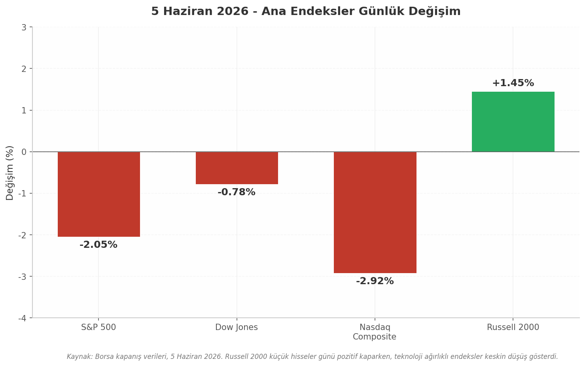

## 1. Piyasa Özeti ve Kapanış Verileri

5 Haziran 2026 Cuma günü ABD borsaları, tarım dışı istihdam verisinin (Non-Farm Payrolls, NFP) beklentilerin yaklaşık iki katı düzeyde gerçekleşmesinin ardından keskin satış baskısıyla kapandı. S&P 500 endeksi 7.428,31 puana gerileyerek %2,05 düşüş kaydetti; bu, endeksin önceki işlem gününde ulaştığı 7.584,31 seviyesinden 156 puanlık geri çekilmeye işaret ediyor[^1^]. Nasdaq Composite ise teknoloji hisselerindeki yoğun satışlarla bir önceki güne göre 784 puan azalarak 26.047 seviyesinden kapandı ve %2,92 ile en sert düşüşü yaşayan ana endeks oldu[^2^]. Dow Jones Industrial Average 51.160 civarında kapandı; gün içi 403 puanlık kayıpla %0,78 geriledi. Dow'un düşüşü sınırlı kaldı çünkü endeks ağırlıklı olarak sağlık ve finansal hisselerden oluşmakta olup, bu sektörler teknolojiden kaçan sermayeyi karşıladı[^3^].

Günün dikkat çekici ayrışması Russell 2000 küçük hisse senedi endeksinde gerçekleşti. Endeks günü %1,45 artıda kapatarak büyük ölçekli endekslerin tersine hareket etti. Bu performansın arkasında yüksek faiz ortamından faydalanan bölgesel bankacılık hisseleri ile değer (value) odaklı küçük şirketler yer alıyor[^4^].

| Endeks | Kapanış | Puan Değişimi | %Değişim | İşlem Hacmi |
|:---|:---:|:---:|:---:|:---:|
| S&P 500 | 7.428,31 | -156,00 | -2,05%[^1^] | Yüksek |
| Dow Jones | ~51.160 | -403 | -0,78%[^3^] | Artmış |
| Nasdaq Composite | ~26.047 | -784 | -2,92%[^2^] | Çok Yüksek |
| Russell 2000 | — | — | +1,45%[^4^] | Artmış |

*Tablo 1: 5 Haziran 2026 ana endeks kapanış verileri. S&P 500 önceki gün 7.584,31'den; Nasdaq 26.831'den geriledi.*

Yukarıdaki tablo, piyasadaki sektörel rotasyonu net biçimde ortaya koymaktadır. Nasdaq'un %2,92'lik düşüşü ile Russell 2000'in %1,45'lik yükselişi arasındaki 4,37 puanlık performans farkı, yatırımcı sermayesinin büyüme (growth) hisselerinden değer hisselerine ve küçük ölçekli şirketlere kaydığını göstermektedir. Dow Jones'un -%0,78 ile sınırlı kalması ise endeksin teknoloji ağırlığının düşük olması ve UnitedHealth, JPMorgan gibi defansif bileşenlerinin kâr realizasyonlarına direnç göstermesiyle açıklanmaktadır[^3^].

*Grafik 1: Ana endekslerin günlük değişim oranları. Kırmızı çubuklar negatif, yeşil çubuk pozitif getiriyi ifade etmektedir.*

Grafiğin en dikkat çekici unsuru, dört ana endeksten üçünün negatif bölgede yer alırken yalnızca Russell 2000'in pozitif ayrışmasıdır. Bu görünüm, NFP verisi sonrası faiz beklentilerindeki yükselişin bankacılık ve finansal kesime yaradığı, ancak yüksek değerlemeli teknoloji şirketlerinin marjinal fonlama maliyetlerindeki artıştan olumsuz etkilendiği yorumunu desteklemektedir.

### 1.1 Önceki Günün Rekoru ve Haftalık Perspektif

Piyasanın 5 Haziran'daki satış baskısı, 4 Haziran Perşembe günü elde edilen rekor kapanışların hemen ardından geldi. Dow Jones 4 Haziran'da 51.561,93 seviyesinde tüm zamanların en yüksek kapanışını gerçekleştirirken, S&P 500 7.584,31 ve Nasdaq 26.830,96 ile güçlü bir görünüm sergilemişti[^5^]. S&P 500'ün Haziran 2026 içindeki zirvesi ise 7.620,90 olarak kaydedilmiştir[^6^]. Bu veriler ışığında, 5 Haziran kapanışıyla S&P 500 zirveden yaklaşık %2,5 gerilemiş oldu; bu düzeltme derinliği teknik analiz açısından önemli bir eşik olan %3'ün altında kalmakla birlikte, momentumun bozulduğuna dair sinyaller taşımaktadır.

### 1.2 VIX ve Sentiment Göstergeleri

Piyasa oynaklık endeksi VIX, 5 Haziran kapanışında 15,72 seviyesinde yer aldı ve gün içinde %2,08 yükseliş kaydetti[^7^]. Bu seviye tarihsel olarak ortalamanın altında kalmakla birlikte, veri öncesi 13-14 bandından gelen yükseliş trendi dikkate alındığında yatırımcıların risk iştahının gerilediğini göstermektedir. VIX'in 20 psikolojik eşiğinin altında kalması, piyasada henüz panik satışlarına dair bir belirti olmadığını; ancak tedirginliğin arttığını ifade etmektedir.

CNN Fear & Greed Endeksi 54-55 bandında Nötr bölgede seyretmektedir[^8^]. Bu okuma, yatırımcı duyarlılığının ne aşırı korku ne de aşırı açgözlülük bölgesinde olduğunu, piyasanın yön arayışında olduğunu göstermektedir. Nötr bandın üst kısmında yer alması, piyasada hâlâ seçici alım potansiyeli bulunduğunu ancak makro veri akışının bu dengeyi bozabileceğini düşündürmektedir.

Tahvil piyasası tarafında, 2 yıllık Hazine tahvili (2Y Treasury) getirisi NFP verisi sonrasında 10 baz puan (bp) yükseldi[^9^]. Bu hareket, piyasanın FED'den gelecek dönemde faiz indirimi beklentisini azalttığını, hatta faiz artırımı ihtimalini fiyatlamaya başladığını göstermektedir. 10 yıllık Hazine tahvili getirisi %4,54 seviyesinde yüksek kalmaya devam ederken[^10^], getiri eğrisinin yükselmesi riskli varlıklar için ek baskı unsuru oluşturmaktadır.

| Gösterge | Değer | Günlük Değişim | Yorum |
|:---|:---:|:---:|:---|
| VIX | 15,72 | +2,08%[^7^] | Oynaklıkta artış; panik yok, tedirginlik var |
| Fear & Greed Endeksi | 54-55 | —[^8^] | Nötr bölge; yön arayışı |
| DXY (Dolar Endeksi) | 99,49 | —[^11^] | Güçlü dolar; riskli varlıklar için baskı |
| 10Y Treasury | %4,54 | —[^10^] | Yüksek; faiz indirimi beklentisini sınırlıyor |
| 2Y Treasury | Veri sonrası +10bp | +10bp[^9^] | Kısa vadeli faizler yükseliyor; FED beklentisi değişiyor |
| Altın (XAU/USD) | ~$4.570/oz | —[^12^] | Güvenli liman talebi destekliyor |
| Brent Petrol | ~$95/varil | —[^13^] | Hafta başı $99 zirvesinden geriledi |

*Tablo 2: 5 Haziran 2026 ana makro göstergeler özeti. NFP verisi sonrası faiz piyasalarında hareketlilik arttı.*

### 1.3 Haftalık Performans Özeti

Haftalık perspektif incelendiğinde, S&P 500 hafta başından itibaren 7.620,90 zirvesinden 7.428,31'e gerileyerek yaklaşık %2,5 değer kaybetmiştir[^6^]. Nasdaq Composite ise hafta içinde 26.831 seviyesinden 26.047'ye düşmüş olup, %2,92'lik günlük düşüşle birlikte haftalık kaybı %4'ü aşmış durumdadır. Teknoloji hisselerindeki bu sert geri çekilmenin temel nedeni, Broadcom'un (AVGO) rehberlik beklentilerini karşılayamaması ve AI altyapı hisselerinde genel değerleme baskısının artmasıdır. Broadcom iki işlem gününde toplam %19,6 değer kaybederken, Nvidia (NVDA) haftalık bazda %8'in üzerinde gerilemiştir[^14^].

Dow Jones'un haftalık performansı ise diğer endekslere göre nispeten iyi kalmıştır. Endeksin sağlık (XLV) ve finansal (XLF) sektörlerine olan ağırlığı, teknoloji satışlarına karşı bir denge oluşturmuştur. 4 Haziran'daki rekor kapanışın ardından gelen geri çekilme, yatırımcıların kar realize etme eğilimini yansıtmaktadır[^5^].

Makro göstergeler tablosunda yer alan veriler, piyasanın genel görünümünü tamamlamaktadır. Dolar endeksi (DXY) 99,49 seviyesinde güçlü seyretmekte[^11^]; bu durum, yabancı yatırımcılar için ABD varlıklarını daha pahalı hale getirmekte ve gelişmekte olan piyasalardan sermaye çekilmesine neden olmaktadır. Altın ons başına 4.570 dolar seviyesinde güvenli liman talebiyle desteklenirken[^12^], Brent petrol hafta başında gördüğü 99 dolar zirvesinden 95 dolara gerilemiş olup, jeopolitik risklerin fiyatlanmaya devam ettiğini göstermektedir[^13^]. Petrol fiyatlarındaki bu yüksek seyir, FED'in enflasyonla mücadele çerçevesinde faiz indirimine gitme ihtimalini zayıflatan bir diğer faktör olarak öne çıkmaktadır.

