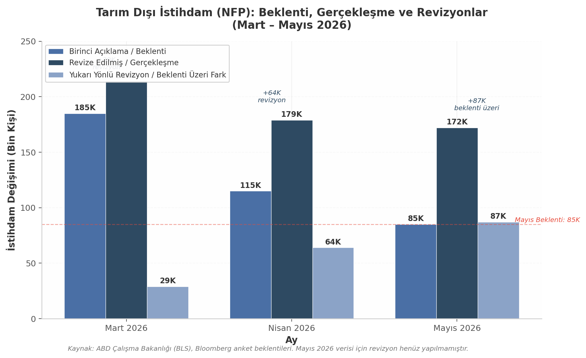

## 2. NFP Verisi: Beklentinin İki Katı ve Piyasa Tepkisi

### 2.1 Tarım Dışı İstihdam Verileri

5 Haziran 2026 sabahı ABD Çalışma Bakanlığı (BLS)'ndan gelen tarım dışı istihdam (Non-Farm Payrolls, NFP) verisi, piyasa beklentilerinin keskin şekilde üzerinde gerçekleşerek finansal piyasalarda derin bir dalgalanmaya yol açtı. Mayıs 2026 döneminde tarım dışı sektörlerde 172 bin kişilik istihdam artışı kaydedildi; bu rakam Bloomberg anketine katılan ekonomistlerin 85 bin düzeyindeki medyan beklentisinin tam iki katına denk gelmekte ve %102'lik bir yukarı yönlü sapma anlamına taşımaktadır [^20^]. Söz konusu veri, önceki ayın yukarı yönlü revize edilmiş 179 binlik değerinin de üzerinde seyretmekte olup, ABD iş gücü piyasasının beklenenden daha dirençli olduğuna dair güçlü bir kanıt olarak yorumlanmıştır.

Veri setinin içsel dinamikleri, tek başına Mayıs ayının 172 binlik artışının ötesinde önemli sinyaller içermektedir. BLS'in önceki aylara yönelik yaptığı yukarı yönlü revizyonlar, istihdam piyasasının gücünün sistematik olarak düşük raporlandığını ortaya koymaktadır. Mart 2026 verisi 185 binden 214 bine (+29 bin), Nisan 2026 verisi ise 115 binden 179 bine (+64 bin) revize edilmiştir [^20^]. Her iki ayın toplam revizyonu +93 bin düzeyinde gerçekleşmiştir. Bu örüntü, birincil veri koleksiyon süreçlerindeki gecikmelerin ve kurumsal yanıt oranlarındaki dalgalanmaların, özellikle işletme açılışları ve kapanışları yoğun dönemlerde, aşağı yönlü sapmalara neden olabileceğini göstermektedir. Üç aylık birikimli değerlendirmede, Nisan ayındaki +64 binlik revizyonun tarihsel ortalamaların oldukça üzerinde olduğu dikkat çekmektedir; bu durum, ilgili dönemdeki iş gücü piyasası dinamiklerinin ilk açıklamada yetersif yansıtıldığına işaret etmektedir.

*Grafik 1: Tarım Dışı İstihdam (NFP) — Beklenti, Gerçekleşme ve Revizyonlar (Mart–Mayıs 2026). Mayıs ayı beklentinin %102 üzerinde gerçekleşirken, Mart ve Nisan aylarında toplam 93 bin kişilik yukarı yönlü revizyon kaydedilmiştir. Kaynak: BLS, Bloomberg.*

Sektörel dağılıma bakıldığında, Mayıs ayındaki istihdam artışının belirli sektörlerde yoğunlaştığı görülmektedir. Seyahat ve konaklama (leisure and hospitality) sektörü +70 bin kişiyle en büyük katkıyı sağlamış olup, bu artışın büyük bölümü yiyecek ve içecek hizmetlerinden (+48 bin) kaynaklanmıştır. Yerel yönetimler (local government) +55 bin, sağlık sektörü (health care) +35 bin ve imalat (manufacturing) +7 bin kişilik istihdam artışı kaydetmiştir [^20^]. Buna karşın, finansal faaliyetler (financial activities) sektöründe 22 bin kişilik istihdam kaybı yaşanmıştır; bu düşüşün ana bileşenlerini sigorta taşıyıcıları ve ilgili faaliyetler (-11 bin) ile ticari bankacılık (-3 bin) oluşturmaktadır. Ulaştırma ve depolama sektöründe kayda değer bir değişim gözlenmezken (+1 bin), inşaat, toptan ticaret, perakende ticaret, bilişim, profesyonel ve iş hizmetleri sektörlerinde sınırlı hareketlilik yaşanmıştır. Sektörel yapıdaki bu ayrışma, hizmet sektörüne yönelik talebin gücünü vurgularken, finansal faaliyetlerdeki gerilemenin faiz oranı duyarlılığı ve kredi piyasası koşullarıyla bağlantılı olabileceğini akla getirmektedir.

### 2.2 İşsizlik ve Ücret Enflasyonu

İstihdam artışının beklentileri aşmasına karşın, işsizlik oranı %4,3 düzeyinde sabit kalarak bir önceki ayın değerini tekrar etmiştir [^20^]. Bu oran, Temmuz 2025'ten bu yana dar bir aralıkta (%4,2–%4,3) dalgalanan işsizlik verilerinin devamlılığını korumaktadır. İşsizlik oranının sabit kalmasının nedeni, istihdam artışına paralel olarak iş gücüne katılım oranının da yükselmesidir; bu durum, ekonomiye yeni giren bireylerin iş bulma hızının mevcut istihdam oluşum hızına denk düzeyde gerçekleştiğini göstermektedir. Uzun vadeli işsiz sayısı 2,0 milyon seviyesine ulaşmış olup, bu rakam bir önceki yılın aynı dönemine göre 524 bin kişilik artışı ifade etmektedir. Uzun vadeli işsizliğin yükselmesi, iş gücü piyasasında yapısal uyumsuzlukların derinleştiğine dair bir uyarı sinyali olarak değerlendirilebilir.

Ortalama saatlik kazançlar (average hourly earnings) aylık bazda %0,3 ve yıllık bazda %3,4 artış göstermiştir [^20^]. Bu rakam, saatlik kazancın $37,53 seviyesine ulaştığı anlamına gelmektedir. Yıllık %3,4'lük artış oranı, FED'in %2'lik enflasyon hedefi göz önünde bulundurulduğunda hâlâ yüksek seyretmekte olup, ücret-baskısı kaynaklı enflasyonist risklerin canlılığını koruduğuna işaret etmektedir. Ücret artışlarının hizmet sektöründe (özellikle yiyecek-içecek ve konaklama alt kalemlerinde) yoğunlaşan istihdam artışıyla paralellik göstermesi, talep kaynaklı fiyat baskılarının sürdüğünü desteklemektedir. FED politika yapıcıları açısından, istihdam artışının yanı sıra ücret enflasyonunun da hedef üzerinde seyretmesi, para politikasının gevşetilmesi yönünde adım atılmasını zorlaştıran bir faktör olarak öne çıkmaktadır.

| Gösterge | Değer | Beklenti / Önceki | Yorum |
|:---------|:------|:------------------|:------|
| Tarım Dışı İstihdam (NFP) | +172.000 | 85.000 (beklenti) [^20^] | Beklentinin %102 üzerinde |
| Mart 2026 Revizyonu | 214.000 | 185.000 (ilk açıklama) [^20^] | +29.000 yukarı revizyon |
| Nisan 2026 Revizyonu | 179.000 | 115.000 (ilk açıklama) [^20^] | +64.000 yukarı revizyon |
| Toplam Revizyon Etkisi | +93.000 | — | Birikimli yukarı düzeltme |
| İşsizlik Oranı | %4,3 | %4,3 (sabit) [^20^] | Temmuz 2025'ten beri dar aralık |
| Ort. Saatlik Kazanç (Aylık) | +%0,3 | — [^20^] | Ücret baskısı devam ediyor |
| Ort. Saatlik Kazanç (Yıllık) | +%3,4 | — ($37,53) [^20^] | FED hedefinin üzerinde |
| Uzun Vadeli İşsiz | 2,0M | +524K (yıllık) | Yapısal işsizlik riski |

*Tablo 1: Mayıs 2026 Tarım Dışı İstihdam Raporu — Detay Veriler. Kaynak: ABD Çalışma Bakanlığı (BLS), Bloomberg anket beklentileri.*

Tablo 1'de özetlenen veriler, ABD iş gücü piyasasının "sıcak" kalmaya devam ettiğini ortaya koymaktadır. İşsizlik oranının sabit kalmasına rağmen, istihdam artışının beklentiyi ikiye katlaması ve ücret enflasyonunun %3,4 seviyesinde direnç göstermesi, FED için istenmeyen bir politika kombinasyonunu temsil etmektedir. Önceki aylara yönelik +93 binlik yukarı revizyonlar ise, istihdam piyasasının gücünün sistematik olarak göz ardı edildiğine dair kanıtları pekiştirmektedir. Bu veri seti, 17 Haziran'da toplanacak FOMC'nin karar alma sürecini önemli ölçüde etkileyecek temel girdiler arasında yer almaktadır.

### 2.3 Piyasa Etkisi: FED Faiz Beklentisinin Değişimi

NFP verisinin açıklanmasının ardından ABD tahvil piyasalarında hareketlilik yaşanmış ve kısa vadeli faizler hızla yükselişe geçmiştir. İki yıllık Hazine tahvili (2Y Treasury) getirisi, veri öncesi yatay seyrinden yaklaşık 10 baz puan (bp) artarak FED'in para politikasına yönelik piyasa beklentilerini yeniden şekillendirmiştir [^20^]. S&P 500 vadeli işlemleri (futures), faizlerdeki sıçrama ile birlikte günün en düşük seviyelerine gerilemiştir; NYSE açılış öncesi yapılan değerlendirmede "2y went from flat to +10bp. S&P futures fell to session lows on the jump in rates" ifadesi, veri ile piyasa tepkisi arasındaki nedensel bağın doğrudanlığını teyit etmektedir [^20^].

Faiz piyasalarındaki bu hareketlenme, yatırımcıların FED'den faiz indirimi beklentilerini hızla küçültmesine neden olmuştur. CME Group'un FedWatch aracına yönelik veriler, piyasanın 2026 yılı içinde faiz artırımı ihtimalini fiyatlamaya başladığını göstermektedir [^56^]. Nisan 2026 tüketici fiyat endeksi (CPI) ve üretici fiyat endeksi (PPI) verilerinin enflasyondaki yukarı yönlü baskıyı teyit etmesinin ardından, "sıcak" NFP verisi piyasa pozisyonlamasında belirleyici bir kırılma noktası işlevi görmüştür. Trading Economics'in değerlendirmesinde, piyasaların FED'in bu yıl içinde faiz artırımı yapma olasılığına yönelik bahislerini artırdığı belirtilmektedir [^20^].

| FOMC Toplantı Tarihi | Faiz Değişikliği Olasılığı | Piyasa Fiyatlaması |
|:---------------------|:---------------------------|:-------------------|
| 17–18 Haziran 2026 | Değişiklik beklenmiyor (~%96) [^64^] | Beklentilerin büyük çoğunluğu "pas" yönlü |
| 29–30 Temmuz 2026 | 25 bp artırım (~%8–10) [^64^] | Artırım ihtimali belirginleşiyor |
| 2026 Sonu Beklentisi | En fazla 1 indirim veya sıfır indirim [^20^] | Gevşeme beklentisi tamamen zayıfladı |
| Güncel Faiz Aralığı | %3,50–%3,75 [^65^] | Nisan 2026'dan bu yana sabit |

*Tablo 2: CME FedWatch Verilerine Göre FED Faiz Beklentisi Piyasa Fiyatlaması (5 Haziran 2026). Kaynak: CME Group FedWatch Aracı, piyasa verileri.*

Tablo 2'de görüldüğü üzere, piyasa fiyatlaması Haziran FOMC toplantısı için büyük ölçüde "değişiklik yok" beklentisi taşımakla birlikte, Temmuz ayı sonrası için faiz artırımı olasılıkları belirgin şekilde artış göstermiştir. Daha da önemlisi, 2026 yılı sonuna kadar herhangi bir faiz indirimi beklentisi neredeyse tamamen ortadan kalkmış, piyasa pozisyonlaması "sıfır indirim" veya sınırlı bir gevşeme senaryosuna doğru kaymıştır. Bu durum, teknoloji ve büyüme hisselerinin değerlemeleri üzerinde baskı yaratmakta, bankacılık ve finansal sektör hisselerinin ise yüksek faiz ortamından fayda sağlaması beklentisini güçlendirmektedir.

FED politikasındaki bu beklenmedik sıkılaşma olasılığı, Kevin Warsh'in 22 Mayıs 2026 tarihinde yemin ederek göreve başlamasının hemen ardından ortaya çıkmıştır [^53^]. Warsh'in başkanlık döneminin ilk günlerinde karşılaştığı bu makroekonomik ortam, FOMC içindeki politika tercihlerini zorlaştırmaktadır. Nisan 28–29 tarihli FOMC toplantı tutanaklarında, enflasyonun "yukarı yönlü risklerle karşı karşıya olduğu" ve "yüksek seyrettiği" vurgulanmıştır; bu tutanaklar ayrıca dört politika yapıcısının faizlerin durdurulması (pause) kararına muhalefet ettiğini, bunlardan üçünün ise gevşeme eğilimine karşı çıktığını kaydetmiştir [^56^]. Warsh'in AI odaklı üretkenlik artışları nedeniyle daha geniş bir enflasyon göstergesi setine açık olduğu bilinmekle birlikte [^55^], Nisan ayındaki toptan satış fiyatlarındaki (PPI) %6'lık yıllık artış [^58^] ve iş gücü piyasasındaki bu "sıcak" veri akışı, FOMC'deki şahin kanadın (hawkish) elini güçlendirmektedir. Piyasa katılımcıları, 17 Haziran'daki ilk FOMC toplantısında Warsh yönetimindeki FED'in söyleminin ne ölçüde değişeceğini yakından takip etmektedir.
