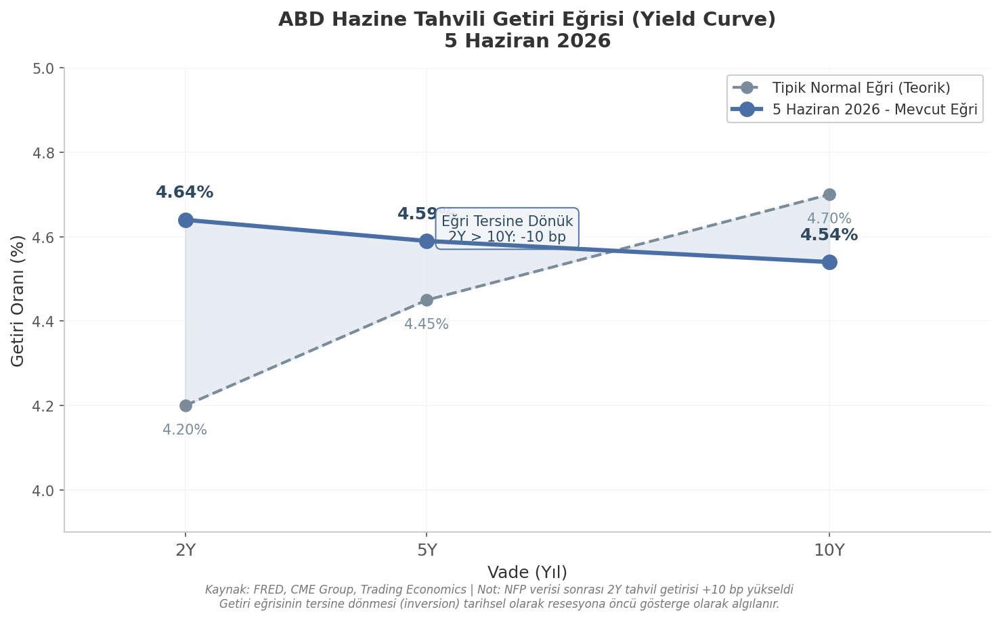

## 4. Konjonktürel ve Makroekonomik Analiz

5 Haziran 2026 satış dalgasının ardında yatan dinamikler, yalnızca bir istihdam raporunun ötesinde geniş kapsamlı bir para politikası dönüşümüne ve jeopolitik risk birikimine işaret etmektedir. Bu bölümde FED'in yeni başkanlık dönemi politikası, enerji fiyatlarının enflasyonist etkileri ve tahvil piyasalarının sinyalleri üç eksende incelenmektedir.

### 4.1 FED Politikası ve Enflasyon Beklentileri

#### 4.1.1 Warsh Döneminde Sıkı Para Politikası Beklentisi

Amerikan Merkez Bankası (FED) başkanlığına Nisan 2026'da atanan Kevin Warsh'ın ilk haftaları, piyasalar tarafından sıkı para politikası (hawkish monetary policy) sinyalleriyle karşılanmıştır. Warsh'ın yemininin ardından gerçekleşen Nisan 2026 FOMC toplantısında fonlama faizi %3,50–3,75 aralığında sabit tutulmuştur [^1^]. Piyasa katılımcılarının odaklandığı nokta ise nominal faizin ötesinde yeni başkanın iletişim stratejisi ve gelecek döneme yönelik sözlü yönlendirmeleri (forward guidance) olmuştur.

NFP verisinin beklentinin iki katı üzerinde gerçekleşmesi (+172.000), FED faiz indirimi (rate cut) beklentilerini önemli ölçüde zayıflatmıştır. CME Group FedWatch verilerine göre piyasalar, 2026 yılı içerisinde bir faiz artırımı (rate hike) ihtimalini giderek daha fazla fiyatlamaktadır [^2^]. Trading Economics'e göre "piyasalar FED'den bu yıl bir faiz artırımı beklentilerini artırdı" [^3^]; StreetStats analizine göre ise "vadeli işlem piyasaları politika faizinde 2026 sonlarına doğru %3,8 civarında kademeli yükseliş fiyatlıyor" [^4^]. Bu veriler piyasa beklentilerinin faiz indiriminden faiz artırımı yönünde kaydığını net biçimde ortaya koymaktadır.

#### 4.1.2 Nisan FOMC Tutanakları ve Enflasyon Vurgusu

28–29 Nisan FOMC toplantısı tutanaklarında yer alan "inflation was elevated" (enflasyon yüksek seyretti) ifadesi, FED'in fiyat istikrarı hedefinden uzaklaşıldığına dair resmi kabul niteliği taşımaktadır [^5^]. "Upside risks to inflation" (enflasyonda yukarı yönlü riskler) vurgusu ise komite üyelerinin fiyat baskılarının gelecek dönemde süreceği beklentisini paylaştıklarını göstermektedir [^5^]. Oylama dağılımında 10 üyeden 9'u faizin sabit tutulması yönünde oy kullanırken yalnızca 1 üye (%10'luk azınlık) indirim talep etmiştir [^6^]. Piyasa içsel (market-implied) verilere göre 2027 ilk çeyreğinde yaklaşık %30 olasılıkla faiz artırımı fiyatlanmaktadır [^7^].

| Gösterge | Değer / Durum | Piyasa Yorumu |
|----------|--------------|---------------|
| FED Fonlama Faizi | %3,50–3,75 (Nisan FOMC) [^1^] | Sabit, sıkı politika devam ediyor |
| FOMC Oylama Dağılımı | 9 sabit, 1 indirim [^6^] | Komitede genel konsensüs sıkı politika |
| Tutanak İfadesi | "inflasyon yüksek seyretti", "yukarı yönlü riskler" [^5^] | Resmi enflasyon endişesi |
| Piyasa Fiyatlaması | 2026 sonu: ~%3,8 politika faizi [^4^] | Faiz artırımı beklentisi hakim |
| 1Ç 2027 Faiz Artırımı Olasılığı | ~%30 (market-implied) [^7^] | Artan eğilim |
| NFP Artışı (Mayıs) | +172.000 (Beklenti: 85.000–88.000) [^8^] | Faiz indirimi olasılığını zayıflattı |

*Tablo 1: FED Politikası Göstergeleri — Haziran 2026. Tutanak ifadeleri ve piyasa içsel verileri para politikasının yönünü belirlemektedir.*

Tablo 1'deki veriler, FED'in faiz indirimine gitmesinin önünde iki temel engel olduğunu göstermektedir: işgücü piyasasının beklenenden güçlü seyri ve enflasyonun %2 hedefinin üzerinde kalıcılığı. Bu ikili yapı, Warsh başkanlığındaki FED'in "bekle-gör" duruşunu sürdürmesine ve gerekirse ek sıkılaştırma adımları atmasına olanak tanımaktadır.

### 4.2 Enerji Fiyatları ve Coğrafi Riskler

#### 4.2.1 İran–ABD Gerginliği ve Hormuz Boğazı Riski

Küresel petrol piyasaları üzerindeki en belirgin jeopolitik risk, İran ile ABD arasındaki gerilimin tırmanması ve Hormuz Boğazı'nın potansiyel abluka tehdidi altında kalmasıdır [^9^]. Dünya petrol ticaretinin yaklaşık beşte birinin geçtiği bu stratejik deniz yolunun güvenliği küresel arz–talep dengesi açısından hayati öneme sahiptir. Brent tipi ham petrol, bu risk primiyle hafta içinde ~99 $/varil zirvesini test etmiş, 5 Haziran'da ~95 $/varil seviyesinden kapanmıştır [^10^]. Haftalık zirveden gerileme kaydedilmiş olmakla birlikte fiyatlar tarihsel olarak yüksek bir bantta seyretmektedir. Uluslararası Enerji Ajansı (IEA) küresel petrol tüketiminde yavaşlama öngörüsü sunarken [^11^], jeopolitik risk priminin fiyatları yukarıda tutmaya devam etmesi arz odaklı bir şokun mümkün olduğunu göstermektedir.

#### 4.2.2 Enerji–Enflasyon Etkileşimi ve FED İkilemi

Yüksek enerji fiyatlarının FED kararlarını zorlaştıran etkisi çift kanallıdır: doğrudan tüketici fiyatlarına yansıma ve enerji girdisi yoğun sektörlerde çekirdek enflasyona yayılma. Nisan FOMC tutanaklarında FED üyelerinin Orta Doğu kaynaklı enerji şokunu ayrıca not etmesi [^5^], bu riskin politika yapıcılar gündeminde öncelikli yer tuttuğunu doğrulamaktadır. Bu koşullarda faiz indirimi enerji kaynaklı enflasyonist baskıyı daha da şiddetlendirebilir; bu nedenle "FED'in bu durumda faiz indirimi yapması zor" değerlendirmesi para politikası tepki fonksiyonunun enerjiye karşı hassasiyetini yansıtmaktadır [^12^].

| Risk Faktörü | Olasılık | Etki Şiddeti | Yön | İlişkili Aktif |
|-------------|----------|-------------|-----|---------------|
| FED faiz artırımı (2026 2H) | Orta–Yüksek | Yüksek | Negatif | S&P 500, Nasdaq |
| İran–ABD askeri gerilimi | Düşük–Orta | Çok Yüksek | Negatif | Petrol, borsalar |
| Kalıcı yüksek enerji fiyatları | Yüksek | Orta–Yüksek | Enflasyonist | Tahviller, hisseler |
| Dolar güçlenmesi (DXY >100) | Orta | Orta | Negatif | EM, emtia |
| Derinleşen yield curve ters dönmesi | Orta | Yüksek | Resesyon sinyali | Finans sektörü |
| AI altyapı yatırımlarında doyum | Belirsiz | Sektörel | Değerleme baskısı | NVDA, AVGO, MU |

*Tablo 2: Makroekonomik Risk Matrisi — Haziran 2026. Olasılık ve etki şiddeti piyasa üzerindeki baskı yönünü belirlemektedir.*

Risk matrisi incelendiğinde FED kaynaklı sıkı politika ile enerji kaynaklı enflasyonist baskının birbirini besleyen bir döngü içinde olduğu görülmektedir. Petrol fiyatlarının yüksek seyri enflasyonu desteklerken, FED'in bu enflasyona karşı sıkı politika sürdürme zorunluluğu riskli varlıklar üzerinde çift yönlü baskı oluşturmaktadır.

### 4.3 DXY ve Tahvil Piyasası

#### 4.3.1 Güçlü Doların Riskli Varlıklar Üzerindeki Baskısı

ABD Dolar Endeksi (DXY) 5 Haziran itibarıyla 99,49 seviyesinden işlem görmektedir [^13^]. Bu seviye doların altı büyük döviz karşısındaki sepete karşı gücünü korumaktadır. Güçlü dolar, gelişmekte olan piyasa (EM) varlıkları üzerinde baskı yaratmakta, dolar cinsinden borçlanan ülkelerin geri ödeme yükünü artırmakta ve ABD'li çok uluslu şirketlerin yurtdışı kazançlarını dolar bazında düşürmektedir. Riskli varlıklar için genel çekicilik azalması (risk-off sentiment) anlamına gelen güçlü dolar, 5 Haziran satışlarının makroekonomik zemininin bir parçasıdır.

#### 4.3.2 Tahvil Getirilerindeki Yükseliş ve Yield Curve Flattening

10 yıllık Hazine tahvili getirisi 5 Haziran'da %4,54 seviyesinde kapanmıştır [^14^]. FRED verilerine göre bu getiri 1 Haziran'da %4,43, 2 Haziran'da %4,46 ve 3 Haziran'da %4,49 seviyelerinden hareketle üç işlem gününde 11 baz puan artış kaydetmiştir [^15^]. NFP verisinin açıklandığı 5 Haziran'da trend ivme kazanarak %4,54'e ulaşmıştır.

*Şekil 1: ABD Hazine Tahvili Getiri Eğrisi. 5 Haziran 2026'da 2Y, 5Y ve 10Y getirileri karşılaştırılmaktadır. Mevcut eğri (mavi) tipik normal eğrinin (gri kesik çizgi) altında kalarak tersine dönük (inverted) yapı sergilemektedir. Kaynak: FRED, CME Group.*

Şekil 1'de görselleştirilen getiri eğrisi kritik bir mesaj içermektedir. 2 yıllık tahvil getirisi yaklaşık %4,64'e yükselmiş olup [^16^], 10 yıllık getiri olan %4,54'ün 10 baz puan üzerinde seyretmektedir. Bu yapı, kısa vadeli getirilerin uzun vadelileri aştığı "tersine dönmüş" (inverted) bir yield curve durumuna işaret eder. NFP sonrası 2Y getirisindeki +10 baz puanlık artış [^16^], piyasanın FED'in daha agresif politika izleyeceği beklentisini fiyatladığını net şekilde ortaya koymaktadır.

Getiri eğrisinin tersine dönmesi tarihsel olarak resesyon öncü göstergeleri arasında yer alır. Kısa vadeli faizlerin yüksek seyri piyasanın önümüzdeki 12–18 ayda ekonomik büyümede yavaşlama beklediğini ima etmektedir. Bu durum hisse senedi piyasaları üzerinde çift yönlü baskı yaratır: yüksek kısa vadeli faizler büyüme şirketlerinin değerlemesini baskılarken, uzun vadeli faizlerin sınırlı kalması ekonomik aktivitede yavaşlama beklentisine işaret eder. Altının ~4.570 $/ons seviyesinde seyretmesi [^17^], yatırımcıların belirsizlik ortamında güvenli liman (safe-haven) varlıklara yöneldiğini teyit eder.

Sonuç olarak, konjonktürel görünümdeki tüm bileşenler — sıkı FED duruşu, enerji kaynaklı enflasyonist baskı, güçlü dolar ve tersine dönmüş getiri eğrisi — 5 Haziran satış baskısının yapısal bir zemine oturduğunu ortaya koymaktadır. Bu koşulların bir araya gelmesi önümüzdeki dönemde piyasaların FED'in herhangi bir genişleyici adımına karşı şüpheci kalmasına neden olması beklenmektedir.
