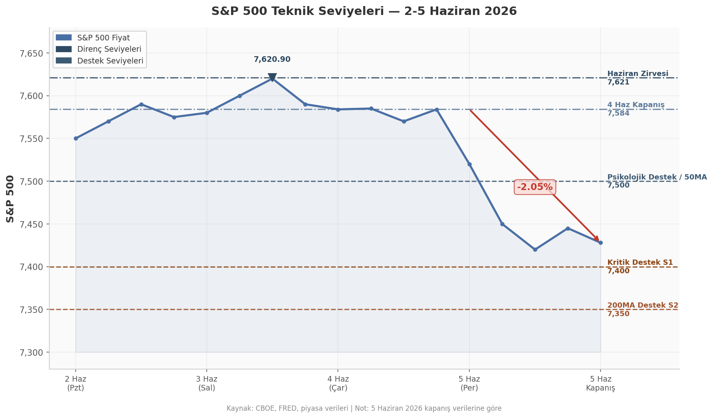

## 5. Teknik Analiz ve Haftaya Bakış

5 Haziran günü S&P 500 endeksi 7.428,31 seviyesinden kapanarak, 4 Haziran kapanışına göre 156 puan (%2,05) geriledi. Endeks 3 Haziran'da gördüğü Haziran zirvesi 7.620,90'den bu seviyeye gerilemiş olup teknik yapı açısından kritik bir dönüm noktasında bulunmaktadır. Bu bölümde S&P 500'ün destek ve direnç haritası, haftalık zaman dilimindeki teknik görünüm ile önümüzdeki haftaya yönelik riskler ve beklentiler ele alınmaktadır.

### 5.1 S&P 500 Teknik Seviyeleri

#### 5.1.1 Kritik Destek: 7.400 Psikolojik Seviye ve 200MA Bölgesi

S&P 500'ün mevcut teknik görünümünde en dikkat çekici unsur, kapanışın 7.400 psikolojik destek seviyesinin hemen üzerinde gerçekleşmesidir. Bu bölge, yalnızca yuvarlak bir sayıdan ibaret değil; aynı zamanda yaklaşık 7.350 seviyelerinde bulunan 200 günlük hareketli ortalama (200MA) ile birlikte güçlü bir destek kümesi oluşturmaktadır. 7.400'ün altına kalıcı bir sarkma gerçekleşmesi durumunda, endeksin bir sonraki anlamlı desteği 7.350 civarındaki 200MA bölgesine denk düşmektedir. Bu iki seviyenin kırılması, orta vadeli yükseliş trendinin bozulduğuna dair güçlü bir teknik sinyal olarak yorumlanacaktır.

5 Haziran kapanışı itibarıyla endeks, 50 günlük hareketli ortalamanın (50MA) da yaklaşık 7.500 seviyelerinde bulunduğu bölgenin altına sarkmış durumdadır. Bu durum kısa vadeli momentumun zayıfladığını teyit etmektedir. Zirveden (7.620,90) kapanışa kadar olan düşüş %2,5'i aşmış olup teknik olarak "düzeltme" tanımına girmektedir.

#### 5.1.2 Direnç Seviyeleri

Yukarı yönlü hareketlerde karşılaşılacak ilk direnç, daha önce destek işlevi gören 7.500 seviyesidir. Bu bölge hem 50MA'nın bulunduğu yerdir hem de psikolojik bir eşik niteliğindedir. Üzerindeki bir sonraki direnç 7.585 seviyesinde — yani 4 Haziran kapanış fiyatında — bulunmaktadır. Bu seviyenin aşılması, satış baskısının azaldığına dair ilk işaret olacaktır. En üst direnç ise Haziran zirvesi olan 7.620,90'da yer almakta olup bu seviyenin üzerine çıkılması için güçlü bir pozitif katalizöre ihtiyaç duyulmaktadır.

Aşağıdaki grafikte S&P 500'ün 2-5 Haziran tarihleri arasındaki fiyat hareketi ve teknik seviyeler görülmektedir:

Grafikte 3 Haziran'da görülen 7.620,90 zirvesinden başlayan keskin düşüş trendi net şekilde gözükmektedir. 7.500 seviyesinin kırılmasıyla hızlanan satışların 7.400 desteğine kadar sürdüğü görülmektedir. Endeksin bu iki kritik destek (7.400 ve 7.350) üzerinde tutunup tutunamayacağı, gelecek haftanın en önemli teknik sorularından biridir.

### 5.2 Haftaya Beklentiler ve Riskler

#### 5.2.1 17 Haziran FOMC Toplantısı Öncesi Piyasa Beklentileri

Önümüzdeki haftanın en kritik olayı 17 Haziran'da gerçekleşecek Federal Açık Piyasa Komitesi (FOMC) toplantısıdır. Piyasa katılımcıları faiz değişikliği beklememekle birlikte, FED Başkanı Kevin Warsh'ın basın toplantısı ve toplantı sonrası yayınlanacak ekonomik projeksiyonlar (nokta grafiği) üzerinde yoğunlaşmaktadır. 5 Haziran'da açıklanan ve beklentinin iki katı üzerinde gerçekleşen tarım dışı istihdam verisi (NFP +172.000), FED'in söylemde şahin (hawkish) duruşunu sürdürmesi yönünde güçlü bir baskı yaratmıştır. Piyasa, toplantı öncesinde FED üyelerinin "faiz indirimi için erken" mesajını pekiştirmesini ve enflasyon üzerindeki yukarı yönlü risklere vurgu yapmasını beklemektedir.

#### 5.2.2 Aşağı ve Yukarı Yönlü Riskler

**Aşağı yönlü riskler** arasında öncelikle FED yetkililerinin beklenenden daha sert bir ton kullanması yer almaktadır. Bu durum, halihazırda zayıflamış olan teknoloji ve büyüme hisseleri üzerindeki baskıyı artırabilir. İkinci olarak, Broadcom (AVGO)'un iki günde %19,6 değer kaybetmesiyle başlayan çip sektöründeki volatilite devam etmektedir; AI altyapı yatırımlarının doyuma ulaşıp ulaşmadığına dair endişeler NVDA, MU ve benzeri hisselerde satış baskısı yaratmaya devam edebilir. Üçüncü olarak, İran-ABD gerginliğinin ve Hürmüz Boğazı'ndaki tansiyonun enerji fiyatlarını yukarı çekmesi, enflasyonist baskıları artırarak FED'in elini güçlendirecektir. Petrol fiyatlarının varil başına 95 dolar seviyesinde kalıcı olması bu riskin somut göstergesidir.

**Yukarı yönlü senaryolar** ise FED'in beklenenden daha yumuşak (dovish) bir ton benimsemesi, İran konusunda diplomatik bir ilerleme kaydedilmesi veya çip sektöründe hızlı bir toparlanma hareketi ile gerçekleşebilir. Ancak mevcut veri seti bu senaryoları desteklememektedir.

#### 5.2.3 Volume Profile ve Haftalık Zaman Dilimi

Hacim profili analizi, S&P 500'ün son haftalardaki en yoğun işlem gördüğü bölgenin 7.500-7.550 aralığında (Point of Control, POC) olduğunu göstermektedir. Bu bölge, fiyatın tekrar yukarı yönlü hareketlerde karşılaşacağı güçlü bir hacimsel direnç olarak işlev görecektir. Haftalık pivot seviyeleri aşağıdaki tabloda özetlenmektedir:

| Seviye | Değer | Teknik Anlamı |
|:-------|:------|:--------------|
| R2 | 7.585 | 4 Haziran kapanışı — güçlü direnç |
| R1 | 7.500 | Eski destek / 50MA / psikolojik eşik |
| Pivot | 7.428 | 5 Haziran kapanışı |
| S1 | 7.400 | Psikolojik destek — kırılım satışları derinleştirir |
| S2 | 7.350 | 200MA bölgesi — trendin korunduğu son savunma hattı |

7.400 seviyesinin altında kapanışlar, teknik olarak S1 desteğinin kırıldığı anlamına gelir ve endeksi 7.350'deki 200MA'ya doğru taşıma potansiyelini güçlendirir. Bu senaryo gerçekleşirse, Nisan ayından bu yana süregelen yükseliş trendi tehlikeye girecektir. Yukarı yönlü hareketlerde ise 7.500'ün üzerinde kapanışlar, kısa vadeli toparlanma umudunu canlı tutacaktır.

Aşağıdaki tablo, önümüzdeki haftanın önemli takvim olaylarını ve bunların piyasalar üzerindeki potansiyel etkilerini özetlemektedir:

| Tarih | Olay | Beklenti | Piyasa Etkisi |
|:------|:-----|:---------|:--------------|
| 16 Haziran | ABD Perakende Satışlar (Mayıs) | Aylık +0,2% | Güçlü veri tüketici talebini doğrular; FED'e hawkish alan tanır |
| 16 Haziran | NY FED İmalat Endeksi | Beklenti üzeri | Bölgesel aktivitede canlanma risk iştahını sınırlayabilir |
| 17 Haziran | **FOMC Kararı** | Faiz değişikliği beklenmiyor (%4,25-4,50) | Söylemde şahin ton; nokta grafiğinde faiz artırımı sinyali aranacak |
| 17 Haziran | FOMC Ekonomik Projeksiyonları (SEP) | 2026 sonu faiz tahmini yukarı revize | Üçer aylık güncelleme; piyasa fiyatlamasını yönlendirir |
| 17 Haziran | Fed Başkanı Warsh Basın Toplantısı | Enflasyon ve istihdam vurgusu | Söylemde en küçük yumuşama bile pozitif yansıyabilir |
| 18 Haziran | ABD İnşaat İzinleri ve Konut Başlangıçları (Mayıs) | İnşaat izinleri 1,42M | Konut piyasası faiz duyarlılığını gösterir |
| 18 Haziran | Haftalık İşsizlik Maaşı Başvuruları | 220.000 civarı | İş gücü piyasası momentumunun devam edip etmediğini gösterir |

Bu takvimdeki en belirleyici unsur, 17 Haziran'daki FOMC toplantısı ve buna eşlik eden ekonomik projeksiyonlardır. NFP verisinin ardından piyasalar, FED üyelerinin 2026 yılı sonu federal fonlar faizi tahminini yukarı yönlü revize edip etmeyeceğini yakından izleyecektir. Mevcut piyasa fiyatlamasına göre 2026 yılı içinde faiz indirimi olasılığı önemli ölçüde azalmış, hatta bir faiz artırım ihtimali gündeme gelmiştir.

Sonuç olarak, S&P 500 teknik olarak 7.400-7.500 bandındaki dar bir koridora sıkışmış durumdadır. Bu hafta sonuçlanan satış dalgasının ardından piyasa 17 Haziran FOMC toplantısına odaklanmıştır. VIX endeksinin 15,72 seviyesinde kalmaya devam etmesi, oynaklığın henüz panik düzeyine ulaşmadığını ancak yukarı yönlü potansiyel taşıdığını göstermektedir. Yatırımcılar için kritik hassasiyet, endeksin 7.400 altına sarkıp sarkmayacağı ve FED söyleminin beklenenden daha sert mi yokasa daha ihtiyatlı mı olacağı sorusuna verilecek yanıttır. 7.350-7.400 destek bandının üzerinde kalınması durumunda mevcut yükseliş trendinin teknik yapısı korunmuş olacaktır.
