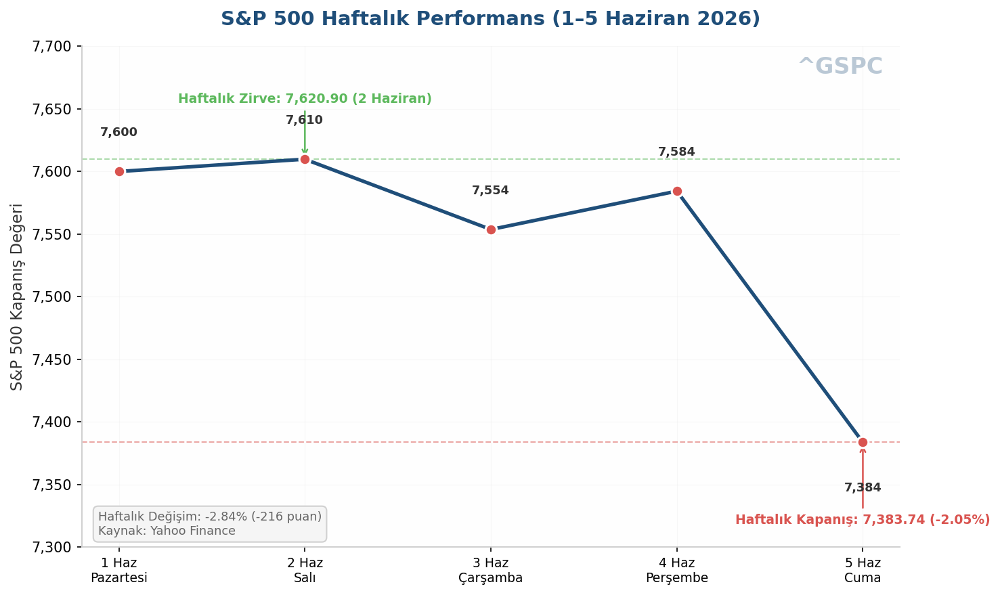

## 1. Haftanin Performansi ve 5 Haziran Kapanisi

### 1.1 Haftalik Endeks Performanslari

1 Haziran Pazartesi gunu S&P 500, 7.599 puandan haftaya yatay baslangic yapti. Piyasalar, yaz basi oncesi son tam islem haftasina dusuk hacimli ama dalgali bir seyirle adim atti. 2 Haziran Sali gunu teknoloji alimlarinin etkisiyle endeks 7.610 puana yukselerek haftanin en yuksek kapanisini gerceklestirdi. Bu seviye, ayni zamanda Haziran ayinin zirvesi olarak kayda gecti. 3 Haziran Carsamba gunu ise kar satislariyla birlikte S&P 500 7.554 puana geriledi.

4 Haziran Persembe gunu Dow Jones Industrial Average 51.562 puana ulasarak rekor kapanis gerceklestirirken, S&P 500 7.584 puandan ve Nasdaq Composite 26.831 puandan islemi tamamladi. Bu gorunum, buyuk capli teknoloji hisselerinin geri planda kaldigi bir ortamda sanayi ve finansal hisselerin liderliginde gerceklesti. Ancak bu pozitif hava 5 Haziran Cuma gunu yasanan sert satislarla dagildi.

Haftalik bazda bakildiginda S&P 500 %2,84 deger kaybederken, Nasdaq Composite %5,08lik cok daha derin bir dusus yasadigi goruldu. Dow Jones %0,42lik sinirli bir gerileme ile haftayi nispeten saglam tamamladi. Russell 2000 kucuk hisse senetleri endeksi ise haftalik bazda %2,49 gerileyerek, buyuk hisselerle kucuk hisseler arasindaki performans farkinin olumlu yonde kapandigina isaret etti. Asagidaki tablo, tum ana endekslerin haftalik performansini ozetlemektedir:

**Tablo 1: Haftalik Endeks Performanslari (1–5 Haziran 2026)**

| Endeks | 1 Haziran Kapanis | 5 Haziran Kapanis | Haftalik Degisim (%) | Puan Degisimi |
|:---|---:|---:|---:|---:|
| S&P 500 | 7.599,96 | 7.383,74 | -2,84 | -216,22 |
| Nasdaq Composite | 27.086,81 | 25.709,43 | -5,08 | -1.377,38 |
| Dow Jones 30 | 51.078,88 | 50.866,78 | -0,42 | -212,10 |
| Russell 2000 | 2.905,76 | 2.833,50 | -2,49 | -72,26 |

*Kaynak: Yahoo Finance. Grafik: S&P 500 gunluk kapanis fiyatlari (1–5 Haziran 2026).*

### 1.2 5 Haziran Cuma Gunu Ozeti

Cuma gunu piyasalari derinden sarsan gelisme, Mayis ayi Tarim Disi Istihdam (NFP) verisinin beklentilerin oldukca uzerinde gelmesi oldu. Piyasalar 85.000 civarinda bir artis beklerken, aciklanan +172.000lik rakam beklentinin tam iki katina ulasti. Bu guclu istihdam verisi, ABD ekonomisinin gucunu teyit etse de FED'in faiz indirim takvimini erteleme ihtimalini guclendirdi. Tahvil faizleri bu gelisimin ardindan yukselis gosterirken, ozellikle faiz hassasiyeti yuksek teknoloji hisseleri uzerinde satis baskisi olustu.

Gun sonunda S&P 500 7.383,74 puana (%2,64) gerilerken, Nasdaq Composite 25.709,43 puandan (%4,18) haftanin en agir kaybini kaydetti. Dow Jones 50.866,78 puana (%1,35) inmesine ragmen, haftalik bazda nispeten daha direncli kalmayi basardi. VIX Volatilite Endeksi 21,51 seviyesine firlatarak %39,68lik sert bir artis gosterdi ve piyasada korku unsurunun yeniden belirginlestigini ortaya koydu.

### 1.3 Haftanin En'leri

Bu hafta piyasalarda sektor rotasyonu en belirgin tema oldu. Agirlikla buyume ve teknoloji odakli sektorler gerilerken, defansif ve deger odakli alanlarda guclu bir performans gozlendi.

**Kazananlar:** Saglik (XLV), Finansal (XLF), Hizmetler (XLU) ve Temel Tuketim (XLP) sektorleri, yukselen tahvil faizleri ve artan belirsizlik ortaminda yatirimcilarin guvenli liman arayisiyla pozitif ayrismayi surdurdu. XLV haftayi %2,8, XLF %2,5, XLU %1,8 ve XLP %2,0 civarinda artisla kapadi. Bu performanslar, piyasadaki rotasyonun yalnizca bir gunluk bir hareket degil, Nisan ayindan bu yana surmekte olan daha genis bir trendin parcasi oldugunu gosteriyor.

**Kaybedenler:** Teknoloji (XLK), Iletisim Hizmetleri (XLC) ve Tuketim Discretionary (XLY) sektorleri haftanin en agir kayiplarini yasadi. XLK %9,0, XLC %3,4 ve XLY %2,8 deger kaybetti. Bu dususlerde teknoloji hisselerinin yuksek faiz ortamindan olumsuz etkilenmesi etkili oldu.

Bireysel hisse bazinda, Broadcom (AVGO) haftanin en cok dikkat ceken hareketlerinden birine imza atti. Sirketin 3 Haziranda acikladigi kazanim raporu sonrasi AI rehberliginin beklentilerin altinda kalmasiyla hisse, 3 gunde %19,6 deger kaybederek 479 dolardan 385 dolara geriledi. Bu dusus, NVIDIAyi (NVDA) da etkiledi ve NVDA haftalik bazda %8,6 gerileyerek 205 dolara indi. Microsoft (MSFT) son dort islem gununde %7,9 deger kaybederken, Amazon (AMZN) %2,7 haftalik dusus yasadi.

**Tablo 2: Haftanin En Cok Kazanan ve Kaybeden Sektorleri (ETF)**

| ETF | Sektor | Haftalik Degisim (%) | Beta (5Y) | Yon |
|:---|:---|---:|---:|:---|
| **XLV** | Saglik | +2,8 | 0,70 | Kazanan |
| **XLF** | Finansal | +2,5 | 0,79 | Kazanan |
| **XLP** | Temel Tuketim | +2,0 | 0,50 | Kazanan |
| **XLU** | Hizmetler | +1,8 | 0,40 | Kazanan |
| **XLY** | Tuketim Discretionary | -2,8 | 1,20 | Kaybeden |
| **XLC** | Iletisim Hizmetleri | -3,4 | 1,10 | Kaybeden |
| **XLK** | Teknoloji | -9,0 | 1,26 | Kaybeden |

*Not: Beta degerleri, SPDR resmi verilerine dayanmaktadir. Haftalik degisimler 1–5 Haziran 2026 kapanis fiyatlarindan hesaplanmistir. Kaynak: Yahoo Finance.*

Russell 2000 endeksinin hafta boyunca goreceli direnci, deger rotasyonunun kucuk olcekli sirketlere de yansidigini gosteriyor. Buyuk teknoloji hisselerinden cikan sermayenin, daha makul fiyatlamali ve faiz hassasiyeti dusuk sektorlere yoneldigi goruluyor. Bu haftanin performansi, piyasalarin FED politikasi beklentilerindeki degisimlere ne kadar hassas oldugunu bir kez daha ortaya koydu.
