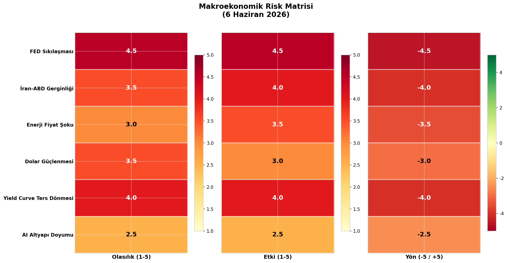

## 2. NFP Şoku ve FED Politikası Etkisi

5 Haziran 2026 Cuma günü açıklanan Tarım Dışı İstihdam (NFP) verisi, piyasaları derinden sarsan bir sürpriz ile karşılandı. Beklentilerin çok üzerinde gelen +172 binlik istihdam artışı, önceki aylara yönelik +93 binlik yukarı yönlü revizyonlarla birleşince, FED'in faiz indirimi beklentileri ani bir şekilde rafa kalktı. Hatta piyasa fiyatlamalarında 2026 sonuna kadar faiz artırımı ihtimali belirgin şekilde yükseldi. Bu bölümde, NFP verisinin detayları, tahvil piyasasının tepkisi ve altı faktörlü makroekonomik risk matrisi kapsamlı bir şekilde incelenmektedir.

### 2.1 NFP Verisi Detayı

#### 2.1.1 Beklentinin %102 Üzeri Gelen İstihdam ve Yüksek Revizyonlar

BLS (ABD İstatistik Bürosu) tarafından 5 Haziran'da açıklanan Mayıs 2026 NFP verisi, +85 bin olan piyasa beklentisini neredeyse ikiye katlayarak +172 bin seviyesinde gerçekleşti. Bu performans, beklentinin tam %102 üzerinde bir sürpriz anlamına gelmekte ve ABD emek piyasasının son derece dirençli olduğunu bir kez daha kanıtlamaktadır. Verinin etkisini daha da derinleştiren unsur ise önceki aylara yönelik yukarı yönlü revizyonlar oldu. Mart ayı verisi 185 binden 214 bine (+29 bin), Nisan ayı verisi ise 115 binden 179 bine (+64 bin) revize edildi. Toplamda +93 binlik revizyon, ilk açıklanan verilerin emek piyasası gücünü tam olarak yansıtmadığını ortaya koymaktadır. İşsizlik oranı %4.3 seviyesinde sabit kalırken, uzun vadeli işsiz sayısı 2.0 milyon seviyesine yükseldi ve yıllık bazda +524 bin artış kaydetti. Sektörel dağılımda Leisure ve Hospitality +70 bin, Yerel Yönetimler +55 bin, Sağlık Hizmetleri +35 bin artışla öne çıkarken, Finansal Aktiviteler -22 bin ile tek daralan sektör oldu.

#### 2.1.2 Ücret Enflasyonu: FED İçin Kritik Engel

NFP verisinin en dikkat çekici boyutlarından biri de ücret enflasyonu bileşeni oldu. Ortalama saatlik kazançlar aylık bazda %0.3, yıllık bazda ise %3.4 artış kaydetti ve saatlik ortalama ücret 37.53 dolar seviyesine ulaştı. Bu rakam, FED'in %2 hedefinin oldukça üzerinde seyreden bir ücret baskısına işaret etmektedir. Ücret artışlarının yüksek seyretmesi, hizmet sektörü enflasyonunu besleyen en önemli aktarım mekanizmalarından biri olarak öne çıkmaktadır. Yeni FED Başkanı Kevin Warsh'ın başkanlığındaki Mayıs 2026 FOMC toplantısında bile ücret baskısının gündemin en üst sıralarında yer aldığı bilinmektedir. Nisan FOMC tutanaklarında "inflation was elevated" ve "upside risks to inflation" ifadeleriyle vurgulanan bu risk, Mayıs NFP verisiyle birlikte somut bir tehdit haline dönüşmüştür. %3.4'lük yıllık ücret enflasyonu, FED'in faiz indirimi konusunda oldukça temkinli durmasını gerektiren bir seviye olarak değerlendirilmektedir.

### 2.2 Tahvil Piyasası Tepkisi

#### 2.2.1 Getiri Eğrisinde Sert Hareketler ve Ters Dönme Riski

NFP verisinin açıklanmasının ardından ABD Hazine tahvil piyasasında sert hareketler gözlemlendi. 2 yıllık Hazine tahvili getirisi flat seviyeden +10 baz puan yükselirken, 10 yıllık Hazine tahvili getirisi %4.54 seviyesine çıktı. Bu seviye, 3 Haziran'daki %4.49, 2 Haziran'daki %4.46 ve 1 Haziran'daki %4.43 seviyelerine kıyasla belirgin bir yükseliş trendini teyit etmektedir. 2Y-10Y getiri spreadi negatif bölgeye girerek yield curve'un ters dönmeye yaklaştığına dair önemli bir sinyal üretti. Ters dönmüş bir getiri eğrisi, tarihsel olarak resesyon öncü göstergesi olarak kabul edilmekle birlikte, mevcut bağlamda piyasanın FED'ten agresif bir sıkılaşma beklediğini de yansıtmaktadır. 2 yıllık tahvil getirisinin 10 yıllıktan daha hızlı yükselmesi, kısa vadeli faiz beklentilerinin uzun vadeli büyüme beklentilerinden daha hızlı arttığını göstermektedir.

#### 2.2.2 Piyasa Fiyatlamalarında Dramatik Dönüş

NFP verisi öncesinde piyasaların büyük çoğunluğu 2026 yılı sonuna kadar en az bir faiz indirimi beklerken, verinin ardından bu beklenti tamamen dağıldı. CME FedWatch ve benzeri türev verilerine göre, piyasa fiyatlamaları 2026 sonu politika faizi tahminini yukarı yönlü revize ederek yaklaşık %3.8 seviyesine çekti. Daha da önemlisi, 2027 yılının ilk çeyreğinde faiz artırımı olasılığı yaklaşık %30 seviyesine yükseldi. Trading Economics verileri de "piyasaların FED'den bu yıl bir faiz artırımı beklentisini artırdığını" doğrulamaktadır. Nisan FOMC toplantısında 9 üye sabit, 1 üye indirim yönünde oy kullanmıştı; ancak Mayıs NFP verisinin ardından Haziran FOMC toplantısında bu dengenin lehine dönebileceği belirtilmektedir. Yeni FED Başkanı Warsh'ın şahin duruşu, güçlü istihdam verisiyle birleşince piyasa faiz beklentileri önemli ölçüde yukarı doğru kaymıştır.

**Tablo 1: Mayıs 2026 NFP Verisi ve Piyasa Fiyatlama Özeti**

| Bileşen | Değer | Beklenti / Önceki | Sapma |
|---------|-------|-------------------|-------|
| Tarım Dışı İstihdam (Mayıs) | +172,000 | +85,000 | %102 üzeri |
| Mart Revizyonu | 214,000 | 185,000 | +29,000 |
| Nisan Revizyonu | 179,000 | 115,000 | +64,000 |
| Toplam Revizyon | — | — | +93,000 |
| İşsizlik Oranı | %4.3 | %4.3 | Sabit |
| Ortalama Saatlik Kazanç (Yıllık) | %3.4 | %3.3 | +0.1 puan |
| 2Y Treasury Getirisi (5 Haziran) | ~flat+10bp | — | +10 bp |
| 10Y Treasury Getirisi (5 Haziran) | %4.54 | %4.49 (3Haz) | +11 bp (3 gün) |
| 2026 Sonu Politika Faizi (Piyasa) | ~%3.8 | ~%3.5 (önceki) | +30 bp revize |
| 1Ç 2027 Faiz Artırım Olasılığı | ~%30 | ~%15 (önceki) | 2x artış |

### 2.3 Makroekonomik Risk Matrisi

#### 2.3.1 Altı Faktörlü Risk Değerlendirmesi

NFP şoku sonrası değişen makroekonomik ortam, altı kritik risk faktörünü aynı anda gündeme taşımıştır. Aşağıdaki matris, her bir risk faktörünün olasılık, etki ve yön boyutlarını kapsamlı bir şekilde değerlendirmektedir.

**FED Sıkılaşması** riski en yüksek olasılık ve etki skorlarına sahip faktör olarak öne çıkmaktadır. Olasılık 4.5/5, etki 4.5/5 ve yön -4.5/5 (keskinlikle negatif) olarak değerlendirilmiştir. Güçlü NFP verisi ve %3.4'lük ücret enflasyonu, FED'in Eylül veya Kasım aylarında faiz artırımına gitme ihtimalini güçlendirmektedir. Bu durum özellikle büyüme hisseleri ve yüksek borçlu şirketler için ciddi bir tehdit oluşturmaktadır.

**İran-ABD Gerginliği** coğrafi politik risk skalasının en üstünde yer almaktadır. Olasılık 3.5/5, etki 4.0/5 ve yön -4.0/5 olarak kodlanmıştır. Hormuz Boğazı'nda yaşanabilecek herhangi bir aksama, küresel enerji tedarik zincirini anında etkileyebilecek potansiyele sahiptir. Bu risk özellikle emtia ve enerji sektörü varlıkları üzerinde yüksek volatilite yaratma potansiyeli taşımaktadır.

**Enerji Fiyat Şoku** olasılığı 3.0/5, etki 3.5/5 ve yön -3.5/5 seviyelerinde ölçülmüştür. Brent petrol hafta içinde ~99 dolar zirvesini test etmiş ve haftayı ~95 dolar seviyesinden kapatmıştır. Petrol fiyatlarındaki bu yukarı yönlü baskı, hem enflasyon beklentilerini yükseltmekte hem de tüketici harcamaları üzerinde baskı oluşturmaktadır.

**Dolar Güçlenmesi** (DXY 99.49) olasılığı 3.5/5, etki 3.0/5 ve yön -3.0/5 olarak değerlendirilmiştir. Güçlü dolar, ABD'li ihracatçı şirketlerin kar marjlarını sıkıştırırken, gelişmekte olan piyasalara sermaye çıkışı baskısı yaratmaktadır. Bu durum MSCI EM endeksleri ve yerel para birimleri üzerinde olumsuz etki yapmaktadır.

**Yield Curve Ters Dönmesi** zaten 2Y-10Y spreadin negatif bölgeye girmesiyle kısmen gerçekleşmiş durumdadır. Olasılık 4.0/5, etki 4.0/5 ve yön -4.0/5 ile finansal sistemin en önemli erken uyarı sinyallerinden biri olarak kabul edilmektedir. Ters dönen eğri, banka kredi marjlarını sıkıştırarak kredi yaratma kapasitesini azaltmaktadır.

**AI Altyapı Doyumu** en düşük olasılıklı faktör olarak kayda geçmiştir (2.5/5), ancak etki potansiyeli 2.5/5 ile hafife alınmamalıdır. Broadcom'un (AVGO) rehberlik beklentilerini kaçırması, yapay zeka altyapı harcamalarının zirve yapmaya başlayabileceğine dair ilk ciddi sinyal olarak yorumlanmaktadır. Bu risk özellikle teknoloji ve yarı iletken sektörleri için yapısal bir tehdit oluşturma potansiyeline sahiptir.

**Tablo 2: Makroekonomik Risk Matrisi (6 Haziran 2026)**

| Risk Faktörü | Olasılık (1-5) | Etki (1-5) | Yön (-/+) | İlişkili Aktif / Sektör |
|-------------|----------------|------------|-----------|------------------------|
| FED Sıkılaşması | 4.5 | 4.5 | -4.5 | Büyüme hisseleri, REITs, Yüksek borçlu şirketler |
| İran-ABD Gerginliği | 3.5 | 4.0 | -4.0 | Enerji, emtia, havayolları, küresel ETF'ler |
| Enerji Fiyat Şoku | 3.0 | 3.5 | -3.5 | Ulaşım, imalat, tüketici istikrarlı şirketler |
| Dolar Güçlenmesi | 3.5 | 3.0 | -3.0 | İhracatçı şirketler, MSCI EM, yerel paralar |
| Yield Curve Ters Dönmesi | 4.0 | 4.0 | -4.0 | Bankacılık, finans, emlak, kredi piyasaları |
| AI Altyapı Doyumu | 2.5 | 2.5 | -2.5 | Yarı iletken, bulut bilişim, AI altyapı hisseleri |

*Şekil 2.1: Altı risk faktörünün olasılık, etki ve yön boyutlarında ısı haritası gösterimi. Koyu kırmızı tonlar yüksek riski, turuncu tonlar orta düzey riski işaret etmektedir. Yön sütununda yeşilden kırmızıya geçiş negatiften pozitife doğru spektrumu temsil etmektedir; mevcut matriste tüm risk faktörleri negatif yönlü olarak değerlendirilmiştir.*

Risk matrisinin bütünsel değerlendirmesi, mevcut ortamın "yüksek belirsizlik, yüksek volatilite" kategorisine girdiğini ortaya koymaktadır. FED sıkılaşması ve yield curve ters dönmesi gibi finansal sistem riskleri, jeopolitik ve enerji kaynaklı risklerle birleşerek çok yönlü bir baskı senaryosu oluşturmaktadır. Yatırımcılar için en kritik husus, bu risklerin birbirini besleyen döngüsel bir yapıya sahip olmasıdır: FED sıkılaşması doları güçlendirir, güçlü dolar emtia fiyatlarını baskılar ancak enerji şoku enflasyonu besleyerek FED'i daha agresif davranmaya zorlar. Bu negatif geri besleme döngüsü, piyasaların önümüzdeki dönemde daha yüksek volatilite ile karşı karşıya kalacağını düşündürmektedir.
