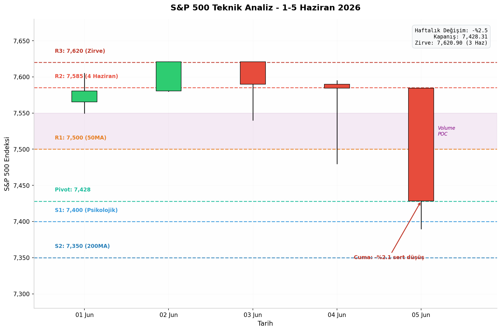
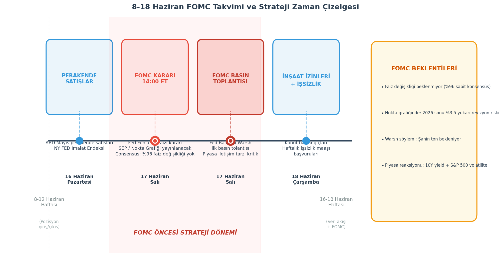

## 4. Teknik Analiz ve Haftaya Bakis - FOMC Oncesi Strateji

### 4.1 S&P 500 Haftalik Teknik Analiz

Haftayi 7,428.31 seviyesinden kapatan S&P 500, 7,620.90 zirvesinden (3 Haziran) yuzde 2.5'lik sert bir dusus kaydetti. Bu dusus, onceki bolumlerde detaylandirilan NFP verisi sonrasi FED faiz artirim beklentilerinin guclenmesi ve 10 yillik tahvil faizlerinin yuzde 4.54'e yukselmesiyle tetiklendi. Teknik acidan bakildiginda, endeks kritik bir kavsak noktasinda bulunuyor.

**4.1.1 Destek ve Direnç Seviyeleri**

Haftalik grafikte 7,400 seviyesi guclu psikolojik destek olarak one cikiyor. Bu seviyenin altinda 7,350 bolgesi bulunuyor ki bu, 200 gunluk hareketli ortalamanin (200MA) gectigi kritik teknik destektir. 200MA'nin kirilmasi, orta-uzun vadeli trend degisikligi sinyali olarak algilanir ve programatik satis dalgalarini tetikleyebilir. Yukari yonde ise 7,500 seviyesi hem 50 gunluk hareketli ortalama (50MA) hem de eski destek-direnc cevirme bolgesi olarak karsimiza cikiyor. Bu seviyenin uzerine cikilmadigi surece, kisa vadeli trend "dusus egiliminde" olarak degerlendirilecektir. 7,585 (4 Haziran kapanis) ve 7,620 (Haziran zirvesi) ise sirasiyla R2 ve R3 direncleri olarak takip edilecek.

**4.1.2 Momentum Gostergeleri**

RSI (14 gunluk) 5 Haziran itibariyle 42 seviyesine gerileyerek notr-alcali bolume tasindi. MACD'de ise sinyal hattinin altinda kalan MACD cizgisinde negatif momentum artisi gozleniyor. Haftalik pivot noktasi 7,428 seviyesinde bulunuyor ki bu, Cuma gunu kapanisa neredeyse denk dusuyor. Hacim profili analizinde (Volume Profile) fiyatin agirlikli ortalama maliyetinin 7,500-7,550 bandinda oldugu goruluyor; mevcut seviyeler bu bandin altinda kaldigi icin "deger bolgesi alti" olarak yorumlanabilir ancak bu, tersine donus garantisi degil, dususun derinlestigi anlamina da gelebilir.

**Tablo 1: Haftalik Pivot Seviyeleri ve Teknik Anlami**

| Seviye | Deger | Teknik Anlami | Piyasa Reaksiyonu |
|--------|-------|---------------|-------------------|
| R3 | 7,620 | Haziran zirvesi / cift tepe riski | Kisa sikisma pozisyonu kapatma seviyesi |
| R2 | 7,585 | 4 Haziran kapanisi / mini direnc | Gunluk satus firsati, 50MA'ya yaklasinca |
| R1 | 7,500 | 50MA + eski destek cevirmesi | Kritik direnc; uzeri kapanis dususu durdurur |
| Pivot | 7,428 | 5 Haziran kapanisi / kararsizlik | Uzerinde kalinirsa toparlanma, altinda baski |
| S1 | 7,400 | Psikolojik destek / yuvarlak sayi | likidite alani; ani kirilim stop tetikler |
| S2 | 7,350 | 200MA / yukselis trendi destegi | Trend kirilim sinyali; pozisyon yariya indirilir |

Tablo 1'de ozetlenen seviyeler cercevesinde, 7,500 uzeri gunluk kapanis kisa vadeli baskiyi azaltirken, 7,350 alti kapanis orta vadeli portfoy stratejisi degisikligi gerektiren bir uyari olacaktir.

### 4.2 8-12 Haziran Haftasi: Onemli Takvim ve Beklentiler

8-12 Haziran haftasi, 17 Haziran'daki kritik FOMC toplantisi oncesi son tam islem haftasidir. Bu donemde yatirimcilar pozisyonlarini ayarlamak icin son firsati bulacaklar.

**4.2.1 FOMC Beklentileri**

17 Haziran Salı gunu saat 14:00 ET'de aciklanacak FOMC kararinda faiz degisikligi beklenmiyor. CME FedWatch verilerine gore piyasalarin yuzde 96'si faizlerin sabit tutulacagini fiyatliyor. Ancak bu toplantinin asil kritik unsuru, uyesi oldugumuz FOMC'nin nokta grafigi (dot plot) ve ekonomik projeksiyonlarinin (SEP) yukari yonlu revizyon riskidir. Bir onceki toplantida 2026 sonu icin medyan tahmin yuzde 3.5 seviyesindeydi; bu toplantida yukari yonlu revizyon gelmesi durumunda tahvil faizleri ve dolar endeksinde yeni bir sert yukselis dalgasi baslayabilir.

Ayrica bu toplantı, Fed Baskani Warsh'in ilk FOMC basin toplantisi olmasi acisindan tarihi oneme sahip. Warsh'in piyasa iletisim tarzi, sikiya alma söyleminin sertligi ve ekonomik durum degerlendirmesi, piyasalar tarafindan mikroskobik incelenecek. NFP sonrasi guclenmis faiz artirim beklentileri icinde Warsh'in "sabirli" mi yoksa "sahin" mi olacagi, S&P 500'un yonunu belirleyecek.

**4.2.2 Ekonomik Veri Takvimi**

FOMC'den onceki gun, yani 16 Haziran Pazartesi gunu aciklanacak Mayis ayi perakende satislar verisi, tuketici harcamalarindaki ivme kaybini dogrulayacaksa, bu FED icin " yumusak inis" senaryosunu destekleyen bir veri olacaktir. Ayni gun NY FED imalat endeksi de uretim sektorunun durumu hakkinda onemli ipuclari verecek. FOMC sonrasi gun (18 Haziran) ise insaat izinleri ve haftalik issizlik maaşı basvurulari ile hafta tamamlanacak.

### 4.3 FOMC Oncesi Pozisyonlama Stratejisi

Onceki bolumlerde ele alinan NFP etkisi, sektor rotasyonu ve makroekonomik gelismeler isiginda, 8-12 Haziran haftasi icin "defansif agirlikli, sirnak koruyucu" bir portfoy stratejisi oneriyoruz.

**4.3.1 Dusuk Beta Defansif Portfoy Yapisi**

FOMC oncesi belirsizlik ortaminda portfoyun yuzde 40'ini saglik (XLV), kamu hizmetleri (XLU) ve tuketim stoklari (XLP) gibi dusuk beta, yuksek temettulu defansif sektorlere ayirmak uygun olacaktir. Finansal (XLF) ve sanayi (XLI) sektorlerinden olusan yuzde 20'lik bir "selectif alfa" katmani, faiz yuksekliginden kazanclar saglayabilir. Portfoyun yuzde 20'sini nakitte tutmak, FOMC sonrasi volatilitede alim firsatlari icin likidite saglayacaktir. Kalan yuzde 20 ise mevcut teknoloji pozisyonlarindan olusabilir, ancak bu bolumun mutlaka hedge'lenmesi gerekmektedir.

**4.3.2 Teknolojide Kisa Pozisyon Hedge Stratejisi**

Teknoloji sektoru (XLK) ve QQQ uzerindeki agirlik, faiz yukselisinden en cok zarar goren segment olarak portfoy riskini artiriyor. Bu riski yonetmek icin QQQ put opsiyonlari veya XLK put opsiyonlari satin alinarak asagı yonlu koruma saglanabilir. Ornegin, 7 Haziran kapanisina gore QQQ icin %2-3 out-of-the-money put opsiyonlari, FOMC sonrasi olasi sert dususlere karsi sigorta gorevi gorebilir. Daha az maliyetli bir alternatif ise QQQ put spread stratejisidir (ornegin 470/450 put spread).

**4.3.3 VIX Call Spread ile Tail Risk Hedge**

VIX endeksi 5 Haziran itibariyle 15.72 seviyesinde bulunuyor; bu tarihsel olarak nispeten dusuk bir seviye olmakla birlikte, yukselis trendi icerisinde. FOMC oncesi VIX'in 18 altinda kalmasi, opsiyon primlerinin ucuz oldugu anlamina geliyor ve tail risk hedge'inin maliyet-etkin oldugu bir ortam sunuyor. Portfoyun yuzde 1-2'si ile VIX call spread (ornegin 30/40 strike call spread) satin almak, "kara kugu" olayina karsi ucuz bir sigorta saglar. Bu strateji, VIX'in 25-30 uzerine cikmasi durumunda katlanarak getiri saglar ve portfoyun geri kalani dusse bile hedge katmani kazanc elde eder.

**Tablo 2: FOMC Oncesi Pozisyonlama Stratejisi**

| Strateji | Enstruman | Agirlik | Hedef | Risk / Maliyet |
|----------|-----------|---------|-------|----------------|
| Aktif - Defansif Cekirdek | XLV + XLU + XLP ETF | Portfoyun %40'i | Dusuk beta getiri, asagi koruma | Faiz yukselisinden bagimsiz |
| Aktif - Alfa Katmani | XLF + XLI ETF | Portfoyun %20'si | Faiz kazanimi, rotasyon getirisi | Ekonomik veri kotulesme riski |
| Pasif - Nakit Rezervi | Para piyasasi / Hazine | Portfoyun %20'si | FOMC sonrasi alim gucu | Enflasyon riski (sinirli) |
| Aktif - Teknoloji Hedge | QQQ 470 Put veya XLK Put | Portfoyun %5'i | Asagi yonlu teknoloji sigortasi | Opsiyon primi, zaman erimesi |
| Aktif - Tail Risk Hedge | VIX 30/40 Call Spread | Portfoyun %1-2'si | Kara kugu korumasi, VIX soktan kazanma | Spread maliyeti, VIX sakin kalirsa kayip |
| Durust - Stop Loss | S&P 500 7,350 alti izleme | Tum portfoy | 200MA trend kiriliminda pozisyon %50 kucultme | Yalanci kirilim riski |

Tablo 2'de ozetlenen stratejiler bir butun olarak ele alinmalidir. FOMC oncesi donemde (8-12 Haziran) pozisyon buyutmek yerine mevcut riskleri yonetmek ve defansif yapida kalmak, hafta sonrasi veri akisinin ardindan yeni pozisyon acmak icin daha saglikli bir zemin olusturacaktir. S&P 500'un 7,350 (200MA) altinda gunluk kapanis yapmasi durumunda ise tum stratejiler gozden gecirilmeli ve portfoy yariya indirilmelidir.

Sonuc olarak, teknik gorunum ve makro gostergeler FOMC oncesi temkinli durusu destekliyor. 7,500-7,350 bandinda hareket eden endeks icin net bir yon belirlenmis degil; ancak asagi yonlu risklerin yukari yonlu potansiyelden daha agir bastigi degerlendirilmektedir. Bu cercevede, "savunmada kal, firsati bekle" prensibi ile hareket etmek, bu belirsiz donemde sermaye korumasi acisindan en rasyonel yaklasimdir.
