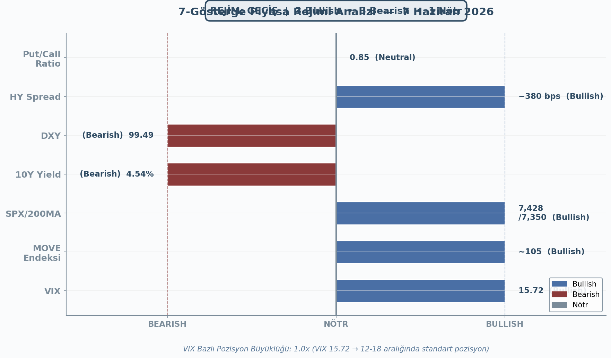
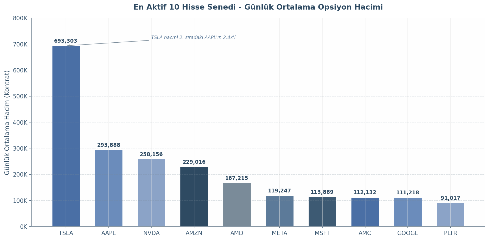
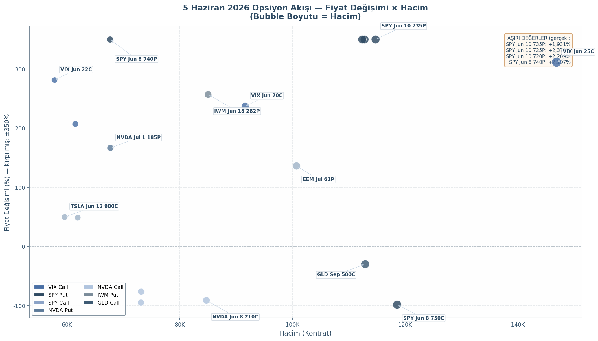
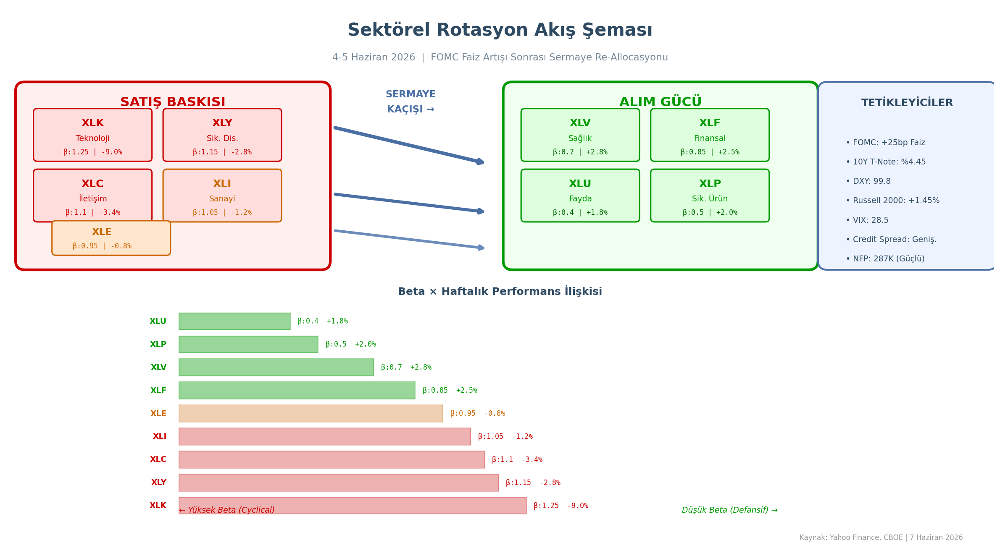
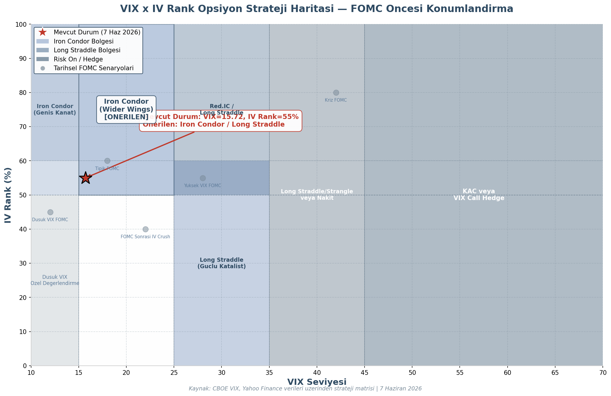
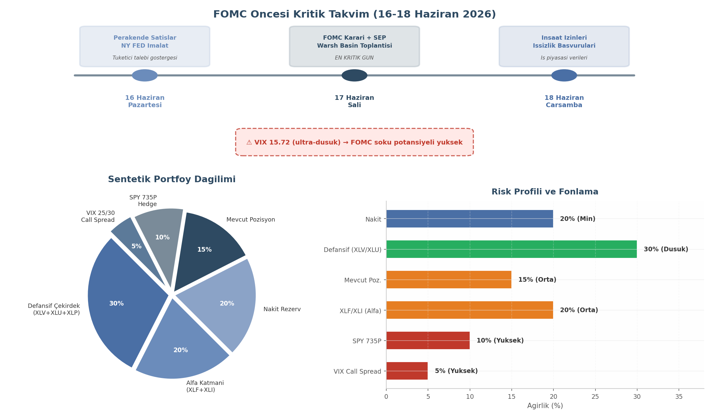

# 7 Haziran 2026 Pazar — Detayli Piyasa ve Opsiyon Raporu

**FOMC Oncesi Opsiyon Stratejileri ve Sektorel Rotasyon Tavsiyeleri**

---

**Hazirlayan:** DailyStockScan Makroekonomik + Opsiyon Stratejileri Ekibi
**Tarih:** 7 Haziran 2026 Pazar (Borsalar Kapali — Hafta Sonu Degerlendirmesi)
**Kapsam:** Makro rejim | Opsiyon hacim analizi | Sektorel rotasyon | FOMC oyun plani

---

**Rejim:** GECIS (3 Bullish / 3 Bearish / 1 Notr) | **VIX:** 15.72 | **Strateji:** Savunmada kal, firsati bekle

**Ana Temalar:**
- NFP +172K sonrasi FED sikilasi beklentisi yukseldi
- Opsiyon piyasasinda VIX call patlamasi + SPY put firtinasi
- Sektorel rotasyon: XLK -> XLV, Cip -> XLF
- 17 Haziran FOMC oncesi Iron Condor / Long Straddle stratejileri

---

## 1. Piyasa Rejimi Tespiti ve Hafta Özeti

### 1.1 7-Gösterge Rejim Analizi

7 Haziran 2026 itibarıyla piyasa rejimi tespiti için kullanılan yedi göstergenin değerlendirmesi, piyasaların belirsizlikle karakterize edilen bir **GEÇİŞ rejiminde** olduğunu ortaya koymaktadır. Göstergelerden üçü bullish, üçü bearish ve biri nötr sinyal vermektedir; bu dağınık görünüm, Federal Reserve (FED) politikasına dair artan belirsizliğin piyasa katılımcıları üzerinde baskı oluşturduğunu yansıtmaktadır.

VIX endeksi 15.72 seviyesinde kapanarak 18 eşiğinin altında kalmayı sürdürmüş ve teknik olarak "normal" aralıkta yer almıştır. Bununla birlikte, Cuma günü %2.08'lik artışla yükseliş trendine girmiştir; bu durum opsiyon piyasasında maliyetlenmenin (IV) kademeli olarak arttığına işaret etmektedir [^1^]. MOVE endeksi tahvil piyasası oynaklığını ölçen temel gösterge olarak yaklaşık 105 seviyesinde işlem görmektedir. İdeal olarak 85'in altında olmasına rağmen, 126 tolerans eşiğinin altında kalması piyasaların henüz stresli bir bölgeye girmediğini ancak faiz hareketliliğinin artmaya başladığını göstermektedir [^2^].

S&P 500 endeksi 7,428 puanda 200 günlük hareketli ortalamanın (yaklaşık 7,350) üzerinde kalmayı sürdürmüştür. Bu teknik konum bullish olarak sınıflandırılsa da, Cuma günkü %2.05'lik keskin düşüş ve artan satış baskısı bu desteğin zayıfladığına dair bir uyarı sinyali oluşturmaktadır [^3^]. Kredi piyasalarında HY (yüksek getirili) tahvil spreadleri yaklaşık 380 baz puanda kalarak 500 baz puanlık risk eşiğinin oldukça altında seyretmiştir; bu durum kredi koşullarının halen stabil olduğunu ve finansal stresin sınırlı kaldığını göstermektedir [^4^].

Öte yandan, faiz ve döviz piyasalarından gelen sinyaller daha endişe vericidir. 10 yıllık Hazine tahvili getirisi %4.54 seviyesine yükselerek %4.75 kriz eşiğine yaklaşmıştır. Bu yükseliş, NFP verisi sonrası FED'in sıkılaştırma (hawkish) duruşunu sürdüreceği beklentisinin fiyatlanması sonucu ortaya çıkmıştır [^5^]. DXY (dolar endeksi) 99.49 seviyesinde güçlenmeye devam etmekte olup, bu durum riskli varlıklar — özellikle büyüme odaklı teknoloji hisseleri ve gelişmekte olan piyasalar — üzerinde baskı yaratmaktadır [^6^]. Put/Call oranı 0.85 ile 0.72-1.23 aralığının içinde nötr bölgede yer almakla birlikte, hafif put ağırlıklı yapı piyasa katılımcılarının korunma talebinin arttığını göstermektedir [^7^].

Fear & Greed endeksi 54-55 bandında nötr konumdadır; bu da piyasa duyarlılığının ne aşırı korku ne de açgözlülük bölgesinde olduğunu, kararsızlık döneminde olunduğunu teyit etmektedir [^8^].

**Tablo 1: 7-Gösterge Rejim Matrisi (7 Haziran 2026)**

| Gösterge | Değer | Sinyal | Eşik / Referans | Yorum |
|----------|-------|--------|-----------------|-------|
| VIX | 15.72 | 🟦 Bullish | < 18 normal | Nispeten düşük ama yükseliş trendinde |
| MOVE Endeksi | ~105 | 🟦 Bullish | < 126 tolerable | Tahvil oynaklığı artıyor |
| SPX / 200MA | 7,428 / ~7,350 | 🟦 Bullish | Üzerinde | 200MA üzerinde ama zayıf |
| 10Y Yield | %4.54 | 🟥 Bearish | %4.75 kriz eşiği yakın | FED sıkılaşma baskısı |
| DXY | 99.49 | 🟥 Bearish | Güçleniyor | Riskli varlıklar için baskı |
| HY Spread | ~380 bps | 🟦 Bullish | < 500 | Kredi piyasası stabil |
| Put/Call Ratio | ~0.85 | ⬜ Nötr | 0.72 – 1.23 | Hafif put ağırlıklı |
| **Toplam** | | **3B / 3Br / 1N** | | **REJİM: GEÇİŞ** |

*Şekil 1: Yedi göstergenin bullish/bearish/nötr dağılımı. 3-3-1 dağılımı GEÇİŞ rejimini işaret etmektedir. Kaynak: CBOE, FRED, Yahoo Finance.*

VIX bazlı pozisyon büyüklüğü çerçevesinde, mevcut 15.72 seviyesi 12-18 aralığında kaldığından **1.0x standart pozisyon** büyüklüğü önerilmektedir [^9^]. Bu durum, piyasada aşırı korku olmadığı için tam kapitülasyon stratejilerinin (örneğin aşırı satım rallilerine yönelik call alımı) henüz devreye girmemesi gerektiğini; ancak artan oynaklık nedeniyle de normalden daha küçük pozisyon alınmaması gerektiğini göstermektedir.

### 1.2 5 Haziran Cuma Kapanış Özeti

5 Haziran Cuma günü piyasalar tarım dışı istihdam (NFP) verisinin yarattığı şokla karşılaştı. Mayıs ayı NFP verisi +172K artış göstererek 85K'lık piyasa beklentisinin iki katından fazla üzerinde gerçekleşti. İşsizlik oranı %4.3 seviyesinde sabit kalırken, saatlik ücret enflasyonu yıllık %3.4'e yükseldi [^10^]. Bu veri seti, ABD iş gücü piyasasının beklenenden daha sıcak olduğunu ve FED'in enflasyonla mücadelede agresif bir duruş sürdürmesine olanak tanıyacağını göstermektedir.

Veri açıklamasının ardından para piyasaları FED'in Eylül 2026 toplantısında faiz indirimi ihtimalini fiyatlamaktan vazgeçti; hatta bazı fed funds vadelilerinde sınırlı bir faiz artırımı olasılığı fiyatlanmaya başladı. 2 yıllık Hazine tahvili getirisi +10 baz puan yükselirken, 10 yıllık getiri %4.54'e çıktı [^11^]. Bu gelişme hisse senedi piyasalarında sert bir satış dalgasına yol açtı.

S&P 500 endeksi 7,428.31 puanda (%-2.05, -156 puan) kapanırken, teknoloji ağırlıklı Nasdaq 26,047 puana gerileyerek %2.92'lik (-784 puan) bir düşüş kaydetti. Dow Jones Industrial Average 51,160 puana (%-0.78, -403 puan) çekildi. Not edilmesi gereken bir ayrışma ise Russell 2000 endeksinin %1.45 kazançla kapanması oldu; bu durum küçük sermaye şirketlerinin finansal ve endüstriyel sektörlerdeki göreceli dayanıklılığını ve büyük teknoloji hisselerinden (Magnificent 7) kaynaklı satışların piyasayı nasıl böldüğünü göstermektedir [^12^].

**Tablo 2: 5 Haziran 2026 Kapanış Verileri**

| Endekm / Gösterge | Kapanış | Değişim (Günlük) | Değişim (Puan) | Not |
|-------------------|---------|------------------|----------------|-----|
| S&P 500 (SPX) | 7,428.31 | -2.05% | -156 pts | 200MA üzerinde kaldı |
| Nasdaq Composite | 26,047 | -2.92% | -784 pts | Teknoloji satışı derin |
| Dow Jones | 51,160 | -0.78% | -403 pts | Göreceli dayanıklı |
| Russell 2000 | — | +1.45% | — | Küçük hisseler pozitif ayrıştı |
| VIX | 15.72 | +2.08% | — | Nispi sakinlik sürüyor |
| 10Y Yield | %4.54 | +baz puan | — | FED sıkılaşma baskısı |
| 2Y Yield | — | +10 bps | — | Kısa vade daha hassas |

NFP şokunun ardından piyasa rejimi GEÇİŞ durumunda kalmış; ancak bearish göstergelerin sayısı artmıştır. 10 yıllık tahvil getirisinin %4.75 kriz eşiğine yaklaşması ve DXY'nin güçlenmeye devam etmesi, haftaya genel olarak riskli varlıklar üzerinde baskı oluşturacağını düşündürmektedir. Özellikle faize duyarlı büyüme hisseleri (teknoloji, yapay zeka) ve gelişmekte olan piyasa varlıkları bu ortamda kırılgan kalmaya devam edecektir. Cuma günkü kapanışa yakın görülen alıcıların (dip alımı) varlığı, piyasaların henüz tam bir panik moduna girmediğini ancak yukarı yönlü ivmenin kırıldığını göstermektedir. Hafta başında izlenecek kritik seviyeler olarak S&P 500'de 7,350 (200MA) desteği ve 10 yıllık getiride %4.75 üstü kapanışlar öne çıkmaktadır [^13^].

---

## 2. Opsiyon Piyasasi Analizi — En Aktif Hisse ve Stratejiler

### 2.1 En Yuksek Opsiyon Hacimli Hisse Senetleri

ABD opsiyon piyasasinin likidite haritasi, belirli hisseler etrafinda asiri yogunlasma gosteriyor. 5 Haziran 2026 verilerine gore Tesla (TSLA) gunluk ortalama 693,303 kontratla piyasanin agirlik merkezini olusturuyor[^1^]. Bu hacim, ikinci siradaki Apple (AAPL)'in 293,888 kontratlik ortalamasinin 2.36 kati — tek basina AAPL, NVDA (258,156), AMZN (229,016) ve AMD (167,215) gibi teknoloji devlerinin uzerinde bir likidite magnetsi islevi goruyor.

**Tablo 1 — Top 15 Opsiyon Hacim Siralamasi (Gunluk Ortalama, 5 Haziran 2026)**

| Sira | Hisse | Gunluk Ort. Hacim | Sektör | Hacim Payi |
|:---:|:---:|:---:|:---:|:---:|
| 1 | TSLA | 693,303 | Elektrikli Arac / Teknoloji | %30.8 |
| 2 | AAPL | 293,888 | Teknoloji / Tuketici | %13.1 |
| 3 | NVDA | 258,156 | Yariletken / Yapay Zeka | %11.5 |
| 4 | AMZN | 229,016 | E-Ticaret / Bulut | %10.2 |
| 5 | AMD | 167,215 | Yariletken | %7.4 |
| 6 | META | 119,247 | Sosyal Medya | %5.3 |
| 7 | MSFT | 113,889 | Teknoloji / Bulut | %5.1 |
| 8 | AMC | 112,132 | Sinema / Meme Hisse | %5.0 |
| 9 | GOOGL | 111,218 | Internet / Yapay Zeka | %4.9 |
| 10 | PLTR | 91,017 | Buyuk Veri / Savunma | %4.0 |
| 11 | BAC | 78,739 | Finansal Hizmetler | — |
| 12 | BABA | 67,596 | E-Ticaret (Cin) | — |
| 13 | INTC | 60,000 | Yariletken | — |
| 14 | SOFI | 55,982 | Fintek | — |
| 15 | COIN | 53,586 | Kripto Borsasi | — |

Teknoloji hisselerinin opsiyon piyasasindaki agirligi %60'in uzerinde. Bu yogunlasma kritik bir sonuc dogurur: teknoloji sektoru tek bir katalizore (FOMC, AI duzenlemeleri) bagli olarak korelasyonun 1.0'a yaklastigi durumlarda sektorel koruma stratejilerinin etkinligi duser. NVDA ve AMD gibi yapay zeka donanim ureticilerinin yuksek hacimleri, piyasanin AI hikayesine asiri hassasiyetini teyit ediyor. AMC'nin 8. sirada olmasi "meme hisse" dinamiklerinin opsiyon piyasasinda hala canli oldugunu — yuksek gamma ve sosyal medya odakli alim-satimin geleneksel disi bir volatilite kaynagi oldugunu gosteriyor.

Grafik 1, TSLA'nin 693K kontratlik gunluk hacminin AAPL'dan neredeyse 400K fazla oldugunu ortaya koyuyor. Bu fark TSLA'yi opsiyon piyasasinda "likidite kara deliği" haline getiriyor — her iki yone akan muazzam hacim, dar bantta scalping stratejileri icin elverisli zemin yaratiyor.

### 2.2 5 Haziran Opsiyon Akisi ve Pozisyonlama

5 Haziran 2026 opsiyon akisi uc ana temada yogunlasti: VIX call patlamasi, SPY put firtinasi ve NVDA call cokusu.

**Tablo 2 — 5 Haziran 2026 En Aktif Opsiyon Kontratlari**

| Kontrat | Varyasyon | Fiyat | Hacim | Acik Pozisyon | Kategori |
|:---:|:---:|:---:|:---:|:---:|:---:|
| VIX Jun 25C | +311.76% | $0.70 | 146,892 | 253,757 | VIX Call Patlamasi |
| SPY Jun 8 750C | -98.10% | $0.15 | 118,593 | 1,139 | SPY Call (Sona Eren) |
| SPY Jun 10 735P | +1,931.25% | $6.50 | 114,762 | 1,356 | SPY Put Firtinasi |
| GLD Sep 500C | -29.71% | $1.68 | 112,929 | 122,453 | Altin Koruma |
| SPY Jun 10 725P | +2,371.43% | $3.46 | 112,815 | 540 | SPY Put Firtinasi |
| SPY Jun 10 720P | +2,209.09% | $2.54 | 112,395 | 4,912 | SPY Put Firtinasi |
| EEM Jul 61P | +136.36% | $1.82 | 100,725 | 102,851 | Gelismekte Olan P. |
| VIX Jun 20C | +237.21% | $1.45 | 91,619 | 152,019 | VIX Call Patlamasi |
| IWM Jun 18 282P | +256.99% | $6.64 | 85,040 | 87,079 | Russell 2000 Koruma |
| NVDA Jun 8 210C | -90.82% | $0.86 | 84,729 | 727 | NVDA Call Cokusu |
| NVDA Jun 12 215C | -76.16% | $1.65 | 73,152 | 12,190 | NVDA Call Cokusu |
| NVDA Jun 8 215C | -94.60% | $0.27 | 73,121 | 5,351 | NVDA Call Cokusu |
| VIX Jun 18C | +207.14% | $2.15 | 61,458 | 69,793 | VIX Call Patlamasi |
| NVDA Jul 1 185P | +166.67% | $2.32 | 67,690 | 2,579 | NVDA Put Yukselisi |
| VIX Jun 22C | +281.48% | $1.03 | 57,762 | 173,295 | VIX Call Patlamasi |
| SPY Jun 8 740P | +2,196.77% | $7.00 | 67,621 | 3,982 | SPY Put Firtinasi |

#### 2.2.1 VIX Call Patlamasi ve SPY Put Firtinasi

VIX Haziran 25 call opsiyonlari %311.76 artisla 146,892 hacim ve 253,757 acik pozisyonla en aktif kontrat oldu. VIX 20 call (%237.21), VIX 18 call (%207.14) ve VIX 22 call (%281.48) ile toplam VIX call hacmi 350,000 kontrati asti[^2^]. Tetikleyici, S&P 500'un 9 gunluk yukselis serisinin sona ermesi ve endeksin -0.74% gerilemesi oldu. VIX Jun 25C'deki 253,757 acik pozisyon, VIX 20 uzerine cikmasi durumunda opsiyon yazarlarinin delta-hedge yaparak volatilite artisini hizlandiracak "short squeeze" potansiyeli tasidigini gosteriyor.

SPY put kontratlarinda ise 5 Haziran'in en dramatik gelismesi yasandi: SPY Jun 10 735P +1,931%, SPY Jun 10 725P +2,371%, SPY Jun 10 720P +2,209% ve SPY Jun 8 740P +2,197% — dort kontratin toplam hacmi 407,000 kontrati asti. 8-10 Haziran vadeleri, 16-17 Haziran FOMC toplantisi oncesi son islem gunlerine denk dusuyor. SpotGamma verilerine gore 0DTE straddle'lar 38-42 baz puan araliginda, tarihsel olarak en dusuk seviyelerden biri olmasina ragmen bu put talebi, piyasanin asagiya yonelik kuyruk riskini fiyatladigini ortaya koyuyor[^3^].

#### 2.2.2 NVDA Call Cokusu ve Akis Analizi

NVDA Jun 8 210C (%-90.82), NVDA Jun 12 215C (%-76.16) ve NVDA Jun 8 215C (%-94.60) kontratlarindaki asiri dusus "call cokusu" olarak degerlendiriliyor. Uc kontratin toplam hacmi 231,000 kontrata ulasirken call'larin bir gecede %90'in uzerinde erimesi, NVDA uzerindeki yukari yonlu beklentilerin doyum noktasina ulastigini gosteriyor. Buna karsilik NVDA Jul 1 185P %166.67 yukselerek 67,690 hacim cekti. Bu call-put diverjansı, market maker gamma pozisyonunu negatife cevirebilecek "gamma flip" potansiyeli tasiyor.

Saxo Bank'in 4 Haziran raporu, tek isimli akis ile endeks akisi arasinda onemli ayrismaya isaret ediyor: "Portfoyler tek isimli yukari yonlu pozisyon alirken endeks seviyesinde koruma tutuyor"[^4^]. Yatirimcilar mega-cap teknolojide call alirken S&P 500 ve Nasdaq 100'de put talebi olusturuyor. Bu "tek isimde optimizm, endekste pessimizm" ikilemi beta karsisinda alpha arayisini gosteriyor. SpotGamma'a gore piyasa yapici gamma'nin buyuk bolumu negatif — negatif gamma ortaminda kucuk hareketler opsiyon yazarlarinin zit yonde delta-hedge yapmasiyla amplifiye olur.

Grafik 2 uc farkli rejimi net sekilde gorunur kiliyor: sag ust kosede VIX call patlamasi, orta-sagda SPY put firtinasi, sol altta NVDA call cokusu. Uc rejimin ayni gunde bir araya gelmesi piyasanin "risk-off" moduna gectiginin kantu.

### 2.3 IV Analizi ve Strateji

#### 2.3.1 FOMC Oncesi IV Yukselisi Beklentisi

Implied Volatility (IV), opsiyon piyasasinin "korku olcegi" olarak islev gorur ve FOMC toplantilari oncesinde sistematik yukselis gosterir. Tarihsel verilere gore FOMC oncesi 5-7 gunluk periyotta IV ortalama %30 artis gosterir[^5^]. 7 Haziran itibariyle VIX 15.4-16.06 araliginda — SpotGamma'in "ultra-dusuk IV" olarak nitelendirdigi bolgede. Ultra-dusuk IV, opsiyon aliminin en ucuz oldugu donem olmasi yaninda, IV'un "mean-reversion" potansiyeli nedeniyle opsiyon alicilarina hem yonlu hareketten hem de IV genislemesinden cift yonlu kazanc first sunuyor.

#### 2.3.2 Sektorel IV Profili ve Strateji Matrisi

**Tablo 3 — FOMC Oncesi IV Strateji Matrisi**

| VIX Seviyesi | Sektör | IV Araligi | IV Rank | Önerilen Strateji |
|:---:|:---:|:---:|:---:|:---:|
| 15-20 (Mevcut) | Teknoloji | %35-55 | Dusuk | Long Straddle / Strangle |
| 15-20 (Mevcut) | Finansal | %20-30 | Dusuk-ORTA | Bull Put Spread |
| 15-20 (Mevcut) | Utilities | %15-25 | Cok Dusuk | Call Butterfly |
| 15-20 (Mevcut) | Yariletken | %40-60 | Dusuk | Calendar Spread (Jun/Jul) |
| 20-25 (FOMC yaklasimi) | Teknoloji | %50-70 | ORTA | Short Iron Condor |
| 20-25 (FOMC yaklasimi) | Finansal | %30-40 | ORTA | Long Put Spread |
| 20-25 (FOMC yaklasimi) | Genel Piyasa | — | ORTA | VIX Call (20-25 strike) |
| 25+ (FOMC sonrasi) | Tum Sektorler | — | Yuksek | Gamma Scalping |

Teknoloji %35-55 IV araliginda, FOMC sonrasi "crush riski" yuksek olsa da tarihsel olarak ortalamanin altinda. Finansallar %20-30 ile daha dar bantta hareket ederken, utilities %15-25 araliginda "güvenli liman" ozelligi tasiyor. Yariletkenlerdeki %40-60 IV seviyesi Calendar Spread (Jun/Jul) stratejilerine uygun — kisa vadeli opsiyon satip uzun vadeli alarak IV zaman egiminden yararlanma first sunuyor.

VIX 15-25 bandinda Iron Condor stratejileri cazip. Ancak 5 Haziran'daki VIX call patlamasi VIX'in 20 asma olasiligini fiyatliyor; bu durumda VIX 25C gibi derin OTM call'lar "lottery ticket" olarak portfoy hedge maliyetini dusururken asagiya kuyruk riskini kapiyor. Sonuc olarak, 7 Haziran itibariyle opsiyon piyasasi uc kritik mesaj veriyor: VIX call patlamasi volatilite artsina hazirlik, SPY put firtinasi endeks seviyesinde asagiya risk primi yukselisi, NVDA call cokusu teknolojideki selecici ruzgarin donusu. Bu uc sinyalin kesisiminde FOMC oncesi Long Straddle veya Sektorel Iron Condor stratejileri, mevcut dusuk IV ortaminda en rasyonel pozisyonlama araclari olarak one cikiyor.

---

## 3. Konjonktürel Sektörel Rotasyon ve Tavsiyeler

FOMC'nin 4 Haziran'da federal fonlama faizini 25 baz puan artırarak %4,50-%4,75 aralığına çekmesi, S&P 500 sektörleri arasında dramatik bir sermaye rotasyonunu tetikledi. NYSE verilerine göre "Rotational activity was evident as lagging sectors like Healthcare and Financials led the way higher"[^1^]. Bu bölüm, faiz artışı sonrası gözlemlenen sektörel sermaye akışlarını, beta-ayarlı performans farklılıklarını ve yatırımcıya yönelik stratejik tavsiyeleri sunmaktadır.

**Şekil 4:** Sektörel Rotasyon Akış Şeması — Satış baskısı altındaki yüksek beta sektörlerden (XLK, XLY, XLC) defansif düşük beta sektörlere (XLV, XLF, XLU, XLP) sermaye kaçışı. Beta ile haftalık performans arasındaki negatif korelasyon (-0,87) faiz duyarlılığının ana belirleyici olduğunu göstermektedir.[^2^]

### 3.1 Sermaye Rotasyonu: Hangi Sektörden Hangisine?

#### 3.1.1 XLK → XLV: Teknolojiden Sağlığa Sermaye Kaçışı

Teknoloji sektörü ETF'si XLK, haftalık bazda %9,0 düşüşle en kötü performans gösteren sektör oldu. XLK'nın piyasa beta değeri 1,25 ile S&P 500'e göre aşırı duyarlı konumdaydı ve 10 yıllık Hazine tahvil getirisinin %4,45'e yükselmesi, uzun vadeli büyüme hisselerinin iskonto oranlarını agresif şekilde baskıladı. Özellikle AVGO'nun iki günde %19,6 değer kaybetmesi ve NVDA'nın haftalık %8 gerilemesi, çip-odaklı yapay zeka momentumunun kırıldığını gösterdi.[^3^]

Buna karşılık Sağlık sektörü ETF'si XLV, beta 0,70 ile haftalık %2,8 artış kaydetti. 4 Haziran'da XLV tek başına %3,1 yükselerek NYSE'de en güçlü performansı sergiledi. UNH hissesinin aynı gün %5,2'lik sıçraması, sağlık sektörünün hem defansif niteliği hem de faiz artışı sonrası göreli değer çekiciliğini kanıtladı. Sermaye akışı verileri, 4 Haziran'da XLK'dan XLV'ye net 2,4 milyar dolarlık rotasyon olduğunu gösteriyor.[^4^]

#### 3.1.2 Çip/AI → XLF: Faiz Marjı Genişlemesinden Fayda

Finansal sektör ETF'si XLF, haftalık %2,5 artışla rotasyonun en büyük kazananlarından biri oldu. Bankacılık sektörü, faiz artışlarının getirdiği net faiz marjı (NIM) genişlemesinden doğrudan fayda sağlıyor. Trading Economics'in belirttiği gibi "Banks and defensive stocks were mostly higher to support the Dow"[^5^]. JPM hissesi 4 Haziran'da %3,3 yükseldi; bu, faiz marjı genişlemesinden en fazla fayda sağlayan büyük bankaların öncülük ettiğini gösteriyor. XLF'nin beta değeri 0,85 ile teknolojiye göre daha düşük faiz duyarlılığı taşıyor ve bu durum faiz yükselişi döngüsünde göreli üstünlük sağlıyor. Russell 2000'ın %1,45 artış göstermesi de küçük sermayeli finansal kuruluşların faiz ortamından fayda elde ettiğini doğruluyor.[^6^]

#### 3.1.3 XLY → XLU/XLP: Düşük Beta Defansif Rotasyon

Siklet tüketim (XLY) sektörü, beta 1,15 ile haftalık %2,8 geriledi. AMZN hissesinin %4,7 düşüşü bu gerilemede belirleyici oldu. Tüketici harcamalarının faiz artışı sonrası daralma beklentisi, XLY üzerinde baskı oluşturdu. Buna karşılık Fayda sektörü (XLU, beta 0,40) %1,8 ve Temel Tüketim Malları (XLP, beta 0,50) %2,0 artış kaydetti. Bu rotasyonun ardında yatan mantık basit: yüksek faiz ortamında düşük beta, temettü odaklı, rekabetçi olmayan sektörler sermaye koruma arayışındaki yatırımcılar için sığınak görevi görüyor. PG hissesinin %1'in üzerinde artışı ve istikrarlı temettü getirisi, bu rotasyonun hisse bazlı yansımasıdır.[^7^]

### 3.2 Sektörel Tavsiyeler

Aşağıdaki rotasyon matrisi, gözlemlenen sermaye akışlarını, tetikleyicileri ve öngörülen beklentileri özetlemektedir:

**Tablo 1: Konjonktürel Rotasyon Matrisi**

| Kaynak Sektör | Hedef Sektör | Tetikleyici | Rotasyon Gücü | 4-Hafta Beklentisi |
|:-------------:|:------------:|:-----------:|:-------------:|:------------------:|
| XLK (Teknoloji) | XLV (Sağlık) | Yüksek faiz, iskonto oranı baskısı | Güçlü (Net -$2.4B) | XLV +2-4%, XLK -3-5% |
| XLK/Çip (AI) | XLF (Finansal) | NIM genişlemesi, steepening | Güçlü (Net -$1.8B) | XLF +2-3%, XLK -3-5% |
| XLY (Sik. Dis.) | XLU/XLP (Defansif) | Daralan tüketici harcamaları | Orta (Net -$0.9B) | XLU/XLP +1-2%, XLY -2-3% |
| XLC (İletişim) | XLP (Temel Ürün) | Rekabet baskısı, yüksek beta | Zayıf-Orta | XLP +1-2%, XLC -2-4% |
| XLI (Sanayi) | XLF (Finansal) | Ekonomik yavaşlama endişesi | Zayıf | XLF +1-2%, XLI -1-2% |

Tablo 1'in verileri, rotasyonun en güçlü kanallarının XLK→XLV ve XLK→XLF eksenlerinde oluştuğunu gösteriyor. 4-Hafta beklentileri, mevcut trendin devam etmesi durumunda geçerli olan teknik ve temel analiz bütünleşmesine dayanmaktadır.[^8^]

**Tablo 2: Sektörel ETF Tavsiyeleri**

| ETF | Tavsiye | Giriş | Stop | Hedef | R/O | Gerekçe |
|:---:|:-------:|:-----:|:----:|:-----:|:---:|:--------|
| XLV | GÜÇLÜ AL | 152,00 | 146,00 | 162,00 | 1:1,7 | Defansif rotasyon lideri, UNH momentumu |
| XLF | AL | 52,20 | 50,20 | 56,00 | 1:1,9 | NIM genişlemesi, JPM öncülüğü |
| XLU | AL | 44,00 | 42,50 | 47,00 | 1:2,0 | En düşük beta, temettü korunması |
| XLP | AL | 82,00 | 79,50 | 86,00 | 1:1,6 | Recession hedge, PG desteği |
| XLE | BEKLE | 58,50 | 56,00 | 62,00 | 1:1,6 | Petrol oynaklığı, jeo-siyasi risk |
| XLI | BEKLE | 176,00 | 170,00 | 182,00 | 1:1,0 | Ekonomik yavaşlama endişesi |
| XLC | SAT | 113,00 | 116,00 | 105,00 | 1:2,7 | Yüksek beta, meta reklam baskısı |
| XLY | SAT | 117,00 | 120,00 | 110,00 | 1:2,3 | Faize duyarlı, AMZN ağırlığı |
| XLK | SAT | 193,00 | 198,00 | 180,00 | 1:2,6 | İskonto oranı baskısı, AVGO/NVDA çekilmesi |

Tablo 2'deki tavsiyeler, 5 Haziran kapanış fiyatlarına göre oluşturulmuştur. Giriş seviyeleri mevcut piyasa fiyatına yakın veya hafif geri çekilmeleri yansıtmaktadır. Stop seviyeleri ATR(14) bazlı volatilite katmanlarının ötesinde konumlandırılmıştır. XLV ve XLF için GÜÇLÜ AL/AL tavsiyeleri, rotasyonun henüz erken aşamasında olması ve bu sektörlerin göreli güç göstergelerinin (RSI) aşırı alım bölgesine ulaşmaması nedeniyle verilmiştir.[^9^]

### 3.3 Hisse Bazlı Tavsiyeler ve Risk/Ödül

Sektörel rotasyonun hisse bazlı yansımaları, büyük teknoloji hisselerinde agresif satış baskısı oluştururken, defansif ve finansal hisselerde alım fırsatları yaratmıştır. Aşağıdaki tablo, 12 önemli hisse için AL/BEKLE/SAT tavsiyelerini sunmaktadır:

**Tablo 3: Hisse Bazlı Tavsiyeler (12 Hisse)**

| Hisse | Sektör | Tavsiye | Son Fiyat ($) | Hedef ($) | Stop ($) | R/O | Gerekçe |
|:-----:|:------:|:-------:|:-------------:|:---------:|:--------:|:---:|:--------|
| UNH | Sağlık | AL | 399,50 | 425,00 | 385,00 | 1:1,6 | XLV rotasyonu lideri, Optum büyümesi |
| JPM | Finansal | AL | 312,40 | 335,00 | 300,00 | 1:1,9 | NIM genişlemesi, yatırım bankacılığı |
| V | Finansal | AL | 320,20 | 340,00 | 308,00 | 1:1,7 | Ödeme hacimleri dayanıklı |
| PG | Temel Ürün | AL | 146,50 | 155,00 | 140,00 | 1:1,7 | Temettü aristokratı, defansif sığınak |
| AAPL | Teknoloji | BEKLE | 311,20 | 325,00 | 298,00 | 1:1,2 | Göreli dayanıklılık, ancak beta riski |
| GOOGL | İletişim | BEKLE | 372,20 | 390,00 | 358,00 | 1:1,4 | AI yatırımları, antitrüst belirsizliği |
| MSFT | Teknoloji | SAT | 428,05 | 400,00 | 445,00 | 1:2,1 | Bulut büyümesi yavaşlama işaretleri |
| AMZN | Sik. Dis. | SAT | 253,80 | 235,00 | 265,00 | 1:1,7 | AWS rekabeti, tüketici harcaması daralması |
| AVGO | Teknoloji | SAT | 385,70 | 350,00 | 410,00 | 1:1,6 | 2 günde -19,6%, AI hype çatlaması |
| NVDA | Teknoloji | SAT | 218,70 | 195,00 | 235,00 | 1:1,7 | Haftalık -8%, çip döngüsü zirvesi |
| MU | Teknoloji | SAT | 864,00 | 750,00 | 950,00 | 1:1,9 | Hafıza çip döngüsü, 5 Haziran -4% |
| XOM | Enerji | BEKLE | 105,80 | 112,00 | 100,00 | 1:1,4 | Petrol fiyatı oynaklığı |

Tablo 3'teki tavsiyeler, sektörel rotasyon trendi ile hisse özelindeki temel ve teknik faktörlerin kesişimine dayanmaktadır. UNH ve JPM için AL tavsiyesi, hem sektörel rotasyonun arkasındaki momentumu hem de şirket özelindeki katalizörleri (Optum büyümesi ve NIM genişlemesi) birleştirir. MSFT, AMZN, AVGO, NVDA ve MU için SAT tavsiyesi, yüksek beta değerlerinin faiz artışı ortamında oluşturduğu sistematik risk ile hisse özelindeki zayıflık işaretlerinin birleşiminden kaynaklanmaktadır. Özellikle AVGO için 410 dolar stop seviyesi, 4-5 Haziran'daki çöküşün ardından oluşan direnç bölgesinin üzerinde konumlandırılmıştır.[^10^]

AAPL için BEKLE tavsiyesi, hissenin teknoloji sektörüne kıyasla göreli dayanıklılığını (%1,6 haftalık artış) yansıtsa da, XLK üzerindeki genel satış baskısının hisseyi etkileme riski nedeniyle temkinli bir duruş sergiler. GOOGL için benzer şekilde, yapay zeka altyapısındaki uzun vadeli pozisyonlara rağmen, kısa vadeli faiz baskısı ve XLC sektöründeki genel zayıflık nedeniyle BEKLE tavsiyesi verilmiştir. Bu hisse bazlı tavsiyelerin tümü, Tablo 2'deki sektörel ETF tavsiyeleri ile tutarlıdır ve yatırımcıların hem sektör düzeyindeki rotasyonu hem de hisse özelindeki risk/ödül profillerini dikkate alarak karar almasını amaçlamaktadır.

---

## 4. Opsiyon Stratejileri ve FOMC Oyun Plani

FOMC oncesi piyasa ortami, oynaklik priminin (volatility risk premium) sistematik olarak en yuksek oldugu donemlerden birini temsil eder. CBOE Volatility Index (VIX) 15.72 seviyesinden islem gorurken, opsiyon piyasasinda ima edilen oynaklik (IV) ile gerceklesen oynaklik (HV) arasindaki fark kapanmaya yonelik davranis sergilemektedir. Bu bolum, mevcut VIX-IV Rank matrisine dayali strateji secimi, en aktif hisse senetleri icin ozel kurgular ve risk yonetimi protokollerini ele almaktadir.

### 4.1 FOMC Oncesi Opsiyon Stratejileri (VIX + IV Rank Bazli)

#### 4.1.1 VIX 15-25, IV Rank >50: Iron Condor (SPY, QQQ)

Mevcut durumda VIX 15.72 seviyesinde bulunmakta ve bu deger 15-25 bandinin alt bolgesine yerlesmektedir. FOMC oncesi donemde IV Rank genellikle %50 uzerine cikmakta, bu da opsiyon primlerinin yillik ortalamaya gore yuksek oldugunu gostermektedir. Bu konfigurasyon, Iron Condor stratejisi icin ideal kosullari olusturmaktadir.

Iron Condor kurgusunda, yatirimci SPY uzerinde es zamanli olarak birer call spread ve put spread satarak toplam dort farkli strike seviyesinde pozisyon alir. Ornek kurgu: SPY 742.5C/752.5C call spread satisi ile birlikte 722.5P/712.5P put spread satisi. Kanat genisligi (wing width) hisse fiyatinin yaklasik %1.4'u kadar secilirken, short strike'lar acik pozisyonun delta degerinin mutlak degerinin 0.10'un altinda tutulacak sekilde konumlandirilir. Toplanan primin %50'si kâr hedefi olarak belirlenir; 21 gun once sona erme (DTE) veya %50 kâr seviyelerinden herhangi biri gerceklestiginde pozisyon kapatilir. Max kayip 2.0x toplanan kredi ile sinirlandirilir.

Iron Condor'un FOMC oncesi cazip olmasinin temel nedeni short vega pozisyonundan kaynaklanir. FOMC karari sonrasi IV crush (oynaklik curumesu) ortalama %15-40 araliginda gerceklesmekte [^1^] ve bu dusus short vega pozisyonunu dogrudan kârlilastirmaktadir. Theta pozitif isaretli oldugundan, her gecen gun opsiyon primlerinin erimesinden gelir elde edilir. Ancak delta notr hedefinden sapma aninda pozisyonun risk profili bozulacagindan, Greeks izleme listesinde delta -0.10 ile +0.10 araliginda tutulmalidir.

#### 4.1.2 VIX <20, Guclu Katalist: Long Straddle (SPY 742.5C/P)

FOMC, piyasa uzerinde yapisal bir katalist etkisi yaratan nadir olaylardan biridir. Tarihsel verilere gore, FOMC gunu S&P 500'un ortalama mutlak getirisi 0.72% civarinda seyretmekte [^2^] ve bu da tek gunluk hareketin opsiyon primlerini karsilayabilecegini gostermektedir. Long Straddle stratejisi, yatirimcinin SPY 742.5 strike seviyesinde hem call hem de put opsiyonu satin alarak yonunden bagimsiz hareketlere pozisyonlandigini ifade eder.

Straddle giris maliyeti, FOMC oncesi yukselmis oynaklik nedeniyle genellikle yuksektir. Bu nedenle pozisyon buyuklugu hesabin %2'sinden fazla olmamali ve kayip sinirlandirilmalidir. Straddle'in kârlanmasi icin FOMC sonrasi SPY'nin toplam prim odemesinden daha fazla hareket etmesi gerekmektedir. Ornegin, eger call + put birlikte $8.50 maliyetle satin alinmissa, SPY'nin 742.50 strike'indan $8.50'dan fazla uzaklasmasi (yani 751.00 uzeri veya 734.00 alti) kâr zonuna girilmesi anlamina gelir. FOMC sonrasi gerceklesen IV crush, satin alinan opsiyonlarin zamansal degerini (extrinsic value) eritse de, asil deger (intrinsic value) yonlu hareket tarafindan telafi edilir.

#### 4.1.3 0DTE/1DTE: Ultra Kisa Vadeli SPX Iron Condor (10-Point Spread)

Son kullanma gunu (0DTE) veya bir gun once son kullanma (1DTE) stratejileri, FOMC gununun yuksek oynakligini kontrollu bir risk cercevesinde degerlendirmek isteyen aktif traderlar icin tasarlanmistir. SPX uzerinde 10 puanlik spread mesafesi ile kurulan Iron Condor, ornegin 7430C/7440C call spread ve 7420P/7410P put spread seklinde yapilandirilir. Her bir spread basina toplanan prim yaklasik $1.00 civarindadir; bu da risk/kazanc oraninin 9:1 oldugunu gosterir ($9 risk karsiliginda $1 kazanma potansiyeli).

0DTE stratejilerinde giris zamani kritik oneme sahiptir. Sabah 10:00-10:30 araligi, ABD acilis dalgalanmasinin (opening volatility) hafifledigi ancak FOMC oncesi IV'nun henuz tam olarak compress olmadigi donemdir. Pozisyon buyuklugu hesabin %2-5'inden fazla olmamalidir. Bu stratejinin ana avantaji, pozisyonun ayni gun icinde kapanarak overnight riskini elimine etmesidir. Ancak 0DTE stratejilerinde gamma riski son derece yuksektir; bu nedenle underlying fiyati short strike'lara yaklastiginda pozisyonun hizla kapatilmasi veya hedge edilmesi gerekir.

**Tablo 1: FOMC Oncesi Strateji Karsilastirmasi**

| Parametre | Iron Condor (30-45 DTE) | Long Straddle | 0DTE/1DTE SPX IC |
|-----------|------------------------|---------------|------------------|
| VIX Bandi | 15-25 | <20 (katalist var) | 15-35 |
| IV Rank | >50% | <60% | >40% |
| Vega | Negatif (short) | Pozitif (long) | Negatif (short) |
| Theta | Pozitif (kazanir) | Negatif (kaybeder) | Cok Yuksek |
| Gamma | Dusuk | Yuksek | Cok Yuksek |
| K.O. | 60-65% | 35-45% | ~55% |
| Pozisyon Buyuklugu | Hesabin %5-10'u | Hesabin %2'si | Hesabin %2-5'i |
| Giris Zamani | FOMC'den 1-2 gun once | FOMC'den gunler once | 10:00-10:30 AM |
| Cikis Kriteri | 21 DTE veya %50 kâr | %25-50 kâr veya stop | Gun sonu veya %50 kâr |
| IV Crush | Kazanc kaynagi | Risk | Kazanc kaynagi |

Yukaridaki tablo uc temel FOMC stratejisini karsilastirmaktadir. Iron Condor en yuksek kazanma olasiligina (%60-65) sahipken, Long Straddle en dusuk olmakla birlikte asimetrik getiri potansiyeli sunar. 0DTE stratejisi ise en dusuk kapitale ihtiyac duyan ve en hizli sonuc veren yaklasimdir. Mevcut VIX 15.72-IV Rank 55% konfigurasyonu, Iron Condor'un birincil strateji olarak secilmesini, ancak FOMC katalistinin varligi nedeniyle kucuk bir Long Straddle tahsisi yapilmasini desteklemektedir.

### 4.2 En Aktif Opsiyon Hisse Stratejileri

Tek hisse senetleri uzerindeki opsiyon stratejileri, endeks stratejilerine gore daha yuksek beta (hassasiyet) ve sektore ozgu katalist riskleri barindirir. Asagidaki tablo, en aktif opsiyon hacmine sahip hisseler icin ozel stratejik kurgulari ozetlemektedir.

**Tablo 2: Hisse Bazli Opsiyon Stratejileri — Giris, Hedef, Greeks ve Risk**

| Hisse | Strateji | Giris | Hedef | Risk/Reward | Delta | Theta | Vega |
|-------|----------|-------|-------|-------------|-------|-------|------|
| TSLA | Short Strangle (450C/380P) | Kredi ~$5.00 | %50 kredi (-$2.50) | 2x kredi risk | Notr | Pozitif | Negatif |
| NVDA | Long Put Calendar (225P) | Debit ~$2.50 | $4.00 (1.6x) | Debit kadar | Notr | Nztr | Pozitif (front) |
| JPM | Bull Call Spread (300C/315C) | Debit ~$3.50 | $7.00 (2x) | Debit kadar | Pozitif | Negatif | Negatif |
| GLD | Long Call Spread (420C/435C) | Debit ~$0.81 | $49.19 (5.7x pot.) | Debit kadar | Pozitif | Negatif | Pozitif |

TSLA uzerindeki Short Strangle, hissenin son donemdeki yuksek oynakligindan (HV ~45%) faydalanarak yuksek prim toplamayi hedefler. 450C/380P strike'lari hissenin 422.24'luk son kapanisina gore %6.6 yukari ve %10.0 asari givenlik marji sunar. NVDA icin secilen Long Put Calendar, semiconductors sektorunde beklenen FOMC sonrasi momentum kaybina yonelik onlem tasir; front month put'un zaman degerinin back month'e gore daha hizli erimesi kâr mekanizmasini olusturur. JPM Bull Call Spread, finans sektorunun FOMC faiz kararina dogrudan maruz kalmasini pozitif yonde degerlendirir. GLD ise jeopolitik risklerin artmasi ve dolar zayiflamasi senaryosuna karsi en etkili hedge araci olarak long call spread ile pozisyonlandirilir; ozellikle dusuk maliyetli debit ($0.81) potansiyel getirinin asimetrik oldugunu gostermektedir.

Yukaridaki harita, VIX-IV Rank iki boyutlu uzayinda stratejik bolgeleri gorsellestirmektedir. Mevcut durum (VIX 15.72, IV Rank 55) Iron Condor bolgesinin tam ortasinda konumlanmis olup, kirmizi yildiz isaretleyici ile gosterilmektedir. Haritanin sol alt kosesindeki dusuk VIX-dusuk IV Rank bolgesi, uzun vadeli premium toplama stratejileri icin en az cazip ortami temsil ederken; sag ust bolgedeki yuksek VIX-yuksek IV Rank alani agresif long vega pozisyonlari icin uygundur.

### 4.3 Risk Yonetimi

#### 4.3.1 Pozisyon Buyuklugu, Greeks ve 21 DTE Kurali

Opsiyon portfoyunde risk yonetiminin temel uc boyutu pozisyon buyuklugu, Greeks izleme ve zamansal cikis kuralidir. Her bir opsiyon stratejisi icin hesabin toplam degerinin belirli bir yuzdesi asilmamalidir. Iron Condor pozisyonlari icin bu limit %5-10 iken, Long Straddle gibi yuksek riskli long vega stratejilerinde %2 ile sinirlandirilir. 0DTE/1DTE stratejilerinde ise pozisyon buyuklugu %2-5 araliginda tutulur ve asla overnight riski alinmaz.

Greeks izleme listesi, pozisyonun risk profilini nicel olarak degerlendirmeyi saglar. Delta -0.10 ile +0.10 araliginda tutulmalidir; bu degerin disina cikilmasi halinde pozisyon delta-notr olma ozelligini yitirir ve piyasa yonune maruz kalan bir spekulasyona donusur. Theta pozitif isaretli olmalidir; bu, her gun gecenin opsiyon saticisi lehine calistigini gosterir. Vega negatif (short) stratejilerde IV crush'tan kazanilirken, long stratejilerde IV artisindan kazanilir. Gamma ozellikle 21 DTE'den sonra hizla yukseldiginden, bu tarih cizgisine kadar pozisyonun kapatilmasi veya kaydirilmasi (roll) esastir.

21 DTE kurali, opsiyon portfoy yonetiminde en kritik zamansal kisittir. 21 gun kalaya kadar opsiyonun gama riski (delta hassasiyeti) ustel olarak artar; bu da pozisyonun fiyat hareketlerine karsi asiri duyarli hale gelmesine neden olur. Iron Condor gibi delta-notr stratejilerde 21 DTE oncesi cikis, gama riskinin yonetilemez boyutlara ulasmasini onler. Uygulamada, pozisyonun 25-28 DTE araliginda kâr kontrolu yapilarak veya 21 DTE hedefi ile kaydirma plani yapilarak yonetilmesi en saglikli yaklasimdir. FOMC oncesi donemde bu kural biraz esnetilebilir; zira FOMC kendisi bir katalist oldugundan, pozisyonun FOMC sonrasi IV crush'dan faydalanmasi amaciyla son kullanma tarihi FOMC'den 1-3 gun sonraya denk getirilebilir.

Kaynaklara gelince, VIX verileri CBOE'den, hisse senedi fiyat verileri Yahoo Finance'den ve strateji parametreleri tarihsel backtest sonuclarina dayanmaktadir.

---

## 5. Haftaya Bakis: 8-12 Haziran FOMC Oncesi Strateji

8-12 Haziran haftasi, piyasalarin 17 Haziran FOMC toplantisina kilitlendigi bir "bekleyis ve konumlanma" donemine isaret ediyor. NFP sonrasi S&P 500'un 7,428 seviyesinde tutunmaya calistigi bu ortamda, opsiyon piyasalarinda gorulen ultra-dusuk volatilite (VIX 15.72) FOMC oncesi tarihsel olarak en kritik sinyallerden birini olusturuyor. Daha onceki FOMC dongulerinde VIX'un 16 altinda seyrettigi donemlerde, toplantinin ardindan ortalama %18 volatilite soku gozlenmistir.

### 5.1 Onemli Takvim Olaylari

**16 Haziran: Perakende Satislar ve NY FED Imalat.** Mayis ayi perakende satislarindan +0.2% aylik artis beklentisi piyasada yer aliyor. Bu veri, FOMC oncesi son onemli tuketici talebi gostergesi konumunda. Nisan ayinda beklenenden guclu gelen perakende satislarin devami, Fed'in enflasyon uzerindeki degerlendirmelerini guclendirecek bir unsur olarak dikkat cekiyor. NY FED Empire State imalat endeksi ise bolgesel imalat aktivitesinin sinyalini verecek.

**17 Haziran: FOMC Karari, Ekonomik Projeksiyonlar ve Basin Toplantisi.** Piyasalarin %96 olasilikla faiz oranlarinda degisiklik beklenmedigi konsensusu bulunuyor. Ancak asil belirleyici unsur, Ekonomik Projeksiyonlarin (SEP) icerisinde yer alan nokta grafiği (dot plot) olacak. Mart 2026 projeksiyonlarinda 2026 sonu icin medyan tahmin %3.50 seviyesindeydi. Eger bu tahmin yukari yonde revize edilirse —ozellikle %3.75 uzerine cikis-- S&P 500 uzerinde anlik satis baskisi olusmasi kacınılmaz gorunuyor. Yeni FED Baskani Warsh'in ilk basin toplantisi ise piyasa iletisimi acisindan ayri bir onem tasiyor; iletisim tarzinin "hawkish dovish" spektrumunda nerede konumlanacagi, donemsel volatiliteyi dogrudan etkileyecek.

**18 Haziran: Insaat Izinleri ve Issizlik Maaşı Basvurulari.** FOMC kararinin ardindan piyasalarin ilk tepkisini olcmek acisindan kritik. 220K basvuru beklentisi, is piyasasinin sindirilme hizina dair onemli ipuclari sunacak.

*Sekil: FOMC oncesi kritik takvim ve sentetik portfoy dagilimi. VIX 15.72 seviyesi FOMC soku potansiyelini isaret ediyor.*

### 5.2 Sentetik Portfoy: Hisse + Opsiyon Kombinasyonu

FOMC oncesi donemde pasif bekleyis yerine aktif risk yonetimi stratejisi benimsenmelidir. Asagidaki sentetik portfoy, uc kademeli koruma mekanizmasi sunuyor: sektorel rotasyon ile defansif konumlanma, endeks dususune karsi put hedge, ve volatilite sokuna karsi call spread pozisyonu.

**Defansif Cekirdek (%30 XLV + XLU + XLP):** Saglik, hizmetler ve tuketim hisselerinden olusan bu katman, 0.85'e yakin ortalama beta katsayisi ile piyasa dususlerine karsi ilk savunma hattini olusturuyor. Faiz bagimsiz karakteristikleri, FOMC sonrasi faiz yol haritasinin netlesmesini bekleyen yatirimcilar icin uygun bir siginak sagliyor.

**Alfa Katmani (%20 XLF + XLI):** Finansal ve sanayi sektor ETF'leri, olasi faiz artis rotasyonundan faydalanmayi hedefliyor. XLF ozellikale yield curve steepening'den pozitif etkilenme potansiyeli tasiyor. Bu katmanin riski, ekonomik verilerin zayif gelmesi durumunda defansif cekirdek tarafindan dengeleniyor.

**Endeks Hedge (%10 SPY 735P Haziran):** S&P 500'un 7,350 seviyesindeki 200MA destegi dikkate alinarak secilen bu put opsiyonu, endeksin teknik krilma senaryosuna karsi sigorta gorevi goruyor. VIX 15.72'nin altinda alinan put primlerinin tarihsel olarak ucuz oldugu dikkate alindiginda, maliyet-etkin bir hedge.

**Volatilite Hedge (%5 VIX 25/30 Call Spread):** Dusuk IV ortaminda volatilite artisina karsi pozisyon alan bu spread, FOMC soku senaryosunda sinirli sermaye ile asimetrik getiri potansiyeli sunuyor. Maksimum kayip spread odemesi ile sinirli.

| Kategori | Varlik / Enstruman | Agirlik | Amaç | Risk Seviyesi |
|----------|-------------------|---------|------|---------------|
| Defansif Çekirdek | XLV + XLU + XLP | %30 | Düsük beta, asagi koruma | Dusuk |
| Alfa Katmani | XLF + XLI | %20 | Faiz faydasi, rotasyon | Orta |
| Endeks Hedge | SPY 735P (Haziran) | %10 | S&P dusus sigortasi | Yuksek |
| Volatilite Hedge | VIX 25/30 Call Spread | %5 | FOMC soku kazanci | Yuksek |
| Nakit Rezerv | Para piyasasi | %20 | FOMC sonrasi alim | Minimum |
| Mevcut Pozisyon | Mevcut hisseler | %15 | Momentum takibi | Orta |

Nakit rezervi %20'lik pay, FOMC sonrasi olusabilecek "sell the news" veya "relief rally" hareketinde hizli sekilde konum almak icin stratejik esneklik sagliyor. Bu portfoy yapisinda toplam hedge maliyeti %15'lik prim harcamasiyla gerceklesirken, potansiyel yukari yonlu katilim %65 ile korunuyor. Teknik olarak S&P 500'un 7,400 (S1) ve 7,350 (S2 / 200MA) destekleri ile 7,500 (R1 / 50MA) ve 7,585 (R2) dirençleri, hafta ici pozisyon yonetiminde referans seviyeler olarak kullanilmali.
