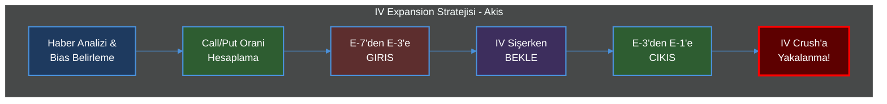
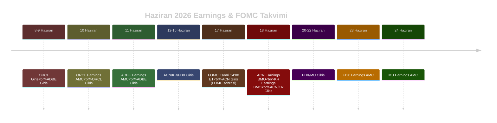
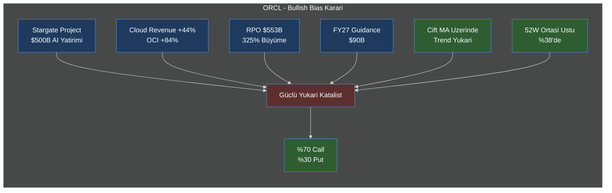
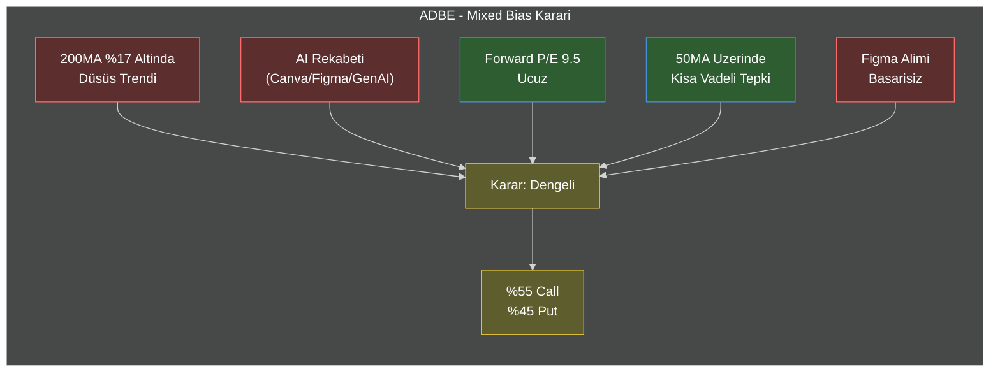
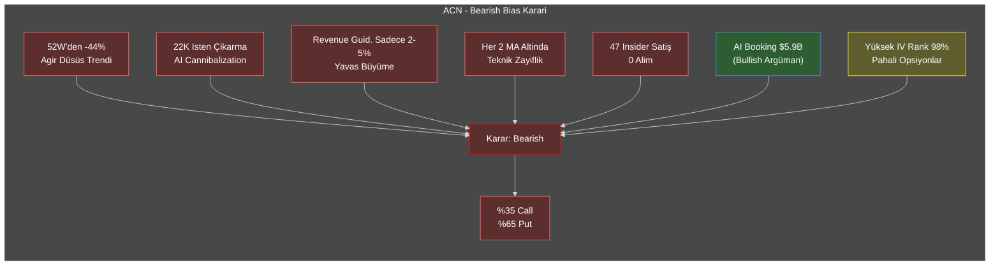
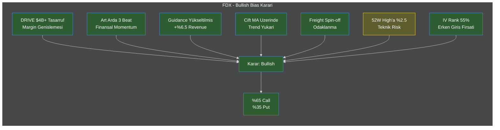
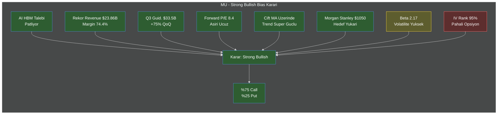
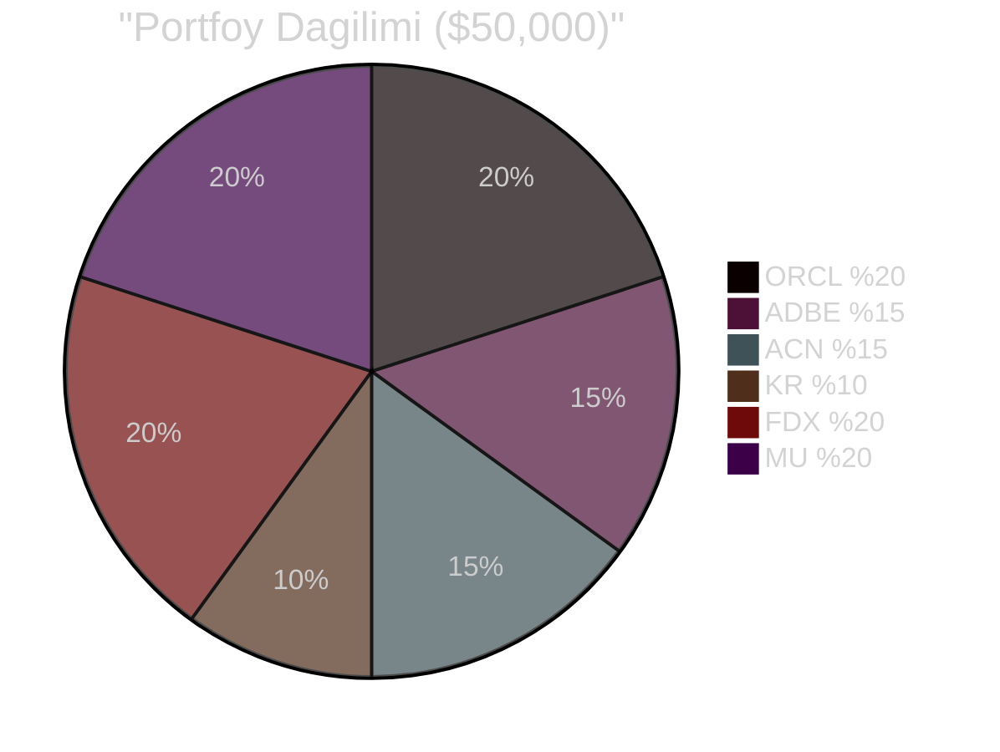
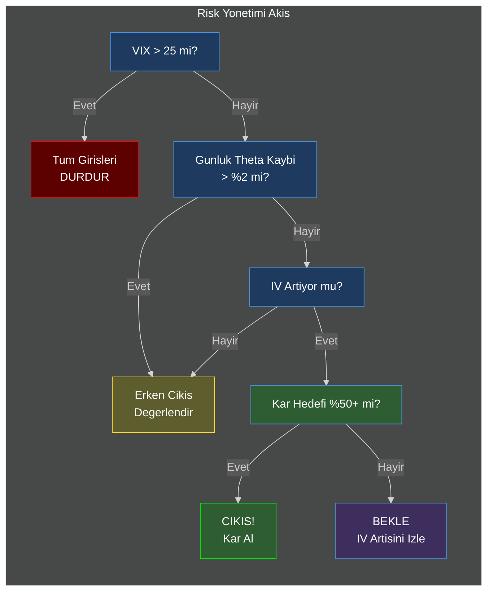

# Pre-Earnings IV Expansion Stratejileri - Haziran 2026

> **Strateji Tipi:** Long Vega + Directional Bias  
> **Mekanizma:** Earnings oncesi IV sismesinden kazanmak - hem Call hem Put al, haberlere gore oranla, earnings oncesi cik  
> **Rapor Tarihi:** 6 Haziran 2026 | VIX: 18.1 (Sari Rejim)

---



---



---

## Strateji Prensibi: Nasil Kazanilir?

Earnings oncesinde opsiyon piyasalari büyük bir hareket bekler ve bu beklenti **Implied Volatility'yi (IV) şişirir**. Biz bu şişme sürecine girer, şişme tamamlandığında çıkarız.

```mermaid
%%{init: {'theme': 'dark'}}%%
xychart-beta
    title "IV Expansion & Crush Pattern (Tipik)"
    x-axis [E-14, E-12, E-10, E-7, E-5, E-3, E-1, E-Day, E+1, E+3, E+7]
    y-axis "IV %" 0 --> 100
    line "IV" {25, 28, 35, 45, 55, 60, 65, 70, 35, 28, 25}
    annotation "GIRIS" {x: E-10, y: 35}
    annotation "CIKIS" {x: E-3, y: 60}
    annotation "CRUSH" {x: E+1, y: 35}
```

### Kazanc Formulu

```
Kazanc = (Vega x IV Artisi) + (Delta x Hisse Hareketi) - (Theta x Gun Sayisi)

- Vega: Pozitif (IV yukseldikce primler siser)
- Delta: Bias'li yonlu (ornegin %70C/%30P ise yukari hareket call'lari besler)
- Theta: Negatif (her gun zaman kaybi)
```

---

## 1. ORCL (Oracle) - 10 Haziran AMC - 4 GUN KALDI

### Sirket Profili

| Ozellik | Deger |
|---------|-------|
| **Fiyat** | $215.16 |
| **Piyasa Degeri** | $619B |
| **Sektor** | Enterprise Software & Cloud |
| **50MA** | $176.38 (Uzerinde, +22%) |
| **200MA** | $206.95 (Uzerinde, +4%) |
| **IV Rank** | 84.68% |
| **IV Percentile** | 96% |
| **Beta** | 1.66 |
| **EPS Beklenti (Q4 FY2026)** | $1.96 |
| **Revenue Beklenti** | $19.10B |
| **Onceki EPS** | $1.79 |
| **52W Range** | $135 - $346 |

### Detayli Haber Analizi

#### 1.1 Stargate Project: $500B'lik Dev AI Yatirimi

Ocak 2025'te Trump, SoftBank CEO'su Masayoshi Son, Oracle CTO Larry Ellison ve OpenAI CEO'su Sam Altman bir araya gelerek **Stargate Project**'i duyurdular. Bu proje, ABD'de **$500 milyar**'lik AI altyapisi yatirimi anlamina geliyor ve Oracle bu projenin merkezinde.

- Oracle, Stargate'in temel bulut altyapisi saglayicisi konumunda
- Proje, ABD genelinde devasa veri merkezleri insasi planliyor
- Bu, Oracle'in OCI (Oracle Cloud Infrastructure) talebini uzun yillara yayiyor
- Larry Ellison: "Bu, insanligin en büyük projelerinden biri olacak"

#### 1.2 Finansal Performans - Roket Gibi Büyüme

Oracle'in son finansallari (Q3 FY2026) tarihi bir basari:

| Metrik | Q3 FY2026 | Onceki Yil | Büyüme |
|--------|-----------|------------|--------|
| **Toplam Revenue** | $17.2B | $14.1B | +22% |
| **Cloud Revenue** | $8.9B | $6.2B | +44% |
| **OCI (IaaS)** | $4.9B | $2.7B | +84% |
| **SaaS** | $4.0B | $3.5B | +13% |
| **RPO (Backlog)** | $553B | $130B | +325% |

Q4 FY2026 Guidance:
- Revenue: +19% ile +21%
- Cloud: +46% ile +50%
- FY2027 Revenue: **$90B** (yükseltilmiş guidance!)

#### 1.3 AI Talebi - "Doyumsuz"

Oracle Q3 earnings call'da şu açiklamalari yapti:
- AI cloud computing talebi **arzdan hizli büyüyor**
- En büyük AI müşterileri finansal pozisyonlarini güclendirdi
- **FY2027 revenue guidance $90B**'a yükseldi (önceki $67B'ydi)
- AI code generation teknolojisi geliştirme maliyetlerini düşürüyor

#### 1.4 Strateji Dayanagi - Neden %70 Call / %30 Put?



| Faktor | Etki | Agirlik |
|--------|------|---------|
| Stargate Project ($500B) | Pozitif | Yuksek |
| Cloud Revenue +44% | Pozitif | Yuksek |
| RPO $553B (+325%) | Pozitif | Yuksek |
| FY27 $90B guidance | Pozitif | Yuksek |
| Cift MA uzerinde | Pozitif | Orta |
| Yüksek Beta (1.66) | Yukari hareket potansiyeli | Orta |
| **Net Bias** | **Bullish** | **%70C/%30P** |

### Strateji Detayi

```
Oran:        %70 Call / %30 Put (Strong Bullish)
Call Strike: $220 (hafif OTM, delta ~0.42)
Put Strike:  $210 (hafif OTM, delta ~0.38)
Expiry:      20 Haziran 2026 (10 DTE - ONERILEN)
             13 Haziran 2026 (3 DTE - COK RISIKLI)
Giris:       6-7 Haziran (HEMEN! 4 gun kaldi)
Cikis:       9 Haziran sabah (Earnings oncesi 1 gun)
```

| Parametre | Call ($220) | Put ($210) |
|-----------|-------------|------------|
| Delta | +0.42 | -0.38 |
| Vega | +0.18 | +0.15 |
| Theta (gunluk) | -0.85 | -0.65 |
| Gamma | +0.03 | +0.025 |

**Kritik Uyari:** Sadece 4 gun kaldi - Theta kaybi cok hizli. Eger 13 Haziran expiry secerseniz, hem IV Crush hem Theta çifte vuracak. **20 Haziran expiry zorunlu.**

---

## 2. ADBE (Adobe) - 11 Haziran AMC - 5 GUN KALDI

### Sirket Profili

| Ozellik | Deger |
|---------|-------|
| **Fiyat** | $251.73 |
| **Piyasa Degeri** | $102B |
| **Sektor** | Creative Software & SaaS |
| **50MA** | $245.46 (Hafif uzerinde) |
| **200MA** | $302.62 (Altinda, -17%) |
| **Beta** | 1.40 |
| **Forward P/E** | 9.5 |
| **52W Range** | $224 - $421 |
| **EPS Beklenti** | ~$2.54 |

### Detayli Haber Analizi

#### 2.1 AI Rekabeti - Creative Cloud'e Darbe

Adobe, yaratıcılık ve tasarım yazılımları alanında uzun süredir lider. Ancak 2024-2026 döneminde bir dizi tehditle karşı karşıya:

**Canva:**
- 100+ milyon aylık aktif kullanıcı
- Ücretsiz katman + uygun fiyatlı Pro sürüm
- İşletmeler arasında hızla yayılıyor
- Adobe'nin SME segmentinde pazar payını yiyor

**Figma:**
- UI/UX tasarımında altın standart
- Adobe $20B teklifle almak istedi ama **antitröst engeliyle başarısız oldu** (2024)
- Figma bağımsız büyümeye devam ediyor
- Adobe XD'yi emekliye ayırdı, Figma'ya rakip ürünü yok

**Generatif AI:**
- Adobe Firefly hâlâ pazarın gerisinde
- Midjourney, DALL-E 3, Stable Diffusion daha popüler
- OpenAI Sora video oluşturma alanında devrim yaratıyor
- Adobe'nin AI stratejisi bulanık

#### 2.2 Finansal Durum

| Metrik | Durum | Yorum |
|--------|-------|-------|
| Revenue Growth | Düsük tek haneli | Mature pazar |
| Creative Cloud Subscribers | Yavas büyüme | Doygunluk |
| Digital Experience | Rekabetçi | Salesforce, HubSpot |
| Operating Margin | 35%+ | Güçlü ama düsüyor |

#### 2.3 Strateji Dayanagi - Neden %55 Call / %45 Put?



| Faktor | Etki | Agirlik |
|--------|------|---------|
| 200MA %17 altinda | Negatif | Yuksek |
| AI rekabeti siddetli | Negatif | Yuksek |
| Figma alimi basarisiz | Negatif | Orta |
| Forward P/E 9.5 (ucuz) | Pozitif | Orta |
| 50MA uzerinde (kisa vadeli) | Hafif Pozitif | Düsük |
| **Net Bias** | **Hafif Bearish ama deger kalmis** | **%55C/%45P** |

**Önemli:** Bias hafif bullish belirlendi çünkü:
1. P/E 9.5 çok düşük - aşırı satım bölgesi
2. Her earnings'te short squeeze riski var
3. 52-week low ($224) yakın - teknik destek

Ama put oranını %45'te tuttuk çünkü trend aşağı.

### Strateji Detayi

```
Oran:        %55 Call / %45 Put (Slightly Bullish / Value Play)
Call Strike: $255 (hafif OTM)
Put Strike:  $250 (ATM/ITM)
Expiry:      20 Haziran 2026 (9 DTE - ONERILEN)
Giris:       8-9 Haziran
Cikis:       10-11 Haziran
```

---

## 3. ACN (Accenture) - 18 HAZIRAN BMO - 12 GUN KALDI

### Sirket Profili

| Ozellik | Deger |
|---------|-------|
| **Fiyat** | $178.72 |
| **Piyasa Degeri** | $110B |
| **Sektor** | IT Consulting & Services |
| **50MA** | $184.42 (Altinda) |
| **200MA** | $231.04 (Altinda, -23%) |
| **IV Rank** | **98.56%** |
| **Beta** | 1.07 |
| **Forward P/E** | 12.0 |
| **EPS Beklenti** | $3.72 |
| **52W Range** | $156 - $322 |
| **Calisan Sayisi** | 784,000+ |

### Detayli Haber Analizi

#### 3.1 AI Danismanliği Tarafından Yenilme (AI Cannibalization)

Accenture'in en büyük krizi: **AI, danışmanların yerini alıyor.**

**İşten Çikarmalar:**
- 2025 sonlarında **11,000 çalışan** çıkarıldı ($865M yeniden yapılanma)
- Son 6 ayda **22,000 işten çıkarma** toplam
- Yönetim: "AI otomasyonu geleneksel danışmanlık talebini azaltıyor"

**Mali Etkiler:**
- FY2026 revenue guidance sadece **2-5%** (düşük)
- AI booking'leri $5.9B'ya ulaştı ama geleneksel iş kaybı daha büyük
- Operasyon marjlarında baskı

**Insourcing Trendi:**
- Santander, GM, Procter & Gamble, Sainsbury's outsourcing'i iptal edip içeride çözüyor
- Bulut "as-a-service" modelleri esnek sözleşmeleri gereksiz kılıyor
- ABD federal hükümeti (GSA) danışmanlık harcamalarını kesiyor

#### 3.2 Finansal Performans - Yavasliyor

| Metrik | Q1 FY2026 | Yorum |
|--------|-----------|-------|
| Revenue | $18.74B | +6% (idare eder) |
| New Bookings | $20.94B | +12% (iyi) |
| Adjusted EPS | $3.94 | +10% |
| Operating Margin | 17.0% | +30bps |
| AI Bookings | $2.2B | 2x buyüme |
| **Stock** | **-40% 52W** | **Piyasa güvenmiyor** |

**Önemli Detay:** 6 ayda 47 insider SATIŞ işlemi, 0 alım! CEO Julie Sweet 17 ayrı satış yaptı.

#### 3.3 Strateji Dayanagi - Neden %35 Call / %65 Put?



| Faktor | Etki | Agirlik |
|--------|------|---------|
| 52W'den -44% | Güçlü Negatif | Yuksek |
| AI cannibalization | Yapisal Negatif | Yuksek |
| 22K isten çikarma | Güçlü Negatif | Yuksek |
| 2 MA altinda | Teknik Negatif | Yuksek |
| 47 insider satis | Güven Sinyali Negatif | Yuksek |
| AI booking $5.9B | Hafif Pozitif | Düsük |
| IV Rank 98% (pahali) | Risk | Orta |
| **Net Bias** | **Bearish** | **%35C/%65P** |

### Strateji Detayi & FOMC Uyari

```
Oran:        %35 Call / %65 Put (Bearish)
Call Strike: $180 (hafif OTM)
Put Strike:  $175 (hafif OTM)
Expiry:      27 Haziran 2026 (9 DTE)
Giris:       13-16 Haziran (veya FOMC sonrasi 17 Haziran aksam)
Cikis:       16-17 Haziran (Earnings oncesi 1-2 gun)
```

> **FOMC UYARISI:** 17 Haziran saat 14:00 ET FOMC karari! Eger FOMC sert mesaj verirse tum piyasa sallanir. Eger yumusak kalirsa IV artar. **Öneri:** 17 Haziran aksami giris yap, 18 Haziran sabah ACN earnings aciklanmadan cik.

---

## 4. KR (Kroger) - 18 HAZIRAN BMO - 12 GUN KALDI

### Sirket Profili

| Ozellik | Deger |
|---------|-------|
| **Fiyat** | $63.96 |
| **Piyasa Degeri** | $39B |
| **Sektor** | Grocery Retail |
| **50MA** | $67.76 (Altinda) |
| **200MA** | $66.83 (Altinda) |
| **Beta** | **0.42** (Cok dusuk) |
| **Forward P/E** | 11.4 |
| **EPS Beklenti** | $1.58 |
| **52W Range** | $59 - $77 |

### Detayli Haber Analizi

#### 4.1 Margin Pressure - Enflasyon ve Rekabet

Kroger ABD'nin en büyük süpermarket zincirlerinden biri ancak bir dizi zorlukla karşı karşıya:

**Enflasyon Baskisi:**
- Gida fiyatları yüksek kalmaya devam ediyor
- Tüketiciler fiyat hassasiyeti artıyor
- Private label (marka) ürünlere yönelim
- Kar marjları eziliyor

**Amazon & Walmart Rekabeti:**
- Amazon Whole Foods + online delivery baskısı
- Walmart her gün düşük fiyat stratejisi
- Aldi, Lidl gibi discount zincirler büyüyor
- Market payı kaybı riski

**Consumer Spending:**
- Ekonomik belirsizlik harcamaları azaltıyor
- Lüks olmayan harcamalarda kesinti
- Restaurant yemeği yerine evde yemek
- Bu teorik olarak Kroger'e yardımcı ama margin baskısı daha büyük

#### 4.2 Strateji Dayanagi - Neden %30 Call / %70 Put?

| Faktor | Etki | Agirlik |
|--------|------|---------|
| 2 MA altinda | Teknik Negatif | Yuksek |
| Margin pressure | Mali Negatif | Yuksek |
| Amazon/Walmart rekabeti | Yapisal Negatif | Yuksek |
| Beta 0.42 (ucuz opsiyon) | Risk Düsük | Pozitif |
| Defensive sektor | Recession hedge | Hafif Pozitif |
| **Net Bias** | **Bearish** | **%30C/%70P** |

### Strateji Detayi

```
Oran:        %30 Call / %70 Put (Bearish)
Call Strike: $65 (hafif OTM)
Put Strike:  $63 (ATM)
Expiry:      20 Haziran 2026 (2 DTE) - AGRESIF
             27 Haziran 2026 (9 DTE) - ONERILEN
Giris:       13-16 Haziran
Cikis:       16-17 Haziran
```

> **Avantaj:** Beta 0.42 = DÜŞÜK IV = ÇOK UCUZ OPSİYONLAR! Call ~$0.50, Put ~$0.80. Cok dusuk sermaye ile pozisyon alinabilir. Dezavantaj: Düsük volatilite = hisse yavas hareket eder, sabir gerekir.

---

## 5. FDX (FedEx) - 23 HAZIRAN AMC - 17 GUN KALDI

### Sirket Profili

| Ozellik | Deger |
|---------|-------|
| **Fiyat** | $332.64 |
| **Piyasa Degeri** | $79B |
| **Sektor** | Logistics & Transportation |
| **50MA** | $305.93 (Uzerinde, +9%) |
| **200MA** | $249.73 (Uzerinde, +33%) |
| **Beta** | 1.30 |
| **Forward P/E** | 15.1 |
| **EPS Beklenti** | $5.84 (Onceki: $5.25) |
| **52W Range** | $174 - $341 |

### Detayli Haber Analizi

#### 5.1 DRIVE Programi - Maliyet Kesme Zaferi

FedEx'in DRIVE programi tarihi bir basari:

| Program | Sonuc |
|---------|-------|
| **DRIVE FY2024 Tasarruf** | $1.8 milyar (kalici) |
| **DRIVE FY2025 Tasarruf** | $2.2 milyar (ek) |
| **FY2026 Hedef** | $1.0 milyar (DRIVE + Network 2.0) |
| **Toplam Tasarruf** | **$4.0+ milyar** |

**Network 2.0:**
- Uçuş frekanslarını azaltma
- Park edilmiş uçaklar
- Personel azaltma (611 Memphis çalışanı)
- Daha verimli rota optimizasyonu

#### 5.2 Finansal Performans - Art Arda Beat

| Ceyrek | Revenue | EPS | Margin | Yorum |
|--------|---------|-----|--------|-------|
| Q1 FY2026 | $22.24B | $3.83 | 5.8% | Beklenti ustu |
| Q2 FY2026 | $22.47B | $4.82 | 6.9% | Beklenti ustu |
| Q3 FY2026 | $24.00B | $5.25 | 6.7% | Beklenti ustu |
| **Q4 Bek.** | **~$24.5B** | **$5.84** | **?** | **+11% EPS buyumesi** |

**Guidance Yükseltilmiş:**
- FY2026 Revenue: %6.0-6.5 (önceki %5-6)
- FY2026 Adjusted EPS: $19.30-20.10 (önceki $17.80-19.00)
- FY2026 CapEx: $4.1B (önceki $4.5B - daha verimli!)

#### 5.3 FedEx Freight Spin-off

FedEx Freight'in 1 Haziran 2026'da (GEÇMİŞ) ayrılması tamamlandı. Bu:
- Daha odaklı çekirdek iş
- Daha yüksek margin Express segmenti
- Daha temiz finansal yapı

#### 5.4 Strateji Dayanagi - Neden %65 Call / %35 Put?



| Faktor | Etki | Agirlik |
|--------|------|---------|
| DRIVE $4B+ tasarruf | Güçlü Pozitif | Yuksek |
| Art arda 3 beat | Güçlü Pozitif | Yuksek |
| Guidance yükseltilmiş | Güçlü Pozitif | Yuksek |
| Cift MA uzerinde | Teknik Pozitif | Yuksek |
| Freight spin-off | Pozitif | Orta |
| IV Rank 55% (erken) | Giris Firsati | Pozitif |
| 52W high'a yakin | Hafif Risk | Negatif |
| **Net Bias** | **Bullish** | **%65C/%35P** |

### Strateji Detayi

```
Oran:        %65 Call / %35 Put (Bullish)
Call Strike: $340 (hafif OTM)
Put Strike:  $325 (hafif OTM)
Expiry:      3 Temmuz 2026 (9 DTE - ONERILEN)
Giris:       15-18 Haziran (IV henuz dusuk - erken giris avantaji!)
Cikis:       20-22 Haziran
```

> **Erken Giris Avantaji:** IV Rank sadece 55% - henuz IV sismedi! Eger 15-18 Haziran'da girerseniz IV artisinin tamaminin onunde olursunuz. Ideal: IV 55% → 75% arttiginda %20-30 prim kazanci.

---

## 6. MU (Micron) - 24 HAZIRAN AMC - 18 GUN KALDI

### Sirket Profili

| Ozellik | Deger |
|---------|-------|
| **Fiyat** | $886.74 |
| **Piyasa Degeri** | $1.0T |
| **Sektor** | Semiconductors - Memory |
| **50MA** | $595.71 (Uzerinde, +49%) |
| **200MA** | $352.78 (Uzerinde, +151%) |
| **Beta** | **2.17** (Cok volatil) |
| **Forward P/E** | **8.4** (Asiri ucuz) |
| **IV Rank** | **95.29%** |
| **EPS Beklenti** | $19.72 (Onceki: $12.07) |
| **Expected Move** | **±20%** |
| **52W Range** | $103 - $1,089 |

### Detayli Haber Analizi

#### 6.1 AI HBM (High Bandwidth Memory) Patlamasi

Micron'un basarisi tek bir kelimeyle özetlenebilir: **HBM**

**HBM Nedir?**
- High Bandwidth Memory = AI çiplerinin kullandigi ultra hizli bellek
- NVIDIA H100/H200/B200 GPU'larin her biri HBM gerektiriyor
- AI egitimi ve inference HBM talebini patlatiyor
- 3 uretici var: SK Hynix, Samsung, **Micron**

**Finansal Patlama:**

| Metrik | Q2 FY2026 | Yorum |
|--------|-----------|-------|
| Revenue | $23.86B | Rekor |
| Gross Margin | 74.4% | Inanilmaz |
| Operating Margin | 67.6% | Endustri lideri |
| EPS | $12.07 | Onceki yil: $0.42 |
| YTD Getiri | **+203%** | S&P 500: +8% |
| 1Y Getiri | **+715%** | S&P 500: +24% |

**Q3 FY2026 Guidance (Rekor!):**
- Revenue: **$33.5B** (+75% QoQ!)
- Gross Margin: 69-71%
- EPS: $18.90-$19.15
- HBM3E üretimi tam kapasite

#### 6.2 Analist Gorusleri - Hedef Fiyatlar

| Analist | Hedef | Not |
|---------|-------|-----|
| Morgan Stanley | $1,050 | Overweight (yükseltilmiş) |
| Ortalama | $739 | |
| En Yuksek | $1,750 | |
| En Dusuk | $249 | |
| **Mevcut** | **$886** | |

Morgan Stanley (6 Haziran 2026): Hedef $520'den **$1,050'ye yükseltilmiş!**

#### 6.3 Strateji Dayanagi - Neden %75 Call / %25 Put?



| Faktor | Etki | Agirlik |
|--------|------|---------|
| AI HBM talebi patlamasi | Güçlü Pozitif | En Yuksek |
| Rekor finansallar | Güçlü Pozitif | En Yuksek |
| Q3 guidance $33.5B (+75%) | Güçlü Pozitif | En Yuksek |
| Forward P/E 8.4 | Deger Yok | Pozitif |
| Cift MA uzerinde | Teknik Pozitif | Yuksek |
| Analyst hedef yukselis | Pozitif | Orta |
| Beta 2.17 (volatil) | Risk/First | Notr |
| IV Rank 95% (pahali) | Risk | Negatif |
| **Net Bias** | **Strong Bullish** | **%75C/%25P** |

### Strateji Detayi

```
Oran:        %75 Call / %25 Put (Strong Bullish)
Call Strike: $900 (hafif OTM)
Put Strike:  $870 (hafif OTM)
Expiry:      3 Temmuz 2026 (9 DTE - ONERILEN)
Giris:       16-20 Haziran
Cikis:       22-23 Haziran (Earnings oncesi 1-2 gun)
Max Pozisyon: Portfoyun %20'si
```

> **EN AGRESIF HİSSE:** Expected Move ±20% = ertesi gun ±$177-$195! IV zaten cok yuksek (%95.29) ama AI HBM histerisi IV'yi daha da %100+ sisebilir (gecmiste goruldu). Pozisyon buyuklugu MAX %20. Bu hisse tek basina portfoyu ya ucurur ya batir.

---

## Ozet Tablo - Tum Stratejiler

```mermaid
%%{init: {'theme': 'dark'}}%%
xychart-beta
    title "IV Rank Karsilastirmasi (Haziran 2026)"
    x-axis [ORCL, ADBE, ACN, KR, FDX, MU]
    y-axis "IV Rank %" 0 --> 100
    bar "IV Rank" {84.68, 75, 98.56, 60, 55, 95.29}
    line "Ortalama" {78, 78, 78, 78, 78, 78}
```

| Hisse | Earnings | Gun | Call% | Put% | Bias | IV Rank | Risk | Giris | Cikis |
|-------|----------|-----|-------|------|------|---------|------|-------|-------|
| **ORCL** | 10 Haz AMC | 4 | %70 | %30 | Bullish | %84.68 | Yuksek | 6-7 Haz | 9 Haz |
| **ADBE** | 11 Haz AMC | 5 | %55 | %45 | Mixed | %75 | Orta | 8-9 Haz | 10-11 Haz |
| **ACN** | 18 Haz BMO | 12 | %35 | %65 | Bearish | %98.56 | Yuksek | 13-16 Haz | 16-17 Haz |
| **KR** | 18 Haz BMO | 12 | %30 | %70 | Bearish | %60 | Dusuk | 13-16 Haz | 16-17 Haz |
| **FDX** | 23 Haz AMC | 17 | %65 | %35 | Bullish | %55 | Orta | 15-18 Haz | 20-22 Haz |
| **MU** | 24 Haz AMC | 18 | %75 | %25 | Str.Bull | %95.29 | Yuksek | 16-20 Haz | 22-23 Haz |

---

## Portfoy Dagilimi (Ornek $50,000)



| Hisse | Sermaye | Call | Put | Tahmini Maliyet | Hedef Getiri |
|-------|---------|------|-----|-----------------|--------------|
| ORCL | $10,000 | 7x $220C | 3x $210P | ~$8,500 | %30-60 |
| ADBE | $7,500 | 5.5x $255C | 4.5x $250P | ~$6,500 | %30-50 |
| ACN | $7,500 | 3.5x $180C | 6.5x $175P | ~$5,500 | %20-40 |
| KR | $5,000 | 3x $65C | 7x $63P | ~$1,800 | %30-60 |
| FDX | $10,000 | 6.5x $340C | 3.5x $325P | ~$7,500 | %20-50 |
| MU | $10,000 | 7.5x $900C | 2.5x $870P | ~$9,000 | %40-100 |

---

## Risk Yonetimi & Altin Kurallar



### 10 Altin Kural

1. **Earnings açıklanmadan MUTLAKA çık!** IV Crush primleri %50+ eritir
2. **Kar hedefi: %30-50 prim artışı.** Açgözlülük yapma, git.
3. **FOMC günü (17 Haziran) pozisyon küçült.** Çifte risk.
4. **VIX >25 ise tüm girişleri durdur.**
5. **Theta kaybı her gün izlenmeli.** IV artmazsa kayıp yaşanır.
6. **Tek hisse max kaybı: Portföyün %2'si.**
7. **MU pozisyonu max %20.** En volatil hisse.
8. **Erken gir, erken çık.** E-7'den E-3'e gir, E-3'den E-1'e çık.
9. **Vega pozitif tut.** Her 1% IV artışı = kazanç.
10. **Duygusallık yok.** Önceden belirlenen kurallara sadık kal.

---

> **YASAL UYARI:** Bu rapor yalnizca egitim ve arastirma amaclidir. Finansal tavsiye niteliginde degildir. Pre-Earnings IV Expansion stratejisi theta (zaman) riski ve IV deflation riski tasir. Gecmis performans gelecek performansi garanti etmez. Yatirim karari almadan once profesyonel danismana basvurunuz.
